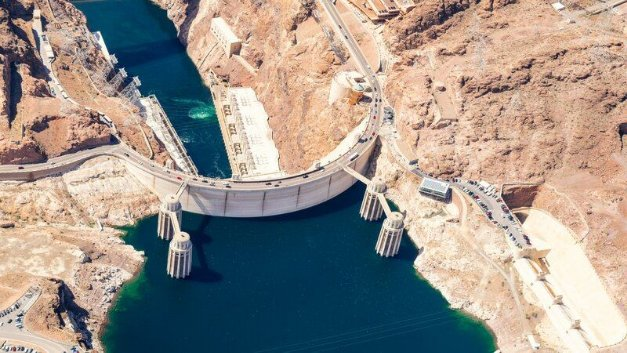

# Oasis Pro partnership is where DeFi meets RealFi for Cardano
### **New deal promises democratization of financial services and access to capital across developing countries**
 16 October 2021[ Dominic Swords](tmp//en/blog/authors/dominic-swords/page-1/) 6 mins read

### [**Dominic Swords**](tmp//en/blog/authors/dominic-swords/page-1/)
Writer and editor

Marketing & Communications

- 

At first glance, the deal between Cardano and Oasis Pro Markets announced at the [Cardano Summit](https://summit.cardano.org/sessions/announcement-bridging-the-gap-connecting-people-and-capital) may sound like a specialist application of blockchain technology to the rarefied world of finance – of interest to bankers, perhaps, but not to the person on the street. But it could turn out to be a game changer for millions of people throughout the world. 

Thoạt nhìn, thỏa thuận giữa các thị trường Cardano và Oasis Pro được công bố tại [Hội nghị thượng đỉnh Cardano] (https://summit.cardano.org/sessions/AnnoUnceling-bridging-the-gap-connecting-people-and
Giống như một ứng dụng chuyên gia về công nghệ blockchain vào thế giới tài chính hiếm hoi - có lẽ là người quan tâm đối với các chủ ngân hàng, nhưng không phải là người trên đường phố.
Nhưng nó có thể trở thành một người thay đổi trò chơi cho hàng triệu người trên toàn thế giới.

Many countries struggle to fund large infrastructure projects such as bridges, dams, and rail networks, while their best and brightest citizens go and live elsewhere, their only contribution to their home country now the monthly cheques they send back home.

Nhiều quốc gia đấu tranh để tài trợ cho các dự án cơ sở hạ tầng lớn như cầu, đập và mạng lưới đường sắt, trong khi những công dân tốt nhất và thông minh nhất của họ đi và sống ở nơi khác, đóng góp duy nhất của họ cho đất nước của họ bây giờ là kiểm tra hàng tháng mà họ gửi về nhà.

If you know anyone who sends money to their family in another country, then you have encountered the world of remittances. Although made up of small sums, it amounts to a huge well of money. Whole nations are kept afloat in this way, with remittances accounting for well over 30% of GDP in some cases. 

Nếu bạn biết bất cứ ai gửi tiền cho gia đình của họ ở một quốc gia khác, thì bạn đã gặp phải thế giới kiều hối.
Mặc dù được tạo thành từ một khoản tiền nhỏ, nhưng nó lên tới một con tiền khổng lồ.
Toàn bộ các quốc gia được giữ nguyên theo cách này, với kiều hối chiếm hơn 30% GDP trong một số trường hợp.

Since 2020, as countries such as the UK have cut back their aid budgets, global remittances have actually exceeded the value of foreign direct investment (excluding China) and government aid from richer countries combined. It is a situation that Nick Cafaro, IOHK product manager, describes as ‘pretty astonishing’.

Kể từ năm 2020, vì các quốc gia như Vương quốc Anh đã cắt giảm ngân sách viện trợ của họ, kiều hối toàn cầu đã thực sự vượt quá giá trị đầu tư trực tiếp nước ngoài (không bao gồm Trung Quốc) và viện trợ của chính phủ từ các nước giàu hơn.
Đó là một tình huống mà Nick Cafaro, người quản lý sản phẩm IOHK, mô tả là "sự đáng kinh ngạc".

‘This means, for the first time in the 21st century, foreign workers abroad are sending money back home in amounts greater than all the investment coming from countries and corporations into those lower and middle-income countries – as well as the total amount of official aid.’

"Điều này có nghĩa là lần đầu tiên vào thế kỷ 21, những người lao động nước ngoài ở nước ngoài đang gửi tiền trở về nhà với số tiền lớn hơn tất cả các khoản đầu tư đến từ các quốc gia và các tập đoàn vào các quốc gia có thu nhập thấp và trung bình cũng như cũng như
Tổng số lượng viện trợ chính thức.

Yet that huge sum of money, much needed as it is, can only do so much good back home. ‘The government is unable to pool all that capital and put it towards big infrastructure projects that might benefit wider sections of the population,’ Cafaro said. ‘And the money coming in is not distributed evenly and so can actually increase inequality within countries.’

Tuy nhiên, số tiền khổng lồ đó, rất cần thiết, chỉ có thể làm rất nhiều việc trở về nhà.
"Chính phủ không thể tập hợp tất cả vốn đó và đưa nó vào các dự án cơ sở hạ tầng lớn có thể có lợi cho các bộ phận dân số rộng lớn hơn," Cafaro nói.
"Và tiền đến không được phân phối đều và do đó thực sự có thể tăng bất bình đẳng trong các quốc gia.

A third downside to this situation, Cafaro added, was that for remittances to continue people had to keep moving abroad to work, abandoning their family and wider community, ‘something that none of us really want to happen’.

Một nhược điểm thứ ba của tình huống này, Cafaro nói thêm, là để kiều hối tiếp tục mọi người phải tiếp tục di chuyển ra nước ngoài để làm việc, từ bỏ gia đình và cộng đồng rộng lớn hơn, một điều gì đó mà không ai trong chúng ta thực sự muốn xảy ra.

### **A better way**

### **Một cách tốt hơn**

Imagine a way of harnessing these funds so that they make the biggest impact where they are needed. A way that could actually raise the standard of living in the target country, and potentially stem the ‘brain drain’ of talented people from poorer to richer countries. Imagine that your solution also provides a return on investment for the person working overseas.

Hãy tưởng tượng một cách khai thác các khoản tiền này để chúng tạo ra tác động lớn nhất ở nơi cần thiết.
Một cách thực sự có thể nâng cao mức sống ở quốc gia mục tiêu, và có khả năng ngăn chặn những người tài năng từ các nước nghèo hơn đến các nước giàu hơn.
Hãy tưởng tượng rằng giải pháp của bạn cũng cung cấp lợi tức đầu tư cho người làm việc ở nước ngoài.

Blockchain can make this possible.

Blockchain có thể làm cho điều này có thể.

Countries typically fund infrastructure projects by issuing debt – sovereign bonds, as they are known. Sovereign debt is one of the bigger, more intimidating beasts in the capital markets zoo, and it is not one that most retail investors would be comfortable approaching. When a bond is issued by a sovereign nation, banks often form syndicates to buy up the entire issue. They want it for themselves because sovereign debt provides a fixed income at a low risk. Also it’s a regulation-heavy area of investment, so you need a huge amount of expertise to take part. It’s nice work if you can get it.

Các quốc gia thường tài trợ cho các dự án cơ sở hạ tầng bằng cách phát hành nợ - trái phiếu có chủ quyền, như họ đã biết.
Nợ có chủ quyền là một trong những con thú lớn hơn, đáng sợ hơn trong sở thú thị trường vốn, và nó không phải là một điều mà hầu hết các nhà đầu tư bán lẻ sẽ thoải mái tiếp cận.
Khi một trái phiếu được ban hành bởi một quốc gia có chủ quyền, các ngân hàng thường hình thành các tập đoàn để mua toàn bộ vấn đề.
Họ muốn nó cho chính họ vì nợ có chủ quyền cung cấp thu nhập cố định với rủi ro thấp.
Ngoài ra, đây là một lĩnh vực đầu tư nặng quy định, vì vậy bạn cần một lượng chuyên môn lớn để tham gia.
Đó là công việc tốt đẹp nếu bạn có thể nhận được nó.

In the increasingly decentralized financial future, this massive class of debt and the huge pot of remittance money will be brought together. The relationship between Cardano and Oasis Pro Markets is a big step in that direction.

Trong tương lai tài chính ngày càng phân cấp, loại nợ khổng lồ này và tiền khổng lồ của tiền chuyển sẽ được mang lại với nhau.
Mối quan hệ giữa thị trường Cardano và Oasis Pro là một bước tiến lớn theo hướng đó.

Cardano had wanted to form such an alliance for some time, and chose Oasis Pro because of its blockchain-first platform and regulatory expertise, said Cafaro, announcing the deal at the Cardano Summit last month. 

Cafaro cho biết, Cardano đã muốn thành lập một liên minh như vậy trong một thời gian và chọn Oasis Pro vì nền tảng và chuyên môn điều tiết đầu tiên của blockchain, Cafaro cho biết, công bố thỏa thuận tại Hội nghị thượng đỉnh Cardano vào tháng trước.

‘The networks that are run by these syndicates of banks... are not capable of handling that type of deal flow, so you need to figure out how to connect those tens of thousands of individuals to the issuer through a single platform. The good news is that the Cardano blockchain is a great tool to solve this type of problem.

"Các mạng được điều hành bởi các tập đoàn của các ngân hàng này ... không có khả năng xử lý loại dòng giao dịch đó, vì vậy bạn cần tìm ra cách kết nối hàng chục ngàn cá nhân với nhà phát hành thông qua một nền tảng duy nhất.
Tin tốt là Blockchain Cardano là một công cụ tuyệt vời để giải quyết loại vấn đề này.

As Nick Cafaro, Product Manager at IOHK said:

Như Nick Cafaro, người quản lý sản phẩm tại IOHK đã nói:

We just had to find a partner to bring this “real fi” product to the Cardano blockchain. It had to be a company with expertise in capital markets and blockchain, and with all the right regulatory permissions in place.

Chúng tôi chỉ cần tìm một đối tác để mang sản phẩm này thực tế đến blockchain Cardano.
Nó phải là một công ty có chuyên môn về thị trường vốn và blockchain, và với tất cả các quyền điều tiết phù hợp.

Enter Oasis Pro Markets, Pat Lavecchia, the financial company’s chief executive, said: ‘We’re very much looking forward to a long-term partnership with Cardano and IOHK, providing democratization of financial services to a variety of countries utilizing our best-in-class technology – our matching engine or exchange, depending on the country and regulatory environment.’

Enter Oasis Pro Markets, Pat Lavecchia, giám đốc điều hành của công ty tài chính, cho biết: "Chúng tôi rất mong chờ một quan hệ đối tác lâu dài với Cardano và IOHK, cung cấp dân chủ hóa các dịch vụ tài chính cho nhiều dịch vụ tài chính cho nhiều loại
Các quốc gia sử dụng công nghệ tốt nhất của chúng tôi-Công cụ phù hợp hoặc trao đổi của chúng tôi, tùy thuộc vào quốc gia và môi trường pháp lý.

He added that as well as providing greater access to the sovereign bond market for small investors – ‘the citizenry and diaspora of these countries’ – the initiative would provide ‘efficiencies and cost savings’ to the issuing governments.

Ông nói thêm rằng cũng như cung cấp quyền truy cập nhiều hơn vào thị trường trái phiếu có chủ quyền cho các nhà đầu tư nhỏ - € â € Citizery và Diaspora của các quốc gia này - Sáng kiến này sẽ cung cấp cho hiệu quả và tiết kiệm chi phí cho
phát hành chính phủ.

Lavecchia described the Oasis Pro approach as ‘digital cash for digital securities’, which in effect meant using stablecoins and also potentially CBDCs, depending on different countries’ regulations.

Lavecchia mô tả phương pháp Oasis Pro là tiền mặt kỹ thuật số cho chứng khoán kỹ thuật số, có hiệu lực có nghĩa là sử dụng stablecoin và cũng có khả năng CBDC, tùy thuộc vào các quy định của các quốc gia khác nhau.

‘Sovereign debt is a security that in the blockchain area could actually be fractionalized, and that fractionalization is tied very much to its democratization. It helps risk management for the issuer [and] increases the investor base, which in turn should improve liquidity as well, seamlessly. The digital exchange trading systems and order-matching engines that we’ve developed are the transition point from the legacy solutions . . . to the blockchain, and the benefits are enormous.’ 

Nợ nợ là một bảo mật mà trong khu vực blockchain thực sự có thể được phân đoạn, và phân đoạn đó được gắn rất nhiều vào dân chủ hóa của nó.
Nó giúp quản lý rủi ro cho nhà phát hành [và] làm tăng cơ sở nhà đầu tư, từ đó cũng nên cải thiện tính thanh khoản, một cách liền mạch.
Các hệ thống giao dịch trao đổi kỹ thuật số và các công cụ khớp đơn hàng mà chúng ta đã phát triển là điểm chuyển đổi từ các giải pháp kế thừa.
.
.
Đối với blockchain và lợi ích là rất lớn.

According to Lavecchia, the issuer benefits in several ways. Because of anti-money laundering provisions, the issuer can ‘know at any time what institutions or individuals own their sovereign debt’. Governments no longer have to track down investors’ addresses and mail out their interest payments. ‘All that asset servicing is a tremendous time waste and unnecessary. The blockchain solves that issue. We estimate that the savings are anywhere between 25 and 50 basis points [0.25-.5%] of the issue amount.’

Theo Lavecchia, nhà phát hành được hưởng lợi theo nhiều cách.
Do các điều khoản chống rửa tiền, nhà phát hành có thể nhận ra bất cứ lúc nào các tổ chức hoặc cá nhân sở hữu khoản nợ có chủ quyền của họ.
Chính phủ không còn phải theo dõi các địa chỉ của các nhà đầu tư và gửi các khoản thanh toán lãi của họ.
"Tất cả việc phục vụ tài sản đó là một chất thải thời gian to lớn và không cần thiết.
Blockchain giải quyết vấn đề đó.
Chúng tôi ước tính rằng các khoản tiết kiệm là bất cứ nơi nào từ 25 đến 50 điểm cơ bản [0,25-.5%] số tiền phát hành.

The issuing country can also benefit from smart contract innovations. ‘The smart contracts are embedded in the security itself and contain the terms of the security – for instance the principal and interest payments, the default provisions, if any, or any other actions or protections that are incorporated, not only for the investor but also for the issuer, the sovereign nation. It eliminates poor documentation and also reduces settlement times, which are currently between two and 10 days. Utilizing the blockchain and digital cash, that settlement time is reduced to almost zero.’

Quốc gia phát hành cũng có thể được hưởng lợi từ các đổi mới hợp đồng thông minh.
"Hợp đồng thông minh được nhúng vào chính bảo mật và chứa các điều khoản của bảo mật - ví dụ
Nhà đầu tư nhưng cũng cho nhà phát hành, quốc gia có chủ quyền.
Nó loại bỏ tài liệu kém và cũng làm giảm thời gian giải quyết, hiện đang từ hai đến 10 ngày.
Sử dụng blockchain và tiền mặt số, thời gian giải quyết đó giảm xuống gần như bằng không.

Once a country is set up with the Cardano/Oasis Pro system, it can expand its financial dealings to other asset classes such as equities, asset-backed securities, and other kinds of project finance, said Lavecchia. ‘This technology is available today and we have it with IOG ready to launch across the spectrum. In five to ten years this is going to be ubiquitous, so the sovereign nations that work with us today are going to be significantly ahead of the curve.’

Khi một quốc gia được thiết lập với hệ thống Cardano/Oasis Pro, nó có thể mở rộng các giao dịch tài chính của mình sang các loại tài sản khác như cổ phiếu, chứng khoán được hỗ trợ bởi tài sản và các loại tài chính dự án khác, Lavecchia nói.
"Công nghệ này có sẵn ngày hôm nay và chúng tôi đã sẵn sàng với IOG để khởi chạy trên phổ.
Trong năm đến mười năm, điều này sẽ có mặt khắp nơi, vì vậy các quốc gia có chủ quyền làm việc với chúng ta ngày nay sẽ đi trước đường cong.

