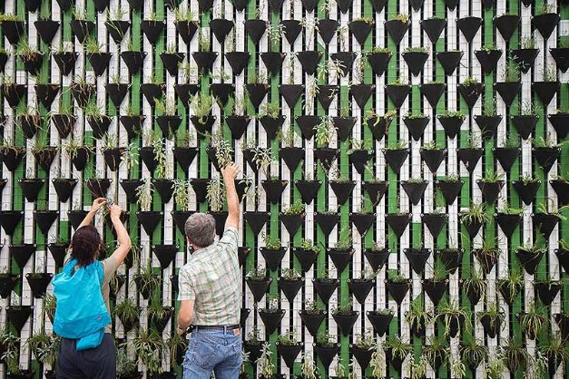

# IOG's third round of delegation gives voice to stake pool operators
### **Choice of 100 recipients for ada stake based on nominations**
 27 October 2021[ Dominic Swords](tmp//en/blog/authors/dominic-swords/page-1/) 4 mins read

### [**Dominic Swords**](tmp//en/blog/authors/dominic-swords/page-1/)
Writer and editor

Marketing & Communications

- 

The 100 Cardano stake pools to benefit from the third IOG delegation have been announced. They were chosen from 520 nominations made by stake pool operators, based on contributions to the Cardano community.

100 nhóm Cardano cổ phần để được hưởng lợi từ phái đoàn IOG thứ ba đã được công bố.
Họ đã được chọn từ 520 đề cử được thực hiện bởi các nhà khai thác nhóm cổ phần, dựa trên những đóng góp cho cộng đồng Cardano.

All the pools chosen will receive delegated stake of about 3m ada from IOG, in a [strategy to encourage a vibrant pool ecosystem](https://iohk.io/en/blog/posts/2021/01/22/our-new-delegation-strategy-announcing-the-pools-we-are-supporting/). By delegating this large stake to a pool for several months, IOG increases that pool's chances of minting the latest block of data on the blockchain. When a block is produced, the pool earns rewards that are split between the pool’s operators and every ada holder who has delegated to the pool.

Tất cả các hồ bơi được chọn sẽ nhận được cổ phần được ủy quyền khoảng 3M ADA từ IOG, trong một [chiến lược để khuyến khích một hệ sinh thái bể bơi sôi động] (https://iohk.io/en/blog/posts/2021/01/22/OUR-NEW
-Delegation-chiến lược-giải trí-pools-we-are-hỗ trợ/).
Bằng cách ủy thác cổ phần lớn này cho một nhóm trong vài tháng, IOG tăng cơ hội khai thác khối dữ liệu mới nhất trên blockchain.
Khi một khối được sản xuất, hồ bơi kiếm được phần thưởng được phân chia giữa các nhà khai thác của nhóm và mọi chủ sở hữu ADA đã ủy thác cho nhóm.

Most of the pool operators who got involved – 84% – nominated another pool, and 7% entered just to promote another pool and didn't apply for delegation for themselves. All the pools that received delegation were nominated by other operators.

Hầu hết các nhà khai thác hồ bơi có liên quan - 84% - được đề cử một nhóm khác, và 7% đã tham gia chỉ để quảng bá cho một nhóm khác và không áp dụng cho phái đoàn cho chính họ.
Tất cả các nhóm nhận được phái đoàn đã được đề cử bởi các nhà khai thác khác.

‘The selection process, although driven by the nominations of all 520 pools that took part, was discretionary,' said Ben O’Hanlon, IOG’s head of community, insights and engagement. 'But we’re clear that the 100 chosen reflect the voice of the community.’

"Quá trình lựa chọn, mặc dù được thúc đẩy bởi các đề cử của tất cả 520 nhóm tham gia, là tùy ý ', Ben Oâ € ™ Hanlon, người đứng đầu cộng đồng, hiểu biết và sự tham gia của IOG.
'Nhưng chúng tôi rõ ràng rằng 100 người chọn phản ánh tiếng nói của cộng đồng.

He added: ‘A key difference between proof-of-work and proof-of-stake is that POW extracts value from the network. In POS, stake pool operators have to attract delegation, so they have a stronger relationship with other stakeholders in the ecosystem. This is why nominations are so interesting.’

Ông nói thêm: "Một sự khác biệt chính giữa bằng chứng làm việc và bằng chứng cổ phần là giá trị chiết xuất POW từ mạng.
Trong POS, các nhà khai thác nhóm cổ phần phải thu hút phái đoàn, vì vậy họ có mối quan hệ mạnh mẽ hơn với các bên liên quan khác trong hệ sinh thái.
Đây là lý do tại sao các đề cử rất thú vị.

Participation with others to build, create and educate is one of the salient characteristics of those selected. More than 30 tools and resources created or being developed by SPOs have been added to the [Essential Cardano](https://github.com/input-output-hk/essential-cardano/blob/main/essential-cardano-list.md) page on GitHub. This makes it easier for people to find their way around the ecosystem, and [GitHub users can add their suggestions.](https://github.com/input-output-hk/essential-cardano#want-to-contribute)

Sự tham gia với những người khác để xây dựng, sáng tạo và giáo dục là một trong những đặc điểm nổi bật của những người được chọn.
Hơn 30 công cụ và tài nguyên được tạo ra hoặc đang được SPO phát triển đã được thêm vào [Cardano thiết yếu] (https://github.com/input-output-hk/essential-cardano/blob/main/essential-cardano-list.
md) trang trên github.
Điều này giúp mọi người dễ dàng tìm đường của họ xung quanh hệ sinh thái và [người dùng GitHub có thể thêm đề xuất của họ.] (Https://github.com/input-output

Here is the table of the 100 successful pools.

Đây là bảng của 100 hồ bơi thành công.

Whereas the first two rounds of delegation were about giving a leg-up to mission-driven and smaller, or ‘incubator’, pools, in this round pools were asked to nominate contributions by operators that they considered outstanding. Stake pool operators (SPOs) were also asked questions about environmental matters such as green energy use. (Their answers will be published in a follow-up post.)

Trong khi hai vòng đầu tiên của phái đoàn là về việc đưa ra một bước cho nhiệm vụ và nhỏ hơn, hoặc ", các hồ bơi, trong các hồ bơi này được yêu cầu đề cử các đóng góp của các nhà khai thác mà họ coi là xuất sắc.
Các nhà khai thác nhóm cổ phần (SPO) cũng được đặt câu hỏi về các vấn đề môi trường như sử dụng năng lượng xanh.
(Câu trả lời của họ sẽ được xuất bản trong một bài tiếp theo.)

‘Something that the first two delegation rounds revealed was that SPOs wanted all the good work they saw being done silently to be recognized,’ said O’Hanlon. ‘This is the feedback we heard, and so we acted on it and gave SPOs the opportunity to nominate.’

"Một điều gì đó mà hai vòng đầu tiên được tiết lộ là Spos muốn tất cả công việc tốt mà họ thấy được thực hiện âm thầm để được công nhận," Hanlon nói.
"Đây là phản hồi mà chúng tôi đã nghe, và vì vậy chúng tôi đã hành động trên đó và cho Spos cơ hội để đề cử.

Although not everyone will agree on every delegation decision, it's important to remember how much progress has been made since the start of the year and what a success the strategy has been. When the staking process was set up, IOG ran 20 public pools to which it delegated the stake from its own ada. All but one of these were retired in December last year and part of the stake was moved to private pools through the delegation process. The first ‘call for delegation’ was on December 10 (Ada Lovelace’s birthday).

Mặc dù không phải ai cũng đồng ý về mọi quyết định của phái đoàn, nhưng điều quan trọng cần nhớ là đã đạt được bao nhiêu tiến bộ kể từ đầu năm và chiến lược đã thành công như thế nào.
Khi quá trình đặt cược được thiết lập, IOG đã chạy 20 hồ bơi công cộng mà nó đã ủy thác cổ phần từ ADA của chính mình.
Tất cả trừ một trong số đó đã được nghỉ hưu vào tháng 12 năm ngoái và một phần của cổ phần đã được chuyển đến các nhóm tư nhân thông qua quá trình phái đoàn.
Phần đầu tiên cho phái đoàn là vào ngày 10 tháng 12 (sinh nhật của Ada Lovelace).

In the second round, more emphasis was placed on mission-driven pools, geographical distribution (to minimize connectivity failure), social and community activity (to keep ‘telling the story’ of the Cardano blockchain), and support for the lower-middle-sized ‘core’ of the network.

Trong vòng thứ hai, sự nhấn mạnh hơn đã được đặt vào các nhóm điều khiển nhiệm vụ, phân phối địa lý (để giảm thiểu sự cố kết nối), hoạt động xã hội và cộng đồng (để giữ cho câu chuyện của Cardano blockchain) và hỗ trợ cho mức thấp hơn thấp hơn
-Middle Kích thước-C của mạng.

This third round opened as Cardano achieved one of its key goals – 100% of block production in the hands of the pools. Running a stake pool is a competitive business, and there are no guaranteed outcomes, but IOG has directly supported pools with 300 delegations so far as part of this strategy!

Vòng thứ ba này đã mở ra khi Cardano đạt được một trong những mục tiêu chính của mình - 100% sản lượng khối trong tay các hồ bơi.
Chạy một nhóm cổ phần là một doanh nghiệp cạnh tranh và không có kết quả nào được đảm bảo, nhưng IOG đã hỗ trợ trực tiếp với 300 đoàn cho đến nay là một phần của chiến lược này!

You can discover more about the latest 100 successful pools, and all the 3,000-odd active pools, at [Adapools](https://adapools.org/) or [Pooltool](https://pooltool.io/). On these community-built platforms, you can search on each ticker-like name for more information. Their search functions work differently and it's worth spending a bit of time looking at the differences.

Bạn có thể khám phá thêm về 100 nhóm thành công mới nhất và tất cả các nhóm hoạt động 3.000 lẻ, tại [Adapools] (https://adapools.org/) hoặc [pooltool] (https://pooltool.io/).
Trên các nền tảng được xây dựng cộng đồng này, bạn có thể tìm kiếm trên từng tên giống như đánh dấu để biết thêm thông tin.
Chức năng tìm kiếm của họ hoạt động khác nhau và đáng để dành một chút thời gian để xem xét sự khác biệt.

