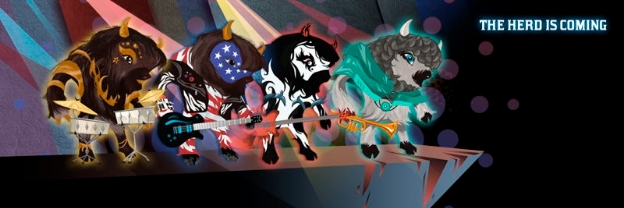

# Buffalo soldiers march to the heart of the blockchain
### **Crypto Bisons is a musical NFT game unveiled at the 2021 summit – and it has far-reaching implications for a host of other applications**
 28 October 2021[ Dominic Swords](tmp//en/blog/authors/dominic-swords/page-1/) 4 mins read

### [**Dominic Swords**](tmp//en/blog/authors/dominic-swords/page-1/)
Writer and editor

Marketing & Communications

- 

You want to demonstrate a unique combination of blockchain functions, bringing real-world elements together with collectibles and smart contracts. Of course you’d like to have a massive cohort of willing creative participants just ready and waiting to develop it. 

Bạn muốn chứng minh sự kết hợp độc đáo của các chức năng blockchain, mang các yếu tố trong thế giới thực cùng với các bộ sưu tập và hợp đồng thông minh.
Tất nhiên bạn muốn có một nhóm lớn những người tham gia sáng tạo sẵn sàng sẵn sàng và chờ đợi để phát triển nó.

It’s time to call in the guitar-playing bisons, obviously. 

Rõ ràng là thời gian để gọi các bisons chơi guitar, rõ ràng.

*Crypto Bisons*, a blockchain-enabled NFT game unveiled at Cardano Summit 2021, is based on an original concept from Charles Hoskinson, who, as well as founding Cardano, is a long-time gamer and game designer. He is also the owner of a herd of 500 or so bison. Because, why not?

*Crypto Bisons*, một trò chơi NFT hỗ trợ blockchain được công bố tại Cardano Summit 2021, dựa trên một khái niệm ban đầu từ Charles Hoskinson, người, cũng như sáng lập Cardano, là một game thủ và nhà thiết kế trò chơi lâu năm.
Anh ta cũng là chủ sở hữu của một đàn 500 hoặc hơn là bò rừng.
Bởi vì, tại sao không?

To see where the idea would go, Hoskinson enlisted the help of by six students at [Enjmin](https://enjmin.cnam.fr/cnam-enjmin/presentation/ecole-nationale-du-jeu-et-des-medias-interactifs-numeriques-1036162.kjsp)\*, the national digital game school of France in Angoulême. ‘We said to them, “Have some fun with it and see what you guys can do.” And it’s absolutely remarkable to see, month by month, the level of creativity and the convergence to something that actually has very practical gameplay mechanics,’ said Hoskinson. 

Để xem ý tưởng sẽ đi đâu, Hoskinson đã tranh thủ sự giúp đỡ của sáu sinh viên tại [Enjmin] (https://enjmin.cnam.fr/cnam-enjmin/presentation
-interactifs-numeriques-1036162.kjsp) \*, Trường trò chơi kỹ thuật số quốc gia của Pháp ở Angoulême.
Chúng tôi đã nói với họ, Hãy vui vẻ với nó và xem những gì các bạn có thể làm.
Và nó hoàn toàn đáng chú ý để xem, từng tháng, mức độ sáng tạo và sự hội tụ với một thứ thực sự có cơ chế chơi trò chơi rất thực tế, ông Hoskinson nói.

Karim Sellami, who managed the French team, said: ‘The first question that we had as students was not about gaming at all, but what happens in your field when you have so many bison! One day one of the bison had a fall and it made a noise and it was exciting, and then music is born. We thought about what will happen if all the bison discover music.’

Karim Sellami, người quản lý đội Pháp, cho biết: Câu hỏi đầu tiên mà chúng tôi có khi sinh viên không phải là chơi game, nhưng điều gì xảy ra trong lĩnh vực của bạn khi bạn có rất nhiều bò rừng!
Một ngày nọ, một con bò rừng bị ngã và nó gây ồn ào và nó rất thú vị, và sau đó âm nhạc được sinh ra.
Chúng tôi nghĩ về những gì sẽ xảy ra nếu tất cả các loài bò rừng khám phá âm nhạc.

But why a game? ‘Multiplayer games are a great use-case for blockchain,’ said Romain Pellerin, IOG technology chief. ‘You have the players, and they need to connect to a system and be logged in somewhere. With blockchain you have your log-in – it’s your wallet.’

Nhưng tại sao một trò chơi?
Trò chơi nhiều người chơi là một trường hợp sử dụng tuyệt vời cho blockchain, ông Romain Pellerin, giám đốc công nghệ IOG cho biết.
Bạn có người chơi và họ cần kết nối với một hệ thống và được đăng nhập ở đâu đó.
Với blockchain, bạn có đăng nhập-đó là ví của bạn.

Players form bands whose members are bison. Each bison has its own personality, which develops as the game world evolves. And a bison avatar is incomplete without a saxophone, right? Or a guitar. And if it’s a buffalo soldier, it’s going to need dreadlocks too. Well, there’s your collectibles. 

Người chơi thành lập các ban nhạc có thành viên là Bison.
Mỗi con bò rừng có tính cách riêng, phát triển khi thế giới trò chơi phát triển.
Và một hình đại diện của Bison không đầy đủ mà không có saxophone, phải không?
Hoặc một cây đàn guitar.
Và nếu nó là một người lính trâu, thì nó cũng sẽ cần Dreadlocks.
Vâng, có những bộ sưu tập của bạn.

The music the bison bands play is another function of the digital world: it’s algorithmically generated. ‘The original design brief was that we wanted to do something where we combine NFTs, algorithmically generated music and blockchain together with a geolocation component,’ said Hoskinson. 

Âm nhạc mà các ban nhạc Bison phát là một chức năng khác của thế giới kỹ thuật số: nó được tạo ra về mặt thuật toán.
Hoskinson cho biết, bản tóm tắt thiết kế ban đầu là chúng tôi muốn làm một cái gì đó trong đó chúng tôi kết hợp NFT, âm nhạc và blockchain được tạo ra về mặt thuật toán cùng với một thành phần định vị địa lý, ông Hoskinson nói.

‘It's a great experiment to take NFTs to the next level. Until recently NFTs were considered static things. They were pictures, videos – it was like owning a letter or something like that. It didn’t change; it was just there and, you know, it could be traded and so forth.’

Đó là một thử nghiệm tuyệt vời để đưa NFT lên cấp độ tiếp theo.
Cho đến gần đây NFT được coi là những thứ tĩnh.
Chúng là hình ảnh, video - nó giống như sở hữu một lá thư hoặc một cái gì đó tương tự.
Nó không thay đổi;
Nó chỉ ở đó và, bạn biết đấy, nó có thể được giao dịch và vv.

In *Crypto Bisons*, by contrast, the way the game object is used over time, from game to game, and even on to other platforms outside the game, affects its usability. ‘And so that's really a great experiment to conduct. You know, this also has very practical infrastructural implications on Cardano,’ said Hoskinson.

Trong *Crypto Bisons *, ngược lại, cách sử dụng đối tượng trò chơi theo thời gian, từ trò chơi này sang trò chơi khác và thậm chí đến các nền tảng khác bên ngoài trò chơi, ảnh hưởng đến khả năng sử dụng của nó.
Và đó thực sự là một thử nghiệm tuyệt vời để thực hiện.
Bạn biết đấy, điều này cũng có ý nghĩa cơ sở hạ tầng rất thực tế đối với Cardano, ông Hoskinson nói.

And where the bison go, others are sure to follow. ‘The bridging of the physical real world with the digital blockchain world – it hasn't really been done much before. Once that’s done, you can use it as a template for anything in the physical world. It can be artwork, it can be other types of animals, it can be people, places, these types of things.’

Và nơi bò rừng đi, những người khác chắc chắn sẽ làm theo.
Sự cầu nối của thế giới thực vật lý với thế giới blockchain kỹ thuật số - nó thực sự chưa được thực hiện nhiều trước đây.
Sau khi thực hiện xong, bạn có thể sử dụng nó như một mẫu cho bất cứ điều gì trong thế giới vật lý.
Nó có thể là tác phẩm nghệ thuật, nó có thể là các loại động vật khác, nó có thể là con người, địa điểm, những thứ này.

Pellerin added: ‘The game objects can be shared across games, not only within games. You could reuse them in different games but also in other entertainment support, your own music, other video games, platforms, and social networks. Finally, the logic and the scenario can be represented as a smart contract to evolve the scenario but also the game object. So we are very ambitious for this game. It’s going to bring great innovation that will lead to standards, because we have to design what is a game object on an NFT standard. And you can have many versions of the game standard, and that will lead to greater research.’

Pellerin nói thêm: Các đối tượng trò chơi có thể được chia sẻ trên các trò chơi, không chỉ trong các trò chơi.
Bạn có thể sử dụng lại chúng trong các trò chơi khác nhau mà còn trong các hỗ trợ giải trí khác, âm nhạc của riêng bạn, các trò chơi video, nền tảng và mạng xã hội khác.
Cuối cùng, logic và kịch bản có thể được thể hiện như một hợp đồng thông minh để phát triển kịch bản mà còn là đối tượng trò chơi.
Vì vậy, chúng tôi rất tham vọng cho trò chơi này.
Nó sẽ mang lại sự đổi mới tuyệt vời sẽ dẫn đến các tiêu chuẩn, bởi vì chúng ta phải thiết kế một đối tượng trò chơi trên một tiêu chuẩn NFT.
Và bạn có thể có nhiều phiên bản của tiêu chuẩn trò chơi và điều đó sẽ dẫn đến nghiên cứu lớn hơn.

Another thing Hoskinson likes about the game is that players compete against each other in a creative, rather than a destructive, way. The bison just want to play their way into the musical hall of fame.

Một điều khác mà Hoskinson thích về trò chơi là người chơi cạnh tranh với nhau trong một cách sáng tạo, thay vì một cách phá hoại.
Bison chỉ muốn chơi theo cách của họ vào Hội trường danh vọng âm nhạc.

(\* École nationale du jeu et des médias interactifs numériques)

(\* École Nationale du Jeu et des Médias tương tác Numériques)

Catch up on all the announcements from the [Cardano Summit 2021](https://summit.cardano.org/) website and [IOHK’s Twitter](https://twitter.com/InputOutputHK).

Hãy bắt kịp tất cả các thông báo từ [Hội nghị thượng đỉnh Cardano 2021] (https://summit.cardano.org/) và [IOHK tựa Twitter] (https://twitter.com/inputoutputhk).

