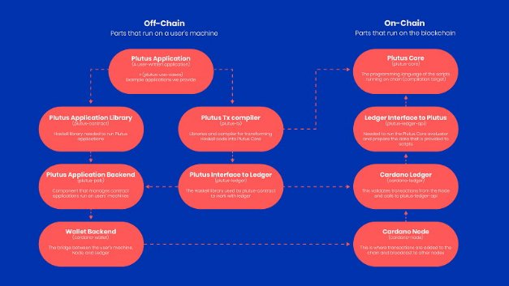

# Plutus Application Backend (PAB): supporting DApp development on Cardano
### **The PAB provides the components and an environment to help developers create and test DApps, before deploying them to a live production environment**
 28 October 2021[ Fernando Sanchez](tmp//en/blog/authors/fernando-sanchez/page-1/) 6 mins read

### [**Fernando Sanchez**](tmp//en/blog/authors/fernando-sanchez/page-1/)
Technical Writer

Marketing and Communications

- 
- 

The Alonzo protocol upgrade introduced Plutus – a platform that provides a native smart contract language along with the necessary infrastructure and tools to support smart contracts on Cardano. The Plutus platform enables developers to write decentralized applications (DApps) with scripting capabilities that interact with distributed ledgers. 

Nâng cấp giao thức Alonzo đã giới thiệu Plutus - một nền tảng cung cấp ngôn ngữ hợp đồng thông minh bản địa cùng với cơ sở hạ tầng và công cụ cần thiết để hỗ trợ các hợp đồng thông minh trên Cardano.
Nền tảng Plutus cho phép các nhà phát triển viết các ứng dụng phi tập trung (DAPP) với các khả năng kịch bản tương tác với các sổ cái phân tán.

To understand Plutus, one has to recognize three concepts:

Để hiểu Sao Diêm Vương, người ta phải nhận ra ba khái niệm:

- The [Extended Unspent Transaction Output](https://docs.cardano.org/plutus/eutxo-explainer) (EUTXO) model

- Đầu ra giao dịch không được mở rộng] (https://docs.cardano.org/plutus/eutxo-explainer) (EUTXO)

- Plutus Core ‒ the ‘on-chain’ part of Plutus

- Core Plutus

- The Plutus Application Framework (PAF) ‒ Plutus contracts consist of parts that run on the blockchain (on-chain code) and parts that run on a user’s machine (off-chain or client code)

-Khung ứng dụng Plutus (PAF)-Các hợp đồng Plutus của Plutus bao gồm các phần chạy trên blockchain (mã trên chuỗi) và các bộ phận chạy trên máy của người dùng (mã Off-chuỗi hoặc mã máy khách)

Both the on-chain and off-chain code are written in Haskell, and Plutus smart contracts are effectively Haskell programs.

Cả mã trên chuỗi và mã ngoài chuỗi đều được viết bằng Haskell và các hợp đồng thông minh Plutus là các chương trình Haskell một cách hiệu quả.

### **What is the Plutus Application Backend?**

### ** Ứng dụng Plutus phụ trợ là gì? **

[In a previous blog post](https://iohk.io/en/blog/posts/2021/04/13/plutus-what-you-need-to-know/), we discussed the on- and off-chain functionality of core components of Plutus in greater detail. Here, let’s dive deeper into Plutus off-chain capabilities and take a look at the Plutus Application Backend (PAB). 

[Trong một bài đăng trên blog trước đó] (https://iohk.io/en/blog/posts/2021/04/13/plutus-what-you-meed-to-kn
Chức năng chuỗi của các thành phần cốt lõi của Plutus chi tiết hơn.
Ở đây, hãy đi sâu hơn vào các khả năng của Plutus Off-chuỗi và xem phần phụ trợ ứng dụng Plutus (PAB).

In the UTXO model, we have off-chain infrastructure that builds the transactions that move the apps along. This off-chain infrastructure is quite complicated because it needs to look at the ledger state, pick some information from the ledger, and put it all together to build a transaction with the right pieces of data in the right place. The PAB is a single Haskell library that makes it easier to write this off-chain infrastructure and the on-chain scripts. 

Trong mô hình UTXO, chúng tôi có cơ sở hạ tầng ngoài chuỗi xây dựng các giao dịch di chuyển các ứng dụng.
Cơ sở hạ tầng ngoài chuỗi này khá phức tạp vì nó cần xem xét trạng thái sổ cái, chọn một số thông tin từ sổ cái và kết hợp tất cả lại với nhau để xây dựng một giao dịch với đúng dữ liệu ở đúng nơi.
PAB là một thư viện Haskell duy nhất giúp viết cơ sở hạ tầng ngoài chuỗi này dễ dàng hơn và các tập lệnh trên chuỗi.

The PAB helps with building the UTXO transactions in two ways:

PAB giúp xây dựng các giao dịch UTXO theo hai cách:

- The read path - That is, getting information from the chain, and reacting to events that happen on the blockchain. The read path is currently working on the testnet

- Đường dẫn đọc - nghĩa là lấy thông tin từ chuỗi và phản ứng với các sự kiện xảy ra trên blockchain.
Đường dẫn đọc hiện đang hoạt động trên testnet

- The write path - This is where we actually construct the transactions that run the Plutus scripts

- Đường dẫn ghi - Đây là nơi chúng tôi thực sự xây dựng các giao dịch chạy các tập lệnh Plutus

### **The role of the PAB**

### ** Vai trò của pab **

The PAB is a key component of the Plutus Application Framework (PAF) that enables developers to create and test DApps locally, before deploying them to a live production environment. A little like the [Marlowe Playground](https://alpha.marlowe.iohkdev.io/#/) provides a sandbox for devs to create and test financial smart contracts, the PAB offers a similar environment for devs to create and test full DApps.

PAB là một thành phần chính của Khung ứng dụng Plutus (PAF) cho phép các nhà phát triển tạo và kiểm tra DAPP tại địa phương, trước khi triển khai chúng đến môi trường sản xuất trực tiếp.
Giống như [Sân chơi Marlowe] (https://alpha.marlowe.iohkdev.io/#/) cung cấp một hộp cát cho các nhà phát triển để tạo và kiểm tra các hợp đồng thông minh tài chính
Dapps.

The PAB is an off-chain, backend service for managing and handling the requirements of the application instance throughout its lifecycle. This includes interaction with external clients (such as wallet frontends) and acts as an intermediary between Plutus Applications, the node, the wallet backend, and end-users. Such interaction is made possible by PAB commands and mock components that enable convenient simulations and integration of DApps. 

PAB là một dịch vụ ngoài chuỗi, phụ trợ để quản lý và xử lý các yêu cầu của thể hiện ứng dụng trong suốt vòng đời của nó.
Điều này bao gồm sự tương tác với các máy khách bên ngoài (như Fallet Frontends) và hoạt động như một trung gian giữa các ứng dụng Plutus, nút, phụ trợ ví và người dùng cuối.
Sự tương tác như vậy được thực hiện bởi các lệnh PAB và các thành phần giả cho phép mô phỏng thuận tiện và tích hợp DAPP.

While not a prerequisite for DApp creation or implementation – some developers are creating their own tools and indeed [API-based alternatives](https://youtu.be/W2R3zl91U24?t=357) are being worked on by the community – the PAB removes the need for developers to create their own infrastructure from scratch (including chain index, etc.) reducing development time and resources needed. It allows developers to simulate how an application would behave on-chain for prior testing and error elimination, to ensure a flawless transition for launch. 

Mặc dù không phải là điều kiện tiên quyết để tạo hoặc triển khai DAPP-Một số nhà phát triển đang tạo ra các công cụ của riêng họ và thực sự [các lựa chọn thay thế dựa trên API] (https://youtu.be/w2r3zl91u24?t=357) đang được làm việc bởi cộng đồng-
€ Các PAB loại bỏ sự cần thiết của các nhà phát triển để tạo cơ sở hạ tầng của riêng họ từ đầu (bao gồm chỉ số chuỗi, v.v.) giảm thời gian phát triển và tài nguyên cần thiết.
Nó cho phép các nhà phát triển mô phỏng cách ứng dụng sẽ hoạt động trên chuỗi để thử nghiệm trước và loại bỏ lỗi, để đảm bảo chuyển đổi hoàn hảo để khởi chạy.

The purpose of the PAB is to:

Mục đích của PAB là:

- provide a standardized environment for Plutus applications to run in

- Cung cấp một môi trường tiêu chuẩn hóa cho các ứng dụng Sao Diêm Vương để chạy

- present discoverable interfaces to the external clients

- Trình bày các giao diện có thể khám phá cho các máy khách bên ngoài

- track on-chain information for smart contract uses

- Theo dõi thông tin trên chuỗi cho việc sử dụng hợp đồng thông minh

- allow the developer to work in an emulated or non-emulated environment

- Cho phép nhà phát triển làm việc trong môi trường được mô phỏng hoặc không được mô phỏng

The PAB can switch between emulated and non-emulated (real network) environments seamlessly. This makes it easier to write all kinds of different tests – unit tests, integration tests, property based tests, etc. The PAB allows DApps to easily communicate with it as the backend can receive and deliver messages. Thus, the DApp can send usual requests to endpoints that the PAB has exposed, and which correspond to actions and operations that any particular smart contract is capable of handling.

PAB có thể chuyển đổi giữa môi trường được mô phỏng và không được phát minh (mạng thực) một cách liền mạch.
Điều này giúp việc viết tất cả các loại bài kiểm tra khác nhau - các bài kiểm tra đơn vị, kiểm tra tích hợp, kiểm tra dựa trên tài sản, vv PAB cho phép DAPP dễ dàng giao tiếp với nó vì phụ trợ có thể nhận và gửi tin nhắn.
Do đó, DAPP có thể gửi các yêu cầu thông thường đến các điểm cuối mà PAB đã phơi bày và tương ứng với các hành động và hoạt động mà bất kỳ hợp đồng thông minh cụ thể nào cũng có khả năng xử lý.

Applications deployed using the framework’s libraries can run on the PAB, which provides runtime support for access to the blockchain to further perform smart contract operations triggering transactions based on the [EUTXO model](https://iohk.io/en/blog/posts/2021/03/11/cardanos-extended-utxo-accounting-model/). Additionally, PAB features functionality for persistence, logging, and monitoring.

Các ứng dụng được triển khai bằng các thư viện của khung có thể chạy trên PAB, cung cấp hỗ trợ thời gian chạy để truy cập vào blockchain để thực hiện thêm các hoạt động hợp đồng thông minh kích hoạt các giao dịch dựa trên [mô hình EUTXO] (https://iohk.io/en/
blog/bài viết/2021/03/11/cardanos-extends-utxo-model-model/).
Ngoài ra, PAB có chức năng cho sự kiên trì, ghi nhật ký và giám sát.

### **Where are we right now?**

### ** Chúng ta đang ở đâu ngay bây giờ? **

Earlier this summer, we deployed the first in a series of color-coded testnets to bring core Plutus smart contract capability to Cardano. This was deployed on mainnet via the ‘Alonzo’ hard fork. Smart contract capability is currently accessible using a Command Line Interface (CLI). While the first simple smart contracts were enabled on mainnet in early September, this was always the first stage in the road to DApp deployment on mainnet. 

Đầu mùa hè này, chúng tôi đã triển khai lần đầu tiên trong một loạt các testnet được mã hóa màu để đưa khả năng hợp đồng thông minh Plutus Core cho Cardano.
Điều này đã được triển khai trên Mainnet thông qua hard -€ ˜ ALONZOâ € ™.
Khả năng hợp đồng thông minh hiện có thể truy cập bằng giao diện dòng lệnh (CLI).
Mặc dù các hợp đồng thông minh đơn giản đầu tiên đã được kích hoạt trên Mainnet vào đầu tháng 9, nhưng đây luôn là giai đoạn đầu tiên trên con đường triển khai DAPP trên Mainnet.

Developers have meanwhile been working on their DApps (many via the PAB) locally while testing any core smart contract functionality on the testnet. These elements need to come together before an DApp hits mainnet and this takes time. Once the PAB is integrated with the node and other core components such as the wallet back end (WBE) connector, developers will be able to move their DApps into a state of readiness and bring them to the Cardano testnet prior to mainnet launch. 

Các nhà phát triển đã làm việc trên các DAPP của họ (nhiều người thông qua PAB) cục bộ trong khi kiểm tra bất kỳ chức năng hợp đồng thông minh cốt lõi nào trên TestNet.
Các yếu tố này cần phải đến với nhau trước khi một DApp tấn công chính và điều này cần có thời gian.
Khi PAB được tích hợp với nút và các thành phần cốt lõi khác như đầu nối đầu (WBE), các nhà phát triển sẽ có thể chuyển DAPP của họ vào trạng thái sẵn sàng và đưa chúng đến Cardano Testnet trước khi ra mắt Mainnet.

These early applications built locally will then be able to interact with the mainnet as intended. The ‘mockchain’ approach to development to date means that for DApp creators, it will be a smooth transition from testnet to mainnet. All it takes is a change in the configuration files to start the PAB, it requires no changes to the actual code or to the Haskell code. This integration work is complex and a critical part of Cardano infrastructure so we need to ensure it is done correctly. We’re continuing to work on the final integrations and based on the current trajectory, we plan to deliver the integration in November, assuming we don’t encounter any critical issues.

Các ứng dụng ban đầu được xây dựng tại địa phương sau đó sẽ có thể tương tác với chính như dự định.
Cách tiếp cận phát triển cho đến nay, cách tiếp cận phát triển cho đến nay có nghĩa là đối với người tạo DAPP, nó sẽ là một sự chuyển đổi suôn sẻ từ testnet sang mainnet.
Tất cả chỉ cần thay đổi trong các tệp cấu hình để bắt đầu PAB, nó không yêu cầu thay đổi mã thực tế hoặc mã Haskell.
Công việc tích hợp này rất phức tạp và là một phần quan trọng của cơ sở hạ tầng Cardano, vì vậy chúng tôi cần đảm bảo nó được thực hiện chính xác.
Chúng tôi đang tiếp tục làm việc trên các tích hợp cuối cùng và dựa trên quỹ đạo hiện tại, chúng tôi dự định cung cấp tích hợp vào tháng 11, giả sử chúng tôi không gặp phải bất kỳ vấn đề quan trọng nào.

### **Looking ahead**

### ** Nhìn về phía trước **

This is just the start. As always, this will be an iterative process. With the evolution of the Plutus platform, we will be inviting the developer community to deploy their own tooling and create off-chain code for their DApps running on Cardano. We have already seen a hive of activity in this area, through both the Alonzo testnet program and Project Catalyst. So while we test the platform with our engineers/QA and the developer community, we’ll be making gradual improvements and adding more capabilities and functionality. The goal? From the Alonzo hardfork and the arrival of Plutus smart contracts, a rapid scaling of the developer experience, with new tools, APIs and environments to support an already burgeoning ecosystem of talent. 

Đây mới chỉ là khởi đầu.
Như mọi khi, đây sẽ là một quá trình lặp đi lặp lại.
Với sự phát triển của nền tảng Plutus, chúng tôi sẽ mời cộng đồng nhà phát triển triển khai công cụ của riêng họ và tạo mã ngoài chuỗi cho các DAPP của họ chạy trên Cardano.
Chúng tôi đã thấy một tổ chức hoạt động trong lĩnh vực này, thông qua cả chương trình ALONZO TESTNET và Project Catalyst.
Vì vậy, trong khi chúng tôi kiểm tra nền tảng với các kỹ sư/QA của chúng tôi và cộng đồng nhà phát triển, chúng tôi sẽ thực hiện các cải tiến dần dần và thêm nhiều khả năng và chức năng.
Mục đích?
Từ Alonzo Hardfork và sự xuất hiện của các hợp đồng thông minh Plutus, một quy mô nhanh chóng của trải nghiệm nhà phát triển, với các công cụ mới, API và môi trường để hỗ trợ một hệ sinh thái tài năng đã phát triển.

*For regular updates make sure you follow us on [Twitter](https://twitter.com/InputOutputHK) and subscribe to our [YouTube](https://www.youtube.com/channel/UCBJ0p9aCW-W82TwNM-z3V2w) channel. For an overview of projects #BuildingOnCardano be sure to check out the [Essential Cardano](https://github.com/input-output-hk/essential-cardano) repo.*

*Để cập nhật thường xuyên, hãy đảm bảo bạn theo dõi chúng tôi trên [Twitter] (https://twitter.com/inputoutputhk) và đăng ký vào [YouTube] của chúng tôi (https://www.youtube.com/channel/ucbj0p9acw-w82twnm-z3v2w)
kênh truyền hình.
Để biết tổng quan về các dự án #BuildingCardano, hãy chắc chắn kiểm tra [Cardano thiết yếu] (https://github.com/input-output-hk/essential-cardano) repo.*

