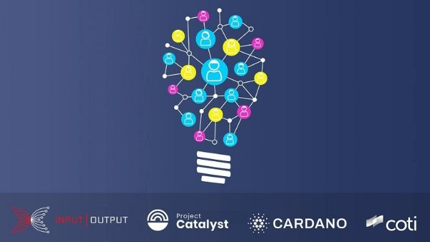

# Introducing Catalyst Natives - How any business can leverage the Cardano innovation engine
### **As part of the broader Catalyst project, the Catalyst Natives program opens up the potential of blockchain technology to new use cases for everyday businesses of all sizes**
 10 November 2021[ Fernando Sanchez](tmp//en/blog/authors/fernando-sanchez/page-1/) 5 mins read

### [**Fernando Sanchez**](tmp//en/blog/authors/fernando-sanchez/page-1/)
Technical Writer

Marketing and Communications

- 
- 

We are excited to announce the first Catalyst Natives pilot, as part of [Project Catalyst](https://iohk.io/en/blog/posts/2021/02/12/our-million-dollar-baby-project-catalyst/), Cardano’s community-driven innovation engine. Catalyst Natives enables any organization to leverage the crowd’s power to solve business problems and outsource the implementation of solutions. This project opens up the potential of blockchain technology to new use cases for everyday businesses, both large and small.

Chúng tôi rất vui mừng được thông báo phi công người bản địa Catalyst đầu tiên, là một phần của [Project Catalyst] (https://iohk.io/en/blog/posts/2021/02/12/our-million-dollar-baby-project-catalyst
/), Động cơ đổi mới dựa trên cộng đồng của Cardano.
Người bản địa Catalyst cho phép bất kỳ tổ chức nào tận dụng sức mạnh của đám đông để giải quyết các vấn đề kinh doanh và thuê ngoài việc thực hiện các giải pháp.
Dự án này mở ra tiềm năng của công nghệ blockchain cho các trường hợp sử dụng mới cho các doanh nghiệp hàng ngày, cả lớn và nhỏ.

We’re launching a series of pilots, firstly in conjunction with [COTI](https://coti.io/), an enterprise-grade fintech company that empowers organizations to build their payment solutions. COTI has developed, in partnership with Cardano, a very user-friendly and scalable ada payment solution for the community. As a result, online merchants, from a small hotel in Europe to a big e-commerce website in Asia, can easily accept hundreds or thousands of ada transactions by integrating [adaPay](https://adapay.finance/) into their site.

Chúng tôi sẽ ra mắt một loạt các phi công, trước tiên kết hợp với [coti] (https://coti.io/), một công ty fintech cấp doanh nghiệp trao quyền cho các tổ chức xây dựng các giải pháp thanh toán của họ.
COTI đã phát triển, hợp tác với Cardano, một giải pháp thanh toán ADA rất thân thiện và có thể mở rộng cho cộng đồng.
Do đó, các thương nhân trực tuyến, từ một khách sạn nhỏ ở châu Âu đến một trang web thương mại điện tử lớn ở châu Á, có thể dễ dàng chấp nhận hàng trăm hoặc hàng ngàn giao dịch ADA bằng cách tích hợp [Adapay] (https://adapay.finance/) vào trang web của họ
.

When asked about the partnership Shahaf Bar-Geffen the CEO of COTI, he said:

Khi được hỏi về quan hệ đối tác Shahaf Bar-Geffen Giám đốc điều hành của Coti, ông nói:

We are very excited to be the first company to launch a Catalyst Native fund. As close partners, it is only natural for COTI, IOHK, and Cardano Foundation to collaborate once again to allow teams from all over the world to take part in the adaPay development and participate in our challenge. Finding new innovative ways to enrich adaPay will value not only the Cardano and COTI communities but the entire world by allowing a very wide variety of merchants to accept ada as a payment method.

Chúng tôi rất vui mừng khi trở thành công ty đầu tiên ra mắt một quỹ bản địa chất xúc tác.
Là những đối tác thân thiết, việc COTI, IOHK và Cardano Foundation trở nên tự nhiên là một lần nữa để cho phép các đội từ khắp nơi trên thế giới tham gia vào sự phát triển của Adapay và tham gia vào thử thách của chúng tôi.
Tìm kiếm những cách sáng tạo mới để làm phong phú Adapay sẽ coi trọng không chỉ các cộng đồng Cardano và Coti mà toàn bộ thế giới bằng cách cho phép rất nhiều thương nhân chấp nhận ADA như một phương thức thanh toán.

### **Project Catalyst**

### ** Chất xúc tác dự án **

In less than a year, Project Catalyst has grown to become the world’s largest decentralized innovation fund. It is a center for future development and sustainable innovation, driven by the Cardano community, for the Cardano community. In this initial pilot of Catalyst Natives, we are opening the gateway to organizations outside of the Cardano ecosystem to harness the transformative power of the Project Catalyst innovation engine.

Trong chưa đầy một năm, Project Catalyst đã phát triển để trở thành quỹ đổi mới phi tập trung lớn nhất thế giới.
Đây là một trung tâm phát triển trong tương lai và đổi mới bền vững, được thúc đẩy bởi cộng đồng Cardano, cho cộng đồng Cardano.
Trong phi công ban đầu của người bản địa Catalyst, chúng tôi đang mở cửa ngõ cho các tổ chức bên ngoài hệ sinh thái Cardano để khai thác sức mạnh biến đổi của động cơ đổi mới của Project Catalyst.

At each funding round, Project Catalyst has presented several challenges for the community to collaborate on and deliver solutions. Now, with the launch of [Fund 7](https://bit.ly/3qzYYP8), there is $8m worth of ada available, 80% of which is set aside for project funding and 20% is available for rewards incentives for voters and community advisors. Fund 7 consists of 24 challenges, 21 of those challenges were proposed by and voted for by the community, two challenges were proposed by [IOG](https://iohk.io/), and the Catalyst natives pilot in collaboration with COTI. The Catalyst community votes on the presented solutions and the winners of that vote receive funding to complete their projects.

Tại mỗi vòng tài trợ, Project Catalyst đã đưa ra một số thách thức cho cộng đồng để hợp tác và cung cấp các giải pháp.
Bây giờ, với sự ra mắt của [Quỹ 7] (https://bit.ly/3qzyyp8), có sẵn ADA trị giá 8 triệu đô la, 80% trong số đó được đặt sang một bên để tài trợ dự án và 20% có sẵn cho các ưu đãi phần thưởng cho các ưu đãi cho phần thưởng cho
Cử tri và cố vấn cộng đồng.
Quỹ 7 bao gồm 24 thách thức, 21 trong số những thách thức đó đã được cộng đồng đề xuất và bỏ phiếu cho cộng đồng, hai thách thức đã được đề xuất bởi [IOG] (https://iohk.io/), và phi công người bản địa Catalyst phối hợp với Coti.
Cộng đồng Catalyst bỏ phiếu cho các giải pháp được trình bày và người chiến thắng trong cuộc bỏ phiếu đó nhận được tài trợ để hoàn thành các dự án của họ.

### **Catalyst Natives**

### ** Người bản địa Catalyst **

Catalyst Natives extends access to Project Catalyst functionality like the Cardano [native tokens](https://docs.cardano.org/native-tokens/learn) feature extends the range of tokens on the Cardano blockchain.

Người bản địa Catalyst mở rộng quyền truy cập vào chức năng xúc tác dự án như cardano [mã thông báo gốc] (https://docs.cardano.org/native-tokens/learn) Tính năng mở rộng phạm vi mã thông báo trên blockchain Cardano.

With the introduction of Catalyst Natives, organizations outside of the Cardano/Catalyst ecosystem can also present challenges and offer incentives and rewards to those who successfully meet the challenge with their proposed innovations. 

Với việc giới thiệu người bản địa Catalyst, các tổ chức bên ngoài hệ sinh thái Cardano/Catalyst cũng có thể đưa ra những thách thức và đưa ra các ưu đãi và phần thưởng cho những người đáp ứng thành công thách thức với những đổi mới được đề xuất của họ.

In this pilot, COTI offers an innovative technical challenge to our communities. All small and medium enterprises currently using platforms such as Shopify and WooCommerce will be able to benefit from new and creative ways to accept ada payments with seamless integration by adding a plug-in to their site. 

Trong phi công này, COTI cung cấp một thách thức kỹ thuật sáng tạo cho các cộng đồng của chúng tôi.
Tất cả các doanh nghiệp vừa và nhỏ hiện đang sử dụng các nền tảng như Shopify và WooC Commerce sẽ có thể hưởng lợi từ các cách mới và sáng tạo để chấp nhận thanh toán ADA với tích hợp liền mạch bằng cách thêm trình cắm vào trang web của họ.

Following the pilot, we will be opening Catalyst Natives to receive further challenges from other external organizations, these challenges in the initial phase will be curated by IOG to ensure they add value to the wider Cardano ecosystem. Organizations submitting challenges through Natives will provide the funding for those proposals, meaning that Catalyst Natives do not use the Cardano Treasury funding to pay for the successfully voted-for projects. In Fund 7, COTI provides $100k worth of COTI tokens plus costs, which is over and above the existing $8 million ada fund. 

Sau phi công, chúng tôi sẽ mở các người bản địa Catalyst để nhận thêm những thách thức từ các tổ chức bên ngoài khác, những thách thức này trong giai đoạn ban đầu sẽ được IOG quản lý để đảm bảo họ tăng thêm giá trị cho hệ sinh thái Cardano rộng hơn.
Các tổ chức đệ trình các thách thức thông qua người bản địa sẽ cung cấp tài trợ cho các đề xuất đó, có nghĩa là người bản địa Catalyst không sử dụng tài trợ của Kho bạc Cardano để trả cho các dự án được bỏ phiếu thành công.
Trong quỹ 7, COTI cung cấp các mã thông báo COTI trị giá 100 nghìn đô la, đã vượt quá và hơn quỹ ADA trị giá 8 triệu đô la hiện có.

Catalyst Natives is a fantastic proposition for organizations of all shapes and sizes to gain access to a veritable trove of ideas and to those with the skills to realize them. Catalyst Natives is currently looking to help partners and native asset token projects in the Cardano ecosystem address specific pain points that they either do not have the resources to resolve or simply do not have a solution for, and outsource them as Catalyst challenges for proposers to address.

Người bản địa Catalyst là một đề xuất tuyệt vời cho các tổ chức thuộc mọi hình dạng và quy mô để có được quyền truy cập vào một kho ý tưởng thực sự và cho những người có kỹ năng nhận ra chúng.
Người bản địa Catalyst hiện đang tìm cách giúp các đối tác và các dự án mã thông báo tài sản bản địa trong hệ sinh thái Cardano giải quyết các điểm đau cụ thể mà họ không có tài nguyên để giải quyết hoặc đơn giản là không có giải pháp cho và thuê ngoài chúng là những thách thức của chất xúc tác để giải quyết vấn đề
.

As the future rolls toward us at an ever-increasing pace, organizations must adapt to constantly changing market conditions and systems like Catalyst may pave the way for disruption in how people collaborate and make decisions beyond the Cardano community. Emerging markets make planning exceptionally challenging. This uncertainty is why the ability to tap into a think tank as and when needed and outsource implementation is highly valuable and may be the differentiating factor in competitive market spaces.

Khi tương lai tiến về phía chúng tôi với tốc độ ngày càng tăng, các tổ chức phải thích nghi với các điều kiện và hệ thống thị trường liên tục thay đổi như Catalyst có thể mở đường cho sự gián đoạn trong cách mọi người hợp tác và đưa ra quyết định ngoài cộng đồng Cardano.
Thị trường mới nổi làm cho kế hoạch đặc biệt thách thức.
Sự không chắc chắn này là lý do tại sao khả năng khai thác vào một bể tư duy khi và khi cần thiết và thuê ngoài thực hiện rất có giá trị và có thể là yếu tố khác biệt trong không gian thị trường cạnh tranh.

### **How to apply to Catalyst Natives**

### ** Cách áp dụng cho người bản địa Catalyst **

Do you have a specific business problem and would like to take part in the next Catalyst Natives pilot? Please apply [here](https://forms.gle/BA8LmtrAWWmHHcY59) and take the next steps towards accessing untapped potential.

Bạn có một vấn đề kinh doanh cụ thể và muốn tham gia vào phi công người bản địa Catalyst tiếp theo?
Vui lòng áp dụng [tại đây] (https://forms.gle/ba8lmtrawwmhhcy59) và thực hiện các bước tiếp theo để truy cập tiềm năng chưa được khai thác.

### **Where to find out more about Project Catalyst?**

### ** Nơi để tìm hiểu thêm về Project Catalyst? **

- [Catalyst Newsletter](https://bit.ly/3dSZJvx)

- [Bản tin Catalyst] (https://bit.ly/3dszjvx)

- [Catalyst Announcements Channel](https://t.me/cardanocatalyst)

- [Kênh thông báo Catalyst] (https://t.me/cardanocatalyst)

- [Catalyst Community Chat](https://t.me/ProjectCatalystChat)

- [Trò chuyện cộng đồng Catalyst] (https://t.me/projectcatalystchat)

- [Catalyst Fund 7 Launch Guide](https://bit.ly/3qzYYP8)

- [Hướng dẫn khởi động của Fund Fund 7] (https://bit.ly/3qzyyp8)

- [Browse Projects](https://cardano.ideascale.com)

- [Duyệt các dự án] (https://cardano.ideascale.com)

##### ***Tim Richmond, communications manager at IOG, also contributed to this article.***

#### *** Tim Richmond, Giám đốc truyền thông tại IOG, cũng đã đóng góp cho bài viết này. ***

