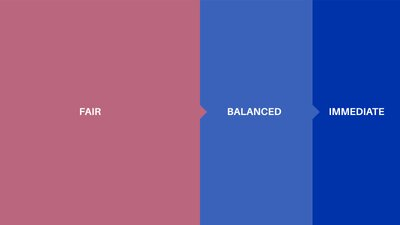

# Network traffic and tiered pricing
### **Decentralized finance will continue to build demand on Cardano. Our research project is looking at ways to maintain fair access and throughput for every user**
 26 November 2021[ Philip Lazos](tmp//en/blog/authors/philip-lazos/page-1/) 7 mins read

### [**Philip Lazos**](tmp//en/blog/authors/philip-lazos/page-1/)
Research Fellow

Academic Research

- 

A recent blog post outlined some of the ways in which the Cardano network would [flex and evolve](https://iohk.io/en/blog/posts/2021/11/22/slow-and-steady-wins-the-race-network-evolution-for-network-growth/) to meet the global demands of smart contracts and DeFi. Similarly, it will become necessary to upgrade the transaction fee system used for Cardano. 

Một bài đăng trên blog gần đây đã phác thảo một số cách mà mạng Cardano sẽ [Flex và Evolve] (https://iohk.io/en/blog/posts/2021/11/22/slow-and-wins-wins-the
-Race-Network-Evolution-for-Network-Growth/) để đáp ứng các yêu cầu toàn cầu của các hợp đồng thông minh và Defi.
Tương tự, nó sẽ trở nên cần thiết để nâng cấp hệ thống phí giao dịch được sử dụng cho Cardano.

The current system is simple and fair: every transaction is treated the same and it is not possible for users to alter their priority by paying higher fees. As long as the throughput capacity is comparable to the demand, this approach works well.

Hệ thống hiện tại rất đơn giản và công bằng: Mọi giao dịch đều được đối xử giống nhau và người dùng không thể thay đổi mức độ ưu tiên của họ bằng cách trả phí cao hơn.
Miễn là khả năng thông lượng có thể so sánh với nhu cầu, phương pháp này hoạt động tốt.

There are, however, drawbacks. As the use of Cardano increases, there will, eventually, come a point when not all transactions will be able to be included in the blockchain, even with adjustments to the parameterization. Although increasing the capacity of the main chain and/or diverting transactions to [Hydra](https://iohk.io/en/blog/posts/2021/09/17/hydra-cardano-s-solution-for-ultimate-scalability/) or other layer 2 solutions can alleviate this concern, the core system must still work in an agile way in all possible cases and at all times.

Tuy nhiên, có những nhược điểm.
Khi việc sử dụng Cardano tăng lên, cuối cùng, sẽ đến một điểm khi không phải tất cả các giao dịch sẽ có thể được đưa vào blockchain, ngay cả với các điều chỉnh cho tham số hóa.
Mặc dù tăng khả năng của chuỗi chính và/hoặc chuyển hướng các giao dịch sang [hydra] (https://iohk.io/en/blog/posts/2021/09/17/hydra-cardano
Khả năng mở rộng/) hoặc các giải pháp Lớp 2 khác có thể làm giảm bớt mối quan tâm này, hệ thống cốt lõi vẫn phải hoạt động một cách nhanh nhẹn trong mọi trường hợp có thể và mọi lúc.

This is especially relevant in the case of a denial of service (DoS) attack. With the system as is, an attacker could take advantage of the fair treatment and pass off their malicious spam as legitimate transactions, increasing waiting times for everyone else. There are measures in place (eg, relating to transaction propagation through the peer-to-peer network) that make such an attack technically challenging. However, for extra protection, we would like to be able to increase the costs of such attacks without jeopardizing the fairness and price efficiency of the whole system. 

Điều này đặc biệt có liên quan trong trường hợp tấn công từ chối dịch vụ (DOS).
Với hệ thống như hiện tại, một kẻ tấn công có thể tận dụng sự đối xử công bằng và vượt qua thư rác độc hại của họ như các giao dịch hợp pháp, tăng thời gian chờ đợi cho mọi người khác.
Có các biện pháp tại chỗ (ví dụ: liên quan đến việc truyền bá giao dịch thông qua mạng ngang hàng) khiến cho một cuộc tấn công như vậy trở nên khó khăn về mặt kỹ thuật.
Tuy nhiên, để bảo vệ thêm, chúng tôi muốn có thể tăng chi phí cho các cuộc tấn công đó mà không gây nguy hiểm cho sự công bằng và hiệu quả giá của toàn bộ hệ thống.

This is a topic members of IO Group’s research team have been looking at this year. The resulting approach proposed in this post maintains the pillars of Cardano transaction processing (predictability, fairness and inexpensive access) while mitigating the issues that could arise from greater demand. Our approach puts forth a novel transaction fee mechanism for blockchains. The key to the design is partitioning each block into three ‘tiers’ based on use case. Each tier makes up a set percentage of the maximum block size and is designed for different types of transactions (Figure 1). The tiers, along with the suggested split we are analyzing at present, would be:

Đây là một thành viên chủ đề của nhóm nghiên cứu của Tập đoàn IO đã xem xét trong năm nay.
Cách tiếp cận kết quả được đề xuất trong bài đăng này duy trì các trụ cột của xử lý giao dịch Cardano (dự đoán, tính công bằng và truy cập rẻ tiền) trong khi giảm thiểu các vấn đề có thể phát sinh từ nhu cầu lớn hơn.
Cách tiếp cận của chúng tôi đưa ra một cơ chế phí giao dịch mới cho blockchains.
Chìa khóa cho thiết kế là phân vùng từng khối thành ba â € ˜tiersâ € ™ dựa trên trường hợp sử dụng.
Mỗi tầng chiếm một tỷ lệ phần trăm được thiết lập của kích thước khối tối đa và được thiết kế cho các loại giao dịch khác nhau (Hình 1).
Các tầng, cùng với sự phân chia được đề xuất mà chúng tôi đang phân tích hiện tại, sẽ là:

- fair (50%)

- Hội chợ (50%)

- balanced (30%)

- Cân bằng (30%)

- immediate (20%)

- ngay lập tức (20%)

#### **Figure 1. Each block would be split into three tiers.**

#### ** Hình 1. Mỗi khối sẽ được chia thành ba tầng. **

We will discuss the fair segment last, because it works differently from the other two. Balanced and immediate work by having a ‘fee threshold’, which is different for each. To be included in a block, transaction issuers would specify the tier of service they need. This can be done by setting a maximum fee for the transaction. Then, each block would be filled starting with the immediate, then balanced, and finally fair tiers. Similar transactions within the same tier would pay the same fee. To make this choice simple, each transaction would only be charged the lowest fee that would guarantee its entry in the block. After every block, fees for immediate and balanced tiers would be updated dynamically and deterministically (reflecting the level of demand in previous blocks) to ensure that each segment uses its target percentage of the block. 

Chúng tôi sẽ thảo luận về phân khúc công bằng cuối cùng, bởi vì nó hoạt động khác với hai phần còn lại.
Công việc cân bằng và ngay lập tức bằng cách có một ngưỡng ", khác nhau, khác nhau.
Để được bao gồm trong một khối, các nhà phát hành giao dịch sẽ chỉ định tầng dịch vụ họ cần.
Điều này có thể được thực hiện bằng cách đặt một khoản phí tối đa cho giao dịch.
Sau đó, mỗi khối sẽ được lấp đầy bắt đầu với ngay lập tức, sau đó cân bằng, và cuối cùng là các tầng công bằng.
Các giao dịch tương tự trong cùng một tầng sẽ trả cùng một khoản phí.
Để làm cho lựa chọn này đơn giản, mỗi giao dịch sẽ chỉ được tính phí thấp nhất đảm bảo mục nhập của nó trong khối.
Sau mỗi khối, các khoản phí cho các tầng ngay lập tức và cân bằng sẽ được cập nhật một cách linh hoạt và xác định (phản ánh mức độ nhu cầu trong các khối trước đó) để đảm bảo rằng mỗi phân đoạn sử dụng tỷ lệ phần trăm mục tiêu của khối.

The difference between immediate and balanced tiers is in the way fees would be updated, specifically the ‘speed’ at which they adjust given the current load. The threshold for immediate service would always be higher than balanced and would react more sharply to demand, ensuring that the transaction asking for it would be serviced as soon as possible. The balanced threshold would be slower to adapt and more stable: this would make it unsuitable for time-sensitive transactions, but would provide a lower, more reliable price at the expense of more varied waiting time.

Sự khác biệt giữa các tầng ngay lập tức và cân bằng là theo cách các khoản phí sẽ được cập nhật, cụ thể là "tốc độ mà họ điều chỉnh cho tải hiện tại.
Ngưỡng dịch vụ ngay lập tức sẽ luôn cao hơn cân bằng và sẽ phản ứng mạnh hơn với yêu cầu, đảm bảo rằng giao dịch yêu cầu nó sẽ được phục vụ càng sớm càng tốt.
Ngưỡng cân bằng sẽ chậm hơn để thích nghi và ổn định hơn: điều này sẽ khiến nó không phù hợp với các giao dịch nhạy cảm với thời gian, nhưng sẽ cung cấp một mức giá thấp hơn, đáng tin cậy hơn với chi phí của thời gian chờ đợi nhiều hơn.

While the balanced and immediate tiers aim to handle transactions with different levels of urgency, the fair tier handles ordinary transactions. The fair segment is intended to serve as a refinement of the current system in Cardano, keeping the fees low (or in the future even stable, by pegging to a basket of commodities/fiat, as explained in the [post on stablefees](https://iohk.io/en/blog/posts/2021/06/10/stablefees-and-the-decentralized-reserve-system/)) and removing any unpredictability from the user’s perspective. As long as demand is low (and the transactions fit into half of the block) this segment would function as Cardano does now. 

Trong khi các tầng cân bằng và ngay lập tức nhằm mục đích xử lý các giao dịch với các cấp độ khẩn cấp khác nhau, thì công bằng xử lý các giao dịch thông thường.
Phân khúc công bằng nhằm phục vụ như là một sự tinh chỉnh của hệ thống hiện tại ở Cardano, giữ phí thấp (hoặc trong tương lai thậm chí ổn định, bằng cách gắn vào một rổ hàng hóa/fiat, như được giải thích trong [bài về stablefees] (https
: //iohk.io/en/blog/posts/2021/06/10/stablefees-and-the-deCentralized-reserve-system/)) và loại bỏ mọi điều không thể đoán trước khỏi quan điểm của người dùng.
Miễn là nhu cầu thấp (và các giao dịch phù hợp với một nửa khối), phân khúc này sẽ hoạt động như Cardano bây giờ.

However, once demand rises, a special mechanism would kick in for fair tier transactions. The mechanism would filter transactions in a manner independent of fees and be based on a prioritization function. One example of this would be to give priority to transactions depending on the age and amount of their UTXOs. In particular, the priority of a given transaction would be equal to the sum of the amount of each input multiplied by its age and then divided by the total size of the transactions in bytes. This priority could be used in conjunction with a threshold (updated dynamically after every block) that would filter transactions whose priority is too low. Such an approach guarantees liveness for each transaction at a low and predictable price and limits the effect a malicious attacker (or a surge of demand) could have on prices, by always providing an inexpensive way into each block.

Tuy nhiên, một khi nhu cầu tăng lên, một cơ chế đặc biệt sẽ khởi động cho các giao dịch cấp công bằng.
Cơ chế sẽ lọc các giao dịch theo cách độc lập với phí và dựa trên chức năng ưu tiên.
Một ví dụ về điều này là ưu tiên cho các giao dịch tùy thuộc vào độ tuổi và số lượng UTXO của họ.
Cụ thể, mức độ ưu tiên của một giao dịch nhất định sẽ bằng tổng số lượng của mỗi đầu vào nhân với tuổi của nó và sau đó chia cho tổng kích thước của các giao dịch trong byte.
Ưu tiên này có thể được sử dụng cùng với ngưỡng (được cập nhật động sau mỗi khối) sẽ lọc các giao dịch có mức độ ưu tiên quá thấp.
Cách tiếp cận như vậy đảm bảo khả năng sinh hoạt cho mỗi giao dịch với mức giá thấp và có thể dự đoán được và hạn chế ảnh hưởng của một kẻ tấn công độc hại (hoặc sự gia tăng của nhu cầu) có thể có giá, bằng cách luôn cung cấp một cách rẻ tiền cho mỗi khối.

The tiered pricing idea presented here also extends and clarifies the concept of the multiplier that we introduced in the stablefees post. Viewed in this way, each of the three tiers is associated with a deterministically calculated multiplier (with the fair tier always at a multiplier of 1) whose value depends on the congestion of the respective tier in previous blocks. 

Ý tưởng giá được trình bày ở đây cũng mở rộng và làm rõ khái niệm về số nhân mà chúng tôi đã giới thiệu trong bài StableFees.
Nhìn theo cách này, mỗi tầng trong số ba tầng được liên kết với hệ số nhân được tính toán xác định (với tầng công bằng luôn ở số nhân 1) có giá trị phụ thuộc vào sự tắc nghẽn của tầng tương ứng trong các khối trước đó.

This mechanism is different from current pricing approaches, as used by Bitcoin or Ethereum (even with Ethereum Improvement Proposal 1559), where there is a variable fee that each transaction must exceed to make it into a block. The downside of this approach is that the fee everyone needs to pay is dictated by the ‘richest’ consumers. Even worse, this is the fee paid by the richest consumers to make it into a block ‘immediately’. In addition, even though the fees are mostly a function of supply and demand, these particular types of transaction fee mechanism can inadvertently ‘shape’ demand, or inadvertently increase prices because the optimal bidding strategy is not clear to users. Imagine if the transaction fees of Bitcoin were halved suddenly and everyone forgot what they used to be, would they still rise to their current levels? Answering ‘no’ to this question illustrates the downsides of such mechanisms and is a predicament that tiered pricing precludes by design. 

Cơ chế này khác với các phương pháp định giá hiện tại, được sử dụng bởi Bitcoin hoặc Ethereum (ngay cả với đề xuất cải tiến Ethereum 1559), trong đó có một khoản phí thay đổi mà mỗi giao dịch phải vượt quá để biến nó thành một khối. Nhược điểm của phương pháp này là phí mà mọi người cần phải trả được quyết định bởi người tiêu dùng "đa dạng nhất. Thậm chí tệ hơn, đây là khoản phí mà người tiêu dùng giàu nhất phải trả để biến nó thành một khối - ˜IMPILITYITYITILYI -€ ™. Ngoài ra, mặc dù các khoản phí chủ yếu là một chức năng của cung và cầu, các loại cơ chế phí giao dịch cụ thể này có thể vô tình - nhu cầu giảm giá, hoặc vô tình tăng giá vì chiến lược đấu thầu tối ưu không rõ ràng cho người dùng. Hãy tưởng tượng nếu phí giao dịch của Bitcoin bị giảm một nửa đột ngột và mọi người đều quên những gì họ từng là, liệu họ có còn tăng đến mức hiện tại không? Trả lời "Không phải câu hỏi này minh họa cho các nhược điểm của các cơ chế đó và là một tình huống khó khăn mà việc định giá cấp theo thiết kế.

The tiered approach is more refined. It understands that not every transaction has the same needs, ensuring that different use cases can happen simultaneously and making it easy for users to choose the desired type of service. In this way, tiered pricing makes it possible to have predictable and fair fees while managing periods of congestion on the main chain. Combined with design improvements to be revealed in later posts that focus on increasing the raw throughput capacity and processing power of the main chain, tiered pricing shows how Cardano will be able to accommodate any circumstance of transaction processing demand. 

Cách tiếp cận tầng là tinh tế hơn.
Nó hiểu rằng không phải mọi giao dịch đều có cùng một nhu cầu, đảm bảo rằng các trường hợp sử dụng khác nhau có thể xảy ra đồng thời và giúp người dùng dễ dàng chọn loại dịch vụ mong muốn.
Theo cách này, giá cả theo cấp độ cho phép có thể có các khoản phí dự đoán và công bằng trong khi quản lý thời gian tắc nghẽn trên chuỗi chính.
Kết hợp với các cải tiến thiết kế được tiết lộ trong các bài đăng sau này tập trung vào việc tăng khả năng thông lượng thô và sức mạnh xử lý của chuỗi chính, giá theo cấp cho thấy Cardano sẽ có thể đáp ứng mọi trường hợp của nhu cầu xử lý giao dịch như thế nào.

*I would like to acknowledge the contributions of Giorgos Panagiotakos, Aggelos Kiayias and Elias Koutsoupias to this post. Together we form the research group working on the design of this mechanism. A technical paper will be available soon.*

*Tôi muốn thừa nhận những đóng góp của Giorgos Panagiotakos, Aggelos Kiayias và Elias Koutsoupias cho bài đăng này.
Chúng tôi cùng nhau thành lập nhóm nghiên cứu làm việc về thiết kế của cơ chế này.
Một bài báo kỹ thuật sẽ sớm có sẵn.*

