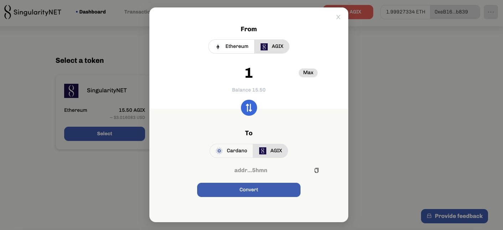

# The AGIX ERC20 converter testnet is now live
### **A public testnet is available for you to try out the migration of AGIX tokens to the Cardano ecosystem**
 7 December 2021[ Olga Hryniuk](tmp//en/blog/authors/olga-hryniuk/page-1/) 6 mins read

### [**Olga Hryniuk**](tmp//en/blog/authors/olga-hryniuk/page-1/)
Technical Writer

Marketing & Communications

- 
- 

In our [previous blog post](https://iohk.io/en/blog/posts/2021/05/17/bringing-erc20-to-cardano/) earlier this summer, we shared how Cardano would support the migration of ERC20 tokens from Ethereum, working initially with SingularityNET and their AGIX token. Today we can announce that the AGIX ERC20 converter testnet is live and ready for community evaluation. 

Trong [bài đăng trên blog trước] của chúng tôi (https://iohk.io/en/blog/posts/2021/05/17/bre
Mã thông báo ERC20 từ Ethereum, làm việc ban đầu với Singularitynet và mã thông báo Agix của họ.
Hôm nay chúng tôi có thể thông báo rằng TestNet chuyển đổi AGIX ERC20 đã trực tiếp và sẵn sàng để đánh giá cộng đồng.

[S](https://singularitynet.io/)[ingularityNET](https://singularitynet.io/) is our first partner in this initiative. And the converter is a significant step in our shared journey towards a much deeper collaboration with the SingularityNET community. 

[S] (https://singularitynet.io/) [ingularitynet] (https://singularitynet.io/) là đối tác đầu tiên của chúng tôi trong sáng kiến này.
Và bộ chuyển đổi là một bước quan trọng trong hành trình chung của chúng tôi hướng tới sự hợp tác sâu sắc hơn nhiều với cộng đồng SingularityNet.

Dr. Ben Goertzel, CEO and Chief Scientist at SingularityNET says:

Tiến sĩ Ben Goertzel, Giám đốc điều hành và nhà khoa học trưởng tại Singularitynet nói:

I'm extremely excited by the emergence of the AGIX-ADA/AGIX-ETH converter onto Cardano testnet, and soon after that onto mainnet. Every revolution is carried out one step at a time, and this is the first in a series of steps whose result will be the porting of the full SingularityNET decentralized AI platform onto Cardano. The importance of this port for SingularityNET and the whole blockchain and AI ecosystems cannot be overestimated – it will yield not only a far faster and more economical AI network, but also a massively superior foundation for adding advanced new functions to SingularityNET and moving toward realizing our vision of decentralized AGI.

Tôi vô cùng phấn khích vì sự xuất hiện của bộ chuyển đổi AGIX-ADA/AGIX-ETH trên Cardano Testnet, và ngay sau đó trên Mainnet.
Mỗi cuộc cách mạng được thực hiện từng bước một và đây là lần đầu tiên trong một loạt các bước mà kết quả sẽ là việc chuyển toàn bộ nền tảng AI đã phân cấp đầy đủ vào Cardano.
Tầm quan trọng của cổng này đối với SingularityNet và toàn bộ hệ sinh thái blockchain và AI không thể được đánh giá quá cao - Nó sẽ mang lại không chỉ một mạng AI nhanh hơn và kinh tế hơn nhiều
Nhận ra tầm nhìn của chúng tôi về AGI phi tập trung.

In this initial [testnet ve](https://testnet.agix-converter.iohk.io/)[rsi](https://testnet.agix-converter.iohk.io/)[on](https://testnet.agix-converter.iohk.io/), users can move SingularityNET’s AGIX tokens to Cardano and back to Ethereum via the permissioned bridge. This marks a significant step forward in driving interoperability between blockchains to establish a functional environment for decentralized finance (DeFi). Users can assess the capabilities of the testnet and pilot the transfer of AGIX tokens to benefit from Cardano’s higher transaction capacity, lower fees, and proven security benefits. 

Trong [Testnet VE ban đầu này (https://testnet.agix-converter.iohk.io/) [rsi] (https://testnet.agix-converter.iohk.io/) [ON] (https: //
testnet.agix-converter.iohk.io/), người dùng có thể chuyển các mã thông báo Agix của SingularityNet đến Cardano và quay trở lại Ethereum thông qua cây cầu được cho phép.
Điều này đánh dấu một bước tiến đáng kể trong việc thúc đẩy khả năng tương tác giữa các blockchain để thiết lập một môi trường chức năng cho tài chính phi tập trung (DEFI).
Người dùng có thể đánh giá khả năng của TestNet và thí điểm chuyển mã thông báo Agix để hưởng lợi từ công suất giao dịch cao hơn của Cardano, phí thấp hơn và lợi ích bảo mật đã được chứng minh.

## **Blockchain bridges power interoperability**

## ** Blockchain Bridges Power Interoper **

Blockchain interoperability is key to boosting adoption and growth for the entire space. Alongside our open-source approach, this has always been one of our priorities – to make blockchain solutions accessible for everyone, regardless of the chosen protocol. However, speed of transaction processing, security properties, and scalability are critical to satisfying the needs of the crypto community. 

Khả năng tương tác blockchain là chìa khóa để tăng cường áp dụng và tăng trưởng cho toàn bộ không gian.
Bên cạnh cách tiếp cận nguồn mở của chúng tôi, đây luôn là một trong những ưu tiên của chúng tôi để làm cho các giải pháp blockchain có thể truy cập được cho mọi người, bất kể giao thức được chọn.
Tuy nhiên, tốc độ xử lý giao dịch, tính chất bảo mật và khả năng mở rộng là rất quan trọng để đáp ứng nhu cầu của cộng đồng tiền điện tử.

We are currently building out and collaborating on multiple bridges to connect Cardano to other blockchains, and this first converter is a vital artery in this system. The more these connections grow, the higher the network effect to boost the flow of liquidity within the Cardano ecosystem. 

Chúng tôi hiện đang xây dựng và hợp tác trên nhiều cây cầu để kết nối Cardano với các blockchain khác và bộ chuyển đổi đầu tiên này là một động mạch quan trọng trong hệ thống này.
Càng nhiều kết nối này phát triển, hiệu ứng mạng càng cao để tăng lưu lượng thanh khoản trong hệ sinh thái Cardano.

So, let’s take a closer look at how exactly the AGIX ERC20 converter tool works. 

Vì vậy, hãy xem xét kỹ hơn cách chính xác công cụ chuyển đổi AGIX ERC20 hoạt động.

## **Working with the converter**

## ** Làm việc với bộ chuyển đổi **

The converter enables the migration of AGIX ERC20-based tokens from the source network to Cardano. Users can access the converter via a URL and move their tokens in just a few clicks. The converter ‘translates’ an ERC20 token into a native token on Cardano with the same value and functionality, which can be moved into Daedalus or Yoroi wallets to make payments or other transactions. The built-in conversion system allows the tokens to be converted back into ERC20 format, if desired.

Bộ chuyển đổi cho phép di chuyển các mã thông báo dựa trên AGIX ERC20 từ mạng nguồn sang Cardano.
Người dùng có thể truy cập bộ chuyển đổi thông qua URL và di chuyển mã thông báo của họ chỉ trong vài lần nhấp.
Bộ chuyển đổi - Translatesâ € ™ Một mã thông báo ERC20 vào mã thông báo gốc trên Cardano có cùng giá trị và chức năng, có thể được chuyển vào ví Daedalus hoặc Yoroi để thực hiện thanh toán hoặc các giao dịch khác.
Hệ thống chuyển đổi tích hợp cho phép các mã thông báo được chuyển đổi trở lại định dạng ERC20, nếu muốn.

Users do not need technical expertise or coding experience to use the converter. They simply access the tool through a URL and then proceed by creating a new account or configuring an existing Metamask account. 

Người dùng không cần chuyên môn kỹ thuật hoặc kinh nghiệm mã hóa để sử dụng bộ chuyển đổi.
Họ chỉ cần truy cập công cụ thông qua URL và sau đó tiến hành bằng cách tạo một tài khoản mới hoặc định cấu hình tài khoản Metamask hiện có.

It is essential to configure the associated Cardano address, which corresponds to either a [testnet Daedalus](https://testnets.cardano.org/en/testnets/cardano/get-started/wallet/) or [Yoroi Nightly](https://chrome.google.com/webstore/detail/yoroi-nightly/poonlenmfdfbjfeeballhiibknlknepo) wallet to store the migrated tokens. After initial setup, users are welcome to use some testnet AGIX and Ethereum Kovan test network (KETH) tokens to start testing the tool. 

Điều cần thiết là phải định cấu hình địa chỉ Cardano được liên kết, tương ứng với [testnet daedalus] (https://testnet.cardano.org/en/testnet/cardano/get-started/wallet/) hoặc [yoroi đêm] (https
: //chrom.google.com/webstore/detail/yoroi-dlyly
Sau khi thiết lập ban đầu, người dùng được chào đón sử dụng một số mã thông báo TestNet Agix và Ethereum Kovan Test (Keth) để bắt đầu kiểm tra công cụ.

The converter reflects the token balance and its equivalent value in US dollars on the token card on a dashboard: 

Bộ chuyển đổi phản ánh số dư mã thông báo và giá trị tương đương của nó bằng đô la Mỹ trên thẻ mã thông báo trên bảng điều khiển:

Figure 1. ERC20 converter dashboard

Hình 1. Bảng điều khiển chuyển đổi ERC20

**Token migration**

** Di chuyển mã thông báo **

To migrate testnet tokens to Cardano, users need to select the token card, choose the amount, and click the *Convert* button:

Để di chuyển mã thông báo TestNet sang Cardano, người dùng cần chọn thẻ mã thông báo, chọn số tiền và nhấp vào nút * chuyển đổi *:

Figure 2. The process of token migration from Ethereum to Cardano

Hình 2. Quá trình di chuyển mã thông báo từ Ethereum sang Cardano

The user will be notified once the transaction is processed both on the Cardano and Ethereum Kovan testnets, and the balance will update accordingly.

Người dùng sẽ được thông báo sau khi giao dịch được xử lý cả trên TestNets Cardano và Ethereum Kovan và số dư sẽ cập nhật tương ứng.

For the reverse process, the user needs to click the conversion arrow to point to the target blockchain. The system will notify the user about smart contract execution, and the steps to follow. 

Đối với quy trình ngược lại, người dùng cần nhấp vào mũi tên chuyển đổi để trỏ đến blockchain đích.
Hệ thống sẽ thông báo cho người dùng về thực thi hợp đồng thông minh và các bước cần tuân theo.

The converter provides a user-friendly interface that features tips, notifications, and additional information to guide users throughout their token migration journey. For example, the testnet version of the converter utilizes the Kovan test network. If a user is in a different environment, the system will notify the user to change networks. The same applies to the Cardano address setup, sending values that exceed the actual balance, and so on.

Bộ chuyển đổi cung cấp giao diện thân thiện với người dùng có các mẹo, thông báo và thông tin bổ sung để hướng dẫn người dùng trong suốt hành trình di chuyển mã thông báo của họ.
Ví dụ: phiên bản testnet của bộ chuyển đổi sử dụng mạng thử nghiệm Kovan.
Nếu người dùng ở trong một môi trường khác, hệ thống sẽ thông báo cho người dùng thay đổi mạng.
Điều tương tự cũng áp dụng cho thiết lập địa chỉ Cardano, gửi các giá trị vượt quá số dư thực tế, v.v.

Finally, all the activity can be tracked on both blockchain explorers:

Cuối cùng, tất cả các hoạt động có thể được theo dõi trên cả hai trình khám phá blockchain:

- [Kovan Etherscan](https://kovan.etherscan.io/) and

- [Kovan Etherscan] (https://kovan.etherscan.io/) và

- [Cardano testnet explorer](https://explorer.cardano-testnet.iohkdev.io/en)

- [Cardano Testnet Explorer] (https://explorer.cardano-testnet.iohkdev.io/en)

It is also possible to check recent transactions in the converter’s *Transaction history* section:

Cũng có thể kiểm tra các giao dịch gần đây trong phần Lịch sử giao dịch * của bộ chuyển đổi *

Figure 3. ERC20 converter transaction history

Hình 3. Lịch sử giao dịch chuyển đổi ERC20

## **What’s next?**

## ** tiếp theo là gì? **

Our commercial team is now running the process to allow for secure and seamless token migration from other blockchains and sidechains to Cardano. Projects who want to initiate a dialog can [get in touch here](https://iohk.io/en/contact-commercial). We will continue pursuing Cardano’s interoperability mission across a range of permissioned and permissionless, producing a mesh of interconnected sidechains with decentralized applications (DApps) written in Solidity, Glow, and more. This will expand the base ecosystem of DApps written in Plutus on Cardano.

Nhóm thương mại của chúng tôi hiện đang điều hành quá trình cho phép di chuyển mã thông báo an toàn và liền mạch từ các blockchains và sidechains khác sang Cardano.
Các dự án muốn bắt đầu một hộp thoại có thể [liên lạc tại đây] (https://iohk.io/en/contact-commercial).
Chúng tôi sẽ tiếp tục theo đuổi nhiệm vụ tương tác của Cardano trong một loạt các sideChains được phép và không cho phép, tạo ra một lưới các sidechains được kết nối với các ứng dụng phi tập trung (DAPP) được viết bằng sự vững chắc, phát sáng, v.v.
Điều này sẽ mở rộng hệ sinh thái cơ bản của DAPP được viết bằng Plutus trên Cardano.

Following our philosophy where security comes first, we are treating the converter deployment with the highest scrutiny to always secure the funds of individuals. That is why we are inviting the community to put it through its paces on the testnet while the code is constantly monitored and audited to ensure that everything is working properly. While the user flow and UI for the testnet converter will likely be very similar on mainnet, the current build is not yet optimized for performance. The testnet phase is an essential part of this process, gathering user data – particularly at times of high network saturation – will help us address this and improve throughput as we get closer to the mainnet launch.

Theo triết lý của chúng tôi nơi bảo mật đến trước, chúng tôi đang đối xử với việc triển khai bộ chuyển đổi với sự giám sát cao nhất để luôn bảo đảm quỹ của các cá nhân.
Đó là lý do tại sao chúng tôi mời cộng đồng đưa nó qua các bước đi của nó trên testnet trong khi mã liên tục được giám sát và kiểm toán để đảm bảo rằng mọi thứ đều hoạt động đúng.
Mặc dù luồng người dùng và giao diện người dùng cho bộ chuyển đổi testnet có thể sẽ rất giống nhau trên mainnet, bản dựng hiện tại chưa được tối ưu hóa cho hiệu suất.
Giai đoạn TestNet là một phần thiết yếu của quá trình này, thu thập dữ liệu người dùng - đặc biệt là vào thời điểm bão hòa mạng cao - sẽ giúp chúng tôi giải quyết vấn đề này và cải thiện thông lượng khi chúng tôi tiến gần hơn đến lần khởi chạy chính.

Ready to try out the AGIX converter? First, make sure to visit the dedicated [testnet page with step-by-step instructions](https://testnets.cardano.org/en/testnets/erc20-converter/erc20-overview/). And if you’re ready to get started, then go to the [ERC20 converter](https://testnet.agix-converter.iohk.io/) – the testnet is now live and waiting for you to try it out!

Sẵn sàng để thử bộ chuyển đổi Agix?
Đầu tiên, hãy đảm bảo truy cập trang [TestNet của TestNet với hướng dẫn từng bước] (https://testnets.cardano.org/en/testnets/erc20-converter/erc20-overview/).
Và nếu bạn đã sẵn sàng để bắt đầu, thì hãy truy cập [bộ chuyển đổi ERC20] (https://testnet.agix-converter.iohk.io/)-TestNet hiện đang sống và chờ bạn thử nó
ngoài!

