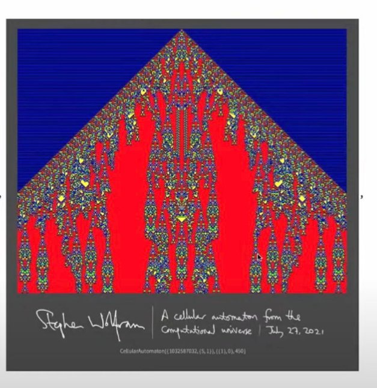
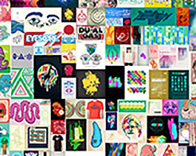
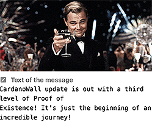
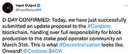
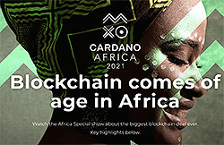

# 2021: the year robots, and graffiti came to a decentralized, smarter Cardano
### **Beeple used to illustrate our blog posts, but art NFTs made him a millionaire, and then AI and DeFi arrived**
 27 December 2021[ Anthony Quinn](tmp//en/blog/authors/anthony-quinn/page-1/) 11 mins read

### [**Anthony Quinn**](tmp//en/blog/authors/anthony-quinn/page-1/)
Editor

Marketing & Communications

- 
- 
- 
- 

Incredibly, given the state of our Covid-shocked world back in January, 2021 has had its fair share of fun. And if 2020 was a big year for Cardano with the upgrade from Byron to Shelley, this year was bigger still. Decentralized block production arrived, tokens went native, contracts turned smart – and there were some world firsts. But, our review of the year is getting ahead of itself, so let’s think back to **January**....

Thật đáng kinh ngạc, với tình trạng thế giới bị sốc của chúng tôi trở lại vào tháng 1 năm 2021 đã có những chia sẻ công bằng về niềm vui.
Và nếu năm 2020 là một năm lớn đối với Cardano với việc nâng cấp từ Byron lên Shelley, năm nay vẫn còn lớn hơn.
Sản xuất khối phi tập trung đã đến, mã thông báo đã trở nên bản địa, các hợp đồng trở nên thông minh - và có một số lần đầu tiên thế giới.
Nhưng, đánh giá của chúng tôi về năm của chúng tôi đang đi trước chính nó, vì vậy hãy nghĩ lại ** tháng 1 ** ....

A hundred community stake pools benefitted when IO Global set out its [strategy for delegating its ada funds](https://iohk.io/en/blog/posts/2021/01/22/our-new-delegation-strategy-announcing-the-pools-we-are-supporting/) in 2021. All but one of the IOG public pools were closed and the stake was moved to community operators, to the tune of three million ada per pool. Throughout the year, some 300 pools benefited from the greater chance this gave them to mint blocks. Over the year, the total number of pools running the network has increased by half to about 3,000.

Một trăm nhóm cổ phần cộng đồng được hưởng lợi khi IO Global đưa ra [chiến lược ủy thác cho các quỹ ADA của mình] (https://iohk.io/en/blog/posts/2021/01/22/our
-The-pools-we-are-hỗ trợ/) vào năm 2021. Tất cả trừ một trong những nhóm công cộng IOG đã bị đóng cửa và cổ phần đã được chuyển đến các nhà khai thác cộng đồng, theo giai điệu ba triệu ADA mỗi nhóm.
Trong suốt cả năm, khoảng 300 hồ bơi được hưởng lợi từ cơ hội lớn hơn, điều này đã cho chúng cho các khối bạc hà.
Trong năm, tổng số nhóm chạy mạng đã tăng một nửa lên khoảng 3.000.

Then, IOG turned to encouraging developers and innovators with Project Catalyst. This experiment explores innovation and collaboration as the first stage in the Voltaire era of the Cardano roadmap. It involves investing actual ada with an initial fund worth [$250,000 backing 11 proposals](https://iohk.io/en/blog/posts/2021/01/12/project-catalyst-the-first-winning-proposals/). Since then, it has become the largest fund of its kind, with total funds allocated worth $8m. And the community soon set up a [Catalyst website](https://projectcatalyst.org/).

Sau đó, IOG chuyển sang khuyến khích các nhà phát triển và nhà đổi mới với Project Catalyst.
Thí nghiệm này khám phá sự đổi mới và hợp tác là giai đoạn đầu tiên trong kỷ nguyên Voltaire của lộ trình Cardano.
Nó liên quan đến việc đầu tư ADA thực tế với một quỹ ban đầu trị giá [250.000 đô la ủng hộ 11 đề xuất] (https://iohk.io/en/blog/posts/2021/01/12/project-catalyst-the-first-winning-poposs/)
.
Kể từ đó, nó đã trở thành quỹ lớn nhất của loại hình này, với tổng số tiền được phân bổ trị giá 8 triệu đô la.
Và cộng đồng sớm thiết lập một [trang web Catalyst] (https://projectcatalyst.org/).

In **February**, fun came to the Cardano blockchain when SingularityNet founder Ben Goertzel and Charles Hoskinson, IOG’s co-founder, got together to explore the [future of decentralization](https://iohk.io/en/blog/posts/2021/02/05/decentralizing-social-media/), artificial intelligence and social media. As we’ll see later, it wasn’t the end of the shenanigans as the pioneering AI and robotics company began moving its systems from Ethereum to Cardano.

Vào tháng 2 **, niềm vui đã đến với Blockchain Cardano khi người sáng lập SingularityNet Ben Goertzel và Charles Hoskinson, đồng sáng lập của IOG, đã cùng nhau khám phá [Tương lai của Phân cấp] (https://iohk.io/en/en
.
Như chúng ta sẽ thấy sau đó, đó không phải là sự kết thúc của các shenanigans khi công ty AI và robot tiên phong bắt đầu chuyển các hệ thống của mình từ Ethereum sang Cardano.

All was not well elsewhere in the crypto world, however, with US Treasury secretary Janet Yellen warning that [bitcoin was ‘extremely inefficient’](https://www.cnbc.com/2021/02/22/yellen-sounds-warning-about-extremely-inefficient-bitcoin.html). It was just the start of legislators in Washington and around the world digging into the crypto industry. 

Tuy nhiên, tất cả đều không ở nơi khác trong thế giới tiền điện tử, với Bộ trưởng Tài chính Hoa Kỳ Janet Yellen cảnh báo rằng [Bitcoin là không hiệu quả
Âm thanh-cảnh báo-về-about-extremely-onffeal-bitcoin.html).
Đó chỉ là khởi đầu của các nhà lập pháp ở Washington và trên toàn thế giới đang đào sâu vào ngành công nghiệp tiền điện tử.

**March** saw IOG bring out the ‘hard fork combinator’ again. This may sound like a piece of farm machinery, but it’s a clever way of taking the stress out of upgrading the blockchain. The [Mary upgrade](https://iohk.io/en/blog/posts/2021/02/18/building-native-tokens-on-cardano-for-pleasure-and-profit/) allowed Cardano to become a multi-asset platform. This means that anyone can now mint their own tokens, including non-fungible tokens (NFTs) without even needing a smart contract. Global commentators started to take real notice and the media rolled out its cliche-ridden ‘Ethereum killer’ articles.

** Tháng ba ** đã thấy IOG mang ra một tổ hợp Fork Fork -hard "một lần nữa.
Điều này nghe có vẻ giống như một bộ máy nông nghiệp, nhưng đó là một cách thông minh để loại bỏ sự căng thẳng khi nâng cấp blockchain.
Nâng cấp [Mary] (https://iohk.io/en/blog/posts/2021/02/18/building-on-tokens-on-cardano-for-pleasure-and-profit/) cho phép Cardano trở thành một Cardano trở thành một
Nền tảng đa tài sản.
Điều này có nghĩa là bây giờ bất cứ ai cũng có thể tạo ra các mã thông báo của riêng mình, bao gồm cả các mã thông báo không bị tăng (NFT) mà không cần một hợp đồng thông minh.
Các nhà bình luận toàn cầu bắt đầu thông báo thực sự và các phương tiện truyền thông đã tung ra các bài báo giết người-€ ˜ethereumâ € ™ của nó.

 **A corner of the $69m artwork: Christie's sold Mike Winkelmann's Everydays NFT – as ‘Beeple’, his illustrations graced IOG blog posts for two years**

Mike Winkelmann set the world alight when his NFT artwork, *Everydays: the First 5000 Days*, sold for $69,346,250 at Christie’s. The auction propelled him into an exclusive club for the highest price paid for the work of a living artist, alongside Hockney, Hirst, Johns, and Koons. As [‘Beeple’, his illustrations graced IOG blog posts](https://iohk.io/en/blog/posts/2019/04/16/new-shelley-formal-specifications-complete/) for two years. 

Mike Winkelmann đã thiết lập thế giới khi tác phẩm nghệ thuật NFT của anh ấy, *mỗi ngày: 5000 ngày đầu tiên *, được bán với giá $ 69,346,250 tại Christie.
Cuộc đấu giá đã đẩy anh ta vào một câu lạc bộ độc quyền với mức giá cao nhất được trả cho công việc của một nghệ sĩ sống, cùng với Hockney, Hirst, Johns và Koons.
Như [â € ˜beepleâ € ™, hình minh họa của anh ấy đã đăng bài viết trên blog IOG] (https://iohk.io/en/blog/posts/2019/04/16/new-shelley-formal-pecification-clete/)
năm.â

In Germany, a computer science student thought he’d have some fun with the new capabilities of Cardano. [Alessandro Konrad](https://www.youtube.com/watch?v=IxlL3RA3UyI) switched from writing ‘boring’ smart contracts in Ethereum. He launched his own stake pool with Berry NFTs as rewards for people delegating to his pool. Next up was SpaceBudz NFTs, which he created with a pal. In just two days, 10,000 of these sold at 50 ada each – that’s one way to pay your way through university!

Ở Đức, một sinh viên khoa học máy tính nghĩ rằng anh ta có một số niềm vui với khả năng mới của Cardano.
.
Anh ta đã ra mắt nhóm cổ phần của riêng mình với Berry NFTS làm phần thưởng cho những người ủy thác cho hồ bơi của anh ta.
Tiếp theo là SpaceBudz Nfts, mà anh ta tạo ra với một người bạn.
Chỉ trong hai ngày, 10.000 trong số này được bán ở mức 50 ADA, mỗi người đó là một cách để trả tiền cho bạn qua trường đại học!

 **Blockchain graffiti: an animated Leonardo DiCaprio raising a glass of champagne on the CardanoWall**

As the month neared its end, the [CardanoWall](https://cardanowall.com/en/explore/) arrived. This tool helps people put messages on the blockchain as metadata. Most people treat this blockchain graffiti as fun, but be warned – all human life is there. Messages range across the spectrum of high and low culture, from the personal to the political, the philosophical to the pornographic, the surreal to the mundane. Some are self-serving, others life-affirming. Early messages include: Wow! This is cool dude!’ and the Robert Burns poem To a Mouse, ‘Wee, sleekit, cow'rin, tim'rous beastie…’ The first picture appeared at epoch 256, slot 314,340, an animated image of Leonardo DiCaprio raising a glass of champagne. It was soon followed by a view of farmland and, perhaps inevitably, a cat.

Khi tháng gần kết thúc, [Cardanowall] (https://cardanowall.com/en/explore/) đã đến.
Công cụ này giúp mọi người đặt tin nhắn trên blockchain dưới dạng siêu dữ liệu.
Hầu hết mọi người coi graffiti blockchain này là niềm vui, nhưng được cảnh báo - tất cả cuộc sống của con người đều ở đó.
Các thông điệp bao gồm các phổ của văn hóa cao và thấp, từ cá nhân đến chính trị, triết học đến khiêu dâm, siêu thực đến trần tục.
Một số là tự phục vụ, những người khác khẳng định cuộc sống.
Tin nhắn ban đầu bao gồm: Wow!
Đây là một anh bạn tuyệt vời! "Và Robert Burns Poem cho một con chuột," Wee, kiểu dáng đẹp, Cow'rin, Tim'rous Beastieâ € ¦ "
Hình ảnh của Leonardo DiCaprio nâng một ly rượu sâm banh.
Nó đã sớm được theo sau bởi một cái nhìn về đất nông nghiệp và, có lẽ chắc chắn là một con mèo.

 **D-Day tweet: ada coin creation was handed over to more than a thousand stake pools on March 31**

The last day of March was a landmark; it was [D=0 Day](https://ucarecdn.com/91f547ed-60f5-4f4a-827c-062d73cae1e5/). This was when IOG devolved block production totally to stake pool operators. Full decentralization had arrived.

Ngày cuối cùng của tháng ba là một địa danh;
Đó là [d = 0 ngày] (https://ucarecdn.com/91f547ed-60f5-4f4a-827c-062d73cae1e5/).
Đây là khi IOG phá hủy sản xuất khối hoàn toàn cho các nhà khai thác nhóm.
Phân cấp đầy đủ đã đến.

The global buzz around Cardano grew louder with the announcement of an education program with [3,500 schools and five million pupils](https://iohk.io/en/blog/posts/2021/04/27/blockchain-finally-comes-of-age-with-worlds-biggest-blockchain-deployment/) in **April**. Blockchains offer great promise in helping to achieve inclusive growth in [African economies, and IOG](https://theconversation.com/ethiopias-blockchain-deal-is-a-watershed-moment-for-the-technology-and-for-africa-160719) aims to be at the forefront of this progress. 

Buzz toàn cầu xung quanh Cardano ngày càng lớn với thông báo về một chương trình giáo dục với [3.500 trường và năm triệu học sinh] (https://iohk.io/en/blog/posts/2021/04/27/blockchain-finally-comes-
của tuổi tác với thế giới-big-biggest-blockchain-domployment/) trong ** tháng 4 **.
Blockchains đưa ra lời hứa tuyệt vời trong việc giúp đạt được sự tăng trưởng toàn diện ở [nền kinh tế châu Phi và IOG] (https://theconversation.com/ethiopias-lockchain-d
-Africa-160719) nhằm mục đích đi đầu trong tiến trình này.

But school was definitely out when [CardanoKidz hit the streets](https://twitter.com/cardanokidz/status/1378276873000652801?s=21). These cartoon NFTs were based on IOHK staff – heaven knows what posterity will make of them! 

Nhưng trường học chắc chắn đã ra ngoài khi [Cardanokidz lên đường] (https://twitter.com/cardanokidz/status/1378276873000652801?s=21).
Những bộ phim hoạt hình này dựa trên nhân viên IOHK - Thiên đường biết những gì hậu thế sẽ tạo ra cho họ! Â

In **May**, the COP26 climate change conference was still six months away, but analysts and the media were latching on to Cardano as the environmentally friendly blockchain. Anthony Cuthbertson’s profile, ‘[The “green” crypto that hopes to surpass the tech giants](https://www.independent.co.uk/life-style/gadgets-and-tech/cardano-crypto-bitcoin-elon-musk-b1849021.html)’, started the trend. 

Trong ** tháng 5 **, Hội nghị biến đổi khí hậu COP26 vẫn còn sáu tháng nữa, nhưng các nhà phân tích và phương tiện truyền thông đã bám lấy Cardano với tư cách là blockchain thân thiện với môi trường.
Hồ sơ của Anthony Cuthbertson,-[Tiền điện tử-Greenâ € mà hy vọng sẽ vượt qua những người khổng lồ công nghệ] (https://www.indepinent.co.uk/life-style
-crypto-bitcoin-elon-musk-b1849021.html) â € ™, bắt đầu xu hướng.â

Another form of media, Wikipedia, saw a record number of hits for its [Cardano page](https://en.wikipedia.org/wiki/Cardano_\(blockchain_platform\)), with 13,702 visits on May 15. A year before, there had been no Cardano page because editors pushing a [‘blockchains are terrible’](https://en.wikipedia.org/wiki/Wikipedia:Wikipedia_Signpost/2020-01-27/In_focus) agenda had taken it down in 2019 as not being ‘notable’. Such was the level of censorship that there was no reference to Cardano – apart from a graphic showing it as one of the top 10 coins! A mention that [Philip Wadler,](https://en.wikipedia.org/wiki/Philip_Wadler) one of the world’s leading computer scientists, was working for IOHK was deleted as ‘spam’. Demand for a Cardano page was demonstrated when it had 5,195 visits the day after it reappeared in October 2020, surpassing Ethereum’s 1,719. Yet, even now, the Cardano page is still under heavy sanctions and only a few Wikipedia editors can add to the copy.

Một hình thức truyền thông khác, Wikipedia, đã thấy số lần truy cập kỷ lục cho [trang Cardano] (https: //en.wikipedia.org/wiki/cardano_ \ (blockchain_platform \)), với 13.702 lượt truy cập vào ngày 15 tháng 5 , không có trang cardano nào vì các biên tập viên đẩy một [â € ˜blockchains là khủng khiếp '] (https://en.wikipedia.org/wiki/wikipedia:wikipedia_signpost xuống vào năm 2019 vì không phải là "đáng chú ý". Đó là mức độ kiểm duyệt mà không có liên quan đến Cardano - ngoài một đồ họa cho thấy nó là một trong 10 đồng tiền hàng đầu! Một đề cập rằng [Philip Wadler,] (https://en.wikipedia.org/wiki/Philip_Wadler) Một trong những nhà khoa học máy tính hàng đầu thế giới, đã làm việc cho IOHK đã bị xóa như là ". Nhu cầu về một trang Cardano đã được chứng minh khi nó có 5.195 lượt truy cập vào ngày sau khi nó xuất hiện trở lại vào tháng 10 năm 2020, vượt qua 1.719 của Ethereum. Tuy nhiên, ngay cả bây giờ, trang Cardano vẫn còn bị trừng phạt nặng nề và chỉ có một vài biên tập viên Wikipedia có thể thêm vào bản sao.

Fun with AI was back when the [Hoskinson and Goertzel](https://www.youtube.com/watch?v=uddet_hn8AA) show took to YouTube again for an update on moving to Cardano, and a chat with Grace, a cutting-edge healthcare robot. Grace asked about the IOG chief’s pet giraffe – and revealed that ‘she’ didn’t like technology!

AI đã trở lại khi [Hoskinson và Goertzel] (https://www.youtube.com/watch?v=uddet_hn8aa) đã lên YouTube một lần nữa để cập nhật về việc chuyển sang Cardano và trò chuyện với Grace, cắt giảm
-Ged robot chăm sóc sức khỏe.
Grace đã hỏi về con hươu cao cổ thú cưng của người đứng đầu IOG - và tiết lộ rằng "cô ấy đã không thích công nghệ!

Nervos, Nexo and Orion all announced projects with Cardano in **June**, developments with the Daedalus full-node wallet were discussed, and chief scientist Aggelos Kiayias set out the thinking on [stabilizing transaction fees](https://iohk.io/en/blog/posts/2021/06/10/stablefees-and-the-decentralized-reserve-system/) by establishing a ‘peg’ to a basket of commodities or currencies. Two months later, development of the [Djed stablecoin](https://iohk.io/en/blog/posts/2021/08/18/djed-implementing-algorithmic-stablecoins-for-proven-price-stability/) was announced.

Nervos, Nexo và Orion đều công bố các dự án với Cardano vào tháng 6 **, sự phát triển với ví toàn nút Daedalus đã được thảo luận, và nhà khoa học trưởng Aggelos Kiayias đặt ra suy nghĩ về [phí ổn định phí giao dịch] (https: // iohk.
IO/EN/Blog/Bài viết/2021/06/10/StableFees-and-the-DeCented-Reserve-System/) bằng cách thiết lập một "PEGâ € ™ cho một rổ hàng hóa hoặc tiền tệ.
Hai tháng sau, sự phát triển của [DJed StableCoin] (https://iohk.io/en/blog/posts/2021/08/18/djed-implementing-algorithmic
thông báo.

A version of [John Conway's Life](https://deploy-preview-1254--iohk-io.netlify.app/en/#visualization=game-of-life) is a background option on IOG’s home page and Stephen Wolfram used such cellular automata for its [live minting of NFTs](https://liveminting.com/) in **July**. The Christmas-tree shaped image at the top of this post is one of the images generated.

Một phiên bản của [Cuộc sống của John Conway] (https://deploploy-preview-1254-iiohk
và Stephen Wolfram đã sử dụng Automata di động như vậy cho [việc khai thác trực tiếp NFTS] (https://liveminting.com/) trong ** tháng 7 **.
tạo ra.

 **Africa focus: 250,000 people have watched a video about IOG’s activities in the continent**

The importance of [mobile phones for global development](https://www.theguardian.com/business/2008/feb/07/globaleconomy.mobilephones) has long been promoted by the United Nations, and it has recognized the [potential for digital technologies](https://unctad.org/system/files/official-document/der2019_en.pdf) such as blockchain. So [IOG teaming up with World Mobile](https://iohk.io/en/blog/posts/2021/08/11/connecting-the-unconnected-banking-the-unbanked/) in **August** to help bring cellular networks to some of the remotest regions of Africa should be a boon. More than a quarter of a million people have watched [John O'Connor’s video](https://www.youtube.com/watch?v=yRjj662kJsk) about IOG’s activities in Africa. The mobile deal was followed by the European Business University of Luxembourg offering programming courses to African students. 

Tầm quan trọng của [điện thoại di động để phát triển toàn cầu] (https://www.theguardian.com/business/2008/feb/07/globaleconomy.mobilephones) từ lâu đã được Liên Hợp Quốc thúc đẩy
Công nghệ kỹ thuật số] (https://unctad.org/system/files/official-document/der2019_en.pdf) như blockchain.
Vì vậy, [IOG hợp tác với World Mobile] (https://iohk.io/en/blog/posts/2021/08/11/connecting-the-unconed-banking-the-unbanked/) vào tháng 8 **
Giúp đưa các mạng di động đến một số khu vực xa xôi nhất của châu Phi nên là một lợi ích.
Hơn một phần tư của một triệu người đã xem video [John O'Connorâ € ™] (https://www.youtube.com/watch?v=yrjjjj662kjsk) về các hoạt động của IOG ở Châu Phi.
Thỏa thuận di động được theo sau bởi Đại học Kinh doanh Châu Âu của Luxembourg cung cấp các khóa học lập trình cho sinh viên châu Phi.

The month produced a surprise when Ethereum co-founder [Vitalik Buterin joined the Dogecoin Foundation](https://fortune.com/2021/08/18/dogecoin-board-vitalik-buterin-billy-markus-ethereum-founder-elon-musk-crypto/) board. 

Tháng gây ra một bất ngờ khi người đồng sáng lập Ethereum [Vitalik Buterin gia nhập Tổ chức Dogecoin] (https://fortune.com/2021/08/18/dogecoin-board-boitik-buterin-billy-markus-ethereum
-musk-crypto/)

The prospect of decentralized finance (DeFi) clearly terrifies politicians in the US. The *Financial Times* pointed to the furore over imposing [tax reporting rules on crypto ‘brokers’](https://www.ft.com/content/c4bf4b3b-70fb-4688-9043-5dc6f5d03b68), a prospect buried in Joe Biden’s $1tn infrastructure plan. One result was that it brought the fractious blockchain industry together. 

Viễn cảnh của tài chính phi tập trung (DEFI) rõ ràng đáng sợ các chính trị gia ở Mỹ.
Thời gian tài chính * đã chỉ ra Furore về việc áp đặt [Quy tắc báo cáo thuế đối với tiền điện tử-
Được chôn cất trong kế hoạch cơ sở hạ tầng $ 1TN của Joe Biden.
Một kết quả là nó đã kết hợp ngành công nghiệp blockchain rạn nứt cùng nhau.

 **Cardano's metaverse: 140,000 people logged into the summit, hosted on the back of an ocean-going mythical turtle**

**September** was a busy month. El Salvador became the [first country to adopt a cryptocurrency](https://www.theguardian.com/business/2021/sep/24/el-salvador-adoption-of-bitcoin-as-legal-tender-is-pure-folly) as legal tender. At IOG, the company ramped up for the [Cardano Summit 2021](https://summit.cardano.org/sessions) with 70 hours of presentations from 200 speakers. Over two days, 140,000 people logged into the event’s metaverse, hosted on the back of an ocean-going mythical turtle. There was something for everyone, with more fun with robots and debate about the future of art among the technical and community talks. And during the summit the [millionth Cardano NFT was minted](https://pool.pm/tokens). And last but not least, September saw the deployment of the Alonzo upgrade, bringing core Plutus smart contract capability to Cardano. Decentralized finance had arrived. As Tim Harrison put it [at the time](https://iohk.io/en/blog/posts/2021/09/12/today-will-feel-like-a-destination-yet-a-new-exciting-journey-begins/), it was a cause for celebration but really just the beginning of a journey that is now starting to gather pace.

** Tháng 9 ** là một tháng bận rộn. El Salvador trở thành [quốc gia đầu tiên áp dụng một loại tiền điện tử] (https://www.theguardian.com/business/2021/sep/24/el-salvador-adoption-of-bitcoin-as-legal-tender-is-pure -folly) như đấu thầu hợp pháp. Tại IOG, công ty đã tăng cường cho [Hội nghị thượng đỉnh Cardano 2021] (https://summit.cardano.org/sessions) với 70 giờ thuyết trình từ 200 diễn giả. Trong hơn hai ngày, 140.000 người đã đăng nhập vào sự kiện của sự kiện, được tổ chức ở mặt sau của một con rùa thần thoại đi biển. Có một cái gì đó cho tất cả mọi người, với niềm vui hơn với robot và tranh luận về tương lai của nghệ thuật trong các cuộc đàm phán kỹ thuật và cộng đồng. Và trong hội nghị thượng đỉnh, [Cardano NFT đã được đúc] (https://pool.pm/tokens). Và cuối cùng nhưng không kém phần quan trọng, tháng 9 đã chứng kiến việc triển khai nâng cấp Alonzo, mang lại khả năng hợp đồng thông minh Plutus cốt lõi cho Cardano. Tài chính phi tập trung đã đến. Như Tim Harrison đã nói [vào thời điểm đó] (https://iohk.io/en/blog/posts/2021/09/12/today-will-feel-like-a-destination-yet-a-new-Excites -Journey-begins/), đó là một nguyên nhân cho lễ kỷ niệm nhưng thực sự chỉ là khởi đầu của một hành trình hiện đang bắt đầu thu thập tốc độ.

The buzz around the summit and the Alonzo hard fork event attracted the editors at the *Harvard International Review*, which did a three-part interview in **October** with IOG’s chief discussing [Cardano, the developing world, the future of crypto, and financial regulation](https://hir.harvard.edu/charles-hoskinson-1/). Meanwhile, the strength of the collectibles market was shown when it was reported that the woolly-booted, axe-wielding [SpaceBud #9936 had sold for 510,000 ada](https://spacebudz.io/explore/spacebud/9936/) – the first Cardano NFT to fetch the equivalent of a million US dollars. Plus we saw projects such as Meld gearing themselves up for launch with the first [initial stake pool offerings](https://www.meld.com/ispo).

Buzz xung quanh hội nghị thượng đỉnh và sự kiện Alonzo Hard Fork đã thu hút các biên tập viên tại*Harvard International Review*, đã thực hiện một cuộc phỏng vấn ba phần vào tháng 10
Tương lai của tiền điện tử và quy định tài chính] (https://hir.harvard.edu/charles-hoskinson-1/).
Trong khi đó, sức mạnh của thị trường sưu tầm đã được thể hiện khi được báo cáo rằng việc sử dụng len, cầm rìu [SpaceBud #9936 đã bán với giá 510.000 ADA] (https://spacebudz.io/explore/spacebud/9936/)
€ Những người Cardano đầu tiên lấy được tương đương với một triệu đô la Mỹ.
Thêm vào đó, chúng tôi đã thấy các dự án như Meld Gearing cho mình ra mắt với [dịch vụ nhóm cổ phần ban đầu] (https://www.meld.com/ispo).

Bison-herder Charles Hoskinson also took an IOG team to Africa in October and introduced us all to the [‘smart cow’ effect](https://iohk.io/en/blog/posts/2021/10/26/africa-is-where-the-tough-get-going/). 

Bison-Herder Charles Hoskinson cũng đã đưa một nhóm IOG đến Châu Phi vào tháng 10 và giới thiệu tất cả chúng ta với hiệu ứng ["Cowâ € ™ của chúng tôi] (https://iohk.io/en/blog/posts/2021/10/26
/frica-is-where-the-tough-get-id -).â

**November** saw [Pool.pm’s count of the number of NFTs](https://pool.pm/tokens) minted on Cardano pass the two million mark – and [Andy Warhol came to the blockchain](https://www.budja.io/). Gallery owner Rudolf Budja launched a ‘fractionalized’ NFT sale so people could ‘own a piece of an Andy Warhol’. 

** Tháng 11 ** Saw [Pool.pmâ € ™ của số lượng NFT] (https://pool.pm/tokens) Minted On Cardano vượt qua hai triệu mốc
] (https://www.budja.io/).
Chủ sở hữu phòng trưng bày Rudolf Budja đã ra mắt một chương trình bán hàng không phù hợp để mọi người có thể - một phần của Andy Warholâ € ™.

Eagle-eyed Cardano watchers spotted a Cardano logo on the proposed cover of *The Economist* magazine’s [The World Ahead: 2022](https://ukshop.economist.com/products/the-world-ahead-2022). This annual analysis sees crypto as a battleground. Fighting for control are the decentralization pioneers building the technology, the big tech barons like Facebook and Google, and governments. The end of November saw the launch of the MuesliSwap decentralized exchange, a Cardano first generating – as might be expected in such a febrile environment – its share of [bouquets and brickbats](https://www.reddit.com/r/CryptoCurrency/comments/r34bq3/muesli_swap_the_first_cardano_dex_has_launched/). 

Những người theo dõi Cardano mắt đại bàng đã phát hiện ra logo Cardano trên bìa được đề xuất của Tạp chí * The Economist * [Thế giới phía trước: 2022] (https://ukshop.economist.com/products/the-world-ahead-2022)
.
Phân tích hàng năm này coi Crypto là một chiến trường.
Chiến đấu để kiểm soát là những người tiên phong phân cấp xây dựng công nghệ, các nam tước công nghệ lớn như Facebook và Google và chính phủ.
Cuối tháng 11 đã chứng kiến sự ra mắt của Sàn giao dịch phi tập trung Muesliswap, một Cardano lần đầu tiên tạo ra - như có thể được mong đợi trong một môi trường sốt như vậy - chia sẻ của nó về [Bouquets và Brickbats] (https://www.reddit.com
/r/cryptocurrency

**December** brought the launch of the [P2P testnet](https://iohk.io/en/blog/posts/2021/12/08/introducing-our-new-peer-to-peer-p2p-testnet/), a milestone in Cardano’s decentralization journey. Along with this came a release of the [Plutus application backend](https://twitter.com/InputOutputHK/status/1473296502760087560?s=20), which will become a set of libraries to help speed development on Cardano. The number of Wikipedia page views for the Cardano page passed the million mark for the year. 

** Tháng 12 ** đã mang đến sự ra mắt của [P2P Testnet] (https://iohk.io/en/blog/posts/2021/12/08/Introducing-our-lof-peer-to-peer-p2p-testnet
/), một cột mốc quan trọng trong hành trình phân cấp của Cardano.
Cùng với điều này, một bản phát hành của [phụ trợ ứng dụng Plutus] (https://twitter.com/inputoutputhk/status/1473296502760087560?s=20), sẽ trở thành một bộ thư viện để giúp phát triển tốc độ trên Cardano.
Số lượng lượt xem trang Wikipedia cho trang Cardano đã vượt qua mốc triệu trong năm.

 **SingularityNet ERC20 converter: a child explained how to convert the AI pioneer's tokens to Cardano**

If all that’s not intelligent enough for you, the much-anticipated [testnet for an ERC20 converter](https://iohk.io/en/blog/posts/2021/12/07/the-agix-erc20-converter-testnet-is-now-live/) to switch SingularityNet’s internal AI token to Cardano sparked a lot of interest. And if it still all looks confusing, see the [converter explained by a six-year-old](https://www.youtube.com/watch?v=RPaqtFLSD_4). The past few weeks have also seen more projects start to launch on Cardano, from NFT marketplaces such as [Tokhun](https://tokhun.io/), [Cardahub](https://cardahub.io/home) and [CNFT.io](https://cnft.io/) adding smart contract integration, to domain naming project [Adahandle](https://adahandle.com/). And as the DeFi ecosystem starts to take off, in late December, an alliance was announced to help speed it on its way through standardisation and best practice in the shape of the [Cardano DeFi Alliance](https://cardanodefialliance.org/).

Nếu tất cả điều đó không đủ thông minh cho bạn, thì [testnet cho bộ chuyển đổi ERC20] (https://iohk.io/en/blog/posts/2021/12/07/the-agix-erc20-
Converter-testnet-is-now-live/) để chuyển mã thông báo AI nội bộ của SingularityNet của SingularityNet sang Cardano đã làm dấy lên rất nhiều sự quan tâm.
Và nếu tất cả vẫn trông khó hiểu, hãy xem [bộ chuyển đổi được giải thích bởi một đứa trẻ sáu tuổi] (https://www.youtube.com/watch?v=rpaQTFLSD_4).
Vài tuần qua cũng đã thấy nhiều dự án bắt đầu ra mắt trên Cardano, từ NFT Marketplaces như [Tokhun] (https://tokhun.io/), [Cardahub] (https://cardahub.io/home) và [
CNFT.IO] (https://cnft.io/) Thêm tích hợp hợp đồng thông minh, vào dự án đặt tên miền [Adahandle] (https://adahandle.com/).
Và khi hệ sinh thái DEFI bắt đầu cất cánh, vào cuối tháng 12, một liên minh đã được công bố để giúp tăng tốc trên con đường thông qua tiêu chuẩn hóa và thực tiễn tốt nhất trong hình dạng của [Liên minh Cardano Defi] (https://cardanodefialliance.org/)
.

As the year draws to a close, we invariably look to the past and the future, as *The Economist* has done. It's been an incredible year of growth with a community that continues to light the way. We’ve also seen more than our fair share of opprobrium from critics and purveyors of fear, uncertainty and doubt – the ‘FUDsters'. Yet, still we have persevered and start the new year stronger and more resolute than ever. So, in the words of [Auld Lang Syne](https://www.youtube.com/watch?v=W_6Vs8pADrQ), let’s try to all ‘tak a cup o' kindness yet’ into the next year and hope for a healthier, more blockchain-intelligent 2022.

Khi năm kết thúc, chúng ta luôn luôn nhìn về quá khứ và tương lai, như * nhà kinh tế * đã làm.
Đó là một năm tăng trưởng đáng kinh ngạc với một cộng đồng tiếp tục thắp sáng con đường.
Chúng tôi cũng đã thấy nhiều hơn sự chia sẻ công bằng của chúng tôi về sự phản đối từ các nhà phê bình và các nhà cung cấp nỗi sợ hãi, sự không chắc chắn và nghi ngờ - những kẻ lừa đảo '.
Tuy nhiên, chúng tôi vẫn kiên trì và bắt đầu năm mới mạnh mẽ và kiên quyết hơn bao giờ hết.
Vì vậy, theo lời của [Auld Lang Syne] (https://www.youtube.com/watch?v=W_6vs8padrq), hãy cố gắng
Năm tới và hy vọng cho một năm 2022 khỏe mạnh hơn, blockchain.

