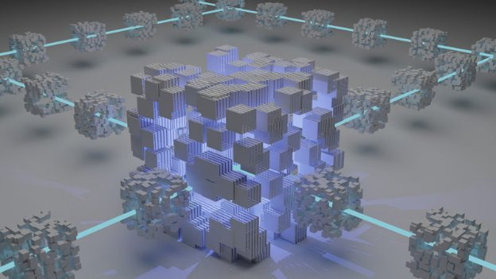

# DeFi demystified
### **With the Cardano ecosystem set to grow exponentially in 2022, now is the time to get to grips with some of the prime principles – and jargon – behind DeFi** 
 10 January 2022[ Olga Hryniuk](tmp//en/blog/authors/olga-hryniuk/page-1/) 11 mins read

### [**Olga Hryniuk**](tmp//en/blog/authors/olga-hryniuk/page-1/)
Technical Writer

Marketing & Communications

- 
- 

The number of ada users and software developers building on the Cardano blockchain continues to grow. With projects now in final testing and starting to deploy, sites like [Cardano Cube](https://www.cardanocube.io/), [Built on Cardano](https://builtoncardano.com/), [Building On Cardano](https://buildingoncardano.com/#/), [Essential Cardano](https://github.com/input-output-hk/essential-cardano), and [Developers.cardano.org](https://developers.cardano.org/showcase/) are busy mapping an exciting ecosystem. Cardano has been created as a secure, robust platform to build blockchain-based products, services, and systems. With a clear roadmap to steadily develop, we now see it scaling to serve on a global scale. 

Số lượng người dùng ADA và các nhà phát triển phần mềm xây dựng trên blockchain Cardano tiếp tục tăng.
Với các dự án hiện đang thử nghiệm cuối cùng và bắt đầu triển khai, các trang web như [Cardano Cube] (https://www.cardanocube.io/), [được xây dựng trên Cardano] (https://builtoncardano.com/), [Xây dựng trên Cardano
].
/developers.cardano.org/showcase/) đang bận rộn lập bản đồ một hệ sinh thái thú vị.
Cardano đã được tạo ra như một nền tảng an toàn, mạnh mẽ để xây dựng các sản phẩm, dịch vụ và hệ thống dựa trên blockchain.
Với một lộ trình rõ ràng để phát triển đều đặn, bây giờ chúng ta thấy nó mở rộng để phục vụ trên quy mô toàn cầu.

DeFi – decentralized finance – has exploded in recent years, opening up a host of new financial instruments – from the useful to the crazily speculative. Ultimately as this market matures, the goal of DeFi is to help individuals and companies engage in financial activity without going through a central, expensive middleman such as a bank, or to attain higher returns on their assets in an era of inflation and negative interest rates. 

Defi - Tài chính phi tập trung - đã bùng nổ trong những năm gần đây, mở ra một loạt các công cụ tài chính mới - từ sự hữu ích đến đầu cơ điên rồ.
Cuối cùng khi thị trường này trưởng thành, mục tiêu của DEFI là giúp các cá nhân và công ty tham gia vào hoạt động tài chính mà không cần phải trải qua một trung tâm trung tâm, đắt tiền như ngân hàng, hoặc đạt được lợi nhuận cao hơn đối với tài sản của họ trong thời đại lạm phát và lãi suất tiêu cực
.

Cardano has expanded on this idea. The aim is to bring inexpensive banking and insurance services to the millions of people worldwide who cannot access such products. This would help break down the barriers between developed and developing nations. We call this vision ‘[RealFi](https://iohk.io/en/blog/posts/2021/11/25/welcome-to-the-age-of-realfi/)’.

Cardano đã mở rộng về ý tưởng này.
Mục đích là để mang lại các dịch vụ bảo hiểm và ngân hàng rẻ tiền cho hàng triệu người trên toàn thế giới, những người không thể truy cập các sản phẩm đó.
Điều này sẽ giúp phá vỡ các rào cản giữa các quốc gia phát triển và đang phát triển.
Chúng tôi gọi tầm nhìn này ‘[Realfi] (https://iohk.io/en/blog/posts/2021/11/25/welcome-to-the-age-of-realfi/).

Despite this surge for Cardano, overall blockchain understanding and adoption levels are still low. Not least, because of the mountain of jargon every crypto-curious person needs to grapple with. So, in anticipation of the next wave of fresh interest in Cardano – and particularly to welcome *new* readers to this blog – we thought the beginning could be a great place to start!

Mặc dù sự gia tăng này cho Cardano, sự hiểu biết blockchain tổng thể và mức độ áp dụng vẫn còn thấp.
Không kém phần quan trọng, vì ngọn núi của biệt ngữ, mọi người có tiền điện tử cần phải vật lộn.
Vì vậy, dự đoán làn sóng quan tâm mới về Cardano tiếp theo - và đặc biệt là chào đón các độc giả * mới * đến blog này - chúng tôi nghĩ rằng sự khởi đầu có thể là một nơi tuyệt vời để bắt đầu!

So we’ll try to unpack the complexity of some notions that we so often read about with blockchain. Terms like DeFi, RealFi, DApp, DEX, liquidity, and so on go hand-in-hand with the latest blockchain products. Let’s take a look at what these terms mean, and let’s start with the basic building blocks.

Vì vậy, chúng tôi sẽ cố gắng giải nén sự phức tạp của một số khái niệm mà chúng tôi thường đọc với blockchain.
Các thuật ngữ như defi, realfi, dapp, dex, thanh khoản, v.v.
Hãy cùng xem xét các thuật ngữ này có ý nghĩa gì và hãy để bắt đầu với các khối xây dựng cơ bản.

## **Where does DeFi start?**

## ** Defi bắt đầu từ đâu? **

It all starts with a [blockchain](https://docs.cardano.org/new-to-cardano/what-is-a-blockchain). So, simply put, a blockchain is a digital ‘book’ of records – what accountants would call a *ledger* – about transactions. What’s unusual about this book is that it is not controlled by a single person, company, or government official. Instead, entries are made in a *decentralized* way. By decentralized, we mean that thousands of people’s computers communicate with each other to agree on whether a transaction is valid. They reach this consensus based on the rules built into the blockchain software they are running. Blockchain records cannot be altered and can be examined by everyone – making it impossible to delete the record about a transaction, forge its amount, or hide any details. This feature guarantees transparency and trust between the users. Interestingly, although the blockchain shows such information, users are ‘presented’ as addresses. So, although anyone can see what transactions were made to and from an address since the blockchain started, no one can identify the person at the blockchain address. 

Tất cả bắt đầu với một [blockchain] (https://docs.cardano.org/new-to-cardano/what-is-a-lockchain). Vì vậy, chỉ cần đặt, một blockchain là một cuốn sách kỹ thuật số của hồ sơ - những gì kế toán viên sẽ gọi là * sổ cái * - về các giao dịch. Điều khác thường về cuốn sách này là nó không được kiểm soát bởi một người, công ty hoặc quan chức chính phủ. Thay vào đó, các mục được thực hiện theo cách * phi tập trung *. Bằng cách phi tập trung, chúng tôi có nghĩa là hàng ngàn người máy tính của Google giao tiếp với nhau để đồng ý về việc một giao dịch có hợp lệ hay không. Họ đạt được sự đồng thuận này dựa trên các quy tắc được tích hợp trong phần mềm blockchain mà họ đang chạy. Các bản ghi blockchain không thể được thay đổi và có thể được kiểm tra bởi mọi người - khiến không thể xóa hồ sơ về một giao dịch, giả mạo số tiền của nó hoặc ẩn bất kỳ chi tiết nào. Tính năng này đảm bảo tính minh bạch và niềm tin giữa người dùng. Thật thú vị, mặc dù blockchain hiển thị thông tin như vậy, người dùng được trình bày dưới dạng địa chỉ. Vì vậy, mặc dù bất cứ ai cũng có thể thấy những giao dịch nào được thực hiện và từ một địa chỉ kể từ khi blockchain bắt đầu, không ai có thể xác định người đó tại địa chỉ blockchain.

The advantages of decentralized systems are summarized in Figure 1.

Ưu điểm của các hệ thống phi tập trung được tóm tắt trong Hình 1.

But how do we use blockchain in daily life, and why does it matter? The answer is that blockchain is about trading or exchanging funds under specified conditions, for a potentially infinite number of applications. Companies in healthcare, art, retail, collecting, beverage, sportswear and gaming already use blockchain technology.

Nhưng làm thế nào để chúng ta sử dụng blockchain trong cuộc sống hàng ngày, và tại sao nó lại quan trọng?
Câu trả lời là blockchain là về giao dịch hoặc trao đổi tiền trong các điều kiện được chỉ định, cho một số ứng dụng có khả năng vô hạn.
Các công ty về chăm sóc sức khỏe, nghệ thuật, bán lẻ, thu thập, đồ uống, đồ thể thao và chơi game đã sử dụng công nghệ blockchain.

Figure 1. Decentralized v traditional finance

Hình 1. Tài chính truyền thống của V Phân cấp

## **What is decentralized finance?**

## ** Tài chính phi tập trung là gì? **

Decentralized finance or **DeFi** is a blockchain-based form of finance that addresses the same needs as traditional finance. You can send and receive payments, pay for products or services, or invest in cryptocurrency projects instead of bonds or stocks. However, DeFi does not depend on any intermediary and uses smart contracts to settle deals fairly. By adding an identity component such as [Atala Prism](https://atalaprism.io/app) – and thus a ‘bridge’ to the real world – you have what we call *RealFi*.

Tài chính phi tập trung hoặc ** defi ** là một hình thức tài chính dựa trên blockchain nhằm giải quyết các nhu cầu tương tự như tài chính truyền thống.
Bạn có thể gửi và nhận thanh toán, thanh toán cho sản phẩm hoặc dịch vụ hoặc đầu tư vào các dự án tiền điện tử thay vì trái phiếu hoặc cổ phiếu.
Tuy nhiên, DEFI không phụ thuộc vào bất kỳ trung gian nào và sử dụng hợp đồng thông minh để giải quyết các giao dịch một cách công bằng.
Bằng cách thêm một thành phần nhận dạng như [Atala Prism] (https://atalaprism.io/app) - và do đó là một cầu nối với thế giới thực - bạn có cái mà chúng ta gọi là *realfi *.

**The money**

**Tiền**

In a traditional setting, we use money to pay for products and services. This medium of exchange is usually represented as coins or banknotes issued by central banks. Crypto users have popularized the use of the term fiat ​​to describe real-world money. The US dollar, British pound, and Japanese yen are all **fiat** money. The word has been used since governments stopped having to back their currency with gold. Instead, they issue a formal decree – a fiat – that their currency is legal tender.

Trong một môi trường truyền thống, chúng tôi sử dụng tiền để trả tiền cho sản phẩm và dịch vụ.
Phương tiện trao đổi này thường được đại diện dưới dạng tiền hoặc tiền giấy được phát hành bởi các ngân hàng trung ương.
Người dùng Crypto đã phổ biến việc sử dụng thuật ngữ fiat để mô tả tiền trong thế giới thực.
Đồng đô la Mỹ, bảng Anh và đồng yên Nhật Bản đều là ** fiat ** tiền.
Từ này đã được sử dụng kể từ khi các chính phủ ngừng phải sao lưu tiền tệ bằng vàng.
Thay vào đó, họ ban hành một sắc lệnh chính thức - một fiat - rằng tiền tệ của họ là hợp pháp.

On the blockchain, people use **crypto assets** instead of fiat. Let’s take a look at the different types (Figure 2).

Trên blockchain, mọi người sử dụng ** tài sản tiền điện tử ** thay vì fiat.
Hãy cùng xem các loại khác nhau (Hình 2).

Figure 2. Types of cryptocurrency assets

Hình 2. Các loại tài sản tiền điện tử

## **How it works**

## **Làm thế nào nó hoạt động**

Before we dive into the peculiarities of DeFi terminology, let’s first see what makes it all work. So, the driving force of security and fair agreements lies in smart contracts. Let’s say you download a DeFi app and you’d like to lend Alice 10 ada. We need to be assured that Alice will pay it back, and we’d also like to earn some interest if she pays back later than agreed. Traditionally, users sign agreements and specify such conditions. That’s also done on the blockchain, but in the form of smart contracts.

Trước khi chúng ta đi sâu vào đặc thù của thuật ngữ Defi, trước tiên hãy xem những gì làm cho tất cả hoạt động.
Vì vậy, động lực của các thỏa thuận an ninh và công bằng nằm trong các hợp đồng thông minh.
Hãy nói rằng bạn tải xuống một ứng dụng DEFI và bạn muốn cho Alice 10 ADA cho vay.
Chúng tôi cần được đảm bảo rằng Alice sẽ trả lại, và chúng tôi cũng muốn kiếm được một số tiền lãi nếu cô ấy trả lại muộn hơn so với thỏa thuận.
Theo truyền thống, người dùng ký thỏa thuận và chỉ định các điều kiện như vậy.
Điều đó cũng được thực hiện trên blockchain, nhưng dưới dạng hợp đồng thông minh.

- [**Smart contract**](https://docs.cardano.org/new-to-cardano/what-is-a-smart-contract): an automated digital agreement, written in code, that tracks, verifies, and executes the binding parts of a deal between various parties. The contract stages are automatically executed by the smart contract code when predetermined conditions are met. 

-[** Hợp đồng thông minh **] (https://docs.cardano.org/new-to-cardano/what-is-a-smart-contract): Thỏa thuận kỹ thuật số tự động, được viết bằng mã, theo dõi, xác minh
và thực hiện các phần ràng buộc của một thỏa thuận giữa các bên khác nhau.
Các giai đoạn hợp đồng được tự động thực hiện bởi mã hợp đồng thông minh khi các điều kiện được xác định trước được đáp ứng.

An interesting fact is that smart contracts don’t find specific data themselves. For example, we agree with Alice that she pays back by say, January 20. For a smart contract to execute, it needs to know the date, whether Alice processed a transaction and whether the sent amount matches the indicated amount. For this, smart contracts use oracles.

Một thực tế thú vị là các hợp đồng thông minh don don tìm thấy dữ liệu cụ thể.
Ví dụ, chúng tôi đồng ý với Alice rằng cô ấy trả lại bằng cách nói, ngày 20 tháng 1. Đối với hợp đồng thông minh để thực hiện, nó cần biết ngày, liệu Alice có xử lý một giao dịch hay không và liệu số tiền được gửi có phù hợp với số tiền được chỉ định hay không.
Đối với điều này, hợp đồng thông minh sử dụng Oracles.

- **Oracle**: a way to communicate with real-world data. Oracles connect with trusted external data sources that enable smart contracts to execute by referencing datasets such as exact timing, the weather, election results, sports statistics, and cryptocurrency prices. Oracles ensure confidence in timely, accurate, and untampered data.

- ** Oracle **: Một cách để giao tiếp với dữ liệu trong thế giới thực.
Oracles kết nối với các nguồn dữ liệu bên ngoài đáng tin cậy cho phép các hợp đồng thông minh thực hiện bằng cách tham chiếu các bộ dữ liệu như thời gian chính xác, thời tiết, kết quả bầu cử, thống kê thể thao và giá tiền điện tử.
Oracles đảm bảo niềm tin vào dữ liệu kịp thời, chính xác và không bị nén.

With Cardano, users can work with **Plutus** or **Marlowe** contracts:

Với Cardano, người dùng có thể làm việc với ** Plutus ** hoặc ** Marlowe ** Hợp đồng:

- [**Plutus**](https://iohk.io/en/blog/posts/2021/04/13/plutus-what-you-need-to-know/): a set of programming tools for writing smart contracts on Cardano. Deployed since September on Cardano, it includes Plutus Core – the software that runs Plutus transactions and contracts – and the Plutus programming language, which is based on Haskell, a language designed for writing extremely reliable programs. There is also the [Plutus Playground](https://iohk.io/en/blog/posts/2021/01/25/introducing-the-new-plutus-playground/) – a place where developers can test their code before using it on the main chain.

-[** Plutus **] (https://iohk.io/en/blog/posts/2021/04/13/plutus-what-you-need-to-know/): một bộ công cụ lập trình để viết
Hợp đồng thông minh trên Cardano.
Được triển khai từ tháng 9 trên Cardano, nó bao gồm Plutus Core - phần mềm chạy các giao dịch và hợp đồng Plutus - và ngôn ngữ lập trình Plutus, dựa trên Haskell, một ngôn ngữ được thiết kế để viết các chương trình cực kỳ đáng tin cậy.
Ngoài ra còn có [Plutus Playground] (https://iohk.io/en/blog/posts/2021/01/25/introducing-the-new-plutus-playground/)-một nơi mà các nhà phát triển có thể kiểm tra mã của họ trước khi
Sử dụng nó trên chuỗi chính.

- [**Marlowe**](https://iohk.io/en/blog/posts/2020/10/06/marlowe-industry-scale-finance-contracts-for-cardano/): Marlowe is a language designed specially for writing financial smart contracts. It is limited to financial applications and is for experts in finance rather than in programming. There is also the [Marlowe Playground](https://play.marlowe-finance.io/#/), where users can create, edit, simulate, and analyze Marlowe contracts in a web browser. Marlowe will be deployed to Cardano later this year.

-[*đáo
đặc biệt để viết hợp đồng thông minh tài chính.
Nó được giới hạn trong các ứng dụng tài chính và dành cho các chuyên gia về tài chính hơn là lập trình.
Ngoài ra còn có [Sân chơi Marlowe] (https://play.marlowe-finance.io/#/), nơi người dùng có thể tạo, chỉnh sửa, mô phỏng và phân tích hợp đồng Marlowe trong trình duyệt web.
Marlowe sẽ được triển khai cho Cardano vào cuối năm nay.

## **DeFi ecosystem**

## ** Hệ sinh thái Defi **

Users access various DeFi platforms and applications for different purposes. For instance, asset management products (or simply, [wallets](https://docs.cardano.org/new-to-cardano/types-of-wallets)) store, send and receive cryptocurrencies between users. There are many decentralized applications (DApps):

Người dùng truy cập các nền tảng và ứng dụng khác nhau cho các mục đích khác nhau.
Chẳng hạn, các sản phẩm quản lý tài sản (hoặc đơn giản, [ví] (https://docs.cardano.org/new-to-cardano/types-ofof-wallets)) cửa hàng, gửi và nhận tiền điện tử giữa người dùng.
Có nhiều ứng dụng phi tập trung (DAPP):

- **DApp**: a digital application that runs on the blockchain. There are various types of DApps, such as DeFi products, NFT markets, wallets, exchanges, games and more. 

- ** dapp **: Một ứng dụng kỹ thuật số chạy trên blockchain.
Có nhiều loại DAPP khác nhau, chẳng hạn như các sản phẩm của Defi, thị trường NFT, ví, trao đổi, trò chơi và nhiều hơn nữa.

Now that the Cardano ecosystem is growing fast, more and more DeFi products are coming to Cardano. Users will soon be able to use new DApps and platforms for their financial needs. Thus, to ensure that users and the developer community can offer and consume products of the best quality, we are working on:

Bây giờ hệ sinh thái Cardano đang phát triển nhanh chóng, ngày càng có nhiều sản phẩm Defi đến Cardano.
Người dùng sẽ sớm có thể sử dụng DAPP và nền tảng mới cho nhu cầu tài chính của họ.
Do đó, để đảm bảo rằng người dùng và cộng đồng nhà phát triển có thể cung cấp và tiêu thụ các sản phẩm có chất lượng tốt nhất, chúng tôi đang làm việc:

- **The dAppStore**: a user-friendly marketplace for all Cardano DApps. It is also a place where users with limited blockchain knowledge will be able to explore ways that the technology can be useful to them.

- ** DAPPSTORE **: Một thị trường thân thiện với người dùng cho tất cả các dapps Cardano.
Đây cũng là nơi người dùng có kiến thức blockchain hạn chế sẽ có thể khám phá những cách mà công nghệ có thể hữu ích cho họ.

- [**DApp certification**](https://iohk.io/en/blog/posts/2021/09/22/bringing-certified-dapps-to-cardano/): certification and assurance help ensure that products meet certain quality checks. While voluntary (Cardano is, after all, open and decentralized) Certification benefits both developers and users because it includes security checks that help with auditing smart contracts. There are [three levels of certification](https://iohk.io/en/blog/posts/2021/10/25/new-certification-levels-for-smart-contracts-on-cardano/), each of which complementary to the others.

-[** Chứng nhận DAPP **] (https://iohk.io/en/blog/posts/2021/09/22/bringing-certified-dapps-to-cardano/)
kiểm tra chất lượng nhất định.
Mặc dù tự nguyện (Cardano, rốt cuộc, việc mở và phân cấp) có lợi cho cả nhà phát triển và người dùng vì nó bao gồm kiểm tra bảo mật giúp kiểm toán các hợp đồng thông minh.
Có [ba cấp độ chứng nhận] (https://iohk.io/en/blog/posts/2021/10/25/new-certification-levels-for-smart-contracts-on-cardano/), mỗi trong số đó
bổ sung cho những người khác.

DeFi platforms and DApps mainly deal with financial activities. Besides sending and receiving funds, these can be used for investing, lending, and borrowing. 

Nền tảng và DAPP của Defi chủ yếu đối phó với các hoạt động tài chính.
Bên cạnh việc gửi và nhận tiền, những thứ này có thể được sử dụng để đầu tư, cho vay và vay.

As a matter of fact, users can borrow cryptocurrency on the blockchain without paying interest:

Thực tế, người dùng có thể mượn tiền điện tử trên blockchain mà không phải trả lãi:

- **Flash loan**: works as an instant loan that doesn't require collateral (funds needed to secure a loan of other cryptocurrencies or tokens) or know-your-customer (KYC) verification. However, the flash loan requires repayment within the same block it is lent to the borrower. If the loan isn’t paid back, the initial transaction is rejected, and the issuer retains their funds.

-** Khoản vay Flash **: Hoạt động như một khoản vay ngay lập tức không yêu cầu tài sản thế chấp (tiền cần thiết để đảm bảo cho vay các loại tiền điện tử hoặc mã thông báo khác) hoặc xác minh của bạn-bạn (KYC).
Tuy nhiên, khoản vay flash yêu cầu trả nợ trong cùng một khối, nó cho vay người vay.
Nếu khoản vay được trả lại, giao dịch ban đầu bị từ chối và nhà phát hành vẫn giữ được tiền của họ.

Let’s take a look at a few more of the most common terms you’ll come across in DeFi:

Hãy cùng xem một vài thuật ngữ phổ biến nhất mà bạn sẽ gặp trong Defi:

- **Exchange**: a cryptocurrency marketplace where users can buy or sell cryptocurrencies. There are two types of exchanges. A **CEX** (centralized exchange) is maintained by a specific entity or structure, which is subject to regulations or rules. A **DEX** (decentralized exchange) is a type of crypto exchange with no intermediary, and users can buy and sell their assets in a secure, peer-to-peer way. 

- ** Exchange **: Một thị trường tiền điện tử nơi người dùng có thể mua hoặc bán tiền điện tử.
Có hai loại trao đổi.
A ** CEX ** (trao đổi tập trung) được duy trì bởi một thực thể hoặc cấu trúc cụ thể, tuân theo các quy định hoặc quy tắc.
Một ** dex ** (trao đổi phi tập trung) là một loại trao đổi tiền điện tử không có trung gian và người dùng có thể mua và bán tài sản của họ một cách an toàn, ngang hàng.

**Liquidity** is another term that you’ll commonly hear. It measures the circulating supply and trading activity in a certain DEX, CEX, or another network. Circulating supply is essential to meet the trading needs of users. For example, Alice wants to sell some bitcoins she owns and instead buy some ada, and let’s say, some tokens needed for her new shopping app. While bitcoin trading is very popular, she won’t have any difficulties. She’ll probably buy ada as well if the chosen exchange supports it. But what if there are none of the tokens she’s looking for? Or, say, she wants to get 100 tokens for her app, and there are only 30? This is what liquidity is about – having enough supply of coins or tokens to satisfy users’ requirements. 

** Thanh khoản ** là một thuật ngữ khác mà bạn thường nghe.
Nó đo lường hoạt động cung cấp và giao dịch lưu hành trong một DEX, CEX hoặc mạng khác nhất định.
Cung cấp lưu hành là điều cần thiết để đáp ứng nhu cầu giao dịch của người dùng.
Ví dụ, Alice muốn bán một số bitcoin mà cô ấy sở hữu và thay vào đó mua một số ADA, và hãy để nói, một số mã thông báo cần thiết cho ứng dụng mua sắm mới của cô ấy.
Trong khi giao dịch Bitcoin rất phổ biến, cô ấy đã giành được bất kỳ khó khăn nào.
Cô ấy cũng có thể mua ADA nếu trao đổi được chọn hỗ trợ nó.
Nhưng điều gì sẽ xảy ra nếu không có mã thông báo nào mà cô ấy tìm kiếm?
Hoặc, nói rằng, cô ấy muốn nhận 100 mã thông báo cho ứng dụng của mình, và chỉ có 30?
Đây là những gì thanh khoản là về - có đủ nguồn cung cấp tiền hoặc mã thông báo để đáp ứng các yêu cầu của người dùng.

Liquidity includes relevant activities and notions that go hand in hand with them:

Thanh khoản bao gồm các hoạt động và khái niệm liên quan đi đôi với chúng:

- **Liquidity mining**: the process of creating or adding new coins or tokens to support the demand for transactions. Liquidity miners (providers) usually get rewards that incentivize them to support the user base and grow liquidity pools. Liquidity mining is also known as yield farming.

- ** Khai thác thanh khoản **: Quá trình tạo hoặc thêm tiền hoặc mã thông báo mới để hỗ trợ nhu cầu giao dịch.
Người khai thác thanh khoản (nhà cung cấp) thường nhận được phần thưởng khuyến khích họ hỗ trợ cơ sở người dùng và phát triển nhóm thanh khoản.
Khai thác thanh khoản còn được gọi là sản lượng canh tác.

- **Liquidity pools**: a pool of deposited cryptocurrencies that provides liquidity to the network, where the currencies are in demand.

- ** Nhóm thanh khoản **: Một nhóm tiền điện tử lắng đọng cung cấp thanh khoản cho mạng, nơi các loại tiền đang có nhu cầu.

- **AMM** (automated market maker): a pool of cryptocurrencies that provides liquidity between ‘trading pairs’. A trading pair is a match between Alice, who wants to sell her bitcoin, and Bob, who wants to buy it, for example. AMMs are decentralized and depend on the liquidity provided by their users. 

- ** AMM ** (Nhà sản xuất thị trường tự động): Một nhóm tiền điện tử cung cấp thanh khoản giữa các cặp giao dịch.
Một cặp giao dịch là một trận đấu giữa Alice, người muốn bán Bitcoin của mình và Bob, người muốn mua nó chẳng hạn.
AMM được phân cấp và phụ thuộc vào thanh khoản được cung cấp bởi người dùng của họ.

Decentralized exchanges aren’t only convenient marketplaces for cryptocurrency trading. They also serve as tools for earning profit. So let’s discuss some relevant terms: 

Trao đổi phi tập trung aren chỉ có các thị trường thuận tiện cho giao dịch tiền điện tử.
Họ cũng phục vụ như là công cụ để kiếm lợi nhuận.
Vì vậy, hãy để thảo luận về một số điều khoản có liên quan:

- **ROI** (return on investment): the profit or loss on an investment, often expressed as a percentage.

- ** ROI ** (lợi tức đầu tư): Lợi nhuận hoặc lỗ khi đầu tư, thường được thể hiện dưới dạng phần trăm.

- **Yield farming**: as mentioned above, this is also known as liquidity mining. Because rewards are gained for providing funds, such a process is called farming.

- ** Năng lượng canh tác **: Như đã đề cập ở trên, điều này còn được gọi là khai thác thanh khoản.
Bởi vì phần thưởng có được khi cung cấp tiền, một quy trình như vậy được gọi là nông nghiệp.

- **Yield**: rewards earned for cryptocurrency staking or liquidity mining.

- ** Năng suất **: Phần thưởng kiếm được cho việc đặt tiền điện tử hoặc khai thác thanh khoản.

- **Leverage**: the act of using borrowed capital, expecting profits to be greater than the paid interest.

- ** Đòn bẩy **: Hành động sử dụng vốn vay, hy vọng lợi nhuận sẽ lớn hơn lãi phải trả.

**Please note that we’re not giving any financial advice. This post explains some of the DeFi terms for informative purposes only.**

** Xin lưu ý rằng chúng tôi không đưa ra bất kỳ lời khuyên tài chính nào.
Bài đăng này giải thích một số thuật ngữ xác định cho mục đích thông tin. **

And while we’re discussing some ‘earning profit’ terms, let’s also recall how ada holders can securely benefit and get rewards from their ada:

Và trong khi chúng tôi đang thảo luận về một số điều khoản kiếm lợi nhuận, hãy nhớ lại cách mà chủ sở hữu ADA có thể hưởng lợi một cách an toàn và nhận phần thưởng từ ADA của họ:

- [**Staking and delegating on Cardano**](https://docs.cardano.org/new-to-cardano/how-to-delegate): every ada holder owns a stake that is based on the amount of ada they have. A developer or a tech-savvy person can set up a stake pool and run it to help verify Cardano transactions, getting rewards for this. Everyone can delegate their funds to a stake pool to earn a share of these rewards. There is no risk to this and no ada leaves your wallet. Ada can be delegated from your wallet or spent at any time.

-
họ có.
Một nhà phát triển hoặc một người am hiểu công nghệ có thể thiết lập một nhóm cổ phần và chạy nó để giúp xác minh các giao dịch Cardano, nhận phần thưởng cho việc này.
Mọi người đều có thể ủy thác tiền của họ cho một nhóm cổ phần để kiếm được một phần của những phần thưởng này.
Không có rủi ro cho điều này và không có ADA rời khỏi ví của bạn.
ADA có thể được ủy quyền từ ví của bạn hoặc chi tiêu bất cứ lúc nào.

*While these are exciting times, we continue to stress the importance of [doing your own research](https://iohk.io/en/blog/posts/2021/12/09/when-it-comes-to-defi-do-your-own-research/) and approaching new products with caution. Follow our blog and [Twitter](https://twitter.com/InputOutputHK/status/1475107377775099910?s=20) for new announcements not to miss a thing. And throughout this year, we’ll have plenty more content coming your way to help you navigate this growing ecosystem.*

*Mặc dù đây là những thời điểm thú vị, chúng tôi tiếp tục nhấn mạnh tầm quan trọng của [thực hiện nghiên cứu của riêng bạn] (https://iohk.io/en/blog/posts/2021/12/09/when-it-comes-to-defi
-Do-your-Research/) và tiếp cận các sản phẩm mới một cách thận trọng.
Theo dõi blog của chúng tôi và [Twitter] (https://twitter.com/inputoutputhk/status/1475107377775099910?s=20) cho các thông báo mới không bỏ lỡ điều gì.
Và trong suốt năm nay, chúng tôi sẽ có nhiều nội dung hơn theo cách của bạn để giúp bạn điều hướng hệ sinh thái đang phát triển này.*

