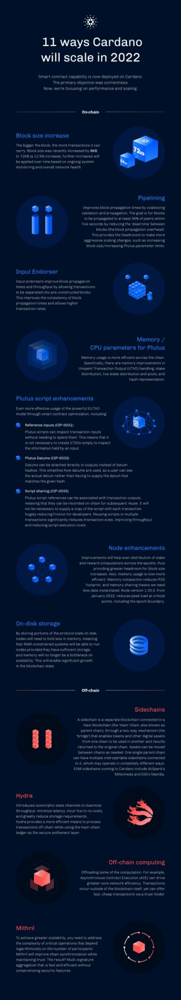

# How we’re scaling Cardano in 2022
### **With core smart contract capability now deployed, the next phase for Cardano focuses on performance optimization and scaling. And it starts right here…**
 14 January 2022[ Tim Harrison](tmp//en/blog/authors/tim-harrison/page-1/) 5 mins read

### [**Tim Harrison**](tmp//en/blog/authors/tim-harrison/page-1/)
VP of Community & Ecosystem

Communications

- 
- 
- 
- 

The Cardano project has always been committed to addressing the classic blockchain trilemma; scalability, security, and (importantly) decentralization. As the organization tasked with creating the core platform, we have always pursued a defined, clearly staged roadmap to deliver on Cardano’s capability and fulfill its long-term potential.

Dự án Cardano luôn cam kết giải quyết vấn đề kinh điển Blockchain Trilemma;
Khả năng mở rộng, bảo mật và (quan trọng) phân cấp.
Khi tổ chức được giao nhiệm vụ tạo ra nền tảng cốt lõi, chúng tôi luôn theo đuổi một lộ trình rõ ràng, rõ ràng để cung cấp khả năng của Cardano và thực hiện tiềm năng lâu dài của nó.

Utilising formal development methods and Haskell code – with deep roots into a peer-reviewed academic approach – we have delivered a robust, secure platform fit for the future. Built for correctness. We named this phase Byron.

Sử dụng các phương pháp phát triển chính thức và mã Haskell-với nguồn gốc sâu sắc vào một cách tiếp cận học thuật được đánh giá ngang hàng-chúng tôi đã cung cấp một nền tảng an toàn, mạnh mẽ phù hợp cho tương lai.
Được xây dựng cho sự đúng đắn.
Chúng tôi đặt tên cho giai đoạn này Byron.

An incredible community has grown up around our endeavors and, through a network of some 3,000 stake pool operators, we now have one of the most decentralized proof-of-stake networks in the world. This era of decentralization and stake pools we named Shelley, after poet and political radical, Percy Bysshe Shelley.

Một cộng đồng đáng kinh ngạc đã lớn lên xung quanh những nỗ lực của chúng tôi và thông qua một mạng lưới gồm khoảng 3.000 nhà khai thác nhóm cổ phần, giờ đây chúng tôi có một trong những mạng lưới chứng minh có sự phân cấp nhất trên thế giới.
Thời đại phân cấp và cổ phần này mà chúng tôi đặt tên là Shelley, theo tên nhà thơ và chính trị cấp tiến, Percy Bysshe Shelley.

Goguen (which included the Alonzo HFC event) brought with it core smart contract capability, paving the way for DeFi and DApps. With initial Plutus capability now deployed, we continue to evolve the expressiveness of the Plutus language and the overall proposition, in collaboration with a growing community of developers. 

Goguen (bao gồm sự kiện Alonzo HFC) mang theo khả năng hợp đồng thông minh cốt lõi, mở đường cho DEFI và DAPP.
Với khả năng Plutus ban đầu hiện được triển khai, chúng tôi tiếp tục phát triển tính biểu cảm của ngôn ngữ Plutus và đề xuất chung, phối hợp với một cộng đồng phát triển đang phát triển.

Now, as we enter the Basho stage, we’re investing further energy into optimization and scaling. Building on these foundations, and steadily increasing capacity and throughput to deal with the growth in the DApp ecosystem and onboard first hundreds of thousands, then millions of new users. From DeFi degens to citizens of developing nations.

Bây giờ, khi chúng tôi bước vào giai đoạn Basho, chúng tôi đã đầu tư thêm năng lượng vào tối ưu hóa và mở rộng.
Dựa trên các nền tảng này, và tăng dần năng lực và thông lượng để đối phó với sự tăng trưởng trong hệ sinh thái DAPP và trên tàu hàng trăm ngàn đầu tiên, sau đó là hàng triệu người dùng mới.
Từ Defi thoái hóa đến công dân của các quốc gia đang phát triển.

During the course of this year, starting right now, we’ll be pursuing this next phase of our mission. Parameter adjustments, improvements, enhancements and other innovations will all play their part in steadily increasing Cardano’s capacity & throughput during 2022. While maintaining the considered, safe approach that has served us to date. Yes, we anticipate periods of high demand, network congestion at times. We’re on an exciting journey and usage will be high. While we may at times feel impatient, this is the way. Here’s how we will optimize and scale as we grow.

Trong suốt năm nay, bắt đầu ngay bây giờ, chúng tôi sẽ theo đuổi giai đoạn tiếp theo của nhiệm vụ.
Điều chỉnh tham số, cải tiến, cải tiến và các đổi mới khác đều sẽ đóng vai trò của họ trong việc tăng dần khả năng & thông lượng của Cardano, trong năm 2022. Trong khi vẫn duy trì cách tiếp cận an toàn, đã phục vụ chúng tôi cho đến nay.
Vâng, chúng tôi dự đoán các giai đoạn của nhu cầu cao, tắc nghẽn mạng đôi khi.
Chúng tôi trên một hành trình thú vị và việc sử dụng sẽ cao.
Trong khi đôi khi chúng ta có thể cảm thấy thiếu kiên nhẫn, đây là cách.
Ở đây, cách chúng tôi sẽ tối ưu hóa và mở rộng quy mô khi chúng tôi phát triển.

## **On-chain solutions**

## ** Giải pháp trên chuỗi **

**Block size increase**

** Tăng kích thước khối **

The bigger the block, the more transactions it can carry. Block size was recently increased by 8KB to 72KB (a 12.5% increase); further increases will be applied over time based on ongoing system monitoring and overall network health.

Khối càng lớn, càng có nhiều giao dịch.
Kích thước khối gần đây đã tăng thêm 8kB lên 72kb (tăng 12,5%);
Việc tăng thêm sẽ được áp dụng theo thời gian dựa trên giám sát hệ thống đang diễn ra và sức khỏe mạng tổng thể.

**Pipelining**

** Đường ống **

Improves block propagation times by coalescing validation and propagation. The goal is for blocks to be propagated to at least 95% of peers within five seconds by reducing the ‘dead time’ between blocks (the block propagation overhead). This provides the headroom to make more aggressive scaling changes, such as increasing block size/increasing Plutus parameter limits.

Cải thiện thời gian lan truyền khối bằng cách kết hợp xác nhận và lan truyền.
Mục tiêu là các khối được truyền đến ít nhất 95% đồng nghiệp trong vòng năm giây bằng cách giảm thời gian chết giữa các khối (chi phí truyền khối).
Điều này cung cấp khoảng trống để thực hiện các thay đổi tỷ lệ tích cực hơn, chẳng hạn như tăng kích thước khối/tăng giới hạn tham số Plutus.

**Input Endorsers**

** Người chứng thực đầu vào **

Input endorsers improve block propagation times and throughput by allowing transactions to be separated into pre-constructed blocks. This improves the consistency of block propagation times and allows higher transaction rates.

Người chứng thực đầu vào cải thiện thời gian lan truyền khối và thông lượng bằng cách cho phép các giao dịch được tách thành các khối được xây dựng sẵn.
Điều này cải thiện tính nhất quán của thời gian lan truyền khối và cho phép tỷ lệ giao dịch cao hơn.

**Memory /CPU parameters for Plutus**

** Bộ nhớ /tham số CPU cho Sao Diêm Vương **

Memory usage is more efficient across the chain. Specifically, there are memory improvements in Unspent Transaction Output (UTXO) handling, stake distribution, live stake distribution and pools, and hash representation.

Việc sử dụng bộ nhớ là hiệu quả hơn trên toàn bộ chuỗi.
Cụ thể, có những cải tiến bộ nhớ trong xử lý đầu ra giao dịch không sử dụng (UTXO), phân phối cổ phần, phân phối cổ phần trực tiếp và nhóm và đại diện băm.

**Plutus script enhancements**

** Cải tiến tập lệnh Plutus **

Even more effective usage of the powerful EUTXO model through smart contract optimization, including: 

Thậm chí sử dụng hiệu quả hơn của mô hình EUTXO mạnh mẽ thông qua tối ưu hóa hợp đồng thông minh, bao gồm:

- Reference inputs (CIP-0031) – Plutus scripts can inspect transaction inputs without needing to spend them. This means that it is not necessary to create UTXOs simply to inspect the information held by an input.

- Đầu vào tham chiếu (CIP-0031)- Các tập lệnh Plutus có thể kiểm tra đầu vào giao dịch mà không cần phải chi tiêu.
Điều này có nghĩa là không cần thiết phải tạo UTXOS chỉ để kiểm tra thông tin được nắm giữ bởi một đầu vào.

- Plutus Datums (CIP-0032) – Datums can be attached directly to outputs instead of datum hashes. This simplifies how datums are used, as a user can see the actual datum rather than having to supply the datum that matches the given hash.

- Datums Plutus (CIP-0032)- Datums có thể được đính kèm trực tiếp vào đầu ra thay vì băm mốc.
Điều này đơn giản hóa cách sử dụng mốc dữ liệu, vì người dùng có thể thấy dữ liệu thực tế thay vì phải cung cấp mốc dữ liệu phù hợp với băm đã cho.

- Script sharing (CIP-0033) – Plutus script references can be associated with transaction outputs, meaning that they can be recorded on-chain for subsequent reuse. It will not be necessary to supply a copy of the script with each transaction, hugely reducing friction for developers. Reusing scripts in multiple transactions significantly reduces transaction sizes, improving throughput and reducing script execution costs.

-Chia sẻ tập lệnh (CIP-0033)-Tài liệu tham khảo tập lệnh Plutus có thể được liên kết với các đầu ra giao dịch, có nghĩa là chúng có thể được ghi trên chuỗi để sử dụng lại tiếp theo.
Sẽ không cần thiết phải cung cấp một bản sao của tập lệnh với mỗi giao dịch, giảm mạnh ma sát cho các nhà phát triển.
Việc sử dụng lại các tập lệnh trong nhiều giao dịch làm giảm đáng kể kích thước giao dịch, cải thiện thông lượng và giảm chi phí thực hiện tập lệnh.

**Node enhancements**

** Cải tiến nút **

Improvements will help even distribution of stake and reward computations across the epochs, thus providing greater headroom for block size increases. Also, memory usage is now more efficient. Memory compaction reduces RSS footprint, and memory sharing means we need less data instantiated. Node version 1.33.0, from January 2022, reduces peak load at critical points, including the epoch boundary.

Những cải tiến sẽ giúp thậm chí phân phối các tính toán cổ phần và phần thưởng trên các kỷ nguyên, do đó cung cấp khoảng trống lớn hơn để tăng kích thước khối.
Ngoài ra, việc sử dụng bộ nhớ bây giờ hiệu quả hơn.
Nén bộ nhớ làm giảm dấu chân RSS và chia sẻ bộ nhớ có nghĩa là chúng tôi cần ít dữ liệu được khởi tạo.
Nút phiên bản 1.33.0, từ tháng 1 năm 2022, giảm tải cực đại tại các điểm tới hạn, bao gồm cả ranh giới kỷ nguyên.

**On-disk storage**

** Lưu trữ trên đĩa **

By storing portions of the protocol state on disk, nodes will need to hold less in memory, meaning that RAM-constrained systems will be able to run nodes provided they have sufficient storage, and memory will no longer be a bottleneck on scalability. This will enable significant growth in the blockchain state.

Bằng cách lưu trữ các phần của trạng thái giao thức trên đĩa, các nút sẽ cần chứa ít hơn trong bộ nhớ, có nghĩa là các hệ thống bị hạn chế RAM sẽ có thể chạy các nút miễn là chúng có đủ lưu trữ và bộ nhớ sẽ không còn là nút cổ chai về khả năng mở rộng.
Điều này sẽ cho phép tăng trưởng đáng kể trong trạng thái blockchain.

## **Off-chain solutions**

## ** Giải pháp ngoài chuỗi **

**Sidechains**

** Sidechains **

A sidechain is a separate blockchain connected to a main blockchain (the 'main' chain, also known as parent chain), through a two-way mechanism (the 'bridge') that enables tokens and other digital assets from one chain to be used in another and results returned to the original chain. Assets can be moved between chains as needed. One single parent chain can have multiple interoperable sidechains connected to it, which may operate in completely different ways. EVM sidechains coming to Cardano include dcSpark’s Milkomeda and IOG’s EVM sidechain project, codenamed ‘Mamba’.

Sidechain là một blockchain riêng được kết nối với blockchain chính (chuỗi 'chính', còn được gọi là chuỗi cha mẹ), thông qua cơ chế hai chiều ('cây cầu') cho phép sử dụng các tài sản kỹ thuật số khác từ một chuỗi
trong một kết quả khác và kết quả trở lại chuỗi ban đầu.
Tài sản có thể được di chuyển giữa các chuỗi khi cần thiết.
Một chuỗi cha mẹ đơn lẻ có thể có nhiều sidechain có thể tương tác được kết nối với nó, có thể hoạt động theo những cách hoàn toàn khác nhau.
EVM Sidechains đến Cardano bao gồm dự án DCSPARK, Milkomeda và IOG, EVM Sidechain, có tên mã ‘Mamba.

**Hydra**

** hydra **

Introduces a family of layer 2 protocols including isomorphic state channels to maximize throughput, minimize latency, incur low to no costs, and greatly reduce storage requirements. Hydra provides a more efficient means to process transactions off-chain while using the main-chain ledger as the secure settlement layer.

Giới thiệu một họ các giao thức Lớp 2 bao gồm các kênh trạng thái đẳng cấu để tối đa hóa thông lượng, giảm thiểu độ trễ, không có chi phí thấp đến và giảm đáng kể các yêu cầu lưu trữ.
Hydra cung cấp một phương tiện hiệu quả hơn để xử lý các giao dịch ngoài chuỗi trong khi sử dụng sổ cái chuỗi chính làm lớp giải quyết an toàn.

**Off-chain computing**

** Điện toán ngoài chuỗi **

Offloading some of the computation, for example with Asynchronous Contract Execution (ACE) can drive greater core network efficiency. Transactions occur outside of the blockchain itself, yet can offer fast, cheap transactions via a trust model.

Việc giảm tải một số tính toán, ví dụ với việc thực hiện hợp đồng không đồng bộ (ACE) có thể thúc đẩy hiệu quả mạng lõi lớn hơn.
Các giao dịch xảy ra bên ngoài chính blockchain, nhưng có thể cung cấp các giao dịch nhanh chóng, giá rẻ thông qua mô hình ủy thác.

**Mithril**

**Bí ngân**

To achieve greater scalability, you need to address the complexity of critical operations that depend logarithmically on the number of participants. Mithril will improve chain synchronization while maintaining trust. The result? Multi-signature aggregation that is fast and efficient without compromising security features.

Để đạt được khả năng mở rộng lớn hơn, bạn cần giải quyết sự phức tạp của các hoạt động quan trọng phụ thuộc vào logarit vào số lượng người tham gia.
Mithril sẽ cải thiện đồng bộ chuỗi trong khi duy trì niềm tin.
Kết quả?
Tập hợp đa chữ ký nhanh chóng và hiệu quả mà không ảnh hưởng đến các tính năng bảo mật.

*Infographic credit: Mikki Pham/Fernando Sanchez*

*Tín dụng infographic: Mikki Phạm/Fernando Sanchez*

