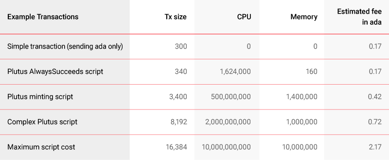
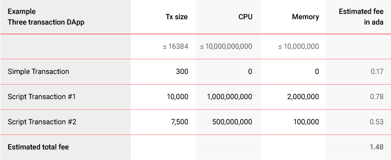

# Plutus fee estimator: find out the cost of transacting on Cardano
### **Our new fee estimator – released today – will help developers estimate the cost of smart contract scripts for maximum efficiency and minimum cost** 
 21 January 2022[ Kevin Hammond](tmp//en/blog/authors/kevin-hammond/page-1/) 6 mins read

### [**Kevin Hammond**](tmp//en/blog/authors/kevin-hammond/page-1/)
Software Engineer

Engineering

- 

[The ‘Alonzo’ smart contract upgrade](https://iohk.io/en/blog/posts/2021/09/12/today-will-feel-like-a-destination-yet-a-new-exciting-journey-begins/) deployed to the Cardano mainnet in September 2021 turned Cardano into a functional platform for the development of decentralized applications (DApps) built in [Plutus](https://iohk.io/en/blog/posts/2021/04/13/plutus-what-you-need-to-know/).

.
Hành trình-begins/) được triển khai đến Cardano Mainnet vào tháng 9 năm 2021 đã biến Cardano thành một nền tảng chức năng để phát triển các ứng dụng phi tập trung (DAPP) được xây dựng trong [Plutus] (https://iohk.io/blog/posts/2021/
04/13/Plutus-what-you-cần biết/).

With the Cardano ecosystem steadily growing, a great number of [DApps are being built](https://twitter.com/InputOutputHK/status/1475107377775099910?s=20) and readied for launch on Cardano. Either in final testing, deployment, or active development, Cardano will soon host a variety of DApps covering [DeFi](https://iohk.io/en/blog/posts/2022/01/10/defi-demystified/) offerings, NFT markets, wallets, exchanges, games, and more.

Với hệ sinh thái Cardano phát triển đều đặn, một số lượng lớn [DApps đang được xây dựng] (https://twitter.com/inputoutputhk/status/1475107377775099910?s=20) và sẵn sàng ra mắt trên Cardano.
Trong thử nghiệm cuối cùng, triển khai hoặc phát triển tích cực, Cardano sẽ sớm tổ chức nhiều loại DAPPS bao gồm [Defi] (https://iohk.io/en/blog/posts/2022/01/10/defi-demystified/)
, Thị trường NFT, ví, trao đổi, trò chơi, và nhiều hơn nữa.

The deterministic design of the Cardano ledger allows developers to predict how much they will pay for contract execution and there’s no fee for contract failure. Deterministic transaction processing, low fees, and security – all of these are major benefits of transacting and building on Cardano. Here, we’ll take a closer look at Cardano pricing and introduce a new Plutus fee estimator developed to provide better clarity on the processing fees.

Thiết kế xác định của sổ cái Cardano cho phép các nhà phát triển dự đoán số tiền họ sẽ trả cho việc thực hiện hợp đồng và không có phí cho việc thất bại hợp đồng.
Xử lý giao dịch xác định, phí thấp và bảo mật - tất cả đều là những lợi ích chính của việc giao dịch và xây dựng trên Cardano.
Tại đây, chúng tôi sẽ xem xét kỹ hơn về giá Cardano và giới thiệu một công cụ ước tính phí Plutus mới được phát triển để cung cấp rõ ràng hơn về phí xử lý.

## **The benefits of building on Cardano**

## ** Những lợi ích của việc xây dựng trên Cardano **

Many factors influence a blockchain's price competitiveness: functionality, quality, security, and, of course, liquidity.

Nhiều yếu tố ảnh hưởng đến khả năng cạnh tranh giá của một blockchain: chức năng, chất lượng, bảo mật, và tất nhiên là thanh khoản.

The design principles underpinning the Cardano ledger ensure high performance while respecting rigorous security properties. Cardano uses an [Extended Unspent Transaction Output (EUTXO) accounting model](https://iohk.io/en/blog/posts/2021/03/12/cardanos-extended-utxo-accounting-model-part-2/), which greatly contributes to its [deterministic design](https://iohk.io/en/blog/posts/2021/09/06/no-surprises-transaction-validation-on-cardano/). Determinism refers to the predictability of outcomes. This means that Cardano transactions and scripts can be validated locally (off-chain), so letting the user know if a transaction is valid before executing it on-chain and without paying any fees. Moreover, transaction fees are fixed and predictable. To compare, smart contract execution costs on Ethereum vary depending on the network load, with fees fluctuating from $5 to hundreds of dollars (see [The ridiculously high cost of Gas on Ethereum](https://coingeek.com/the-ridiculously-high-cost-of-gas-on-ethereum/)). Moreover, even failed Ethereum transactions may also incur fees, creating additional uncertainty about pricing.

Các nguyên tắc thiết kế làm nền tảng cho sổ cái Cardano đảm bảo hiệu suất cao trong khi tôn trọng các đặc tính bảo mật nghiêm ngặt. Cardano sử dụng mô hình kế toán [đầu ra giao dịch mở rộng (EUTXO)] (https://iohk.io/en/blog/posts/2021/03/12/cardanos-extends-utxo-cacking-model-part-2/) , đóng góp rất lớn vào [thiết kế xác định] (https://iohk.io/en/blog/posts/2021/09/06/no-surprises-transaction-validation-on-cardano/). Chủ nghĩa quyết định đề cập đến khả năng dự đoán của kết quả. Điều này có nghĩa là các giao dịch và tập lệnh Cardano có thể được xác thực tại địa phương (ngoài chuỗi), do đó, cho người dùng biết nếu một giao dịch có hiệu lực trước khi thực hiện nó trên chuỗi và không trả bất kỳ khoản phí nào. Hơn nữa, phí giao dịch là cố định và có thể dự đoán được. Để so sánh, chi phí thực hiện hợp đồng thông minh đối với Ethereum khác nhau tùy thuộc vào tải mạng, với các khoản phí dao động từ 5 đến hàng trăm đô la (xem [chi phí khí cao vô lý trên Ethereum] (https://coingeek.com/the-Ridicusly- chi phí cao của khí thải-on-Ethereum/)). Hơn nữa, ngay cả các giao dịch Ethereum thất bại cũng có thể phải chịu phí, tạo ra sự không chắc chắn bổ sung về giá cả.

In contrast, on Cardano, users can calculate the potential fees for transaction processing in advance. Because the user knows in advance whether the transaction is valid or not, there is no need to pay for a transaction that will potentially fail. This saves wasting funds and eliminates on-chain failures. Cardano’s execution fee in ada is always stable as it depends on pre-set network protocol parameters rather than on varying network congestion factors, for example.

Ngược lại, trên Cardano, người dùng có thể tính toán các khoản phí tiềm năng để xử lý giao dịch trước.
Vì người dùng biết trước liệu giao dịch có hợp lệ hay không, không cần phải trả tiền cho một giao dịch có khả năng thất bại.
Điều này tiết kiệm lãng phí tiền và loại bỏ các lỗi trên chuỗi.
Phí thực hiện Cardano, trong ADA luôn ổn định vì nó phụ thuộc vào các tham số giao thức mạng trước thay vì các yếu tố tắc nghẽn mạng khác nhau, ví dụ.

## **Cardano’s pricing model relies on demand over supply**

## ** Mô hình định giá Cardano sườn dựa trên nhu cầu về nguồn cung **

Cardano’s approach to price setting mainly relies on market demand over actual supply. With smart contract support on Cardano, there is now more than one type of demand competing for the common supply. Thus, it is crucial to consider both relative and absolute pricing. One way to do this is to inspect the effects of smart contract pricing, non-fungible token (NFT) operations, etc., with respect to some common value – in our case, the consumption of Cardano’s processing power. 

Cách tiếp cận của Cardano, để thiết lập giá chủ yếu dựa vào nhu cầu thị trường so với nguồn cung thực tế.
Với hỗ trợ hợp đồng thông minh trên Cardano, hiện có nhiều hơn một loại nhu cầu cạnh tranh cho nguồn cung chung.
Vì vậy, điều quan trọng là phải xem xét cả giá tương đối và giá cả tuyệt đối.
Một cách để làm điều này là kiểm tra các tác động của giá hợp đồng thông minh, các hoạt động mã thông báo (NFT) không thể bỏ qua, v.v., đối với một số giá trị chung-trong trường hợp của chúng tôi, việc tiêu thụ sức mạnh xử lý Cardano.

With Cardano, smart contract pricing model is based on a fixed cost, which relies on the pricing of the spent resources (UTXO size or computation/memory used when running). 

Với Cardano, mô hình định giá hợp đồng thông minh dựa trên chi phí cố định, dựa vào giá của các tài nguyên đã chi (kích thước UTXO hoặc tính toán/bộ nhớ được sử dụng khi chạy).

Fees must be paid to fairly compensate for stake pool operation (SPO) work and for the resources used to validate network transactions. In addition, making sure that any particular way of using Cardano is not substantially cheaper than another helps mitigate whole classes of adversarial attacks (e.g. a classic DDoS attack).

Phí phải được trả để bù đắp khá cho hoạt động của nhóm cổ phần (SPO) và cho các tài nguyên được sử dụng để xác nhận các giao dịch mạng.
Ngoài ra, đảm bảo rằng bất kỳ cách sử dụng đặc biệt nào của Cardano không rẻ hơn đáng kể so với một cách khác giúp giảm thiểu các lớp tấn công bất lợi (ví dụ: một cuộc tấn công DDOS cổ điển).

Flexibility is also key and an important feature of the Cardano protocol as it provides the possibility to change its parameters and adapt to price fluctuations. For example, if ada significantly increases in value, protocol parameters can, if required, be adjusted to prevent the user from overpaying for smart contract execution. 

Tính linh hoạt cũng là chìa khóa và là một tính năng quan trọng của giao thức Cardano vì nó cung cấp khả năng thay đổi các tham số của nó và thích ứng với biến động giá.
Ví dụ: nếu ADA tăng đáng kể về giá trị, các tham số giao thức có thể, nếu được yêu cầu, sẽ được điều chỉnh để ngăn người dùng thanh toán quá mức để thực hiện hợp đồng thông minh.

## **Plutus fee estimator**

## ** Công cụ ước tính phí Sao Diêm Vương **

The Plutus fee estimator tool has been developed by IOG for price benchmarking and comparison. Today we are making it available for developers or curious Cardano users on [our public testnet site](https://testnets.cardano.org/en/testnets/cardano/tools/2021-09-06__12-00-00_plutus-fee-estimator.md/). The estimator uses information from real-world Plutus transactions to predict the fees that will be charged for a transaction. The estimator can be used to calculate fees for actual transactions (e.g. to determine the fees that will be charged if the network parameters change), and also to estimate fees for individual script transactions or complete DApps before or during development. It may also be useful to determine the effect of script changes or optimizations on fees.

Công cụ ước tính phí Sao Diêm Vương đã được IOG phát triển để điểm chuẩn và so sánh về giá.
Hôm nay chúng tôi đang cung cấp nó cho các nhà phát triển hoặc người dùng Cardano tò mò trên [Trang web Testnet công khai của chúng tôi] (https://testnets.cardano.org/en/testnet/cardano/tools/2021-09-06__12-00-00_plutus-fee-
Công cụ ước tính.MD/).
Công cụ ước tính sử dụng thông tin từ các giao dịch Plutus trong thế giới thực để dự đoán các khoản phí sẽ được tính cho một giao dịch.
Công cụ ước tính có thể được sử dụng để tính phí cho các giao dịch thực tế (ví dụ: để xác định các khoản phí sẽ được tính nếu các tham số mạng thay đổi) và cũng để ước tính phí cho các giao dịch tập lệnh riêng lẻ hoặc hoàn thành DAPP trước hoặc trong quá trình phát triển.
Nó cũng có thể hữu ích để xác định ảnh hưởng của thay đổi tập lệnh hoặc tối ưu hóa đối với phí.

The estimator uses the same fee calculation formula as the actual Cardano node. Given sufficiently accurate inputs, it can give an accurate idea of the required fee. By combining the costs from multiple transactions, a user can easily predict how much a whole DApp might cost. This will be valuable for developers, business analysts, etc. The estimator includes a number of examples based on real transactions that have been verified against actual fees.

Công cụ ước tính sử dụng công thức tính toán tương tự như nút Cardano thực tế.
Đưa ra các đầu vào đủ chính xác, nó có thể đưa ra một ý tưởng chính xác về phí yêu cầu.
Bằng cách kết hợp các chi phí từ nhiều giao dịch, người dùng có thể dễ dàng dự đoán toàn bộ DAPP có thể có giá bao nhiêu.
Điều này sẽ có giá trị cho các nhà phát triển, nhà phân tích kinh doanh, v.v ... Công cụ ước tính bao gồm một số ví dụ dựa trên các giao dịch thực sự đã được xác minh dựa trên phí thực tế.

Fee calculation requires three pieces of information:

Tính toán phí yêu cầu ba mẩu thông tin:

- **The total on-chain transaction size in bytes**: a simple transaction, for example, is around 300 bytes, one with metadata is around 650 bytes, and Plutus scripts are typically 4,000-8,000 bytes (future optimizations will reduce this).

-** Tổng kích thước giao dịch trên chuỗi trong byte **: Ví dụ, một giao dịch đơn giản là khoảng 300 byte, một giao dịch có siêu dữ liệu là khoảng 650 byte và các tập lệnh Plutus thường là 4.000-8.000 byte (tối ưu hóa trong tương lai sẽ làm giảm điều này
).

- **The number of computational (CPU) steps** that the script uses: each step represents 1 picosecond of execution time on a benchmark machine. Typical scripts should consume less than 1,000,000,000 CPU units (1 millisecond).

- ** Số bước tính toán (CPU) ** mà tập lệnh sử dụng: Mỗi bước đại diện cho 1 picosecond của thời gian thực hiện trên một máy chuẩn.
Các kịch bản điển hình nên tiêu thụ ít hơn 1.000.000.000 đơn vị CPU (1 mili giây).

- **The number of memory units** that the script uses: this represents the number of bytes that the script allocates. Typical scripts should consume less than 1,000,000 memory units (1MB of memory allocation).

- ** Số lượng đơn vị bộ nhớ ** mà tập lệnh sử dụng: Điều này thể hiện số lượng byte mà tập lệnh phân bổ.
Các tập lệnh điển hình sẽ tiêu thụ ít hơn 1.000.000 đơn vị bộ nhớ (1MB phân bổ bộ nhớ).

Let’s take a look at example Plutus scripts to understand their execution costs (Figure 1):

Hãy cùng xem các tập lệnh Plutus ví dụ để hiểu chi phí thực thi của họ (Hình 1):

Figure 1. Estimated fees for script processing on Cardano

Hình 1. Các khoản phí ước tính cho việc xử lý tập lệnh trên Cardano

The estimator shows that sending a simple transaction would be as cheap as 0.17 ada, whereas the maximum possible cost for a single script would be 2.17 ada. 

Công cụ ước tính cho thấy việc gửi một giao dịch đơn giản sẽ rẻ như 0,17 ADA, trong khi chi phí tối đa có thể cho một kịch bản duy nhất sẽ là 2,17 ADA.

The calculation can be extended to DApp execution (see Figure 2). For example, a DApp using three transactions (one simple and two script transactions) might cost ~ 1.50 ada.

Tính toán có thể được mở rộng để thực hiện DAPP (xem Hình 2).
Ví dụ: DAPP sử dụng ba giao dịch (một giao dịch đơn giản và hai kịch bản) có thể có giá ~ 1,50 ADA.

Figure 2. Estimated fees for DApp execution on Cardano

Hình 2. Các khoản phí ước tính cho việc thực hiện DAPP trên Cardano

## **The final word**

## ** từ cuối cùng **

The Alonzo HFC event enabled Plutus script execution on the Cardano mainnet. This was really just the beginning of the journey for Cardano smart contracts. Now, with the launch of major smart contracts projects, we can begin the process of [optimization and scaling](https://iohk.io/en/blog/posts/2022/01/14/how-we-re-scaling-cardano-in-2022/). This includes the ongoing assessment of actual, real-world smart contract usage.

Sự kiện Alonzo HFC đã cho phép thực thi tập lệnh Plutus trên Cardano chính.
Đây thực sự chỉ là khởi đầu của hành trình cho các hợp đồng thông minh Cardano.
Bây giờ, với việc ra mắt các dự án hợp đồng thông minh lớn, chúng ta có thể bắt đầu quá trình [tối ưu hóa và mở rộng] (https://iohk.io/en/blog/posts/2022/01/14/how-we-re-re-scaling
-Cardano-in-2022/).
Điều này bao gồm đánh giá liên tục về việc sử dụng hợp đồng thông minh thực tế, trong thế giới thực.

We need to balance the needs of the user and what is good for the network, speed versus correctness, and – as ever – striking that balance between security, scalability, and decentralization.

Chúng ta cần cân bằng nhu cầu của người dùng và những gì tốt cho mạng, tốc độ so với tính chính xác và - như mọi khi - nổi bật đó là sự cân bằng giữa bảo mật, khả năng mở rộng và phân cấp.

Future code/script optimizations and system performance improvements will help to refine the Cardano fees model over time. Together with our developer and stake pool operator communities, we will monitor the growth of smart contracts, optimize the Cardano node and the Plutus interpreter implementations, and make other adjustments to best support our user base in terms of fair and predictable transaction fees.

Tối ưu hóa mã/tập lệnh trong tương lai và cải tiến hiệu suất hệ thống sẽ giúp tinh chỉnh mô hình phí Cardano theo thời gian.
Cùng với các cộng đồng nhà điều hành nhóm phát triển và cổ phần của chúng tôi, chúng tôi sẽ giám sát sự phát triển của các hợp đồng thông minh, tối ưu hóa nút Cardano và triển khai thông dịch viên Plutus và thực hiện các điều chỉnh khác để hỗ trợ tốt nhất cho cơ sở người dùng của chúng tôi về phí giao dịch công bằng và có thể dự đoán được.

*Check out the Plutus fee estimator on [testnets.cardano.org](https://testnets.cardano.org/en/testnets/cardano/tools/2021-09-06__12-00-00_plutus-fee-estimator.md/) and be sure – you can easily estimate the processing fee without losing your funds in case of transaction failure.*

*Kiểm tra công cụ ước tính phí Plutus trên [testnet.cardano.org] (https://testnets.cardano.org/en/testnet/cardano/tools/2021-09-06__12-00-00_plutus
) và chắc chắn - bạn có thể dễ dàng ước tính phí xử lý mà không mất tiền trong trường hợp thất bại giao dịch.*

