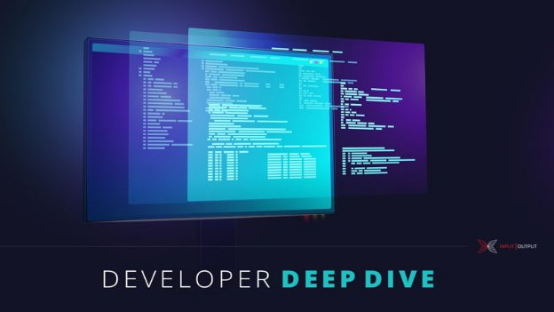

# Simple property-based tests for Plutus validators
### **How to write off-chain code with the 'cooked-validators' library and get property-based tests for free**
 27 January 2022[ Victor Cacciari Miraldo](tmp//en/blog/authors/victor-miraldo/page-1/) 8 mins read

### [**Victor Cacciari Miraldo**](tmp//en/blog/authors/victor-miraldo/page-1/)
Software Engineer

*We recently heard from [Victor Miraldo](https://victorcmiraldo.github.io/), who leads the smart contract verification and auditing team at [Tweag](https://www.tweag.io/), about the importance of verification for security reasons in the world of decentralized finance (DeFi). Victor is a Haskell and formal methods engineer committed to ensuring the safety and correctness of decentralized apps (DApps) through tools and processes. In this blog post he outlines how writing and deploying a DApp is simply not enough, and why every developer should thoroughly test all on-chain code and Plutus scripts against a range of bad actors. For that, he introduces a library of ready-made tools for interacting with Plutus validator scripts – called [cooked-validators](https://github.com/tweag/plutus-libs/tree/main/cooked-validators), developed at Tweag. This library helps implement the innermost layer of off-chain code, which is responsible for generating and submitting transactions. By using this library you can get property-based tests at the transaction level for free.*

*Gần đây chúng tôi đã nghe từ [Victor Miraldo] (https://victorcmiraldo.github.io/), người dẫn đầu nhóm kiểm toán và xác minh hợp đồng thông minh tại [Tweet] (https://www.tweag.io/), về The Tầm quan trọng của việc xác minh vì lý do bảo mật trong thế giới tài chính phi tập trung (DEFI). Victor là một kỹ sư phương pháp chính thức và chính thức cam kết đảm bảo sự an toàn và chính xác của các ứng dụng phi tập trung (DAPP) thông qua các công cụ và quy trình. Trong bài đăng trên blog này, ông phác thảo cách viết và triển khai DAPP đơn giản là không đủ, và tại sao mọi nhà phát triển nên kiểm tra kỹ lưỡng tất cả các tập lệnh mã trên chuỗi và Plutus đối với một loạt các tác nhân xấu. Vì vậy, anh ta giới thiệu một thư viện các công cụ làm sẵn để tương tác với các tập lệnh của Trình xác thực Plutus-được gọi là [Cooked-Validators] (https://github.com , được phát triển tại Tweag. Thư viện này giúp thực hiện lớp trong cùng của mã ngoài chuỗi, chịu trách nhiệm tạo và gửi các giao dịch. Bằng cách sử dụng thư viện này, bạn có thể nhận các thử nghiệm dựa trên tài sản ở cấp độ giao dịch miễn phí.*

*Let's hear what Victor had to say about using their library.*

*Hãy nghe những gì Victor đã nói về việc sử dụng thư viện của họ.*

## **Introduction**

## **Giới thiệu**

Transaction-level tests enable us to submit arbitrary transactions to the validator scripts and to assess their behavior. This process differs from testing a whole smart contract using the defined endpoints as part of the off-chain code of the contract. After all, that off-chain code was designed to seamlessly cooperate with the on-chain code and will have its own intrinsic security and safety checks. This method works for normal operations, but in a testing setup, it often shields on-chain validator scripts from ill-formed or even malicious inputs. Therefore, for transaction-level testing, we want to circumvent the sanitising off-chain code and hammer on-chain scripts with all the same might that an attacker’s hand-crafted off-chain infrastructure might bring. As an analogy with web services, you often want to test your server by sending it arbitrary requests, in addition to those requests that are permitted by the client's user interface.

Các thử nghiệm cấp giao dịch cho phép chúng tôi gửi các giao dịch tùy ý cho các tập lệnh xác thực và để đánh giá hành vi của họ.
Quá trình này khác với việc kiểm tra một hợp đồng hoàn toàn thông minh bằng cách sử dụng các điểm cuối được xác định như là một phần của mã ngoài chuỗi của hợp đồng.
Rốt cuộc, mã ngoài chuỗi đó được thiết kế để hợp tác liền mạch với mã trên chuỗi và sẽ có kiểm tra an toàn và an toàn nội tại của riêng mình.
Phương pháp này hoạt động cho các hoạt động bình thường, nhưng trong một thiết lập thử nghiệm, nó thường che chắn các tập lệnh xác thực trên chuỗi khỏi các đầu vào không được hình thành hoặc thậm chí là độc hại.
Do đó, để kiểm tra cấp độ giao dịch, chúng tôi muốn phá vỡ mã vệ sinh mã ngoài chuỗi và búa trên chuỗi với tất cả các loại tương tự mà một cơ sở hạ tầng ngoài chuỗi được tạo ra bằng tay của kẻ tấn công có thể mang lại.
Là một sự tương tự với các dịch vụ web, bạn thường muốn kiểm tra máy chủ của mình bằng cách gửi các yêu cầu tùy ý, ngoài các yêu cầu được giao diện người dùng của khách hàng cho phép.

The cooked-validators library enables you to write the off-chain code responsible for generating and submitting transactions and use the same code for executing and testing your contract, at the transaction-level. This makes it much easier to write tests for the on-chain that can detect whether a number of bad things can or cannot happen.

Thư viện Validators đã nấu chín cho phép bạn viết mã Off-chuỗi chịu trách nhiệm tạo và gửi giao dịch và sử dụng cùng một mã để thực hiện và kiểm tra hợp đồng của bạn, ở cấp độ giao dịch.
Điều này làm cho việc viết các bài kiểm tra dễ dàng hơn nhiều cho chuỗi có thể phát hiện liệu một số điều xấu có thể hoặc không thể xảy ra.

## **About the 'cooked-validators' library**

## ** về thư viện 'Validators đã nấu chín **

Building your contracts with cooked-validators isn't very different from what you are already used to with the Contract monad. Say you followed the [tutorial on the Split](https://plutus-apps.readthedocs.io/en/latest/plutus/tutorials/basic-apps.html#defining-the-validator-script) contract up to and including the ‘Defining the validator script’ section. At the end, you have a [splitValidator](https://github.com/tweag/plutus-libs/blob/30f4c061cc8d38e5968bbb6418b40a6f4e9e25fa/examples/src/Split.hs) function that executes the *on-chain* part of that contract. If you did not follow the tutorial, the splitValidator contract locks a certain amount of funds that can only be unlocked by being split funds between two previously specified parties.

Xây dựng hợp đồng của bạn với các validators nấu chín không khác lắm so với những gì bạn đã quen với hợp đồng Monad.
Giả sử bạn đã làm theo [hướng dẫn về sự chia rẽ] (https://plutus-apps.readthedocs.io/en/latest/plutus/tutorials/basic-apps.html#defining-the-validator-cript)
Phần xác định phần trình xác thực.
Cuối cùng, bạn có [SplitValidator] (https://github.com/tweag/plutus-libs/blob/30f4c061cc8d38e5968bbbb6418b40a6f4e9e25fa/examplit.
.
Nếu bạn không tuân theo hướng dẫn, hợp đồng SplitValidator khóa một số tiền nhất định chỉ có thể được mở khóa bằng cách chia tiền giữa hai bên được chỉ định trước đó.

Now, to interact with that contract itself, we need to write the *off-chain* code, which generates and sends the necessary transactions to the blockchain. Instead of doing that directly in the Contract monad, we'll rely on the cooked-validators library. The [lockFunds](https://plutus-apps.readthedocs.io/en/latest/plutus/tutorials/basic-apps.html#locking-the-funds) transaction can be written as follows:

Bây giờ, để tương tác với chính hợp đồng đó, chúng ta cần viết mã * off chuỗi *, tạo và gửi các giao dịch cần thiết cho blockchain.
Thay vì thực hiện điều đó trực tiếp trong hợp đồng Monad, chúng tôi sẽ dựa vào thư viện Validators đã nấu chín.
[Lockfunds] (https://plutus-apps.readthedocs.io/en/latest/plutus/tutorials/basic-apps.html#locking-the-funds) có thể được viết như sau:

lockFunds :: (MonadBlockChain m) => SplitData -> m ()

Lockfunds :: (Monadblockchain m) => splitData -> m ()

lockFunds s@SplitData{amount} = void $ validateTxConstr

Lockfunds s@splitdata {số lượng} = void $ ValidateTxConstr

`  `[PaysScript splitValidator [(datum, Ada.toValue amount)]]

`` [PaysScript splitValidator [(datum, ada.tovalue số tiền)]]]]

This is very similar to the [lockFunds](https://plutus-apps.readthedocs.io/en/latest/plutus/tutorials/basic-apps.html#locking-the-funds) we'd have written in the Contract monad directly. The difference being that here we used an arbitrary [MonadBlockChain](https://github.com/tweag/plutus-libs/blob/30f4c061cc8d38e5968bbb6418b40a6f4e9e25fa/cooked-validators/src/Cooked/MockChain/Monad.hs#L45) monad. This technique enables us to use the same lockFunds for two purposes:

Điều này rất giống với [Lockfunds] (https://plutus-apps.readthedocs.io/en/latest/plutus/tutorials/basic-apps.html#locking-the-funds) Chúng tôi đã viết trong hợp đồng
Monad trực tiếp.
Sự khác biệt là ở đây chúng tôi đã sử dụng một [monadblockchain] tùy ý (https://github.com/tweag/plutus-libs/blob/30f4c061cc8d38e5968bbb6418b40a6f4e
Kỹ thuật này cho phép chúng tôi sử dụng cùng một khóa cho hai mục đích:

1. generating the transaction, since the Contract monad is an instance of MonadBlockChain, and

1. Tạo giao dịch, vì hợp đồng Monad là một ví dụ của monadblockchain, và

1. writing tests for the *on-chain* validators using the cooked-validators facilities.

1. Viết các bài kiểm tra cho các trình xác nhận * trên chuỗi * bằng cách sử dụng các cơ sở Validators đã nấu chín.

Let's say that we've also defined the unlockFunds transactions ([code to use](https://github.com/tweag/plutus-libs/blob/30f4c061cc8d38e5968bbb6418b40a6f4e9e25fa/examples/src/Split/OffChain.hs#L54)), so that cooked-validators will interact seamlessly with the Contract monad. In fact, we can define the endpoints function just like in [the tutorial](https://plutus-apps.readthedocs.io/en/latest/plutus/tutorials/basic-apps.html#deploying-the-app-on-the-playground):

Giả sử rằng chúng tôi cũng đã xác định các giao dịch Unlockfunds ([Mã để sử dụng] (https://github.com/tweag/plutus-libs/blob/30f4c061cc8d38e5968bbbb6418b40a6f4e
để các validators nấu chín sẽ tương tác liền mạch với hợp đồng monad.
Trên thực tế, chúng ta có thể xác định chức năng điểm cuối giống như trong [Hướng dẫn] (https://plutus-apps.readthedocs.io/en/latest/plutus/tutorials/basic-apps.html#deploying-the-app
-sân chơi):

endpoints :: (AsContractError e) => Promise w SplitSchema e ()

điểm cuối :: (ascontracterror e) => hứa hẹn w splitschema e ()

endpoints = selectList [lock, unlock]

Điểm cuối = SelectList [Khóa, Mở khóa]

`  `where

`` Ở đâu

`    `lock = endpoint @"lock" (lockFunds . mkSplitData)

`` Lock = endpoint @"khóa" (LockFunds. MKSplitData)

`    `unlock = endpoint @"unlock" (const unlockFunds)

`` Unlock = endpoint @"Unlock" (const Unlockfunds)

## **Testing the contract**

## ** Kiểm tra hợp đồng **

Because we have defined the first layer of our off-chain code (which generates and submits raw transactions) with cooked-validators, we can use its testing infrastructure to test the *on-chain* validators. A basic test of whether it is possible to unlock funds that have been locked could look like this:

Bởi vì chúng tôi đã xác định lớp đầu tiên của mã ngoài chuỗi của chúng tôi (tạo và gửi các giao dịch thô) với các trình xác thực đã nấu chín, chúng tôi có thể sử dụng cơ sở hạ tầng thử nghiệm của nó để kiểm tra trình xác nhận * trên chuỗi *.
Một thử nghiệm cơ bản về việc liệu có thể mở khóa các quỹ đã bị khóa có thể trông như thế này:

unlockPossible1 = assertSucceeds $ do

Unlockpossible1 = AssertSucceSs $ do

`  `lockFunds sd `as` wallet 1 -- sends the lockFunds pretending to be user 1,

`` Lockfunds SD `As` Wallet 1 - Gửi LockFunds giả vờ là Người dùng 1,

`  `unlockFunds `as` wallet 2 -- sends the unlockFunds pretending to be user 2.

`` Mở khóa `As` Wallet 2 - gửi cho Unlockfunds giả vờ là Người dùng 2.

where

ở đâu

`  `-- makes a split of 10 ada between users 2 and 3 that only those users should be able to unlock.

``- tạo ra 10 ADA giữa người dùng 2 và 3 mà chỉ những người dùng đó mới có thể mở khóa.

`  `sd = SplitData (wallet 2) (wallet 3) 10

`` sd = splitData (ví 2) (ví 3) 10

Here, the as combinator only works when testing code and it enables us to interact with our contract in the same way as many users would.

Ở đây, AS Combinator chỉ hoạt động khi kiểm tra mã và nó cho phép chúng tôi tương tác với hợp đồng của chúng tôi theo cách giống như nhiều người dùng.

The function unlockPossible1 is a unit test that checks whether something good happens. We can just as easily test that something bad does *not* happen:

Hàm Unlockpossible1 là một bài kiểm tra đơn vị kiểm tra xem có điều gì đó tốt xảy ra hay không.
Chúng ta có thể dễ dàng kiểm tra rằng một cái gì đó xấu không * không * xảy ra:

unlockImpossible1 = assertFails $ do

Unlockpossible1 = AssertFails $ do

`  `lockFunds sd `as` wallet 1

`` Lockfunds SD `As` Wallet 1

`  `unlockFunds `as` wallet 5 -- user 5 shouldn't be able to unlock the funds.

`` Unlockfunds `As` Wallet 5 - Người dùng 5 không thể mở khóa tiền.

where

ở đâu

`  `sd = SplitData (wallet 2) (wallet 3) 10

`` sd = splitData (ví 2) (ví 3) 10

We can also use these tests as *property-based tests*. In this case, the property being tested is that either of the two recipients of the split can always unlock:

Chúng tôi cũng có thể sử dụng các thử nghiệm này như *các thử nghiệm dựa trên thuộc tính *.
Trong trường hợp này, tài sản đang được kiểm tra là một trong hai người nhận chia tách luôn có thể mở khóa:

unlockProp1 = forAllTr tr assertSucceeds

UnlockProp1 = foralltr tr assertsucceeds

`  `where

`` Ở đâu

`    `tr = do

`` tr = do

`      `-- generates a random SplitData

``- tạo ra một splitdata ngẫu nhiên

`      `sd <- genSplitData

`` sd <- gensplitdata

`      `-- generates a random wallet; anyone can lock funds.

``- tạo ra một ví ngẫu nhiên;
Bất cứ ai cũng có thể khóa tiền.

`      `w <- genArbitraryWallet

`` W <- GenarbitRaryWallet

`      `lockFunds sd `as` w

`` Lockfunds sd `as` w

`      `-- but only the recipients can unlock the funds

``- nhưng chỉ có người nhận mới có thể mở khóa tiền

`      `unlocker <- choose [ recipient1 params , recipient2 params ]

`?

`      `unlockFunds `as` unlocker

`` Mở khóa

Additionally, if one of our tests fails, we will receive a readable summary of the transactions that caused the test to fail. Here's an excerpt of the first three transactions from a test failure of a more involved validator:

Ngoài ra, nếu một trong các thử nghiệm của chúng tôi thất bại, chúng tôi sẽ nhận được một bản tóm tắt có thể đọc được về các giao dịch khiến bài kiểm tra thất bại.
Dưới đây là một đoạn trích của ba giao dịch đầu tiên từ lỗi thử nghiệm của một trình xác thực liên quan hơn:

\1) ValidateTxSkel

\ 1) Validatetxskel

`     `- Signers: [wallet #1 (a2c20c)]

``- người ký: [Ví #1 (A2C20C)]

`     `- Label: ProposalSkel 2(Payment{paymentAmount = 4200000,paymentRecipient = a96a66})

Ings

`     `- Constraints:

``- ràng buộc:

`        `/\ Mints

``/\ Mint

`            `- (18ab4cc $ "threadToken"): 1

``- (18AB4CC $ "ThreadToken"): 1

`            `- Policies: [18ab4c]

``- Chính sách: [18AB4C]

`        `/\ PaysScript script 9d52e00:

``/\ PaysScript Script 9D52E00:

`            `- Accumulator{payment = Payment{paymentAmount = 4200000,paymentRecipient = a96a66},signees = []}

Ings

`              `{ Lovelace: 6200000

`` {Lovelace: 6200000

`                `(18ab4cc $ "threadToken"): 1 }

`` (18AB4CC $ "ThreadToken"): 1}

\2) ValidateTxSkel

\ 2) Validatetxskel

`     `- Signers: [wallet #1 (a2c20c)]

``- người ký: [Ví #1 (A2C20C)]

`     `- Constraints:

``- ràng buộc:

`        `/\ PaysScript script 9d52e00:

``/\ PaysScript Script 9D52E00:

`            `- Sign{signPk = a2c20c,signSignature = 8fef22}

``- Sign {SignPk = A2C20C, SignSignature = 8Fef22}

`              `Lovelace: 1

`` Lovelace: 1

\3) ValidateTxSkel

\ 3) Validatetxskel

`     `- Signers: [wallet #2 (80a4f4)]

``- người ký: [Ví #2 (80A4F4)]]

`     `- Constraints:

``- ràng buộc:

`        `/\ PaysScript script 9d52e00:

``/\ PaysScript Script 9D52E00:

`            `- Sign{signPk = 80a4f4,signSignature = 6853e0}

``- dấu {signpk = 80a4f4, signSignature = 6853e0}

`              `Lovelace: 1

`` Lovelace: 1

...

...

The trace that is displayed to the developer contains all the information necessary to debug the issue, and it tries to present the information in a readable manner.

Dấu vết được hiển thị cho nhà phát triển chứa tất cả các thông tin cần thiết để gỡ lỗi vấn đề và nó cố gắng trình bày thông tin theo cách dễ đọc.

In addition to property-based testing, cooked-validators also provides the ability to modify transactions in a trace according to some function. This can simulate an attack in many different ways. For example, writing a test such as:

Ngoài thử nghiệm dựa trên tài sản, các validators nấu chín cũng cung cấp khả năng sửa đổi các giao dịch theo dấu vết theo một số chức năng.
Điều này có thể mô phỏng một cuộc tấn công theo nhiều cách khác nhau.
Ví dụ: viết một bài kiểm tra như:

attackNotPossibleOnSplit = assertFails $ do

AttackNotPossibleSplit = AssertFails $ do

`  `somewhere doAttack $ do

`` ở đâu đó doattack $ do

`    `lockFunds sd `as` wallet 1

`` Lockfunds SD `As` Wallet 1

`    `unlockFunds `as` wallet 2

`` unlockfunds `as` ví 2

` `where

`` Ở đâu

`  `sd = SplitData (wallet 2) (wallet 3) 10

`` sd = splitData (ví 2) (ví 3) 10

will cause cooked-validators to attempt to execute two tests, both of which should fail, as follows:

sẽ khiến các Validators nấu chín cố gắng thực hiện hai thử nghiệm, cả hai đều không thành công, như sau:

1. modify the lockFunds sd transaction according to doAttack, then submit; then submit an unmodified unlockFunds or

1. Sửa đổi giao dịch SD Lockfunds theo DOATTACK, sau đó gửi;
sau đó gửi một Unlockfunds chưa sửa đổi hoặc

1. submit lockFunds sd; then modify and submit unlockFunds according to doAttack.

1. Gửi Lockfunds SD;
Sau đó sửa đổi và gửi Unlockfunds theo Doattack.

The details of the somewhere combinator can get a little complex, hence we will omit it here. There is a separate [blog post](https://www.tweag.io/blog/2022-01-26-property-based-testing-of-monadic-code) giving the technical details on the Tweag blog for those who are interested.

Các chi tiết của một nơi nào đó kết hợp có thể có một chút phức tạp, do đó chúng ta sẽ bỏ qua nó ở đây.
Có một [bài đăng trên blog] riêng biệt (https://www.tweag.io/blog/2022-01-26-Pressy
quan tâm.

## **Related libraries and conclusion**

## ** Thư viện và kết luận liên quan **

Although Plutus [already supports](https://plutus-pioneer-program.readthedocs.io/en/latest/pioneer/week8.html#property-based-testing) a form of property-based testing of contract endpoints with its [ContractModel](https://marlowe-playground-staging.plutus.aws.iohkdev.io/doc/haddock/plutus-contract/html/Plutus-Contract-Test-ContractModel.html) class, it does not provide transaction-level testing. Transaction-level testing is very important for us at Tweag. When auditing a Plutus contract, we need to be able to act like an attacker and modify transactions to study how the validators will react.

Mặc dù Plutus [đã hỗ trợ] (https://plutus-pioneer-program.readthedocs.io/en/latest/pioneer/week8.html#property dựa trên Testing)
Hợp đồng Model] (https://marlowe-playground-staging.plutus.aws.iohkdev.io/doc/haddock/plutus-contract/html/plutus-contract-test-contractmodel.html)
kiểm tra.
Kiểm tra cấp độ giao dịch là rất quan trọng đối với chúng tôi tại Tweag.
Khi kiểm toán hợp đồng Plutus, chúng ta cần có khả năng hành động như kẻ tấn công và sửa đổi các giao dịch để nghiên cứu cách trình xác nhận sẽ phản ứng.

By using cooked-validators to develop your off-chain code, you will be able to test many safety and correctness properties of your on-chain code, and this can greatly increase your confidence in the correctness of the code. That can save time and money during an audit. In fact, the first step of a Tweag audit is to write the transaction-generating code using cooked-validators, to then be able to interact with our client's infrastructure freely.

Bằng cách sử dụng các validators đã nấu chín để phát triển mã ngoài chuỗi của bạn, bạn sẽ có thể kiểm tra nhiều thuộc tính an toàn và chính xác của mã trên chuỗi của bạn và điều này có thể làm tăng đáng kể sự tự tin của bạn về tính chính xác của mã.
Điều đó có thể tiết kiệm thời gian và tiền bạc trong quá trình kiểm toán.
Trên thực tế, bước đầu tiên của kiểm toán tweag là viết mã tạo giao dịch bằng cách sử dụng các trình xác thực đã nấu chín, để có thể tự do tương tác với cơ sở hạ tầng của khách hàng.

