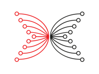

# The knowledge base for Cardano is growing: Cardano Stack Exchange graduates from Beta version
### **A fresh Q&A site will facilitate knowledge-sharing for all Cardano related topics**
 7 February 2022[ Ignacio Calderon de la Barca](tmp//en/blog/authors/gonzalo-ignacio-calderon-de-la-barca-rodo/page-1/) 4 mins read

### [**Ignacio Calderon de la Barca**](tmp//en/blog/authors/gonzalo-ignacio-calderon-de-la-barca-rodo/page-1/)
Technical Community Manager - Plutus

Marketing & Communication

- 
- 
- 
- 

[Cardano Stack Exchange (CSE)](https://cardano.stackexchange.com/), a community-driven knowledge base for Cardano, is now recognized by Stack Exchange as a mature learning community, putting it in a class with some of the biggest knowledge curation sites on the internet. 

[Cardano Stack Exchange (CSE)] (https://cardano.stackexchange.com/), một cơ sở kiến thức dựa trên cộng đồng cho Cardano, hiện được Stack Exchange công nhận là một cộng đồng học tập trưởng thành, đưa nó vào một lớp
Các trang web quản lý kiến thức lớn nhất trên internet.

The demand for in-depth technical knowledge about Cardano has consistently increased as more people invest their time in [building on Cardano](https://twitter.com/InputOutputHK/status/1488131603691884550). Such demand couldn’t (and shouldn’t) be met by any single entity, and that led to the community-driven approach of CSE.

Nhu cầu về kiến thức kỹ thuật chuyên sâu về Cardano đã liên tục tăng lên khi nhiều người đầu tư thời gian của họ vào [xây dựng Cardano] (https://twitter.com/inputoutputhk/status/1488131603691884550).
Nhu cầu như vậy không thể được đáp ứng bởi bất kỳ thực thể nào và điều đó dẫn đến cách tiếp cận dựa trên cộng đồng của CSE.

Plutus developers, researchers, stake pool operators, Cardano project team members, and founding entities – experts of all stripes from around the ecosystem – have come together to meet this demand. The fact that CSE has graduated from its trial period – dropping the ‘Beta’ label – confirms that it has reached a critical mass of *useful, decentralized knowledge*.

Các nhà phát triển, nhà nghiên cứu, nhà điều hành nhóm cổ phần, các thành viên nhóm dự án Cardano và các thực thể sáng lập - các chuyên gia của tất cả các sọc từ khắp hệ sinh thái - đã kết hợp với nhau để đáp ứng nhu cầu này.
Thực tế là CSE đã tốt nghiệp từ thời kỳ thử nghiệm của mình - việc bỏ nhãn "Betbetaâ € ™ € â € xác nhận rằng nó đã đạt được một khối lượng quan trọng của *kiến thức phi tập trung, hữu ích *.

## **From ‘Area 51’ to full site: the Stack Exchange journey**

## ** Từ â € ˜area 51â € ™ cho đến trang web đầy đủ: Hành trình trao đổi Stack **

The Cardano community anticipated the value of having a Stack Exchange site early on. It has been 10 months since a group of community visionaries launched CSE in the Stack Exchange ‘Area 51’ site, an initiative championed by community member [raghu](https://cardano.stackexchange.com/users/12/raghu). 

Cộng đồng Cardano đã dự đoán giá trị của việc có một trang web trao đổi ngăn xếp từ rất sớm.
Đã được 10 tháng kể từ khi một nhóm các nhà nhìn xa trong cộng đồng ra mắt CSE trong trang web Stack Exchange â € ˜area 51â € ™, một sáng kiến được vô địch bởi thành viên cộng đồng [Raghu] (https://cardano.stackexchange.com/users/12/
Raghu).

Since then, a diverse group of community members put their passion and knowledge to work curating information and documenting solutions for the Cardano ecosystem. 

Kể từ đó, một nhóm các thành viên cộng đồng đa dạng đặt niềm đam mê và kiến thức của họ để quản lý thông tin và tài liệu giải pháp cho hệ sinh thái Cardano.

The company behind Stack Exchange facilitates and referees the launch of new communities, and the process is far from easy. For a Stack Exchange initiative to fully launch, it goes through six steps: Discussion, Proposal, Community Commitment, Private Beta, Public Beta, and Graduation. 

Công ty đằng sau Stack Exchange tạo điều kiện và tham gia vào sự ra mắt của các cộng đồng mới, và quá trình này không dễ dàng.
Đối với một sáng kiến trao đổi ngăn xếp để ra mắt hoàn toàn, nó trải qua sáu bước: thảo luận, đề xuất, cam kết cộng đồng, beta riêng, beta công khai và tốt nghiệp.

Conquering them all is a major accomplishment. The ongoing success of this project would not have been possible without the help of many contributors; we make a special acknowledgement of the work of CSE moderators [Marek Mahut](https://cardano.stackexchange.com/users/28/marek-mahut-stakenuts), [Matthias Sieber](https://cardano.stackexchange.com/users/934/matthias-sieber) & [Glenn Rieger](https://cardano.stackexchange.com/users/281/grebel); IOG team members [Lars Brünjes](https://cardano.stackexchange.com/users/186/lars-br%c3%bcnjes) & [Samuel Leathers](https://cardano.stackexchange.com/users/382/samuel-leathers); and the effort of top users like [eddex](https://cardano.stackexchange.com/users/1142/eddex), [Mitchell Turner](https://cardano.stackexchange.com/users/1130/mitchell-turner), [zhekson](https://cardano.stackexchange.com/users/4302/zhekson), [nalyd88](https://cardano.stackexchange.com/users/62/nalyd88), [gorgeos](https://cardano.stackexchange.com/users/1231/georgeos), & [Andy Jazz](https://cardano.stackexchange.com/users/4023/andy-jazz). Additionally, we thank Hassan Khalil for his work on the Beta site analytics.

Chinh phục tất cả là một thành tựu lớn. Thành công liên tục của dự án này sẽ không thể thực hiện được nếu không có sự giúp đỡ của nhiều người đóng góp; Chúng tôi thực hiện một sự thừa nhận đặc biệt về công việc của người điều hành CSE [Marek Mahut] (https://cardano.stackexchange.com/users/28/marek-mahut-stakenuts), [Matthias Sieber] (https: //cardano. com/người dùng/934/matthias-sieber) & [glenn Rieger] (https://cardano.stackexchange.com/users/281/grebel); Các thành viên nhóm IOG [Lars Brünjes] (https://cardano.stackexchange.com/users/186/lars-br%C3%bcnjes) & [Samuel Leathers] Samuel-Leathers); và nỗ lực của người dùng hàng đầu như [eddex] (https://cardano.stackexchange.com/users/1142/eddex), [Mitchell Turner] (https://cardano.stackexchange.com/users/1130/mitchell . //cardano.stackexchange.com/users/1231/georgeos), & [Andy Jazz] (https://cardano.stackexchange.com/users/4023/andy-jazz). Ngoài ra, chúng tôi cảm ơn Hassan Khalil vì công việc của anh ấy trên các phân tích trang web beta.

Refer to the image below, top users, their reputation and most answered topics are included.

Tham khảo hình ảnh dưới đây, người dùng hàng đầu, danh tiếng của họ và các chủ đề được trả lời hầu hết được bao gồm.

## **Future vision**

## **Tầm nhìn tương lai**

[Stack Exchange](https://stackexchange.com/) is a model for Q&A-focused knowledge curation, as well as being a federation of learning communities empowered through merit-based editorial powers and moderator elections. The importance of this platform becomes evident (especially in the context of open source projects) by noting the example of its most iconic representative: [Stack Overflow](https://stackoverflow.com/). Stack Overflow has long been a key community hub for developers, paving the way for the success and adoption of all the most popular programming languages.

.
Tầm quan trọng của nền tảng này trở nên rõ ràng (đặc biệt là trong bối cảnh các dự án nguồn mở) bằng cách lưu ý ví dụ về đại diện mang tính biểu tượng nhất của nó: [Stack Overflow] (https://stackoverflow.com/).
Stack Overflow từ lâu đã là một trung tâm cộng đồng quan trọng cho các nhà phát triển, mở đường cho sự thành công và áp dụng tất cả các ngôn ngữ lập trình phổ biến nhất.

The winning strategy in tech is to leverage a self-governing, self-sustaining community.

Chiến lược chiến thắng trong công nghệ là tận dụng một cộng đồng tự quản, tự duy trì.

So, what does this mean for CSE’s journey? We have just ticked off a major milestone; however, this is only the beginning of a long term vision for the platform. As hinted above, CSE has the potential to enrich [Plutus](https://iohk.io/en/blog/posts/2021/04/13/plutus-what-you-need-to-know/) and [Marlowe](https://iohk.io/en/blog/posts/2020/10/06/marlowe-industry-scale-finance-contracts-for-cardano/) development, similar to the way that Stack Overflow enriched Python, Javascript, and C.

Vì vậy, điều này có ý nghĩa gì đối với hành trình của CSE?
Chúng tôi vừa đánh dấu một cột mốc quan trọng;
Tuy nhiên, đây chỉ là khởi đầu của một tầm nhìn dài hạn cho nền tảng.
Như đã gợi ý ở trên, CSE có khả năng làm phong phú [Plutus] (https://iohk.io/en/blog/posts/2021/04/13/plutus-what-you-need-to-know/) và [Marlowe
] (https://iohk.io/en/blog/posts/2020/10/06/marlowe-industry-scale-finance-contracts-for-cardano/)
, và C.

## **Get involved**

## **Tham gia vào**

This is already the place where developers meet and share knowledge. The next step is to increase the quality of engagement and elevate the creative range of the user base for our ecosystem’s native programming languages, our protocol, and the full Cardano stack. 

Đây đã là nơi mà các nhà phát triển gặp gỡ và chia sẻ kiến thức.
Bước tiếp theo là tăng chất lượng tham gia và nâng cao phạm vi sáng tạo của cơ sở người dùng cho các ngôn ngữ lập trình gốc của hệ sinh thái, giao thức của chúng tôi và Stack Cardano đầy đủ.

To the Technical Community: expect Discord Stages targeted to CSE, here we will highlight top CSE questions and answers and discuss interesting concepts of many topics dealing with building in Cardano.

Đối với cộng đồng kỹ thuật: Mong đợi các giai đoạn bất hòa được nhắm đến CSE, ở đây chúng tôi sẽ nêu bật các câu hỏi và câu trả lời CSE hàng đầu và thảo luận về các khái niệm thú vị về nhiều chủ đề liên quan đến việc xây dựng tại Cardano.

If you are a developer or Cardano enthusiast, get involved. When you do, keep in mind to maintain [best practices](https://cardano.stackexchange.com/help) as you vote, comment, ask and help others. If you are new to the platform, here are the highlights of what you can achieve:

Nếu bạn là một nhà phát triển hoặc người đam mê Cardano, hãy tham gia.
Khi bạn làm, hãy nhớ để duy trì [thực tiễn tốt nhất] (https://cardano.stackexchange.com/help) khi bạn bỏ phiếu, bình luận, hỏi và giúp đỡ người khác.
Nếu bạn chưa quen với nền tảng, đây là những điểm nổi bật của những gì bạn có thể đạt được:

- Gain reputation by asking and answering questions. 

- đạt được danh tiếng bằng cách hỏi và trả lời các câu hỏi.

- Collect badges to guide your upleveling in the platform.

- Thu thập huy hiệu để hướng dẫn Upleveling của bạn trong nền tảng.

- Get specialized information, by filtering questions under tags (e.g., plutus, plutustx, cardano-node, etc…).

- Nhận thông tin chuyên môn, bằng cách lọc các câu hỏi trong các thẻ (ví dụ: Plutus, Plutustx, Cardano-Node, v.v ...).

What does a strong question or answer look like? We’ve pulled an example for you from CSE with key points noted.

Một câu hỏi hoặc câu trả lời mạnh mẽ trông như thế nào?
Chúng tôi đã lấy một ví dụ cho bạn từ CSE với các điểm chính được ghi nhận.

- Cites important sources, and quotes the most relevant passages.

- trích dẫn các nguồn quan trọng, và trích dẫn các đoạn có liên quan nhất.

- Includes formatting (e.g., lists, bold, or italics) to emphasize key information.

- Bao gồm định dạng (ví dụ: danh sách, in đậm hoặc in nghiêng) để nhấn mạnh thông tin chính.

- Broken into paragraphs for understanding.

- chia thành các đoạn văn để hiểu.

- A comments function for improving the quality of the post.

- Một chức năng nhận xét để cải thiện chất lượng của bài viết.

Moving from beta is not only an important milestone. It's also a good reminder of the power of community action to add exponential value and the ‘compounding’ of knowledge that comes when we work together. We have all been part of this journey, and now we need to keep up the good work.

Chuyển từ beta không chỉ là một cột mốc quan trọng.
Đó cũng là một lời nhắc nhở tốt về sức mạnh của hành động cộng đồng để thêm giá trị theo cấp số nhân và kiến thức "kết hợp với nhau khi chúng ta làm việc cùng nhau.
Tất cả chúng ta đều là một phần của hành trình này, và bây giờ chúng ta cần phải tiếp tục công việc tốt.

*I’d like to thank Matthew Capps for his input and contribution in preparing this blog post.*

*Tôi muốn cảm ơn Matthew Capps vì đầu vào và đóng góp của anh ấy trong việc chuẩn bị bài đăng trên blog này.*

