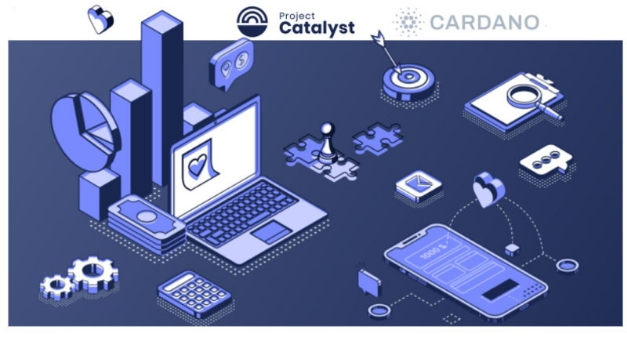

# Project Catalyst, Cardano’s innovation engine, launches Fund8!
### **Project Catalyst is a turbo-charged engine for Cardano, accelerating the ecosystem’s growth and making dreams come true**
 2 March 2022[ Kriss Baird](tmp//en/blog/authors/kriss-braid/page-1/) 4 mins read

### [**Kriss Baird**](tmp//en/blog/authors/kriss-braid/page-1/)
Product Owner

Commercial

- 
- 
- 

Every three months, a new Project Catalyst innovation fund campaign begins with the opportunity to receive resources paid in ada from the Cardano Treasury. Valuable resources to build, create, and contribute to realize great ideas worthy of funding. 

Cứ sau ba tháng, một chiến dịch Quỹ Đổi mới Dự án Catalyst mới bắt đầu với cơ hội nhận tài nguyên được trả ở ADA từ Kho bạc Cardano.
Các nguồn lực có giá trị để xây dựng, sáng tạo và đóng góp để nhận ra những ý tưởng tuyệt vời xứng đáng được tài trợ.

In little over a year, what began as an experiment in collaboration, competition, and elevating human potential has become the world’s largest decentralized innovation fund. The latest iteration, Fund8, will control $16m in ada, check out the [Fund8 Launch Guide](https://bit.ly/3vFgEvl).

Trong hơn một năm, những gì bắt đầu như một thử nghiệm hợp tác, cạnh tranh và nâng cao tiềm năng của con người đã trở thành quỹ đổi mới phi tập trung lớn nhất thế giới.
Việc lặp lại mới nhất, Fund8, sẽ kiểm soát $ 16M tại ADA, hãy xem [Hướng dẫn khởi chạy Fund8] (https://bit.ly/3vfgevl).

A global community comes together to propose, evaluate, and ultimately decide which proposal submissions should be funded. Everything including new decentralized finance (DeFi) applications to address financial inclusion inequalities. Or [RealFi](https://iohk.io/en/blog/posts/2021/11/25/welcome-to-the-age-of-realfi/), which creates an ecosystem of products that remove the frictions of real world economic activities and that provide cheaper credit/ financial products for real people. The [collective manufacturing project](https://wayacollective.com/) owned by African entrepreneurs and workers, for example.

Một cộng đồng toàn cầu kết hợp với nhau để đề xuất, đánh giá và cuối cùng quyết định đề xuất nào nên được tài trợ.
Tất cả mọi thứ bao gồm các ứng dụng tài chính phi tập trung (DEFI) mới để giải quyết sự bất bình đẳng bao gồm tài chính.
Hoặc [realfi] (https://iohk.io/en/blog/posts/2021/11/25/welcome-to-the-e-age-of-realfi/), tạo ra một hệ sinh thái của các sản phẩm loại bỏ các sản phẩm loại
Các hoạt động kinh tế trong thế giới thực và cung cấp các sản phẩm tài chính/ tín dụng rẻ hơn cho người thực.
[Dự án sản xuất tập thể] (https://wayacollective.com/) thuộc sở hữu của các doanh nhân và công nhân châu Phi, chẳng hạn.

### **Project milestones**

### **Mốc dự án**

Over the past seven Catalyst funds, each and every cycle has delivered new, incredible milestones. Before we look forward to what is in store for Fund8, let’s observe the achievements that have just come to pass during our last round.

Trong bảy quỹ chất xúc tác vừa qua, mỗi chu kỳ đã cung cấp các cột mốc mới, đáng kinh ngạc.
Trước khi chúng tôi mong đợi những gì có trong cửa hàng cho Fund8, hãy để Lừa quan sát những thành tựu vừa mới vượt qua trong vòng cuối cùng của chúng tôi.

In Fund7, once votes were counted and tallied, [269 new proposals were chosen to receive ada](https://drive.google.com/file/d/193GZulHuk0zhpTrMiLhcNC4OeEMoRyIa/view). A staggering amount given that each of these projects was in response to 24 real-world challenges proposed by the Cardano community and one further challenge set by Cardano’s first [Catalyst Native](https://iohk.io/en/blog/posts/2021/11/10/introducing-catalyst-natives-how-any-business-can-leverage-the-cardano-innovation-engine/) pioneer, COTI. Catalyst Natives is Cardano’s new initiative to provide decentralized innovation fund management to partners looking to grow their ecosystem by incentivising innovators to help build solutions to challenges that Catalyst Native partners set. 

Trong Fund7, một khi phiếu bầu được tính và tính toán, [269 đề xuất mới đã được chọn để nhận ADA] (https://drive.google.com/file/d/193gzulhuk0zhptrmilhcnc4oeemoryia/view).
Một số tiền đáng kinh ngạc cho rằng mỗi dự án này là để đối phó với 24 thách thức trong thế giới thực do cộng đồng Cardano đề xuất và một thách thức nữa được đặt ra bởi [Catalyst Native] của Cardano (https://iohk.io/en/blog/posts/
2021/11/10/Giới thiệu người bản địa chế độ xúc tác-làm việc-bất kỳ người nào trong những người tiên phong-be-there-whelage-the-cardano-in-in-in-innovation, Coti.
Người bản địa Catalyst là sáng kiến mới của Cardano, để cung cấp quản lý quỹ đổi mới phi tập trung cho các đối tác tìm cách phát triển hệ sinh thái của họ bằng cách khuyến khích các nhà đổi mới giúp xây dựng các giải pháp cho những thách thức mà xúc tác cho các đối tác bản địa đặt ra.

More that 52,500 wallets registered to vote and community advisors participated in reviewing more than 900 proposals this time around to help inform voters’ decisions. 

Thêm 52.500 ví đã đăng ký để bỏ phiếu và cố vấn cộng đồng đã tham gia xem xét hơn 900 đề xuất trong thời gian này để giúp thông báo cho các cử tri quyết định.

In a very short period of time, the number of proposals being funded from the [Cardano Treasury](https://iohk.io/blog/posts/2020/09/10/project-catalyst-voltaire-bring-power-to-the-people/) has nearly doubled to 575 projects. Crucially, we have now seen over 1 million votes cast since the first Project Catalyst community vote in Fund2. 

Trong một khoảng thời gian rất ngắn, số lượng các đề xuất được tài trợ từ [Kho bạc Cardano] (https://iohk.io/blog/posts/2020/09/10/project-catalyst-voltaire-cring-power-to
-The-People/) đã tăng gần gấp đôi lên 575 dự án.
Điều quan trọng, chúng tôi hiện đã thấy hơn 1 triệu phiếu bầu kể từ cuộc bỏ phiếu cộng đồng Project Catalyst đầu tiên trong Fund2.

At the time of writing, the Cardano Treasury holds approximately 800m ada to sustain and grow the ecosystem. Many projects funded in previous rounds have now completed and are [demonstrating their outcomes](https://docs.google.com/spreadsheets/d/1bfnWFa94Y7Zj0G7dtpo9W1nAYGovJbswipxiHT4UE3g/edit#gid=416498551). 

Tại thời điểm viết bài, Kho bạc Cardano nắm giữ khoảng 800m ADA để duy trì và phát triển hệ sinh thái.
Nhiều dự án được tài trợ trong các vòng trước đã hoàn thành và đang [chứng minh kết quả của họ] (https://docs.google.com/spreadsheets/d/1bfnwfa94y7zj0g7dtpo9w1naygovj

As the project rotates to the new fund campaign, another inspiring milestone has been reached. Every single challenge in Fund8 has been set and decided by the Catalyst community. The goal? To accelerate the developer and DApp ecosystem within Cardano’s open source framework. 23 challenges span across themes such as Cardano Ecosystem Foundations & Development, Community Development, Outreach & Adoption, Identity & Interoperability, and Project Catalyst Improvements. 

Khi dự án quay sang chiến dịch quỹ mới, một cột mốc truyền cảm hứng khác đã đạt được.
Mỗi thử thách trong Fund8 đã được đặt ra và quyết định bởi cộng đồng Catalyst.
Mục đích?
Để tăng tốc cho nhà phát triển và hệ sinh thái DAPP trong khung nguồn mở của Cardano.
23 Thử thách trải dài qua các chủ đề như Cardano Hệ sinh thái & Phát triển, phát triển cộng đồng, tiếp cận & áp dụng, nhận dạng & khả năng tương tác và cải thiện chất xúc tác dự án.

2022 is set to eclipse the achievements of the last 12 months, with innovations and projects being propelled forward by people just like you, reading this blog today. Have an idea? Why not apply?

2022 được thiết lập để làm lu mờ những thành tựu của 12 tháng qua, với những đổi mới và dự án được thúc đẩy bởi những người giống như bạn, đọc blog này ngày hôm nay.
Có một ý tưởng?
Tại sao không áp dụng?

### **How to get involved?**

### **Làm thế nào để tham gia?**

On Thursday 24th February 2022, proposal submissions opened. Proposers were originally given one week to submit a draft proposal, and two additional weeks to refine and finalize submissions. This draft submission deadline has now been lifted, there is no longer a draft deadline, and instead we will be accepting proposal submissions up until 11am UTC on March 17th.

Vào thứ năm ngày 24 tháng 2 năm 2022, các bài nộp đề xuất đã mở.
Những người đề xuất ban đầu được đưa ra một tuần để gửi một đề xuất dự thảo, và hai tuần nữa để tinh chỉnh và hoàn thiện các bài nộp.
Hạn chót dự thảo này hiện đã được dỡ bỏ, không còn thời hạn dự thảo nữa, và thay vào đó chúng tôi sẽ chấp nhận đệ trình đề xuất cho đến 11 giờ tối UTC vào ngày 17 tháng 3.

There are many ways to get involved with Project Catalyst. As an innovator, voter, commenter, proposal reviewer, or even a mentor. The first step is [making an account on our collaboration platform](https://cardano.ideascale.com/). Another way is to come join the Project Catalyst community every Wednesday at TownHall which is live streamed on our [YouTube Channel](https://www.youtube.com/c/IohkIo). If you have an idea, or are just curious to explore what’s going on at the heart of Cardano, join us and become part of the Project Catalyst Community. 

Có nhiều cách để tham gia với Project Catalyst.
Là một nhà đổi mới, cử tri, bình luận viên, người đánh giá đề xuất, hoặc thậm chí là một người cố vấn.
Bước đầu tiên là [tạo một tài khoản trên nền tảng hợp tác của chúng tôi] (https://cardano.ideascale.com/).
Một cách khác là đến tham gia cộng đồng Project Catalyst vào mỗi thứ Tư tại Townhall được phát trực tiếp trên [kênh YouTube] của chúng tôi (https://www.youtube.com/c/iohkio).
Nếu bạn có một ý tưởng, hoặc chỉ tò mò muốn khám phá những gì diễn ra ở trung tâm của Cardano, hãy tham gia với chúng tôi và trở thành một phần của cộng đồng Project Catalyst.

To learn more about [Project Catalyst](https://iohk.io/en/blog/posts/2021/02/12/our-million-dollar-baby-project-catalyst), or to take part and answer challenges posted by others through Project Catalyst, please subscribe to the [Catalyst mailing list](https://bit.ly/3dSZJvx) and join our [Telegram community](https://t.me/cardanocatalyst), where we’d be delighted to welcome you.

Để tìm hiểu thêm về [Project Catalyst] (https://iohk.io/en/blog/posts/2021/02/12/our-million-dollar-baby-project-catalyst) hoặc tham gia và trả lời các thử thách được đăng
bởi những người khác thông qua Project Catalyst, vui lòng đăng ký vào [Danh sách gửi thư Catalyst] (https://bit.ly/3dszjvx) và tham gia [cộng đồng Telegram] của chúng tôi (https://t.me/cardanocatalyst), nơi chúng tôi sẽ đến
Vui mừng chào đón bạn.

