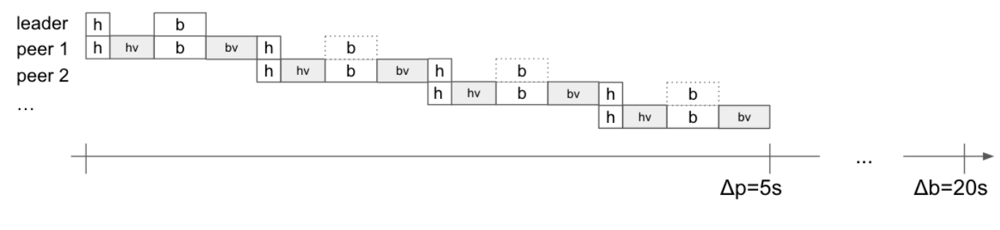
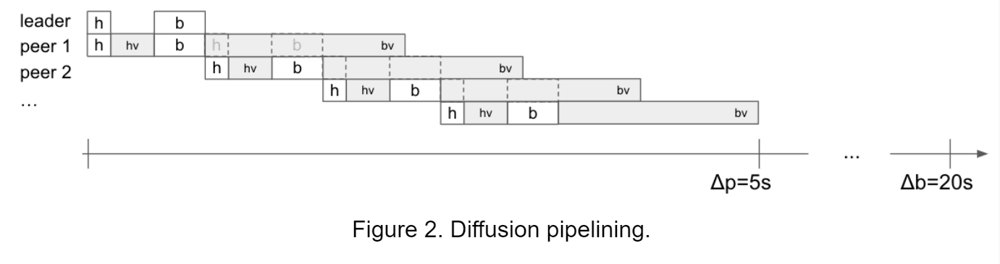
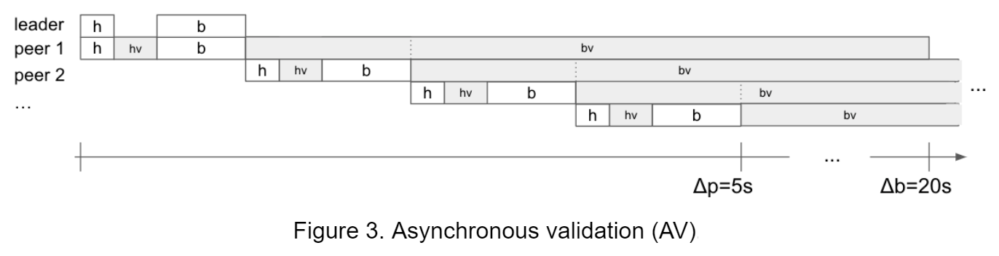
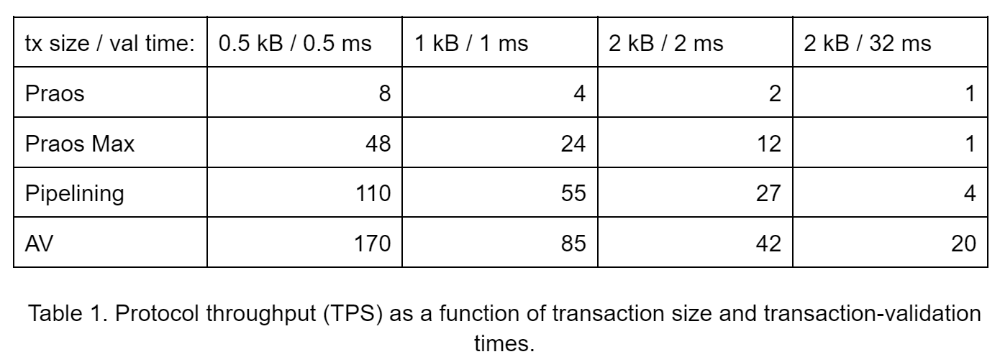

# Increasing the transaction throughput of Cardano
### **Diffusion pipelining - scheduled for this summer - will increase the budget for block propagation and validation times, allowing for larger blocks and increased transaction throughput. Here’s a technical research perspective. (Along with an introduction to AV, its even more performant sibling…)**
 21 March 2022[ Matthias Fitzi](tmp//en/blog/authors/matthias-fitzi/page-1/) 10 mins read

### [**Matthias Fitzi**](tmp//en/blog/authors/matthias-fitzi/page-1/)
Research Fellow

Academic Research

- 
- 
- 

The recent enabling of smart contracts on Cardano has led to a significant increase in user activity. Simultaneously, average transaction sizes grew due to code-carrying script transactions. With the first decentralized-finance (DeFi) applications now deployed on the Cardano ecosystem, and more on the way, we expect this trend to continue. To keep up with this elevated demand, the system’s current transaction throughput must be increased.

Việc cho phép các hợp đồng thông minh gần đây trên Cardano đã dẫn đến sự gia tăng đáng kể trong hoạt động của người dùng.
Đồng thời, kích thước giao dịch trung bình tăng lên do các giao dịch tập lệnh mang mã.
Với các ứng dụng tài chính phi tập trung đầu tiên (DEFI) hiện được triển khai trên hệ sinh thái Cardano và nhiều hơn nữa trên đường đi, chúng tôi hy vọng xu hướng này sẽ tiếp tục.
Để theo kịp nhu cầu nâng cao này, thông lượng giao dịch hiện tại của hệ thống phải được tăng lên.

An obvious approach to increase transaction throughput is to increase the block-size limit to fit more transactions per block. Block size has already been increased by 25% this year—from 64kB to its current 80kB, and we anticipate further increases. However, there is a limit on how large a block can be securely maintained by a ledger-consensus protocol if the block production rate is to be kept at the current level. To achieve high throughput without compromising the security of the system, additional measures are required. To understand why, we need to take a closer look at how ledger consensus works in general:

Một cách tiếp cận rõ ràng để tăng thông lượng giao dịch là tăng giới hạn quy mô khối để phù hợp với nhiều giao dịch hơn cho mỗi khối.
Kích thước khối đã được tăng 25% trong năm nay, từ 64kB đến 80kb hiện tại và chúng tôi dự đoán sẽ tăng thêm.
Tuy nhiên, có một giới hạn về mức độ lớn của một khối có thể được duy trì an toàn bởi một giao thức-tính đồng nhất của sổ cái nếu tốc độ sản xuất khối được giữ ở cấp độ hiện tại.
Để đạt được thông lượng cao mà không ảnh hưởng đến bảo mật của hệ thống, cần có các biện pháp bổ sung.
Để hiểu lý do tại sao, chúng ta cần xem xét kỹ hơn về cách mà sự đồng thuận của sổ cái nói chung:

Ledger consensus protocols are characterized by two time parameters:

Các giao thức đồng thuận sổ cái được đặc trưng bởi hai tham số thời gian:

- Δp, the maximal network delay for a new block to reach (e.g.) 95% of the network, and 

- ΔP, độ trễ mạng tối đa cho một khối mới đạt được (ví dụ:) 95% mạng và

- Δb, the (expected) time between the generation of two new blocks

- ΔB, thời gian (dự kiến) giữa thế hệ của hai khối mới

In typical protocols, to argue consistency for consensus, the propagation of a prior block must finish before the next block is generated—at least most of the time. Thus, Δb is chosen to be somewhat larger than Δp. In Cardano, we have Δp=5s (seconds) and Δb=20s.

Trong các giao thức điển hình, để tranh luận về tính nhất quán cho sự đồng thuận, việc lan truyền của một khối trước phải kết thúc trước khi khối tiếp theo được tạo ra ít nhất là hầu hết thời gian.
Do đó, ΔB được chọn có phần lớn hơn ΔP.
Trong Cardano, chúng ta có Δp = 5s (giây) và ΔB = 20 giây.

Now, how much data can be transported by a block under these conditions? To see this, we need to examine in more detail what exactly has to be achieved within Δp.

Bây giờ, bao nhiêu dữ liệu có thể được vận chuyển bởi một khối trong các điều kiện này?
Để thấy điều này, chúng ta cần kiểm tra chi tiết hơn những gì chính xác phải đạt được trong ΔP.

Figure 1. Block network diffusion and validation within the Δp=5s budget

Hình 1. Khối khuếch tán và xác thực mạng trong ngân sách ΔP = 5s

Consider the above Figure 1 depicting in a simplified way, how block propagation works in the network. The block producer sends their new block header to Peer 1 (white h-box), occupying both nodes’ network links during the time span indicated by the white h-box. Peer 1 then validates the header (involving local computation during the time span indicated by the gray hv-box). If the header is valid, i.e. the header proves eligible block leadership, etc., the block body is downloaded by Peer 1 (white b-box), again occupying both nodes’ network links. Finally, Peer 1 validates the block body (gray bv-box), and, only if the block body is also valid, Peer 1 is ready to propagate the block to other peers along the lines of what was just described.

Hãy xem xét hình trên Hình 1 mô tả theo cách đơn giản hóa, cách truyền khối hoạt động trong mạng.
Nhà sản xuất khối gửi tiêu đề khối mới của họ đến Peer 1 (Hộp H trắng), chiếm cả hai nút liên kết mạng trong khoảng thời gian được biểu thị bằng H-box trắng.
Peer 1 sau đó xác nhận tiêu đề (liên quan đến tính toán cục bộ trong khoảng thời gian được biểu thị bằng hộp HV màu xám).
Nếu tiêu đề là hợp lệ, tức là tiêu đề chứng minh sự lãnh đạo khối đủ điều kiện, v.v., thân khối được tải xuống bởi Peer 1 (B-box trắng), một lần nữa chiếm cả hai liên kết mạng của nút.
Cuối cùng, Peer 1 xác nhận thân khối (BV-bv-bv), và, chỉ khi thân khối cũng hợp lệ, Peer 1 đã sẵn sàng tuyên truyền khối sang các đồng nghiệp khác dọc theo các dòng của những gì vừa được mô tả.

An unfortunate side effect of this mode of operation is that a single node’s CPU and network link is only utilized during a small fraction of Δp=5s while remaining (mostly) idle during the rest of the (expected) Δb=20s.

Một tác dụng phụ đáng tiếc của chế độ hoạt động này là một nút CPU và liên kết mạng duy nhất chỉ được sử dụng trong một phần nhỏ Δp = 5s trong khi vẫn (chủ yếu) nhàn rỗi trong phần còn lại của (dự kiến) ΔB = 20s.

Concretely, the amount of data we can fit into a block is determined by the peer-to-peer network delay of the block and the required validation time. Both grow roughly linearly in the size of the block—times the maximal number of hops required to reach 95% of all nodes. Measurements show that, to guarantee network propagation within Δp=5s, the block size should not exceed 2 MB. Accounting for computationally intense scripts, validation time may even impose a much lower limit.

Một cách cụ thể, lượng dữ liệu chúng ta có thể phù hợp với một khối được xác định bởi độ trễ mạng ngang hàng của khối và thời gian xác thực cần thiết.
Cả hai phát triển gần như tuyến tính về kích thước của khối khối số lượng hoa bia tối đa cần thiết để đạt 95% tất cả các nút.
Các phép đo cho thấy, để đảm bảo sự lan truyền mạng trong ΔP = 5S, kích thước khối không được vượt quá 2 MB.
Kế toán cho các tập lệnh tính toán mạnh mẽ, thời gian xác nhận thậm chí có thể áp đặt giới hạn thấp hơn nhiều.

The good news is that, within these constraints, transaction throughput can be exceeded by applying changes to the peer-to-peer network and/or consensus layers. We explain these techniques below. 

Tin tốt là, trong các ràng buộc này, thông lượng giao dịch có thể vượt quá bằng cách áp dụng các thay đổi cho mạng ngang hàng và/hoặc các lớp đồng thuận.
Chúng tôi giải thích các kỹ thuật dưới đây.

### **Diffusion pipelining**

### ** Đường ống khuếch tán **

Reconsidering Figure 1, we see that all nodes’ actions are performed in strict sequence, and thus Δp needs to fit the time required by a single node multiplied by the number of hops in the peer-to-peer path. We observe that, while this is necessary for network transmission, it is not for block validation.

Xem xét lại Hình 1, chúng ta thấy rằng tất cả các hành động của các nút được thực hiện theo trình tự nghiêm ngặt và do đó ΔP cần phù hợp với thời gian cần thiết bởi một nút duy nhất nhân với số lượng bước nhảy trong đường dẫn ngang hàng.
Chúng tôi quan sát rằng, trong khi điều này là cần thiết cho việc truyền mạng, nó không phải là để xác thực khối.

Consider Figure 2. By allowing blocks to be propagated before full validation has taken place, we can exclude (repeated) body validation from the propagation path. As soon as Peer 1 has received the block body (b-box), it can already start propagating the block concurrently to validating the block-body, etc.

Xem xét Hình 2. Bằng cách cho phép các khối được truyền trước khi xác nhận đầy đủ, chúng ta có thể loại trừ xác thực cơ thể (lặp đi lặp lại) khỏi đường truyền.
Ngay khi Peer 1 đã nhận được thân khối (B-box), nó đã có thể bắt đầu tuyên truyền khối đồng thời để xác thực khối khối, v.v.

In contrast to the scheme in Figure 1, the Δp budget now only needs to account for body validation once. This results in a higher time budget for peer-to-peer network transmission and/or body validation, thus allowing for a higher transaction throughput (for easy comparison to Figure 1, this gain is illustrated by a larger body-validation (‘bv’) budget).

Trái ngược với sơ đồ trong Hình 1, ngân sách ΔP hiện chỉ cần tính đến xác thực cơ thể một lần.
Điều này dẫn đến ngân sách thời gian cao hơn để truyền tải và/hoặc xác thực cơ thể ngang hàng, do đó cho phép thông lượng giao dịch cao hơn (để so sánh dễ dàng với Hình 1, mức tăng này được minh họa bằng xác thực cơ thể lớn hơn ('BV'
) ngân sách).

For reasons explained below, it is crucial that the following two validation checks remain fully replicated in the propagation path:

Vì những lý do được giải thích dưới đây, điều quan trọng là hai kiểm tra xác thực sau vẫn được sao chép hoàn toàn trong đường truyền nhân:

1. Header correctness, i.e. the block correctly references its predecessor, and correct block leadership (verifiable-random-function (VRF) and block-signature validation).

1. Độ chính xác tiêu đề, tức là khối tham chiếu chính xác người tiền nhiệm của nó và chính xác lãnh đạo khối (có thể kiểm chứng-chức năng ngẫu nhiên (VRF) và xác thực chữ ký khối).

1. Block completeness, i.e. the received (but not yet validated) body is indeed referenced by the header’s body hash.

1. Tính hoàn thiện của khối, tức là cơ thể nhận được (nhưng chưa được xác nhận) thực sự được tham chiếu bởi phần băm cơ thể tiêu đề.

How might diffusion pipelining (as described above) affect the security of the consensus and network layers?

Làm thế nào có thể đường ống khuếch tán (như được mô tả ở trên) ảnh hưởng đến bảo mật của các lớp đồng thuận và mạng?

First, note that the consensus layer remains unaffected by this change:

Đầu tiên, lưu ý rằng lớp đồng thuận vẫn không bị ảnh hưởng bởi sự thay đổi này:

- Honest blocks are always valid, since the block leader fully validates the chain to be appended by the new block as well as the new block itself, and,

- Các khối trung thực luôn hợp lệ, vì người lãnh đạo khối xác nhận đầy đủ chuỗi được đặt bởi khối mới cũng như chính khối mới, và,,

- Incomplete blocks are not propagated (due to Point 2 above), and,

- Các khối không hoàn chỉnh không được truyền (do điểm 2 ở trên) và,,

- Invalid (complete) blocks, though possibly propagated through the network, are always discarded by an honest node after body validation

- Các khối không hợp lệ (hoàn chỉnh), mặc dù có thể được truyền qua mạng, luôn bị loại bỏ bởi một nút trung thực sau khi xác thực cơ thể

Second, concerning Denial-of-Service (DoS) attacks on the network layer, note that the adversary can try to congest the system by diffusing invalid blocks. However, correct block leadership is still verified (due to point 1), implying that such a block will only be propagated if the adversary is scheduled to do so, i.e., no more load is generated than if this block leader was honest (except for the block not contributing towards the throughput of the system). Furthermore, stake-pool operators (SPOs) generating invalid blocks can be easily identified and punished, in fact an infraction management system is currently in development to perform exactly this function. 

Thứ hai, liên quan đến các cuộc tấn công từ chối dịch vụ (DOS) vào lớp mạng, lưu ý rằng kẻ thù có thể cố gắng tắc nghẽn hệ thống bằng cách khuếch tán các khối không hợp lệ.
Tuy nhiên, khả năng lãnh đạo khối chính xác vẫn được xác minh (do điểm 1), ngụ ý rằng một khối như vậy sẽ chỉ được truyền bá nếu đối thủ dự kiến sẽ làm như vậy, tức là không có tải nhiều hơn nếu người dẫn đầu khối này là trung thực (ngoại trừ
Khối không đóng góp vào thông lượng của hệ thống).
Hơn nữa, các toán tử Pool Pool (SPO) tạo ra các khối không hợp lệ có thể dễ dàng được xác định và trừng phạt, trên thực tế, một hệ thống quản lý vi phạm hiện đang được phát triển để thực hiện chính xác chức năng này.

To conclude, diffusion pipelining increases the budget for block propagation and validation times within the Δp limit, allowing for larger blocks and thus for increased transaction throughput—while leaving the consensus rules unchanged. It promises to substantially increase throughput while being achievable by minimally invasive changes to the system, and is thus an excellent candidate for implementation in the short term. Still, the impact of pipelining (alone) is limited, and our ambitions do not stop here.

Để kết luận, đường ống khuếch tán làm tăng ngân sách cho thời gian lan truyền và xác thực của khối trong giới hạn ΔP, cho phép các khối lớn hơn và do đó để tăng thông lượng giao dịch, trong khi không thay đổi các quy tắc đồng thuận.
Nó hứa hẹn sẽ tăng đáng kể thông lượng trong khi có thể đạt được bằng những thay đổi xâm lấn tối thiểu vào hệ thống, và do đó là một ứng cử viên tuyệt vời để thực hiện trong thời gian ngắn.
Tuy nhiên, tác động của đường ống (một mình) còn hạn chế và tham vọng của chúng tôi không dừng lại ở đây.

We next give a summary of a more powerful technique that can achieve even higher transaction throughput, but also requires some more dramatic protocol changes.

Tiếp theo chúng tôi đưa ra một bản tóm tắt về một kỹ thuật mạnh mẽ hơn có thể đạt được thông lượng giao dịch cao hơn, nhưng cũng đòi hỏi một số thay đổi giao thức ấn tượng hơn.

### **Asynchronous validation**

### ** Xác thực không đồng bộ **

The idea behind diffusion pipelining—delayed body validation—can be taken to the extreme: a new block is still required to arrive within Δp, but we do not demand that its body validation be completed within Δp. We refer to this as asynchronous validation (AV).

Ý tưởng đằng sau đường ống khuếch tán xác nhận cơ thể bị giảm bằng cách đưa ra cực đoan: một khối mới vẫn được yêu cầu đến trong ΔP, nhưng chúng tôi không yêu cầu hoàn thành việc xác nhận cơ thể của nó trong ΔP.
Chúng tôi đề cập đến điều này là xác thực không đồng bộ (AV).

Consider Figure 3. Body validation is allowed to essentially consume the remaining (expected) Δb budget (besides block transmission and header validation), thus virtually putting the nodes’ CPUs at permanent load. However, note that the network link and the CPU are also assigned to other tasks (such as mempool synchronization), meaning that we do not want to utilize the full remainder of Δb for body validation, but leave a couple of seconds assigned to such other tasks.

Xem xét Hình 3. Xác thực cơ thể được phép sử dụng cơ bản để tiêu thụ ngân sách ΔB còn lại (dự kiến) (bên cạnh việc truyền khối và xác thực tiêu đề), do đó hầu như đặt các nút CPU ở mức tải vĩnh viễn.
Tuy nhiên, lưu ý rằng liên kết mạng và CPU cũng được gán cho các tác vụ khác (chẳng hạn như đồng bộ hóa mempool), có nghĩa là chúng tôi không muốn sử dụng toàn bộ phần còn lại của ΔB để xác thực cơ thể, nhưng để lại một vài giây
Nhiệm vụ.

This has a notable side effect. In contrast to diffusion pipelining, ledger validation generally lags behind the head of the chain. In particular, even honest block leaders now may possibly create blocks that are (partially) invalid, as they may not have finished validating the transaction history leading up to the new block.

Điều này có một tác dụng phụ đáng chú ý.
Trái ngược với đường ống khuếch tán, xác nhận sổ cái thường tụt lại phía sau đầu chuỗi.
Cụ thể, ngay cả các nhà lãnh đạo khối trung thực hiện có thể có thể tạo ra các khối (một phần) không hợp lệ, vì họ có thể chưa hoàn thành việc xác thực lịch sử giao dịch dẫn đến khối mới.

To cope with this side effect, the ledger rules need to be adapted: to guarantee that honest blocks always contribute to the security of consensus, blocks carrying invalid transactions must still be considered as valid chain extensions. Invalid transactions can then simply be discarded during ledger validation.

Để đối phó với tác dụng phụ này, các quy tắc sổ cái cần được điều chỉnh: để đảm bảo rằng các khối trung thực luôn đóng góp vào sự bảo mật của sự đồng thuận, các khối mang các giao dịch không hợp lệ vẫn phải được coi là mở rộng chuỗi hợp lệ.
Các giao dịch không hợp lệ sau đó có thể được loại bỏ trong quá trình xác thực sổ cái.

Although substantially improving over diffusion pipelining, AV can be even further improved. The reason is that, generally, not enough data can be diffused during Δp to produce enough validation work to max out the CPUs during the full remainder of the Δb period. To fully leverage the benefits of AV, we will combine it with the mechanism of input endorsers, which we will describe in an upcoming blog post. 

Mặc dù cải thiện đáng kể đường ống khuếch tán, AV thậm chí còn có thể được cải thiện hơn nữa.
Lý do là, nói chung, không đủ dữ liệu có thể được khuếch tán trong ΔP để tạo ra đủ công việc xác thực để tối đa hóa CPU trong suốt phần còn lại của giai đoạn ΔB.
Để tận dụng đầy đủ các lợi ích của AV, chúng tôi sẽ kết hợp nó với cơ chế của những người chứng thực đầu vào, mà chúng tôi sẽ mô tả trong một bài đăng trên blog sắp tới.

### **Impact**

### **Va chạm**

What impact on throughput can we expect from pipelining and AV? Finding the precise answer to this question is still ongoing work by our network and research teams, as giving a rigorous analysis in case of a malicious adversary (attempting to maximally disrupt the protocol) is rather involved. Still, to provide a first estimate, we give below a throughput analysis for the optimistic case where all SPOs behave honestly—in expectation that the results for the malicious case will not deviate substantially (given also the presence of the infraction management system). Still, note that the real throughput of the system will likely vary from the given estimates.

Tác động gì đến thông lượng mà chúng ta có thể mong đợi từ đường ống và AV?
Tìm câu trả lời chính xác cho câu hỏi này vẫn đang được các nhóm nghiên cứu và mạng của chúng tôi tiếp tục, vì đưa ra một phân tích nghiêm ngặt trong trường hợp đối thủ độc hại (cố gắng phá vỡ tối đa giao thức) có liên quan.
Tuy nhiên, để cung cấp một ước tính đầu tiên, chúng tôi đưa ra phân tích thông lượng dưới cho trường hợp lạc quan trong đó tất cả các Spo hoạt động trung thực, theo kỳ vọng rằng kết quả cho trường hợp độc hại sẽ không đi chệch hướng đáng kể (cũng được đưa ra sự hiện diện của hệ thống quản lý vi phạm).
Tuy nhiên, lưu ý rằng thông lượng thực của hệ thống có thể sẽ thay đổi so với các ước tính đã cho.

In Table 1, we present these throughput estimates (in transactions per second, TPS). Recall that throughput depends both on transaction sizes and validation times. For a selection of size/validation-time pairs, we assume that all transactions have the same characteristics, and give the respective throughput numbers. We compare four different protocols:

Trong Bảng 1, chúng tôi trình bày các ước tính thông lượng này (tính theo giao dịch mỗi giây, TPS).
Hãy nhớ lại rằng thông lượng phụ thuộc cả vào kích thước giao dịch và thời gian xác thực.
Để lựa chọn các cặp thời gian xác thực/kích thước, chúng tôi giả định rằng tất cả các giao dịch có cùng một đặc điểm và đưa ra các số thông lượng tương ứng.
Chúng tôi so sánh bốn giao thức khác nhau:

- Praos: Cardano’s currently deployed protocol (block size 80 kB)

- PRAOS: Giao thức hiện đang triển khai Cardano (kích thước khối 80 kb)

- Praos Max: Praos with the maximal possible block size that can be safely maintained (under the above assumptions)

- Praos Max: Praos với kích thước khối tối đa có thể được duy trì một cách an toàn (theo các giả định trên)

- Diffusion pipelining

- Đường ống khuếch tán

- AV (with 20% of the Δb budget discounted, and reserved for different tasks)

- AV (với 20% ngân sách ΔB được chiết khấu và dành riêng cho các nhiệm vụ khác nhau)

We consider four different transaction types with varied size and required time for validation. A simple payment transaction is somewhere near the 0.5 kB / 0.5 ms category, while script transactions may fall into either one of the other types, which require both a larger size and more effort to validate. Note also the last column (2 kB / 32 ms) where validation time becomes substantial in comparison to the network delay: Increasing the block size (from Praos to Praos Max) does not help to improve throughput as validation already maxes out the time budget. Consequently, pipelining and AV provide strong relative gains exactly in these cases since they increase the validation-time budget.

Chúng tôi xem xét bốn loại giao dịch khác nhau với quy mô khác nhau và thời gian cần thiết để xác nhận.
Một giao dịch thanh toán đơn giản nằm ở đâu đó gần danh mục 0,5 kb / 0,5 ms, trong khi các giao dịch tập lệnh có thể rơi vào một trong các loại khác, đòi hỏi cả kích thước lớn hơn và nỗ lực nhiều hơn để xác nhận.
Cũng lưu ý cột cuối cùng (2 kb / 32 ms) trong đó thời gian xác thực trở nên đáng kể so với độ trễ mạng: tăng kích thước khối (từ PRAO đến PRAOS MAX) không giúp cải thiện thông lượng vì xác thực đã tối đa hóa ngân sách thời gian.
Do đó, Pipelining và AV cung cấp lợi nhuận tương đối mạnh mẽ chính xác trong những trường hợp này vì chúng tăng ngân sách thời gian xác nhận.

### **Outlook for Cardano**

### ** Triển vọng cho Cardano **

Increasing the throughput of a permissionless blockchain is security critical, as admitting more load to the system may introduce DoS-attack opportunities. It is thus advisable to perform such changes in a sequence of small steps while carefully observing the effects on the system.

Việc tăng thông lượng của một blockchain không được phép là bảo mật quan trọng, vì thừa nhận tải nhiều hơn cho hệ thống có thể giới thiệu các cơ hội tấn công dos.
Do đó, nên thực hiện những thay đổi như vậy trong một chuỗi các bước nhỏ trong khi quan sát cẩn thận các hiệu ứng trên hệ thống.

The first such steps were taken last December and this February by raising the block-size limit (and Plutus-script memory units) from 64kB to 80kB (see also this [recent blog](https://iohk.io/en/blog/posts/2021/11/22/slow-and-steady-wins-the-race-network-evolution-for-network-growth/) by John Woods). 

Các bước đầu tiên như vậy đã được thực hiện vào tháng 12 năm ngoái và tháng 2 này bằng cách tăng giới hạn kích thước khối (và các đơn vị bộ nhớ-chữ-script) từ 64kb lên 80kb (xem thêm [blog gần đây] (https://iohk.io/en/blog
.

Over the months ahead, we will continue to closely monitor and adjust these parameters, based on network demand and capacity constraints. Further improvements will come with the implementation of diffusion pipelining. Other consensus optimizations, including input endorsers, are still under development, and more details on how these will be executed will be announced in due time.

Trong những tháng tới, chúng tôi sẽ tiếp tục theo dõi chặt chẽ và điều chỉnh các tham số này, dựa trên các hạn chế về nhu cầu và năng lực của mạng.
Những cải tiến hơn nữa sẽ đi kèm với việc thực hiện đường ống khuếch tán.
Các tối ưu hóa đồng thuận khác, bao gồm cả người chứng thực đầu vào, vẫn đang được phát triển và chi tiết hơn về cách thức này sẽ được thực hiện sẽ được công bố đúng hạn.

Note that the optimization endeavor of the Cardano Basho era extends beyond the network and consensus layers, and includes Plutus script enhancements as well as off-chain processing—see this [recent blog](https://iohk.io/en/blog/posts/2022/01/14/how-we-re-scaling-cardano-in-2022/) by Tim Harrison. In particular, [Hydra](https://iohk.io/en/blog/posts/2020/03/26/enter-the-hydra-scaling-distributed-ledgers-the-evidence-based-way), a layer-2 protocol suite under development, offers another pathway for a dramatic improvement in total transaction throughput by allowing to execute transactions off-chain.

Lưu ý rằng nỗ lực tối ưu hóa của kỷ nguyên Cardano Basho mở rộng ra ngoài mạng lưới và các lớp đồng thuận, và bao gồm các cải tiến tập lệnh Plutus cũng như xử lý chuỗi ngoài chuỗi xem xét [blog gần đây] này (https://iohk.io/blog/
Bài viết/2022/01/14/How-We-Re-Scaling-Cardano-in-2022/) của Tim Harrison.
Cụ thể, [hydra] (https://iohk.io/en/blog/posts/2020/03/26/enter-the-hydra-scaling-distributed-ledgers-the-waidence dựa trên đường), một lớp
-2 Bộ giao thức đang được phát triển, cung cấp một con đường khác để cải thiện đáng kể tổng thông lượng giao dịch bằng cách cho phép thực hiện các giao dịch ngoài chuỗi.

*Acknowledgments. I would like to thank Duncan Coutts, Sandro Coretti-Drayton, Neil Davies, Alexander Esgen, Nicolas Frisby, Peter Gaži, Philipp Kant, Aggelos Kiayias, Karl Knutsson, Tim Harrison, Giorgos Panagiotakos, Alexander Russell, Fernando Sanchez, Marcin Szamotulski, Peter Thompson, Spyros Voulgaris, and John Woods.*

*Sự nhìn nhận.
Tôi xin cảm ơn Duncan Coutts, Sandro Coretti-Drayton, Neil Davies, Alexander Esgen, Nicolas Frisby, Peter Gaži, Philipp Kant, Aggelos Kiayias, Karl Knutsson, Tim Harrison, Giorgos Panagiotakos, Alexander Russell, Fernando
Thompson, Spyros Voulgaris và John Woods.*

