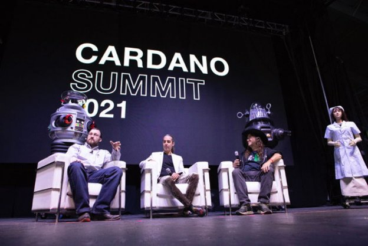

# The critical role of AI / blockchain synergy in humanity’s future
### **A guest blog post by AI and blockchain pioneer, SingularityNET’s Dr. Ben Goertzel**
 30 March 2022[ Dr. Ben Goertzel](tmp//en/blog/authors/ben-goertzel/page-1/) 8 mins read

### [**Dr. Ben Goertzel**](tmp//en/blog/authors/ben-goertzel/page-1/)
CEO and Chief Scientist at SingularityNET

Guest author

- 
- 

The global economy is becoming increasingly complex, with sophisticated AI algorithms now able to marshall more wealth in a day than our great grandparents interacted with in their lifetimes. It is crucial that we prevent control of the emergent planetary AI network from concentrating in a few hands. Transparency and sovereignty must be appropriately architected into its infrastructure. These are the principles behind blockchain architecture. This is an exciting moment in history where the AI blockchain convergence can take place, creating a global technological economy with transparency and sovereignty baked in. AI and blockchain technologies can work together with profound implications across all sectors of human endeavor, and ultimately for the future of humanity and other sentient systems humanity may create. 

Nền kinh tế toàn cầu đang ngày càng trở nên phức tạp, với các thuật toán AI tinh vi giờ đây có thể Marshall giàu có nhiều hơn trong một ngày so với ông bà vĩ đại của chúng ta tương tác trong cuộc đời của họ.
Điều quan trọng là chúng tôi ngăn chặn sự kiểm soát của mạng AI hành tinh mới nổi tập trung trong một vài tay.
Tính minh bạch và chủ quyền phải được kiến trúc một cách thích hợp vào cơ sở hạ tầng của nó.
Đây là những nguyên tắc đằng sau kiến trúc blockchain.
Đây là một khoảnh khắc thú vị trong lịch sử nơi sự hội tụ của Blockchain AI có thể diễn ra, tạo ra một nền kinh tế công nghệ toàn cầu với sự minh bạch và chủ quyền được thực hiện.
của nhân loại và các hệ thống tình cảm khác có thể tạo ra.

The port of the SingularityNET decentralized AI platform from Ethereum to Cardano, currently actively underway, marks one dramatic milestone in AI/blockchain convergence. SingularityNET began on Ethereum in 2017 but was always multi-chain in conception and ambition. With a mid-2021 hard fork the implementation of a version of the SingularityNET AGIX token and associated functionality across multiple blockchains became a possibility. Now this possibility is becoming a reality.

Cảng của nền tảng AI Singularitynet đã phân cấp từ Ethereum đến Cardano, hiện đang tích cực đang tiến hành, đánh dấu một cột mốc kịch tính trong AI/Blockchain Convergence.
Singularitynet bắt đầu trên Ethereum vào năm 2017 nhưng luôn luôn đa chuỗi trong việc thụ thai và tham vọng.
Với một hard hard giữa năm 2021, việc triển khai một phiên bản của mã thông báo SingularityNet Agix và chức năng liên quan trên nhiều blockchain đã trở thành một khả năng.
Bây giờ khả năng này đang trở thành hiện thực.

The AGIX/ADA token converter bridge, now close to completion following a period on testnet, will allow conversion between ETH and ADA versions of the AGIX token. This is the first of several steps that will ultimately result in a Cardano version of the SingularityNET platform with a greater depth and variety of AI functions than were ever possible with the original Ethereum incarnation. After the release of the Converter bridge on mainnet, development effort will focus on porting the SingularityNET marketplace, staking portal and other tools to Cardano. This will result in a platform with greater speed, lower cost and greater usability than has been possible on Ethereum. 

Cây cầu chuyển đổi mã thông báo AGIX/ADA, hiện gần hoàn thành sau một khoảng thời gian trên testnet, sẽ cho phép chuyển đổi giữa các phiên bản ETH và ADA của mã thông báo AGIX.
Đây là bước đầu tiên trong số nhiều bước cuối cùng sẽ dẫn đến phiên bản Cardano của nền tảng SingularityNet với độ sâu và nhiều chức năng AI lớn hơn bao giờ hết với hóa thân Ethereum ban đầu.
Sau khi phát hành Cầu Converter trên Mainnet, nỗ lực phát triển sẽ tập trung vào việc chuyển thị trường SingularityNet, Cổng thông tin và các công cụ khác cho Cardano.
Điều này sẽ dẫn đến một nền tảng với tốc độ lớn hơn, chi phí thấp hơn và khả năng sử dụng lớn hơn so với Ethereum.

## **An ambitious roadmap**

## ** Một lộ trình đầy tham vọng **

Following this initial port, a variety of features leveraging the unique power and sophistication of the Cardano infrastructure will be released.

Theo cổng ban đầu này, một loạt các tính năng tận dụng sức mạnh và sự tinh tế độc đáo của cơ sở hạ tầng Cardano sẽ được phát hành.

The AI-DSL (AI Domain Specific Language), which is under active collaborative development by SingularityNET and IOG since late 2020, will allow AI services on the SingularityNET/Cardano platform to describe their properties and requirements to each other using a standardized formal language. AI-DSL will support the automated assemblage of AI services into meta-services meeting customer needs.

AI-DSL (Ngôn ngữ cụ thể của miền AI), đang được phát triển hợp tác tích cực bởi SingularityNet và IOG từ cuối năm 2020, sẽ cho phép các dịch vụ AI trên nền tảng SingularityNet/Cardano mô tả các thuộc tính và yêu cầu của chúng cho nhau bằng ngôn ngữ chính thức được tiêu chuẩn hóa.
AI-DSL sẽ hỗ trợ tập hợp các dịch vụ AI tự động vào các dịch vụ meta đáp ứng nhu cầu của khách hàng.

Cardano’s use of Haskell & Plutus works elegantly with the more sophisticated type-theoretic mechanisms leveraged in the AI-DSL framework. This sort of language is needed to fulfill the ambition of SingularityNET to be more than just a decentralized marketplace of separate AI services. AI-DSL will allow SingularityNET platform to be a “primordial soup of AI” in which different AI components created by different authors come together in context-appropriate ways to form emergent AI functionalities.

Cardano, sử dụng Haskell & Plutus hoạt động thanh lịch với các cơ chế lý thuyết loại tinh vi hơn được tận dụng trong khung AI-DSL.
Loại ngôn ngữ này là cần thiết để thực hiện tham vọng của SingularityNet không chỉ là một thị trường phi tập trung của các dịch vụ AI riêng biệt.
AI-DSL sẽ cho phép nền tảng SingularityNet trở thành một món súp nguyên thủy của AI, trong đó các thành phần AI khác nhau được tạo bởi các tác giả khác nhau kết hợp với nhau theo những cách phù hợp theo ngữ cảnh để hình thành các chức năng AI mới nổi.

For instance, in the DeFi domain, one AI agent doing altcoin price analytics, one doing news analysis using NLP and one doing abstract symbolic reasoning could come together to form a novel multi-agent approach to altcoin portfolio optimization. This assembly of AI processes could be used in one of [SingularityDAO’](http://singularitydao.io)s DynaSet bundles of Cardano Native Assets – enabling trading of user tokens locked in SingularityDAO smart contracts via algorithms not envisioned by the authors of any of the individual AI agents involved.

Ví dụ, trong miền DEFI, một đại lý AI thực hiện phân tích giá altcoin, một người thực hiện phân tích tin tức bằng NLP và một người thực hiện lý luận tượng trưng trừu tượng có thể kết hợp với nhau để tạo thành một cách tiếp cận đa tác nhân mới để tối ưu hóa danh mục đầu tư altcoin.
Việc tập hợp các quy trình AI này có thể được sử dụng trong một trong [SingularityDao '] (http://singularityda.io) S dynaset gói tài sản bản địa Cardano
Bất kỳ đại lý AI cá nhân liên quan.

The potential of Cardano’s [Hydra](https://iohk.io/en/blog/posts/2022/02/03/implementing-hydra-heads-the-first-step-towards-the-full-hydra-vision/) suite of protocols for facilitating sophisticated SingularityNET AI functionalities will become clearer throughout 2022 and 2023. The Hydra Head protocol provides an elegant and powerful method for implementing the kind of state channels used in SingularityNET’s multi-party Escrow contracts. More advanced aspects of the Hydra protocols can be used more ambitiously. For the custom Cardano sidechain [HyperCycle](http://hypercycle.ai) will provide unprecedentedly scalable infrastructure for multi-agent and population-based AI systems running on SingularityNET.

Tiềm năng của [Hydra] của Cardano (https://iohk.io/en/blog/posts/2022/02/03/Implementing-hydra-heads-the-first-step-towards-the-full-hydra-vision/
) Bộ các giao thức để tạo điều kiện cho các chức năng AI SingularityNet tinh vi sẽ trở nên rõ ràng hơn trong suốt năm 2022 và 2023. Giao thức đầu Hydra cung cấp một phương pháp thanh lịch và mạnh mẽ để thực hiện loại kênh nhà nước được sử dụng trong các hợp đồng ký quỹ đa bên của Singularitynet.
Các khía cạnh nâng cao hơn của các giao thức hydra có thể được sử dụng tham vọng hơn.
Đối với Cardano Sidechain tùy chỉnh [HyperCycle] (http://hypercycle.ai) sẽ cung cấp cơ sở hạ tầng có thể mở rộng chưa từng có cho các hệ thống AI đa tác nhân và dựa trên dân số chạy trên Singularitynet.

## **Blockchain needs AI**

## ** blockchain cần ai **

For the blockchain ecosystem to successfully fulfill its mission of decentralizing and democratizing the world economy, it will need to integrate AI deeply in multiple different ways. The SingularityNET/Cardano collaboration is uniquely well suited to lead the way in this integration.

Đối với hệ sinh thái blockchain để hoàn thành thành công sứ mệnh phân cấp và dân chủ hóa nền kinh tế thế giới, nó sẽ cần phải tích hợp AI sâu sắc theo nhiều cách khác nhau.
Sự hợp tác SingularityNet/Cardano rất phù hợp để dẫn đầu trong tích hợp này.

Current work creating distributed Cardano stakepools using the NuNet decentralized-processing framework, recently spun off from SingularityNET, foreshadows what will be critical in the future for projecting the Cardano network to global scale: Cardano stakepools distributed across diverse processors via NuNet in a manner optimized by neural-symbolic AI that is itself hosted on SingularityNET-on-Cardano and running on NuNet.

Công việc hiện tại tạo ra các bên của Cardano phân tán bằng cách sử dụng khung xử lý phi phân cấp của Nunet, gần đây đã rời khỏi SingularityNet, báo trước những gì sẽ quan trọng trong tương lai để chiếu mạng Cardano theo quy mô toàn cầu: Cardano Stakepools được phân phối trên các bộ xử lý khác nhau thông qua Nunet theo cách tối ưu hóa bằng cách tối ưu hóa bằng cách tối ưu hóa bởi
AI symbolic thần kinh được tổ chức trên Singularitynet-on-cardano và chạy trên nunet.

Hydra will enable the introduction of various forms of sharding into the Cardano network, but agile automated management of this sort of sharding at the large scale will also require advanced AI systems. Custom SingularityNET-oriented Cardano side chains will benefit from these AI-driven sharding solutions, and also provide the needed scalable infrastructure to support the AI underlying these solutions.

Hydra sẽ cho phép giới thiệu các hình thức chuyển hướng khác nhau vào mạng Cardano, nhưng quản lý tự động Agile của loại Sharding này ở quy mô lớn cũng sẽ yêu cầu các hệ thống AI tiên tiến.
Các chuỗi bên Cardano định hướng SingularityNet sẽ được hưởng lợi từ các giải pháp Sharding điều khiển AI này, và cũng cung cấp cơ sở hạ tầng có thể mở rộng cần thiết để hỗ trợ AI làm cơ sở cho các giải pháp này.

Until AGI ascends beyond the human level, every decentralized network on the planet will require some sort of reputation system at its core, so that the humans involved in the network (and their software and hardware proxies) can make appropriate judgments regarding what level of trust to place in the code, transactions and devices in the network. Reputation management beyond a certain scale and complexity also requires sophisticated AI. I anticipate that SingularityNET based “proof of reputation” techniques will find their way into various networks implemented on top of the Cardano platform and perhaps ultimately into the core Cardano software itself.

Cho đến khi AGI tăng vượt quá cấp độ con người, mọi mạng lưới phi tập trung trên hành tinh sẽ yêu cầu một số hệ thống danh tiếng ở cốt lõi của nó, để con người tham gia vào mạng (và các proxy phần mềm và phần cứng của họ)
để đặt trong mã, giao dịch và thiết bị trong mạng.
Quản lý danh tiếng vượt quá một quy mô và độ phức tạp nhất định cũng đòi hỏi AI tinh vi.
Tôi dự đoán rằng các kỹ thuật bằng chứng về danh tiếng của SingularityNet sẽ tìm đường vào các mạng khác nhau được triển khai trên nền tảng Cardano và có lẽ cuối cùng vào phần mềm Cardano cốt lõi.

Decentralized social networks, which will be critical to the next stages of humanity’s evolution culturally and politically and in so many other ways, are clearly among the networks that will rely critically on AI-driven reputation systems. Human analysts, simplistic statistical learning systems and corporate and government regulators have proven terrifyingly incapable of intelligently and ethically guiding and modulating the collective interactions of human beings in modern online social networks. AI is clearly the answer – but whose AI? The answer needs to be, everybody’s AI. 

Các mạng xã hội phi tập trung, điều này sẽ rất quan trọng đối với các giai đoạn tiếp theo của sự tiến hóa của loài người về mặt văn hóa và chính trị và theo nhiều cách khác, rõ ràng là một trong những mạng lưới sẽ phụ thuộc vào các hệ thống danh tiếng điều khiển AI.
Các nhà phân tích con người, hệ thống học tập thống kê đơn giản và các nhà quản lý công ty và chính phủ đã chứng minh không có khả năng hướng dẫn thông minh và đạo đức và điều chỉnh các tương tác tập thể của con người trong các mạng xã hội trực tuyến hiện đại.
AI rõ ràng là câu trả lời - nhưng ai của ai?
Câu trả lời cần phải là, mọi người AI AI.

Blockchain has clear potential to enable this. But this needs decentralized AI running on decentralized networks regulated by decentralized reputation systems. We have all these ingredients in the SingularityNET/Cardano ecosystem right now, but making them work at scale in a manner usable by the masses will be an interesting challenge over the next few years.

Blockchain có tiềm năng rõ ràng để cho phép điều này.
Nhưng điều này cần AI phi tập trung chạy trên các mạng phi tập trung được điều chỉnh bởi các hệ thống danh tiếng phi tập trung.
Chúng tôi có tất cả các thành phần này trong hệ sinh thái SingularityNet/Cardano ngay bây giờ, nhưng làm cho chúng hoạt động ở quy mô theo cách mà quần chúng có thể sử dụng sẽ là một thách thức thú vị trong vài năm tới.

## **AI needs blockchain**

## ** AI cần blockchain **

AI does not need blockchain in order to dominate the world economy – at the moment it is moving rapidly toward a dominant role across all vertical industries, in a manner driven largely by large centralized tech companies and governments. However, if we want this near-inevitable AI economic domination to result in broad human benefit rather than primarily serving a small sector of society, it will be critical that the architecture of the emerging global AI system is decentralized and democratic in nature. The only concrete practical path to this at the moment is blockchain technology.

AI không cần blockchain để thống trị nền kinh tế thế giới - tại thời điểm này, nó đang chuyển động nhanh chóng hướng tới vai trò thống trị trong tất cả các ngành công nghiệp dọc, theo cách thức chủ yếu bởi các công ty và chính phủ công nghệ tập trung lớn.
Tuy nhiên, nếu chúng ta muốn sự thống trị kinh tế của AI gần như không thể xác định này dẫn đến lợi ích rộng lớn của con người thay vì chủ yếu phục vụ một lĩnh vực nhỏ của xã hội, điều quan trọng là kiến trúc của hệ thống AI toàn cầu mới nổi là phi tập trung và dân chủ trong tự nhiên.
Con đường thực tế cụ thể duy nhất cho điều này tại thời điểm này là công nghệ blockchain.

Every aspect of the AI ecosystem needs to be fundamentally and thoroughly blockchain-ized, and all the blockchain networks involved need to be made massively scalable, easily usable and richly and smoothly interoperable. The good news is we have early working versions of pretty much every key aspect needed for this already. Decentralized data stores with Ocean and (for medical data) Rejuve and many others; decentralized processing power with NuNet and Golem and CPUCoin and so forth; decentralized multi-agent AI processing with SingularityNET plus alternatives like Fetch and Matrix; a decentralized knowledge graph beginning with Epik; decentralized Web infrastructure with Elastos and DFinity etc., and much more. Homomorphic encryption and multiparty computing for various AI algorithms, enabling secure and data-sovereignty-respecting AI to occur at global scale, are described in numerous research papers – but commercial-grade implementations are very limited.

Mọi khía cạnh của hệ sinh thái AI cần phải được blockchain cơ bản và hoàn toàn, và tất cả các mạng blockchain liên quan cần phải được mở rộng mở rộng, dễ dàng sử dụng và có thể tương tác một cách mượt mà.
Tin tốt là chúng tôi có các phiên bản làm việc sớm của hầu hết mọi khía cạnh quan trọng cần thiết cho việc này.
Các cửa hàng dữ liệu phi tập trung với Ocean và (đối với dữ liệu y tế) Rejuve và nhiều người khác;
sức mạnh xử lý phi tập trung với nunet và golem và cpucoin, vv;
Xử lý AI đa tác nhân phi tập trung với SingularityNet cộng với các lựa chọn thay thế như tìm nạp và ma trận;
Một biểu đồ kiến thức phi tập trung bắt đầu với Epik;
Cơ sở hạ tầng web phi tập trung với elastos và dfinity, v.v., và nhiều hơn nữa.
Mã hóa đồng hình và điện toán đa nhóm cho các thuật toán AI khác nhau, cho phép AI tôn trọng chủ quyền và an toàn và dữ liệu xảy ra ở quy mô toàn cầu, được mô tả trong nhiều tài liệu nghiên cứu-nhưng việc triển khai cấp thương mại rất hạn chế.

But frankly, none of these decentralized tools and frameworks – including my own projects – yet works as scalably and smoothly as corresponding centralized products launched by big tech companies. This is hardly a condemnation of blockchain technologies, given that our centralized competitors include multiple trillion dollar companies with histories going back far before smart contracts were a thing. But it’s important to understand that to truly blockchain-ize the ongoing AI revolution, we in the decentralized space are going to need to travel quite a long distance in quite a short time. To do this we will need incredible-quality teams working on extremely well designed and solid technologies, and this is why I am so excited about the partnership between SingularityNET and Cardano/IOHK.

Nhưng thành thật mà nói, không có công cụ và khuôn khổ phi tập trung nào - bao gồm cả các dự án của riêng tôi - nhưng vẫn hoạt động một cách mở rộng và trơn tru như các sản phẩm tập trung tương ứng được đưa ra bởi các công ty công nghệ lớn.
Đây không phải là một sự lên án của các công nghệ blockchain, cho rằng các đối thủ tập trung của chúng tôi bao gồm nhiều công ty hàng nghìn tỷ đô la với lịch sử trở lại trước khi hợp đồng thông minh là một điều.
Nhưng điều quan trọng là phải hiểu rằng để thực sự blockchain-cuộc cách mạng AI đang diễn ra, chúng ta trong không gian phi tập trung sẽ cần phải đi khá xa trong một thời gian khá ngắn.
Để làm điều này, chúng tôi sẽ cần các nhóm chất lượng đáng kinh ngạc làm việc trên các công nghệ được thiết kế và vững chắc cực kỳ tốt, và đây là lý do tại sao tôi rất hào hứng với sự hợp tác giữa Singularitynet và Cardano/IOHK.

## **Humanity needs AI/blockchain synergy**

## ** Nhân loại cần AI/Blockchain Synergy **

Our world today in 2022 is already best described as a sort of Global Brain Network, with the emergent intelligence of combined human / computer communication networks vastly exceeding what any individual human mind can comprehend. The intelligence, complexity and synergetic quality of this global brain is only going to increase year on year as the coordinated advance of multiple technologies leads us forward toward Technological Singularity. Slowing down progress while we figure out how best to guide it toward ethical ends seems not a practical option – there is too much upside for various powerful parties in accelerating progress in ways tailored to serve their own ends. The only realistic option for those of us concerned with humanity’s general welfare is to make sure that decentralized, democratic, beneficial development of advanced technology goes faster than centralized, tribalistic, oppressive or otherwise regressive-minded alternatives. The close integration of blockchain and AI is a key part of this, and the collaboration of SingularityNET and Cardano is currently at the forefront of this integration. The impending launch of the [AGIX token Converter bridge](https://www.youtube.com/watch?v=nEOsn7bSp0A) is a small but critical part of this tremendously important overall picture!

Thế giới của chúng ta ngày nay vào năm 2022 đã được mô tả tốt nhất là một loại mạng não toàn cầu, với trí thông minh mới nổi của các mạng truyền thông con người / máy tính kết hợp vượt quá những gì mà bất kỳ tâm trí cá nhân nào có thể hiểu được. Trí thông minh, sự phức tạp và chất lượng tổng hợp của bộ não toàn cầu này sẽ chỉ tăng lên hàng năm khi sự tiến bộ của nhiều công nghệ dẫn đến việc chúng ta tiến tới sự kỳ dị về công nghệ. Làm chậm tiến độ trong khi chúng tôi tìm ra cách tốt nhất để hướng dẫn nó hướng tới mục đích đạo đức dường như không phải là một lựa chọn thực tế - có quá nhiều sự lộn ngược cho các bên mạnh mẽ khác nhau trong việc tăng tốc tiến trình theo cách phù hợp để phục vụ mục đích của chính họ. Lựa chọn thực tế duy nhất cho những người trong chúng ta quan tâm đến phúc lợi chung của loài người là đảm bảo rằng sự phát triển phi tập trung, dân chủ, có lợi của công nghệ tiên tiến sẽ nhanh hơn so với các lựa chọn thay thế tập trung, bộ lạc, áp bức hoặc suy thoái. Sự tích hợp chặt chẽ của blockchain và AI là một phần quan trọng của điều này, và sự hợp tác của Singularitynet và Cardano hiện đang đi đầu trong tích hợp này. Sự ra mắt sắp xảy ra của [Cầu chuyển đổi mã thông báo Agix] (https://www.youtube.com/watch?v=NOSN7BSP0A) là một phần nhỏ nhưng quan trọng của bức tranh tổng thể cực kỳ quan trọng này!

*The AGIX ERC20 converter bridge is scheduled to [go live](https://twitter.com/singularity_net/status/1507760834012930049?s=21&t=xyz7o1UlDSjv78ISignbVw) on mainnet on 18th April. Catch an interview with Ben Goertzel on [March’s Cardano360 show](https://twitter.com/InputOutputHK/status/1508832692686757896).*

*Cầu chuyển đổi AGIX ERC20 được lên kế hoạch cho [RIGHT] (https://twitter.com/singularity_net/status/1507760834012930049?s=21&t=XYZ7O1
Bắt một cuộc phỏng vấn với Ben Goertzel trên [Chương trình tháng ba Card Cardano360] (https://twitter.com/inputoutputhk/status/1508832692686757896).*

