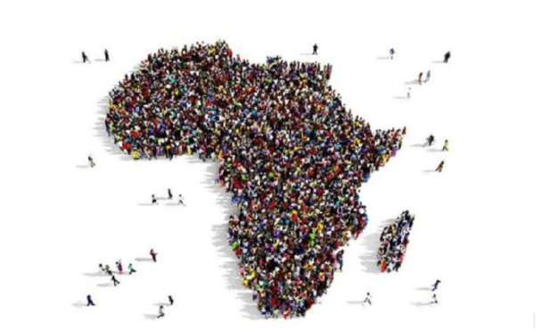
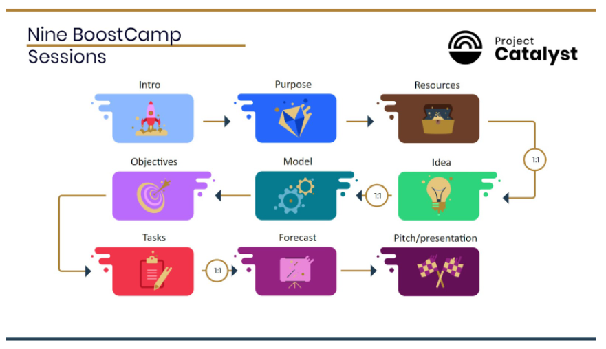

# Project Catalyst launches incubator for Africa
### **Ariob will help drive innovation and tackle everyday challenges across the continent**
 5 April 2022[ Tim Richmond](tmp//en/blog/authors/tim-richmond/page-1/) 6 mins read

### [**Tim Richmond**](tmp//en/blog/authors/tim-richmond/page-1/)
Marketing and Communications Manager

Marketing & Communications

- 
- 

Input Output Global’s Project Catalyst has launched [Ariob](http://ariob.io), an incubator scheme, in collaboration with [iceaddis](https://summit.cardano.org/sessions/building-community-in-africa), a pan-African business incubator, and accelerator. Ariob means ‘a collection of stars’ in Ge’ez, an ancient Semitic language of Ethiopia.

Đầu vào đầu ra của Project Patalyst đã ra mắt [Ariob] (http://ariob.io), một chương trình ươm tạo, hợp tác với [iCeaddis] (https://summit.cardano.org/sessions/building-Community
In-Phi), một vườn ươm doanh nghiệp Pan-Phi và máy gia tốc.
Ariob có nghĩa là - một bộ sưu tập các ngôi sao trong geâ € ™ ez, một ngôn ngữ Semitic cổ đại của Ethiopia.

This strategic partnership is designed to enhance the growth of projects funded by [Project Catalyst](https://developers.cardano.org/docs/governance/project-catalyst/), Cardano’s innovation engine, and offers high potential Catalyst start-ups access to venture-building expertise and resources to help develop products that solve real-life challenges in Africa.

Quan hệ đối tác chiến lược này được thiết kế để tăng cường sự phát triển của các dự án được tài trợ bởi [Project Catalyst] (https://developers.cardano.org/docs/governance/project-catalyst/)
Khởi nghiệp tiếp cận với chuyên môn và nguồn lực xây dựng liên doanh để giúp phát triển các sản phẩm giải quyết các thách thức thực tế ở Châu Phi.

### **Why Africa?**

### ** Tại sao châu Phi? **

Africa is home to 1.3 billion people. It is a fascinating and diverse continent that is seeing a huge acceleration in adopting new technologies such as blockchain. Given that there are no allegiances to legacy systems, it is far easier for technological advances to take hold. Projects for financial services, national identity frameworks, and developments in academia have great potential to transform both industry and society. This evolution offers fertile ground for entrepreneurship and innovation to leapfrog over approaches stuck in the past. Therefore, a focus on delivering cutting-edge programs in Africa can accelerate the growth of the Cardano ecosystem.

Châu Phi là nơi sinh sống của 1,3 tỷ người.
Đó là một lục địa hấp dẫn và đa dạng đang chứng kiến sự tăng tốc lớn trong việc áp dụng các công nghệ mới như blockchain.
Cho rằng không có sự trung thành với các hệ thống kế thừa, việc tiến bộ công nghệ sẽ dễ dàng hơn nhiều.
Các dự án cho các dịch vụ tài chính, khung nhận dạng quốc gia và sự phát triển trong học viện có tiềm năng lớn để biến đổi cả ngành công nghiệp và xã hội.
Sự phát triển này cung cấp mảnh đất màu mỡ cho tinh thần kinh doanh và đổi mới để nhảy vọt về các phương pháp tiếp cận bị mắc kẹt trong quá khứ.
Do đó, tập trung vào việc cung cấp các chương trình tiên tiến ở châu Phi có thể đẩy nhanh sự phát triển của hệ sinh thái Cardano.

Last year, Input Output Global (IOG) announced its partnership with the [Ethiopian Ministry of Education](https://iohk.io/en/blog/posts/2021/04/27/blockchain-finally-comes-of-age-with-worlds-biggest-blockchain-deployment/) to provide five million Ethiopian students with a way to verify their academic credentials using [Atala PRISM](https://atalaprism.io) technology, built on Cardano. IOG is also working with [World Mobile in Zanzibar](https://youtu.be/WSSpI8Rtif0) to connect the unconnected and enable access to essential online services through blockchain technology.

Năm ngoái, đầu vào đầu ra Global (IOG) đã công bố quan hệ đối tác với [Bộ Giáo dục Ethiopia] (https://iohk.io/en/blog/posts/2021/04/27/blockchain-finally-comes-of-g
-With-worlds-biggest-blockchain-domployment/) để cung cấp cho năm triệu sinh viên Ethiopia một cách để xác minh thông tin học tập của họ bằng cách sử dụng [Atala Prism] (https://atalaprism.io), được xây dựng trên Cardano.
IOG cũng đang làm việc với [World Mobile ở Zanzibar] (https://youtu.be/wsspi8rtif0) để kết nối không kết nối và cho phép truy cập vào các dịch vụ trực tuyến cần thiết thông qua công nghệ blockchain.

### **Project Catalyst, mentorship, and incubation**

### ** Catalyst, cố vấn và ủ dự án **

[Project Catalyst](https://iohk.io/en/blog/posts/2021/02/12/our-million-dollar-baby-project-catalyst) is now one of the largest decentralized innovation funds. It is a focal point for ecosystem development and innovation, driven by the Cardano community. With each funding round, the community presents challenges across a range of subjects related to Cardano. These challenges are then answered by the community who present project proposals defining solutions and clear plans. The community then votes on the proposals presented and selects projects to receive funding. 

[Project Catalyst] (https://iohk.io/en/blog/posts/2021/02/12/our-million-dollar-baby-project-catalyst) hiện là một trong những quỹ đổi mới phi tập trung lớn nhất.
Đó là một tâm điểm cho sự phát triển và đổi mới hệ sinh thái, được thúc đẩy bởi cộng đồng Cardano.
Với mỗi vòng tài trợ, cộng đồng đưa ra những thách thức trên một loạt các đối tượng liên quan đến Cardano.
Những thách thức này sau đó được trả lời bởi cộng đồng, những người trình bày các đề xuất dự án xác định các giải pháp và kế hoạch rõ ràng.
Cộng đồng sau đó bỏ phiếu về các đề xuất được trình bày và chọn các dự án để nhận tài trợ.

Catalyst enables people to realize great ideas and implement them, but funding is only part of the journey towards success. Other factors, such as education, mentorship, collaborations, and product roadmap development are also needed to nurture projects and help them formalize a business plan and effective go-to-market strategy.

Catalyst cho phép mọi người nhận ra những ý tưởng tuyệt vời và thực hiện chúng, nhưng tài trợ chỉ là một phần của hành trình hướng tới thành công.
Các yếu tố khác, chẳng hạn như giáo dục, cố vấn, hợp tác và phát triển lộ trình sản phẩm cũng là cần thiết để nuôi dưỡng các dự án và giúp họ chính thức hóa một kế hoạch kinh doanh và chiến lược tiếp theo hiệu quả.

The first entrepreneurship program, to achieve Catalyst funding entitled ‘[BoostCamps](https://www.youtube.com/watch?v=x8134D_Ip9o&t=418s)’, used the [Entreprenerdy](https://entreprenerdy.com) platform where participating projects could take part in sessions designed to develop their business strategy. Fund7 is the latest round, with an Accelerator & Mentor Challenge. Twelve projects will be funded to create programs and tools to support businesses being built on Cardano.

Chương trình khởi nghiệp đầu tiên, để đạt được tài trợ chất xúc tác mang tên â € ˜ [boostcamp] (https://www.youtube.com
.com) Nền tảng nơi các dự án tham gia có thể tham gia vào các phiên được thiết kế để phát triển chiến lược kinh doanh của họ.
Fund7 là vòng mới nhất, với Thử thách tăng tốc & Mentor.
Mười hai dự án sẽ được tài trợ để tạo ra các chương trình và công cụ để hỗ trợ các doanh nghiệp được xây dựng trên Cardano.

BoostCamps has so far taken on five cohorts, one of which focuses on projects whose goals include creating positive change in Africa. This activity inspired this newest innovation, the Ariob incubator, where a select number of projects will be chosen to join a support program running through the first half of 2022. This program offers services aimed at realizing creative potential, testing ideas, and using prototypes to find the best product. Ariob will also help connect projects with educational institutes, government organizations, NGOs, and local companies.

Boostcamp cho đến nay đã thực hiện năm đoàn hệ, một trong số đó tập trung vào các dự án có mục tiêu bao gồm tạo ra sự thay đổi tích cực ở Châu Phi.
Hoạt động này đã truyền cảm hứng cho sự đổi mới mới nhất này, Vườn ươm Ariob, trong đó một số dự án được chọn sẽ được chọn để tham gia một chương trình hỗ trợ chạy trong nửa đầu năm 2022. Chương trình này cung cấp các dịch vụ nhằm thực hiện tiềm năng sáng tạo, thử nghiệm ý tưởng và sử dụng các nguyên mẫu
Tìm sản phẩm tốt nhất.
Ariob cũng sẽ giúp kết nối các dự án với các viện giáo dục, tổ chức chính phủ, tổ chức phi chính phủ và các công ty địa phương.

Markos Lemma, [iceaddis](https://www.iceaddis.com/) Co-founder, and Chief Executive said: ‘Cardano is a platform that’s creating solutions to real-life challenges in Africa and one of our most valuable relationships is with the Cardano ecosystem. Together, we want to demonstrate that the next big ideas are emerging from African countries, and we are ready to invest our resources to make that happen. 

Markos Lemma, [Iceaddis] (https://www.iceaddis.com/) đồng sáng lập, và giám đốc điều hành cho biết: "
Mối quan hệ có giá trị nhất của chúng tôi là với hệ sinh thái Cardano.
Cùng nhau, chúng tôi muốn chứng minh rằng những ý tưởng lớn tiếp theo đang nổi lên từ các nước châu Phi và chúng tôi sẵn sàng đầu tư nguồn lực của mình để thực hiện điều đó.

‘As one of the leading pan-Africa incubators and accelerators, we are eager to drive the development of high-potential Catalyst start-ups through the Ariob incubator.’

"Là một trong những máy gia tốc và máy gia tốc hàng đầu của Pan-Phi, chúng tôi rất muốn thúc đẩy sự phát triển của các công ty khởi nghiệp chất xúc tác tiềm năng cao thông qua ươm tạo Ariob.â € ™

### **Projects joining the Ariob incubator**

### ** Các dự án tham gia ươm tạo Ariob **

**DirectEd** is developing a solution to facilitate scholarships for students in low-income countries, using the transparency, peer-to-peer, and smart contract capabilities of blockchain technology to reduce costs and eliminate corruption. Many talented students lack the financial means to realize their potential, but philanthropists may hesitate to donate for two reasons. First, they cannot ensure that the money goes directly to the student, and second, attaching conditions to donations to ensure that funds are used for their intended purpose is costly. DirectEd solves these problems by providing a transparent, secure, and low-cost way of making conditional peer-to-peer donations directly to students.

** Đạo luật ** đang phát triển một giải pháp để tạo điều kiện cho học bổng cho sinh viên ở các nước thu nhập thấp, sử dụng khả năng hợp đồng minh bạch, ngang hàng và hợp đồng thông minh của công nghệ blockchain để giảm chi phí và loại bỏ tham nhũng.
Nhiều sinh viên tài năng thiếu phương tiện tài chính để nhận ra tiềm năng của họ, nhưng các nhà từ thiện có thể ngần ngại quyên góp vì hai lý do.
Đầu tiên, họ không thể đảm bảo rằng tiền chuyển trực tiếp cho học sinh và thứ hai, việc gắn các điều kiện vào quyên góp để đảm bảo rằng tiền được sử dụng cho mục đích dự định của họ là tốn kém.
Chỉ đạo giải quyết những vấn đề này bằng cách cung cấp một cách quyên góp trong suốt, an toàn và chi phí thấp trực tiếp cho các sinh viên.

**CheCha**: a digital USD voucher system to solve the small change crisis in Zimbabwe. CheCha acts as a trusted third party between customers and vendors to facilitate micro-loans. Vendors can join into partner networks, allowing loan redemption within their closed-loop system, and with the introduction of ada wallets, user-to-user transfers are now possible. In addition, the platform will also become the first commonly recognized liquidity market between fiat and crypto in the country.

** Checha **: Một hệ thống chứng từ USD kỹ thuật số để giải quyết cuộc khủng hoảng thay đổi nhỏ ở Zimbabwe.
Checha hoạt động như một bên thứ ba đáng tin cậy giữa khách hàng và nhà cung cấp để tạo điều kiện cho những chiếc xe tải vi mô.
Các nhà cung cấp có thể tham gia vào các mạng đối tác, cho phép mua lại khoản vay trong hệ thống vòng kín của họ và với việc giới thiệu ví ADA, việc chuyển tiền của người dùng sang người dùng hiện có thể.
Ngoài ra, nền tảng cũng sẽ trở thành thị trường thanh khoản thường được công nhận đầu tiên giữa Fiat và Crypto trong cả nước.

**CanuckCrypto Ekival**: a blockchain-based escrow service that allows users to apply the Hawala system (A system for transferring money, whereby the money is paid to an agent who then instructs a remote associate to pay the final recipient.) to their money transfers. Ekival displays location-based accumulations of value (liquidity pools in the money transfer case) that users based in other locations can commit to acquiring on behalf of beneficiaries.

** Canuckcrypto ekival **: Dịch vụ ký quỹ dựa trên blockchain cho phép người dùng áp dụng hệ thống Hawala (một hệ thống chuyển tiền, theo đó tiền được trả cho một đại lý sau đó hướng dẫn một liên kết từ xa để trả cho người nhận cuối cùng.)
tiền của họ chuyển tiền.
EKIVAL hiển thị tích lũy giá trị dựa trên vị trí (nhóm thanh khoản trong trường hợp chuyển tiền) mà người dùng có trụ sở tại các địa điểm khác có thể cam kết có được thay mặt cho người thụ hưởng.

**Thrift Finance**: a decentralized and trustless thrift savings system governed, maintained, and upgraded by THRIFT token holders. Thrift aims to create a more accessible and efficient financial system for Africa through smart contracts.

** Tài chính tiết kiệm **: Một hệ thống tiết kiệm tiết kiệm phi tập trung và không đáng tin cậy được điều chỉnh, duy trì và nâng cấp bởi các chủ sở hữu mã thông báo tiết kiệm.
Thrift nhằm mục đích tạo ra một hệ thống tài chính dễ tiếp cận và hiệu quả hơn cho châu Phi thông qua các hợp đồng thông minh.

**DeliveryChain** wants to disrupt the centralized postal industry through a peer-to-peer solution built on blockchain. The aim is to enable cheaper, faster, and more reliable parcel delivery across Africa.

** Deliverychain ** muốn phá vỡ ngành công nghiệp bưu chính tập trung thông qua một giải pháp ngang hàng được xây dựng trên blockchain.
Mục đích là để cho phép giao hàng bưu kiện rẻ hơn, nhanh hơn và đáng tin cậy hơn trên khắp châu Phi.

**Hippocrades**: A decentralized healthcare information exchange that uses blockchain to allow information to be passed between healthcare systems without compromising security and privacy. Hippocrades also provides healthcare modules and APIs for developers to build decentralized health applications ready for Web3.

** Hippocrade **: Trao đổi thông tin chăm sóc sức khỏe phi tập trung sử dụng blockchain để cho phép thông tin được thông qua giữa các hệ thống chăm sóc sức khỏe mà không ảnh hưởng đến bảo mật và quyền riêng tư.
Hippocrades cũng cung cấp các mô -đun chăm sóc sức khỏe và API cho các nhà phát triển để xây dựng các ứng dụng sức khỏe phi tập trung sẵn sàng cho Web3.

**WADA**: Building a Web3 microlending solution that empower Africans on the continent and in the diaspora. WADA’s vision is for a more inclusive economy and society, enabled through blockchain technology. 

** WADA **: Xây dựng một giải pháp vi mô web3 trao quyền cho người châu Phi trên lục địa và trong cộng đồng người di cư.
Tầm nhìn của Wada dành cho một nền kinh tế và xã hội toàn diện hơn, được kích hoạt thông qua công nghệ blockchain.

**African Blockchain Center for Developers (ABCD)**: A talent ecosystem that seeks to mentor Africans and provide opportunities to build revolutionary projects. ABCD’s activities are geared towards closing the developer skill gap by providing learning opportunities and acting as a bridge between skilled people and potential clients. 

** Trung tâm Blockchain dành cho các nhà phát triển (ABCD) **: Một hệ sinh thái tài năng tìm cách cố vấn cho người châu Phi và cung cấp cơ hội để xây dựng các dự án cách mạng.
Các hoạt động của ABCD đang hướng đến việc thu hẹp khoảng cách kỹ năng của nhà phát triển bằng cách cung cấp các cơ hội học tập và đóng vai trò là cầu nối giữa những người có kỹ năng và khách hàng tiềm năng.

**Waya Collective** is building a decentralized enterprise network to find a new equilibrium in global manufacturing. The current practice of centralized production, combined with long and complex supply chains, is ever-more for everyone involved. The Waya Collective intends to provide Africa-focused producers access to loans, know-how, and a network of reliable partners in a decentralized way. 

** Waya Collective ** đang xây dựng một mạng lưới doanh nghiệp phi tập trung để tìm một trạng thái cân bằng mới trong sản xuất toàn cầu.
Thực tiễn hiện tại của sản xuất tập trung, kết hợp với chuỗi cung ứng dài và phức tạp, ngày càng nhiều cho tất cả mọi người tham gia.
Waya Collective dự định sẽ cung cấp cho các nhà sản xuất tập trung vào châu Phi quyền truy cập vào các khoản vay, bí quyết và một mạng lưới các đối tác đáng tin cậy theo cách phi tập trung.

#### **Find out more**

#### **Tìm hiểu thêm**

We’ll be following the progress of these projects as they advance through the process, so watch out for more news.

Chúng tôi sẽ theo dõi tiến trình của các dự án này khi chúng tiến lên trong suốt quá trình, vì vậy hãy chú ý để biết thêm tin tức.

The Ariob incubator is open to all Africa-focused projects, so if you’re developing an idea, [the team would love to hear from you](https://ioincubator.com).

Vườn ươm Ariob mở cửa cho tất cả các dự án tập trung vào châu Phi, vì vậy nếu bạn phát triển một ý tưởng, [nhóm rất thích nghe từ bạn] (https://ioincubator.com).

If you’d like to get involved by proposing a challenge, learning more about [Project Catalyst](https://iohk.io/en/blog/posts/2021/02/12/our-million-dollar-baby-project-catalyst), or would like to answer challenges posted by others, please subscribe to the [Catalyst mailing list](https://bit.ly/3dSZJvx) and join the [Catalyst Telegram community](https://t.me/cardanocatalyst).

Nếu bạn muốn tham gia bằng cách đề xuất một thách thức, hãy tìm hiểu thêm về [Project Catalyst] (https://iohk.io/en/blog/posts/2021/02/12/Our
Project-xúc tác), hoặc muốn trả lời các thách thức được đăng bởi những người khác, vui lòng đăng ký vào [Danh sách gửi thư Catalyst] (https://bit.ly/3dszjvx) và tham gia [cộng đồng Telegram Catalyst] (https: // t.
tôi/cardanocatalyst).

