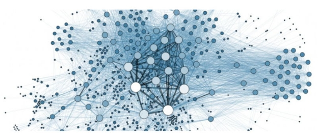

# Introducing the Concept of Delegate Representatives (dReps)
### **dReps will vote on the vast majority of proposals within Project Catalyst and enhance the quality of decision making within each Fund**
 11 April 2022[ Jack Briggs](tmp//en/blog/authors/jack-briggs/page-1/) 2 mins read

### [**Jack Briggs**](tmp//en/blog/authors/jack-briggs/page-1/)
Product Marketing Lead

Product

- 
- 

At a recent [Project Catalyst Town Hall](https://www.youtube.com/watch?v=rNZJvzjgduM), IOG announced the concept of delegating your voting power, the role of Delegate Representatives (dReps) and invited those keen to get involved to express an interest. There has been a fantastic response and we’re now excited to share more details. 

Tại một [Tòa thị chính của Project Catalyst Town] (https://www.youtube.com/watch?v=rnZJVZJGDUM), IOG đã công bố khái niệm ủy thác quyền bầu cử của bạn, vai trò của đại diện đại biểu (Dreps) và mời những người quan tâm đến
Tham gia để bày tỏ sự quan tâm.
Đã có một phản hồi tuyệt vời và bây giờ chúng tôi rất vui mừng được chia sẻ thêm chi tiết.

In less than a year, [Project Catalyst](https://iohk.io/en/blog/posts/2021/02/12/our-million-dollar-baby-project-catalyst) has become the world’s largest decentralized innovation fund. It is a focal point for ongoing development and sustainable innovation, driven by the Cardano community. Fund8 had nearly 1,000 proposals put forward, and Catalyst is now on track to fund over 2,100 proposals during 2022. That is staggering!

Trong vòng chưa đầy một năm, [Project Catalyst] (https://iohk.io/en/blog/posts/2021/02/12/our-million-dollar-baby-project-catalyst) đã trở thành thế giới
Quỹ đổi mới phi tập trung lớn nhất.
Đó là một đầu mối cho sự phát triển liên tục và đổi mới bền vững, được thúc đẩy bởi cộng đồng Cardano.
Fund8 đã có gần 1.000 đề xuất được đưa ra và Catalyst hiện đang trên đường để tài trợ cho hơn 2.100 đề xuất trong năm 2022. Điều đó thật đáng kinh ngạc!

This continued expansion of the Cardano ecosystem signals fantastic news for the Cardano community as a whole. However, exponential growth poses a challenge though. As the number of proposals increases, so does the community’s responsibility to both review and vote upon them. To ensure that all proposals gain the attention they deserve, and to facilitate continued growth, a new system is required to ensure sustainability.

Việc tiếp tục mở rộng hệ sinh thái Cardano báo hiệu tin tức tuyệt vời cho cộng đồng Cardano nói chung.
Tuy nhiên, tăng trưởng theo cấp số nhân đặt ra một thách thức mặc dù.
Khi số lượng đề xuất tăng lên, trách nhiệm của cộng đồng đối với cả việc xem xét và bỏ phiếu cho họ.
Để đảm bảo rằng tất cả các đề xuất có được sự chú ý mà họ xứng đáng, và để tạo điều kiện cho sự phát triển liên tục, một hệ thống mới được yêu cầu để đảm bảo tính bền vững.

Delegation enables ada holders to delegate their voting power to one or many dReps. This allows the more passive voter a chance to continue to have their voice heard, but now across more proposals than they could personally read and evaluate.

Phái đoàn cho phép chủ sở hữu ADA ủy quyền quyền bầu cử của họ cho một hoặc nhiều người bị bỏ rơi.
Điều này cho phép cử tri thụ động hơn một cơ hội để tiếp tục nghe thấy tiếng nói của họ, nhưng bây giờ qua nhiều đề xuất hơn họ có thể đọc và đánh giá cá nhân.

These dReps will vote on the vast majority of proposals within Project Catalyst, and in turn will enhance the quality of decision making within each Fund. dReps will coordinate and form policies together, source and review data, consult with experts, and ultimately vote on an array of projects and topics that the community has brought forward.

Những điều này sẽ bỏ phiếu cho phần lớn các đề xuất trong Chất xúc tác dự án, và đến lượt nó sẽ nâng cao chất lượng ra quyết định trong mỗi quỹ.
DREP sẽ phối hợp và hình thành các chính sách cùng nhau, nguồn và xem xét dữ liệu, tham khảo ý kiến với các chuyên gia và cuối cùng bỏ phiếu cho một loạt các dự án và chủ đề mà cộng đồng đã đưa ra.

The introduction of dReps is another exciting step forward as the community continues to learn and grow. There will be more to share and discuss over the weeks and months ahead as we roll out delegation into future Project Catalyst funds. To bolster inclusion and diversity, **IOG is reopening interest** in [joining the first dRep cohort](https://bit.ly/3rSyHvP).

Sự ra đời của Dreps là một bước tiến thú vị khác khi cộng đồng tiếp tục học hỏi và phát triển.
Sẽ có nhiều hơn để chia sẻ và thảo luận trong các tuần và tháng tới khi chúng tôi triển khai phái đoàn thành các quỹ của Project Catalyst trong tương lai.
Để củng cố sự bao gồm và đa dạng, ** IOG đang mở lại sự quan tâm ** trong [tham gia đoàn hệ DREP đầu tiên] (https://bit.ly/3rsyhvp).

Over the coming weeks, IOG will be organizing a series of workshops that go into greater detail on what it means to be a dRep, the incentive model, and what impact dReps will have on Project Catalyst.

Trong những tuần tới, IOG sẽ tổ chức một loạt các hội thảo đi sâu vào chi tiết hơn về ý nghĩa của việc trở thành một mô hình khuyến khích, mô hình khuyến khích và tác động của Dreps sẽ có đối với Project Catalyst.

