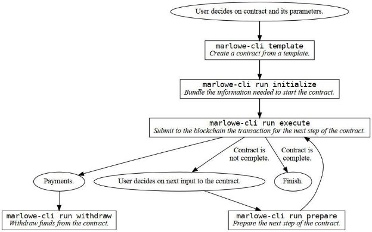

# Introducing the new command line interface tool for Marlowe
### **Learn how to submit transactions and interact with Marlowe contracts from the CLI**
 19 April 2022[ Niamh Ahern](tmp//en/blog/authors/niamh-ahern/page-1/) 5 mins read

### [**Niamh Ahern**](tmp//en/blog/authors/niamh-ahern/page-1/)
Education Manager

Education

- 
- 
- 
- 

Marlowe is an open source, domain specific language (DSL) with a suite of products for the community that will catalyze the adoption of Cardano in finance. It is constantly being enhanced and updated, and a command line interface (CLI) is just something you can't do without. So, we created a more convenient way to interact with Marlowe using the new CLI tool. This new tool supports a straightforward workflow for users who want to run contracts from the command line. It lets you focus on the Marlowe contract itself, while the tool manages details of the input and state for the contract. Additionally, it automates many aspects of Plutus as well as interaction with the Cardano node itself to reduce the burden on users.

Marlowe là một nguồn mở, ngôn ngữ cụ thể miền (DSL) với bộ sản phẩm cho cộng đồng sẽ xúc tác cho việc áp dụng Cardano trong tài chính.
Nó liên tục được tăng cường và cập nhật, và giao diện dòng lệnh (CLI) chỉ là điều bạn không thể làm mà không có.
Vì vậy, chúng tôi đã tạo ra một cách thuận tiện hơn để tương tác với Marlowe bằng công cụ CLI mới.
Công cụ mới này hỗ trợ quy trình làm việc đơn giản cho người dùng muốn chạy hợp đồng từ dòng lệnh.
Nó cho phép bạn tập trung vào chính hợp đồng Marlowe, trong khi công cụ quản lý chi tiết về đầu vào và trạng thái cho hợp đồng.
Ngoài ra, nó tự động hóa nhiều khía cạnh của Plutus cũng như tương tác với chính nút Cardano để giảm gánh nặng cho người dùng.

### **Purpose**

### **Mục đích**

The new [Marlowe CLI tool](https://github.com/input-output-hk/marlowe-cardano/blob/cli-blog-april2022/marlowe-cli/ReadMe.md) facilitates the internal development and testing of Marlowe contracts. This includes measuring transaction sizes, submitting transactions, testing wallet integrations, and debugging validators. It also provides integration with external developer workflows and toolsets for Marlowe contracts, similar to how the Cardano development community has heavily integrated the Cardano CLI tool into various services like libraries, faucets, token minting, marketplaces, and so on.

Công cụ mới [Marlowe CLI] (https://github.com/input-oundput
hợp đồng.
Điều này bao gồm đo kích thước giao dịch, gửi giao dịch, tích hợp ví kiểm tra và trình xác nhận gỡ lỗi.
Nó cũng cung cấp tích hợp với các quy trình và công cụ phát triển bên ngoài cho các hợp đồng Marlowe, tương tự như cách cộng đồng phát triển Cardano đã tích hợp rất nhiều công cụ Cardano CLI vào các dịch vụ khác nhau như thư viện, vòi, khai thác mã thông báo, thị trường, v.v.

It is also an important step in the path of stress testing our code ahead of the official launch of Marlowe, as it provides early access to the features and capabilities on testnet and later on mainnet.

Đây cũng là một bước quan trọng trong con đường kiểm tra căng thẳng của chúng tôi trước khi ra mắt chính thức của Marlowe, vì nó cung cấp quyền truy cập sớm vào các tính năng và khả năng trên Testnet và sau đó trên Mainnet.

Additionally, this new CLI tool will become a useful tool for training users on how to get up to speed using Marlowe. We will be demonstrating how to use it during the upcoming Marlowe Pioneers Program which is launching in the next few weeks! Stay tuned to our [Marlowe Discord channel](https://discord.com/channels/826816523368005654/936295815926927390/936316494042779698) for details on when this course starts and how you can get involved. 

Ngoài ra, công cụ CLI mới này sẽ trở thành một công cụ hữu ích để đào tạo người dùng về cách tăng tốc độ bằng Marlowe.
Chúng tôi sẽ trình diễn cách sử dụng nó trong chương trình Marlowe Pioneers sắp ra mắt sẽ ra mắt trong vài tuần tới!
Hãy theo dõi [Kênh Discord của Marlowe] (https://discord.com/channels/826816523368005654/936295815926927390/93631649404277998)

## **Running Marlowe contracts**

## ** Chạy hợp đồng Marlowe **

The marlowe-cli command supports several fine-grained and high-level workflows for running Marlowe contracts, but here we will focus on a workflow that abstracts away the specifics of Marlowe’s use of the Plutus language. The tool is installed similarly to other Cardano tools, using standard Cabal or Nix commands. Basic use just involves a couple of commands:

Lệnh Marlowe-Cli hỗ trợ một số quy trình công việc cấp cao và chi tiết để điều hành các hợp đồng Marlowe, nhưng ở đây chúng tôi sẽ tập trung vào một quy trình công việc trừu tượng hóa các chi tiết cụ thể về việc sử dụng ngôn ngữ Plutus của Marlowe.
Công cụ được cài đặt tương tự như các công cụ Cardano khác, sử dụng các lệnh Cabal hoặc Nix tiêu chuẩn.
Sử dụng cơ bản chỉ liên quan đến một vài lệnh:

- Create an example contract from a template

- Tạo hợp đồng ví dụ từ một mẫu

- Initialize the contract so that the creation transaction can be submitted

- Khởi tạo hợp đồng để có thể gửi giao dịch sáng tạo

- Apply inputs to a contract

- Áp dụng đầu vào cho hợp đồng

- Withdraw funds from a contract

- Rút tiền từ hợp đồng

- Submit a transaction from creating, applying inputs, or withdrawing

- Gửi giao dịch từ việc tạo, áp dụng đầu vào hoặc rút tiền

- Query the history of a contract

- truy vấn lịch sử của một hợp đồng

Figure 1: High-level workflow for running Marlowe contracts at the command line. Each rectangle corresponds to running a marlowe-cli command.

Hình 1: Quy trình làm việc cấp cao để chạy các hợp đồng Marlowe tại dòng lệnh.
Mỗi hình chữ nhật tương ứng với việc chạy một lệnh marlowe-cli.

There are several ways to design Marlowe contracts, but the easiest are to use the CLI’s template command or the [Marlowe Playground](https://iohk.io/en/blog/posts/2022/03/04/diving-deeper-into-the-marlowe-playground/). One can also create contracts programmatically using Haskell, JavaScript, or any other language that can output the required JSON files that embody the contract and its initial state. The CLI’s template command can generate simple test contracts, escrow contracts, zero-coupon bonds, token swaps, and covered calls. The Playground contains eight example contracts, but you can also design a custom Marlowe contract with it.

Có một số cách để thiết kế các hợp đồng Marlowe, nhưng dễ nhất là sử dụng lệnh mẫu của CLI hoặc [Sân chơi Marlowe] (https://iohk.io/en/blog/posts/2022/03/04/Diving
-Deeper-into-the-marlowe-playground/).
Người ta cũng có thể tạo hợp đồng theo chương trình bằng cách sử dụng Haskell, JavaScript hoặc bất kỳ ngôn ngữ nào khác có thể xuất ra các tệp JSON cần thiết thể hiện hợp đồng và trạng thái ban đầu của nó.
Lệnh mẫu của CLI có thể tạo ra các hợp đồng kiểm tra đơn giản, hợp đồng ký quỹ, trái phiếu không có giá trị, hoán đổi mã thông báo và các cuộc gọi được bảo hiểm.
Sân chơi chứa tám hợp đồng ví dụ, nhưng bạn cũng có thể thiết kế hợp đồng Marlowe tùy chỉnh với nó.

Once a contract has been created and its beginning state defined, the CLI’s initialize command bundles that information together with details of the Cardano network where it will be run. The single resulting JSON-format .marlowe file contains all of the information needed to run or study the Marlowe contract. In addition to the contract and its current state, it contains the address of the Marlowe validators, a serialized copy of its Plutus script, and network details. Examining and extracting information from this JSON file can be useful in learning about how Marlowe works, but isn’t necessary for running Marlowe contracts. Once this necessary information has been bundled, the CLI’s run execute command submits the actual Plutus transaction to the Cardano blockchain, prints statistics about the transaction, and awaits confirmation. 

Khi một hợp đồng đã được tạo ra và trạng thái bắt đầu được xác định, lệnh khởi tạo của CLI, các gói thông tin cùng với các chi tiết của mạng Cardano nơi nó sẽ được chạy.
Tệp .Marlowe định dạng JSON kết quả duy nhất chứa tất cả các thông tin cần thiết để chạy hoặc nghiên cứu hợp đồng Marlowe.
Ngoài hợp đồng và trạng thái hiện tại của nó, nó còn chứa địa chỉ của các trình xác nhận Marlowe, một bản sao nối tiếp của tập lệnh Plutus và chi tiết mạng.
Việc kiểm tra và trích xuất thông tin từ tệp JSON này có thể hữu ích trong việc tìm hiểu về cách thức hoạt động của Marlowe, nhưng không cần thiết để điều hành các hợp đồng Marlowe.
Khi thông tin cần thiết này đã được gói, lệnh thực thi thực thi của CLI sẽ gửi giao dịch Plutus thực tế cho blockchain Cardano, in thống kê về giao dịch và chờ xác nhận.

Applying inputs to a contract follows a simpler process. The CLI’s prepare command lets you set up a deposit of funds to the contract, make a choice in it, or notify it. This takes the previous .marlowe file as input and produces a new one as output, which you can submit with the execute command. The prepare command will warn you if the input is illegal or untimely.

Áp dụng đầu vào cho một hợp đồng tuân theo một quy trình đơn giản hơn.
Lệnh chuẩn bị của CLI cho phép bạn thiết lập một khoản tiền gửi tiền vào hợp đồng, đưa ra lựa chọn trong đó hoặc thông báo cho nó.
Điều này lấy tệp .marlowe trước đó làm đầu vào và tạo một tệp mới làm đầu ra, bạn có thể gửi với lệnh thực thi.
Lệnh chuẩn bị sẽ cảnh báo bạn nếu đầu vào là bất hợp pháp hoặc không đúng lúc.

Withdrawing funds paid by a Marlowe contract is accomplished with the withdraw command, which allows you to select the address at which the funds will be received. Address selection provides flexibility in disbursing funds, so that the output addresses are not “hard wired” into the contract itself.

Việc rút tiền được trả bằng hợp đồng Marlowe được thực hiện với lệnh rút tiền, cho phép bạn chọn địa chỉ tại đó các khoản tiền sẽ được nhận.
Lựa chọn địa chỉ cung cấp sự linh hoạt trong các quỹ giải ngân, do đó các địa chỉ đầu ra không phải là "có dây trong chính hợp đồng.

Querying the history of a contract can also be done from the command line, or you can use the Cardano blockchain explorer.

Truy vấn lịch sử của một hợp đồng cũng có thể được thực hiện từ dòng lệnh hoặc bạn có thể sử dụng Cardano Blockchain Explorer.

# **Prospects**

# **Tương lai**

The command line tool also provides advanced features for creating and manipulating the Plutus validators, datums, redeemers, and hashes involved in Marlowe contracts. Contracts can also be compressed (using Merkle hashes), which makes it possible to run contracts far larger than the Cardano protocol limits on transaction size and memory would otherwise permit. You can also use the CLI to run Marlowe contracts on the PAB, eliminating the need for UTxO management and letting a wallet manage that instead.

Công cụ dòng lệnh cũng cung cấp các tính năng nâng cao để tạo và điều khiển các trình xác nhận, dữ liệu, người mua lại và băm Plutus liên quan đến các hợp đồng Marlowe.
Hợp đồng cũng có thể được nén (sử dụng băm Merkle), điều này có thể chạy các hợp đồng lớn hơn nhiều so với giới hạn giao thức Cardano về quy mô giao dịch và bộ nhớ sẽ cho phép.
Bạn cũng có thể sử dụng CLI để điều hành các hợp đồng Marlowe trên PAB, loại bỏ nhu cầu quản lý UTXO và để ví quản lý điều đó thay thế.

This CLI tool is periodically enhanced to meet developer needs as they emerge. In addition to further simplifying Marlowe workflows, the tool’s contract-testing capabilities are being expanded. 

Công cụ CLI này được tăng cường định kỳ để đáp ứng nhu cầu của nhà phát triển khi chúng xuất hiện.
Ngoài việc đơn giản hóa hơn nữa quy trình làm việc của Marlowe, các khả năng kiểm tra hợp đồng của công cụ đang được mở rộng.

*Please join us on the [Marlowe Discord channel](https://discord.com/channels/826816523368005654/936295815926927390/936316494042779698) to engage in discussions, ask questions, and hear the latest Marlowe news.*

*Vui lòng tham gia với chúng tôi trên [Kênh Marlowe Discord] (https://discord.com/channels/826816523368005654/936295815926927390/93631649404277

*I would like to thank Brian Bush, software engineer for Marlowe, for his help in writing this blog.*

*Tôi muốn cảm ơn Brian Bush, kỹ sư phần mềm cho Marlowe, vì sự giúp đỡ của anh ấy khi viết blog này.*

