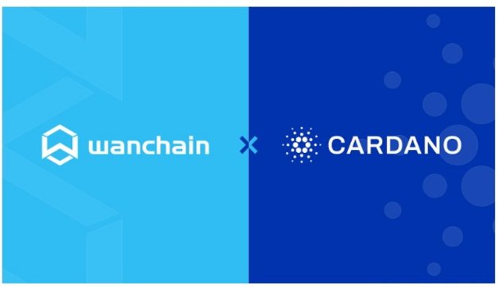

# Guest blog: collaborating on Cardano interoperability
### **Today we’re announcing new interoperability solutions between Cardano and EVM blockchains**
 27 April 2022[ Temujin Louie](tmp//en/blog/authors/temujin-louie/page-1/) 2 mins read

### [**Temujin Louie**](tmp//en/blog/authors/temujin-louie/page-1/)
Director of Marketing, Wanchain

Guest author

At [Wanchain](https://www.wanchain.org/), we believe in the importance of decentralization and have a clear vision of a future where the global blockchain landscape behaves as a beautiful, singular, interoperable network. We’re particularly excited to take another important step in this direction, and today we can share the news that we are enabling interoperability between the Cardano mainnet, Cardano sidechains, and other blockchain networks. 

Tại [Wanchain] (https://www.wanchain.org/), chúng tôi tin vào tầm quan trọng của việc phân cấp và có một tầm nhìn rõ ràng về một tương lai nơi cảnh quan blockchain toàn cầu hoạt động như một mạng lưới đẹp, có thể tương tác.
Chúng tôi đặc biệt hào hứng khi thực hiện một bước quan trọng khác theo hướng này và hôm nay chúng tôi có thể chia sẻ tin tức rằng chúng tôi đang cho phép khả năng tương tác giữa Cardano Mainnet, Cardano Sidechains và các mạng blockchain khác.

These efforts will see the deployment of decentralized, non-custodial, bi-directional cross-chain bridges connecting Cardano to other layer 1 blockchains. Wanchain bridge nodes will be upgraded to further secure Cardano’s cross-chain bridges and transactions and Wanchain will become an EVM-compatible sidechain to Cardano.

Những nỗ lực này sẽ chứng kiến việc triển khai các cầu nối xuyên chuỗi phân cấp, không phân cấp, hai chuỗi kết nối Cardano với các blockchains Lớp 1 khác.
Các nút Wanchain Bridge sẽ được nâng cấp để tiếp tục bảo mật các cây cầu và giao dịch chuỗi Cardano, và Wanchain sẽ trở thành một sidechain tương thích với EVM cho Cardano.

Wanchain is both a sustainable layer 1 proof-of-stake (PoS) blockchain and a decentralized interoperability solution. The Wanchain layer 1 PoS blockchain is a full Ethereum-like environment that works with industry standard Ethereum tools, DApps and protocols. Importantly, it shares some common ground with Cardano. Wanchain uses a proof-of-stake consensus algorithm called [Galaxy Consensus](https://www.wanchain.org/_files/ugd/9296c5_5205d584ee594e879d4b8b58048b6fac.pdf) that leverages a variety of cryptographic schemes, including distributed secret sharing and threshold signatures to improve random number generation and block production mechanisms. Galaxy Consensus, developed by world-class researchers and academics, is a continuation of Cardano’s own [Ouroboros](https://docs.cardano.org/core-concepts/ouroboros-overview).

Wanchain vừa là blockchain bằng chứng Lớp 1 bền vững (POS) vừa là giải pháp khả năng tương tác phi tập trung.
Blockchain của Wanchain Lớp 1 là một môi trường giống như Ethereum đầy đủ, hoạt động với các công cụ, DAPP và giao thức Ethereum tiêu chuẩn công nghiệp.
Điều quan trọng, nó chia sẻ một số điểm chung với Cardano.
Wanchain sử dụng thuật toán đồng thuận bằng chứng có tên là [đồng thuận Galaxy] (https://www.wanchain.org/_files/ugd/9296c5_5205d584ee
Cải thiện việc tạo số ngẫu nhiên và chặn cơ chế sản xuất.
Sự đồng thuận của Galaxy, được phát triển bởi các nhà nghiên cứu và học giả đẳng cấp thế giới, là sự tiếp nối của Cardano, [OuroBoros] (https://docs.cardano.org/core-concepts/ouroboros-overview).

Meanwhile, Wanchain bridges are decentralized, direct, non-custodial bridges that connect both EVM and non-EVM networks without requiring any relay chains or intermediary networks. These bridges use a combination of Secure Multiparty Computation (sMPC) and Shamir's Secret Sharing (SSS) to secure cross-chain assets. Currently, more than fifteen layer 1 and layer 2 networks (and counting!) are connected by Wanchain’s network of blockchains.

Trong khi đó, các cầu Wanchain được phân cấp, các cầu nối trực tiếp, không giam giữ kết nối cả mạng EVM và không EVM mà không yêu cầu bất kỳ chuỗi chuyển tiếp hoặc mạng trung gian nào.
Những cây cầu này sử dụng kết hợp tính toán đa nguyên (SMPC) và chia sẻ bí mật của Shamir (SSS) để bảo mật các tài sản chuỗi chéo.
Hiện tại, hơn mười lăm mạng Lớp 1 và Lớp 2 (và đếm!) Được kết nối bởi mạng lưới blockchain của Wanchain.

By turning Wanchain into an EVM-compatible sidechain to Cardano, Cardano DApp developers and users will gain access to more coding languages, frameworks and integrated developer environments. Furthermore, not only does this novel approach maximize the security of Cardano’s interoperability solution, it also doubles as a scalability solution. Transactions can now safely be moved off Cardano, recording only the vital information on the layer 1 blockchain to ensure security and immutability. 

Bằng cách biến Wanchain thành một sidechain tương thích EVM thành Cardano, các nhà phát triển và người dùng Cardano DAPP sẽ có quyền truy cập vào nhiều ngôn ngữ mã hóa, khung và môi trường phát triển tích hợp.
Hơn nữa, không chỉ cách tiếp cận mới này tối đa hóa bảo mật của giải pháp khả năng tương tác của Cardano, nó còn tăng gấp đôi như một giải pháp khả năng mở rộng.
Các giao dịch hiện có thể được di chuyển một cách an toàn Cardano, chỉ ghi lại thông tin quan trọng trên blockchain Lớp 1 để đảm bảo bảo mật và bất biến.

This sidechain approach heralds a new era for Cardano, as it begins to transition into a fully-fledged multi-chain ecosystem with greater security and scalability. 

Cách tiếp cận Sidechain này báo hiệu một kỷ nguyên mới cho Cardano, vì nó bắt đầu chuyển sang một hệ sinh thái đa chuỗi chính thức với khả năng bảo mật và mở rộng lớn hơn.

Hopefully this is just the beginning of a longer term collaboration between Wanchain and Input Output and we look forward to sharing more updates soon.

Hy vọng rằng đây chỉ là khởi đầu của sự hợp tác dài hạn giữa Wanchain và đầu ra đầu vào và chúng tôi mong muốn được chia sẻ nhiều cập nhật hơn.

*Learn more about Wanchain and the project on [April’s Cardano360 show](https://www.youtube.com/watch?v=b4x5OIy4shU), where Wanchain’s VP of Engineering Dr Weijia Zhang will be appearing as a special guest.*

*Tìm hiểu thêm về Wanchain và dự án trên chương trình [April Card Cardano360] (https://www.youtube.com/watch?v=b4x5oiy4shu), nơi VP kỹ thuật của Wanchain, Tiến sĩ Weijia Zhang sẽ xuất hiện với tư cách là khách mời đặc biệt.

