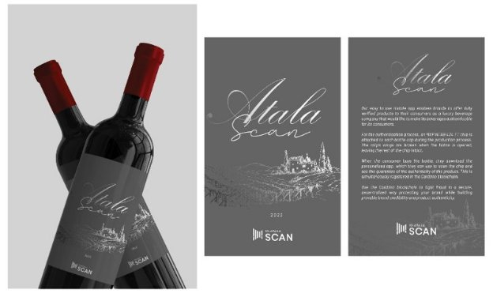

# Atala SCAN: Blockchain-based product authentication
### **How a smart microchip can work with an advanced blockchain to defeat product counterfeiters**
 4 May 2022[ Neil Burgess](tmp//en/blog/authors/neil-burgess/page-1/) 6 mins read

### [**Neil Burgess**](tmp//en/blog/authors/neil-burgess/page-1/)
Technical Writer

Marketing & Communications

- 
- 

You’ve paid a premium price for that collectible bottle of premium spirits, but there’s that nagging doubt. Do you trust the retailer and all the actors in the supply chain to act with complete integrity?

Bạn đã trả một mức giá cao cho chai rượu mạnh có thể sưu tập được đó, nhưng có sự nghi ngờ dai dẳng đó.
Bạn có tin tưởng các nhà bán lẻ và tất cả các diễn viên trong chuỗi cung ứng để hành động với tính toàn vẹn hoàn toàn không?

You buy an expensive drug from an online pharmacy. Are you sure you are getting what you paid for? Atala SCAN – IOG’s product authentication system – can answer your questions without the need to trust the retailer or anyone in the supply chain.

Bạn mua một loại thuốc đắt tiền từ một hiệu thuốc trực tuyến.
Bạn có chắc bạn đang nhận được những gì bạn đã trả tiền?
ATALA Quét hệ thống xác thực sản phẩm của IOG - có thể trả lời câu hỏi của bạn mà không cần tin tưởng vào nhà bán lẻ hoặc bất kỳ ai trong chuỗi cung ứng.

Part of the solution for bottles of spirits is a smart seal that knows if it has been tampered with. Atala adds to this an encrypted, auditable link between the seal and the full manufacturing history of the specific bottle to which the seal is attached. You can check the history using a free app on your phone that can instantly verify a product’s authenticity.

Một phần của giải pháp cho chai rượu mạnh là một con dấu thông minh biết nếu nó đã bị giả mạo.
Atala thêm vào một liên kết được mã hóa, có thể kiểm toán giữa con dấu và lịch sử sản xuất đầy đủ của chai cụ thể mà con dấu được đính kèm.
Bạn có thể kiểm tra lịch sử bằng một ứng dụng miễn phí trên điện thoại của bạn có thể xác minh ngay tính xác thực của sản phẩm.

[Atala SCAN](https://atalascan.io/) is built on the third-generation blockchain technology of Cardano. Blockchain software combined with ‘touch-chip’ technology offers real advantages over traditional security methods like cap seals, holograms, and fancy packaging – the history of a product can be checked instantly by the customer.

[Atala Scan] (https://atalascan.io/) được xây dựng trên công nghệ blockchain thế hệ thứ ba của Cardano.
Phần mềm blockchain kết hợp với công nghệ "Touch-chipâ € ™ mang lại lợi thế thực sự so với các phương pháp bảo mật truyền thống như con dấu nắp, hình ba chiều và bao bì ưa thích-Lịch sử của một sản phẩm có thể được khách hàng kiểm tra ngay lập tức.

### **The problem and solution**

### ** Vấn đề và giải pháp **

The need for improved security on products such as premium spirits, cosmetics, fashion goods, and prescription medication is being driven by the battle against ever-more sophisticated counterfeiters. The United Nations agency that is coordinating the fight against transnational organized crime groups [describes the problem](https://www.unodc.org/toc/en/crimes/counterfeit-goods.html): ‘The production and sale of counterfeit goods is a global, multi-billion dollar problem and one that has serious economic and health ramifications for governments, businesses and consumers.’

Nhu cầu cải thiện bảo mật trên các sản phẩm như tinh thần cao cấp, mỹ phẩm, hàng thời trang và thuốc theo toa đang được thúc đẩy bởi cuộc chiến chống lại những kẻ giả mạo tinh vi hơn bao giờ hết.
Cơ quan Liên Hợp Quốc đang điều phối cuộc chiến chống lại các nhóm tội phạm có tổ chức xuyên quốc gia [mô tả vấn đề] (https://www.unodc.org/toc/en/crimes/c gặp phải-goods.html):
hàng giả là một vấn đề toàn cầu, trị giá hàng tỷ đô la và có sự phân nhánh kinh tế và sức khỏe nghiêm trọng đối với chính phủ, doanh nghiệp và người tiêu dùng.

The size of the international counterfeit market doubled from US$200bn in 2008 to US$509bn in 2019 – equivalent to 2.5% of world trade, [according to the US Patent and Trademark Office](https://www.uspto.gov/sites/default/files/documents/USPTO-Counterfeit.pdf). Counterfeiting at such a scale costs jobs in manufacturing, endangers the lives of food and pharmacy customers, and deprives innovators of due rewards for their efforts.

Quy mô của thị trường giả quốc tế đã tăng gấp đôi từ 200 tỷ đô la Mỹ trong năm 2008 lên 509 tỷ đô la Mỹ trong năm 2019 - tương đương với 2,5% thương mại thế giới, [theo văn phòng bằng sáng chế và nhãn hiệu của Hoa Kỳ] (https: //www.uspto.
gov/sites/mặc định/tệp/tài liệu/uspto-countfeit.pdf).
Phấn giả ở quy mô như vậy chi phí các công việc trong sản xuất, gây nguy hiểm cho cuộc sống của khách hàng thực phẩm và dược phẩm, và tước đi những phần thưởng do những nỗ lực của họ.

IOG’s solution to counterfeiting crime is an integrated system comprising a smart seal based on a ‘chip with wings’ that can be linked at the touch of a smartphone to the production records of the item. The records are held in secure storage that cannot be changed. Purchasers can check the provenance quickly, easily, and at no charge.

Giải pháp của IOG cho tội phạm giả là một hệ thống tích hợp bao gồm một con dấu thông minh dựa trên một chương trình với cánh có thể được liên kết khi chạm vào điện thoại thông minh vào hồ sơ sản xuất của mặt hàng.
Các hồ sơ được giữ trong bộ lưu trữ an toàn không thể thay đổi.
Người mua có thể kiểm tra xuất xứ một cách nhanh chóng, dễ dàng và miễn phí.

### **The smart seal**

### ** Con dấu thông minh **

The smart seal is at the heart of the system. It is a wafer-thin label incorporating a [near-field communication (NFC) chip](http://nearfieldcommunication.org/how-it-works.html). It is small enough to be glued to a product, incorporated in a card, or embedded in a product or its packaging. For example, it can be part of a special bottle cap or stitched into a handbag. You may have seen the NFC logo on a bank card. The technology allows devices to exchange information simply by touching or placing them next to one another. Like the microchips used for pet dogs, the smart seal consumes no power and silently waits for a signal from a reader. The signal induces an electric current in the chip’s antenna, and that is enough power for the chip to transmit its stored data.

Con dấu thông minh là trung tâm của hệ thống.
Nó là một nhãn mỏng wafer kết hợp một chip [giao tiếp gần trường (NFC)] (http://nearfieldc truyền thông.org/how-it-works.html).
Nó đủ nhỏ để được dán vào một sản phẩm, được kết hợp trong một thẻ hoặc được nhúng trong một sản phẩm hoặc bao bì của nó.
Ví dụ, nó có thể là một phần của nắp chai đặc biệt hoặc khâu vào túi xách.
Bạn có thể đã thấy logo NFC trên thẻ ngân hàng.
Công nghệ cho phép các thiết bị trao đổi thông tin chỉ bằng cách chạm hoặc đặt chúng cạnh nhau.
Giống như các vi mạch được sử dụng cho chó cưng, con dấu thông minh không tiêu thụ năng lượng và âm thầm chờ tín hiệu từ người đọc.
Tín hiệu tạo ra một dòng điện trong ăng -ten của chip và đó là đủ năng lượng để chip truyền dữ liệu được lưu trữ của nó.

Modern smartphones incorporate a bi-directional NFC device as a standard feature so that a phone can operate both as a reader and a tag. The Nexus S was the first Android device to include it. That was in 2010. Apple added NFC to the iPhone in 2014 – it has been built into every iPhone since the 6.

Điện thoại thông minh hiện đại kết hợp một thiết bị NFC hai chiều làm tính năng tiêu chuẩn để điện thoại có thể hoạt động cả dưới dạng đầu đọc và thẻ.
Nexus S là thiết bị Android đầu tiên bao gồm nó.
Đó là vào năm 2010. Apple đã thêm NFC vào iPhone vào năm 2014 - Nó đã được tích hợp vào mọi iPhone kể từ 6.

Most tamper-evident NFC tags are designed to stop working if disturbed. All NFC tags need an antenna to work, and if the antenna is fragile enough, any tampering will stop the tag from working. The NTAG product used in Atala SCAN applications takes this one step further. The chip in the tag has two antennas, only one of which is designed to break. If the tag is disturbed, it continues to work but transmits a modified signal as evidence of the tampering.

Hầu hết các thẻ NFC giả mạo được thiết kế để ngừng hoạt động nếu bị xáo trộn.
Tất cả các thẻ NFC cần một ăng -ten để hoạt động và nếu ăng -ten đủ mong manh, bất kỳ sự giả mạo nào cũng sẽ ngăn thẻ hoạt động.
Sản phẩm NTAG được sử dụng trong các ứng dụng quét Atala sẽ tiến thêm một bước.
Chip trong thẻ có hai ăng -ten, chỉ một trong số đó được thiết kế để phá vỡ.
Nếu thẻ bị xáo trộn, nó tiếp tục hoạt động nhưng truyền một tín hiệu được sửa đổi làm bằng chứng cho việc giả mạo.

Atala SCAN is implemented at the first point in the supply chain that delivers the finished product to the brand owner. The brand owner’s records can include product images and a full history, including tracing each component back to its point of origin. The brand owner decides what information is disclosed to the end customer through the embedded smart chip. It might be basic tracking data or part of a global consumer marketing campaign. This information is linked to the unique identifier of each tag. Atala SCAN engineers can help with setting up this linkage. The tag is then attached to, or associated in some way with, each product item.

Atala Scan được triển khai tại điểm đầu tiên trong chuỗi cung ứng cung cấp sản phẩm hoàn chỉnh cho chủ sở hữu thương hiệu.
Các hồ sơ của chủ sở hữu thương hiệu có thể bao gồm hình ảnh sản phẩm và lịch sử đầy đủ, bao gồm truy tìm từng thành phần trở lại điểm xuất phát của nó.
Chủ sở hữu thương hiệu quyết định thông tin nào được tiết lộ cho khách hàng cuối cùng thông qua chip thông minh nhúng.
Nó có thể là dữ liệu theo dõi cơ bản hoặc một phần của chiến dịch tiếp thị tiêu dùng toàn cầu.
Thông tin này được liên kết với định danh duy nhất của mỗi thẻ.
Các kỹ sư quét Atala có thể giúp thiết lập liên kết này.
Thẻ sau đó được gắn vào hoặc liên kết theo một cách nào đó với mỗi mục sản phẩm.

### **The blockchain**

### ** blockchain **

Cardano is a blockchain platform for changemakers, innovators, and visionaries. It uses the Ouroboros proof of stake protocol to achieve consensus so that it is provably secure while consuming only a fraction of the resources required by older blockchains. With Atala, every item is associated with a unique entry on Cardano. That entry cannot be altered, but can be read easily, and can be used as part of an auditing system. Each entry comprises the cryptographic hash of the tag’s identifier and links to the product metadata. The metadata, including images, is stored off-chain.

Cardano là một nền tảng blockchain cho các nhà thay đổi, nhà đổi mới và những người có tầm nhìn.
Nó sử dụng Proboros Proof of Stake Protocol để đạt được sự đồng thuận để nó được bảo mật có thể được bảo mật trong khi chỉ tiêu thụ một phần tài nguyên theo yêu cầu của các blockchain cũ.
Với Atala, mọi mục đều được liên kết với một mục duy nhất trên Cardano.
Mục nhập đó không thể được thay đổi, nhưng có thể được đọc dễ dàng và có thể được sử dụng như một phần của hệ thống kiểm toán.
Mỗi mục bao gồm hàm băm mật mã của định danh của thẻ và các liên kết đến siêu dữ liệu sản phẩm.
Các siêu dữ liệu, bao gồm cả hình ảnh, được lưu trữ ngoài chuỗi.

Juan Ignacio Sierra, the Atala SCAN project manager, says: ‘Working with blockchain ensures the immutability of the product information, but if there’s no mechanism in place to securely link the information to the product itself, fake products can take advantage of the same blockchain information as the originals do. In Atala SCAN we use high security cryptographic hardware in the seal to ensure the security of the link between the blockchain information and the physical product.’

Juan Ignacio Sierra, người quản lý dự án Atala Scan, nói: "Làm việc với blockchain đảm bảo tính bất biến của thông tin sản phẩm, nhưng nếu không có cơ chế nào để liên kết an toàn thông tin với sản phẩm, các sản phẩm giả có thể thực hiện
Lợi thế của cùng một thông tin blockchain như bản gốc làm.
Trong Atala Scan, chúng tôi sử dụng phần cứng mật mã bảo mật cao trong con dấu để đảm bảo bảo mật liên kết giữa thông tin blockchain và sản phẩm vật lý.

### **Scan on your smartphone**

### ** Quét trên điện thoại thông minh của bạn **

If you have a smartphone, you will be able to download the free Atala SCAN app from the relevant online store. This application uses a phone’s NFC reader to read the chip and look up the product information on Cardano. Simply touch the phone to the product, and know at once if the product is genuine and learn about its history.

Nếu bạn có điện thoại thông minh, bạn sẽ có thể tải xuống ứng dụng Atala Scan miễn phí từ cửa hàng trực tuyến có liên quan.
Ứng dụng này sử dụng đầu đọc NFC của điện thoại để đọc chip và tra cứu thông tin sản phẩm trên Cardano.
Chỉ cần chạm vào điện thoại vào sản phẩm và biết ngay lập tức nếu sản phẩm là chính hãng và tìm hiểu về lịch sử của nó.

IOG is talking to several companies about launching the system.

IOG đang nói chuyện với một số công ty về việc ra mắt hệ thống.

‘Atala SCAN has been in gestation for some time and it’s exciting now that we can start to bring the proposition to market’, says Juan Sierra. ‘We’re in discussions with a number of potential clients. We will have more to share soon!’

Juan Sierra cho biết, việc quét ˜atala đã mang thai một thời gian và bây giờ chúng ta có thể bắt đầu đưa ra đề xuất ra thị trường, Juan Sierra nói.
"Chúng tôi đang thảo luận với một số khách hàng tiềm năng.
Chúng tôi sẽ có nhiều hơn để chia sẻ sớm! "

*If you are interested in product authentication for any reason, please get in touch with IOG through the [Atala SCAN website](https://atalascan.io/), and we will be delighted to answer your questions.*

*Nếu bạn quan tâm đến xác thực sản phẩm vì bất kỳ lý do gì, vui lòng liên hệ với IOG thông qua [trang web Atala Scan] (https://atalascan.io/) và chúng tôi sẽ rất vui mừng khi trả lời câu hỏi của bạn.*

*Thanks to Anthony Quinn and Rachel Epstein for their indispensable contributions to this post.*

*Cảm ơn Anthony Quinn và Rachel Epstein vì những đóng góp không thể thiếu của họ cho bài đăng này.*

