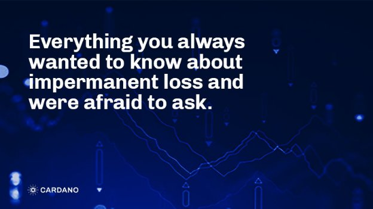

# Everything you always wanted to know about impermanent loss and were afraid to ask
### **How the EUTxO model is better for the predictability of impermanent loss than Accounts-based chains**
 27 May 2022[ Fernando Sanchez](tmp//en/blog/authors/fernando-sanchez/page-1/) 9 mins read

### [**Fernando Sanchez**](tmp//en/blog/authors/fernando-sanchez/page-1/)
Technical Writer

Marketing and Communications

- 
- 

**Disclaimer**: *Nothing in this article is intended to be professional advice, including without limitation, financial, investment, legal or tax advice. Input Output Global is not responsible for your use of or reliance on any information in this article.*

** Tuyên bố miễn trừ trách nhiệm **:*Không có gì trong bài viết này được dự định là lời khuyên chuyên nghiệp, bao gồm nhưng không giới hạn, tư vấn về tài chính, đầu tư, pháp lý hoặc thuế.
Đầu vào đầu vào Toàn cầu không chịu trách nhiệm cho việc bạn sử dụng hoặc phụ thuộc vào bất kỳ thông tin nào trong bài viết này.*

Decentralized Finance (DeFi) is an umbrella term that refers to decentralized applications (DApps), services, protocols, and financial instruments built on blockchain. It is a relatively new industry segment enabled by decentralized ledger technology, which means there is no single authority with centralized control over the system. And anyone familiar with the DeFi environment probably knows about impermanent loss. It's a simple concept with a misleading name.

Tài chính phi tập trung (DEFI) là một thuật ngữ ô đề cập đến các ứng dụng phi tập trung (DAPP), dịch vụ, giao thức và công cụ tài chính được xây dựng trên blockchain.
Đây là một phân khúc công nghiệp tương đối mới được kích hoạt bởi công nghệ sổ cái phi tập trung, điều đó có nghĩa là không có thẩm quyền duy nhất với sự kiểm soát tập trung đối với hệ thống.
Và bất cứ ai quen thuộc với môi trường Defi có thể biết về sự mất mát vô thường.
Đó là một khái niệm đơn giản với một cái tên gây hiểu lầm.

Cardano is a third-generation blockchain whose [expansive DeFi universe](https://iohk.io/en/blog/posts/2022/01/10/defi-demystified/) features, among many other DApps, decentralized exchanges (DEXs). These are crypto exchange protocols that enable peers to trade cryptocurrencies with each other. DEXs use two main design architectures: *automated market maker (AMM)* and *order book*. The implementation of AMMs is relatively simple, and this design has since become the de facto choice for Account-based chains. However, this design has some inherent deficiencies. Their tendency to incur impermanent loss, for example.

Cardano là một blockchain thế hệ thứ ba có [vũ trụ Defi mở rộng] (https://iohk.io/en/blog/posts/2022/01/10/defi-demystified/)
).
Đây là các giao thức trao đổi tiền điện tử cho phép các đồng nghiệp giao dịch tiền điện tử với nhau.
DEXS sử dụng hai kiến trúc thiết kế chính: *Nhà sản xuất thị trường tự động (AMM) *và *Sách đặt hàng *.
Việc triển khai AMMS tương đối đơn giản và thiết kế này đã trở thành lựa chọn thực tế cho các chuỗi dựa trên tài khoản.
Tuy nhiên, thiết kế này có một số thiếu sót vốn có.
Xu hướng của họ phải chịu sự mất mát vô thường, ví dụ.

Cardano uses an [extended unspent transaction output (EUTxO)](https://iohk.io/en/blog/posts/2021/03/11/cardanos-extended-utxo-accounting-model/) accounting model to track the movement of assets across the chain. EUTxO is deterministic, which offers better predictability of impermanent loss.

Cardano sử dụng [đầu ra giao dịch mở rộng (EUTXO)] (https://iohk.io/en/blog/posts/2021/03/11/cardanos-extends-utxo-accounting-model/)
tài sản trên toàn chuỗi.
EUTXO là xác định, cung cấp khả năng dự đoán tốt hơn về sự mất mát vô thường.

These seemingly unrelated concepts coalesce into a very interesting interplay on the blockchain. This article considers DEX designs and explains why EUTxO offers better predictability of impermanent loss than Account-based accounting models.

Những khái niệm dường như không liên quan này hợp nhất thành một sự tương tác rất thú vị trên blockchain.
Bài viết này xem xét các thiết kế DEX và giải thích lý do tại sao EUTXO cung cấp khả năng dự đoán tốt hơn về tổn thất vô thường so với các mô hình kế toán dựa trên tài khoản.

## **Impermanent loss: definition**

## ** Mất thường xuyên: Định nghĩa **

When the total value of assets provided as liquidity is lower than the value that would have accrued had you simply held onto them.

Khi tổng giá trị của tài sản được cung cấp dưới dạng thanh khoản thấp hơn giá trị tích lũy nếu bạn chỉ đơn giản giữ chúng.

This is the simplest definition of impermanent loss, a concept that inspires dread on liquidity providers. 

Đây là định nghĩa đơn giản nhất về sự mất mát vô thường, một khái niệm truyền cảm hứng cho sự sợ hãi đối với các nhà cung cấp thanh khoản.

Impermanent loss occurs when the price of the assets deposited into a liquidity pool changes (upwards or downwards) in relation to when they were deposited. In other words, the worth of your assets when you withdraw them is different to when you deposited them into the liquidity pool. 

Sự mất mát vô thường xảy ra khi giá của tài sản gửi vào nhóm thanh khoản thay đổi (hướng lên hoặc xuống) liên quan đến khi chúng được gửi.
Nói cách khác, giá trị tài sản của bạn khi bạn rút chúng khác với khi bạn gửi chúng vào nhóm thanh khoản.

The name *impermanent* is slightly misleading, as a decrease in token price might only be temporary, and the price might rise again following market or trading conditions, etc. In this case, the loss would be *temporary* (i.e., impermanent), because the price rectified upwards. The change becomes *permanent* only if the dollar price of the token at withdrawal is less than it was when the token was deposited.

Tên * Vô thường * hơi sai lệch, vì giá mã thông báo giảm chỉ có thể là tạm thời và giá có thể tăng trở lại sau các điều kiện thị trường hoặc giao dịch, v.v.
, bởi vì giá được chỉnh sửa lên trên.
Sự thay đổi trở thành * vĩnh viễn * chỉ khi giá đô la của mã thông báo khi rút tiền ít hơn so với khi mã thông báo được gửi.

You could argue that impermanent loss is the risk that liquidity providers take in exchange for fees earned by trading crypto pairs on liquidity pools. If the loss is greater than the fees earned, the liquidity provider realizes a loss, which might not have happened had they held onto their tokens instead. It is interesting to note that you might not actually lose money, but your gains might be less than if you had just held the tokens.

Bạn có thể lập luận rằng mất mát vô thường là rủi ro mà các nhà cung cấp thanh khoản phải đổi lấy phí kiếm được bằng cách giao dịch các cặp tiền điện tử trên các nhóm thanh khoản.
Nếu khoản lỗ lớn hơn các khoản phí kiếm được, nhà cung cấp thanh khoản nhận ra một khoản lỗ, điều này có thể không xảy ra nếu họ giữ trên mã thông báo của họ.
Thật thú vị khi lưu ý rằng bạn có thể không thực sự mất tiền, nhưng lợi nhuận của bạn có thể ít hơn so với khi bạn vừa giữ các mã thông báo.

## **AMMs vs order-book**

## ** Amms vs đơn đặt hàng **

Understanding impermanent loss requires a basic understanding of how DEXs work. Currently, DEXs use two design models: AMM and order book. Each comes with a set of advantages and disadvantages when it comes to impermanent loss, which are explored. below.

Hiểu mất mát vô thường đòi hỏi một sự hiểu biết cơ bản về cách thức hoạt động của Dexs.
Hiện tại, DEXS sử dụng hai mô hình thiết kế: AMM và Sách đặt hàng.
Mỗi người đi kèm với một tập hợp các lợi thế và nhược điểm khi mất đi sự mất mát vô thường, được khám phá.
phía dưới.

**AMM**

** Amm **

The Automated Market Maker (AMM) DEX mode enables automated trading of cryptocurrency pairs using smart contracts. These pairs are usually (but not always) an Ethereum-based token and a stablecoin.

Chế độ DEX của Nhà sản xuất thị trường tự động (AMM) cho phép giao dịch tự động các cặp tiền điện tử bằng hợp đồng thông minh.
Các cặp này thường (nhưng không phải luôn luôn) một mã thông báo dựa trên Ethereum và stableCoin.

AMMs rely on liquidity pools, which are mechanisms that facilitate users to pool their assets into smart contracts. The more liquidity there is in the pool, the easier it becomes to trade on the DEX the pool is associated with, and the higher the fees and rewards earned by liquidity providers. Liquidity pools aggregate the liquidity provided by investors into both sides of the trading pair. The pool uses an algorithm that looks at the current liquidity to calculate the pair's market price at that time. To put it another way, the algorithm considers the availability of a particular asset in the pool to determine its price.

AMMS dựa vào các nhóm thanh khoản, đó là các cơ chế tạo điều kiện cho người dùng tập hợp tài sản của họ thành hợp đồng thông minh.
Càng thanh khoản càng nhiều trong hồ bơi, việc giao dịch trên DEX càng dễ dàng hơn và các khoản phí và phần thưởng kiếm được càng cao từ các nhà cung cấp thanh khoản.
Các nhóm thanh khoản tổng hợp thanh khoản được cung cấp bởi các nhà đầu tư vào cả hai phía của cặp giao dịch.
Bể bơi sử dụng một thuật toán xem xét tính thanh khoản hiện tại để tính giá thị trường của cặp tại thời điểm đó.
Nói cách khác, thuật toán xem xét tính khả dụng của một tài sản cụ thể trong nhóm để xác định giá của nó.

AMMs rely almost entirely on liquidity providers to provide liquidity to expand the pool's size and ensure the assets are traded at a fair price. This design trait effectively means that the liquidity providers are the market makers.

Amms phụ thuộc gần như hoàn toàn vào các nhà cung cấp thanh khoản để cung cấp thanh khoản để mở rộng quy mô của nhóm và đảm bảo tài sản được giao dịch với giá hợp lý.
Đặc điểm thiết kế này có nghĩa là các nhà cung cấp thanh khoản là các nhà tạo lập thị trường.

Liquidity providers need an incentive to invest, of course. This comes in the form of yield farming, essentially token rewards earned through lending or staking of digital assets.

Các nhà cung cấp thanh khoản cần một động lực để đầu tư, tất nhiên.
Điều này xuất hiện dưới dạng sản lượng canh tác, về cơ bản là phần thưởng mã thông báo kiếm được thông qua việc cho vay hoặc đặt cược tài sản kỹ thuật số.

**Order book**

**Quyển sổ đặc Mua hàng**

The mechanics behind the order book design have been around the economics field for a long time. It is a very straightforward model. The order book simply lists all the buy/sell (asks/bids, in this context) orders, so when the traders put in their orders, the order book sorts them according to the asset's price. If there is supply and demand, the asset can be traded.

Các cơ chế đằng sau thiết kế sách đặt hàng đã xuất hiện trong lĩnh vực kinh tế trong một thời gian dài.
Đó là một mô hình rất đơn giản.
Cuốn sách đặt hàng chỉ đơn giản liệt kê tất cả các đơn đặt hàng mua/bán (yêu cầu/giá thầu, trong bối cảnh này), vì vậy khi các nhà giao dịch đặt hàng, sổ đặt hàng sắp xếp chúng theo giá của tài sản.
Nếu có cung và cầu, tài sản có thể được giao dịch.

UTXO-based ledgers, like Cardano, are far more suitable for order book architecture, as this design, together with Cardano's EUTxO features, mitigates the effects of impermanent loss. 

Các sổ cái có trụ sở tại UTXO, như Cardano, phù hợp hơn nhiều cho kiến trúc sách đặt hàng, như thiết kế này, cùng với các tính năng EUTXO của Cardano, giảm thiểu tác động của sự mất mát vô thường.

## **The (un)predictability of impermanent loss**

## ** Khả năng dự đoán của mất thường xuyên **

Liquidity providers provide liquidity to pools for financial returns. But this brings with it risk. The amount of tokens in the pool and number of liquidity providers contributing to it are major factors on the possibility of impermanent loss occurring, and such consideration is important for potential liquidity providers. Frequent impermanent loss leads to pools drying up and liquidity providers looking elsewhere.

Các nhà cung cấp thanh khoản cung cấp thanh khoản cho các nhóm cho lợi nhuận tài chính.
Nhưng điều này mang lại rủi ro.
Số lượng mã thông báo trong nhóm và số lượng các nhà cung cấp thanh khoản đóng góp cho nó là những yếu tố chính về khả năng mất mát vô thường xảy ra, và việc xem xét như vậy rất quan trọng đối với các nhà cung cấp thanh khoản tiềm năng.
Mất thường xuyên thường xuyên dẫn đến các hồ bơi đang cạn kiệt và các nhà cung cấp thanh khoản tìm kiếm ở nơi khác.

Here's the insidious thing about impermanent loss: it is very difficult to predict whether or not it will occur, and to what degree.

Đây là điều ngấm ngầm về sự mất mát vô thường: rất khó để dự đoán liệu nó có xảy ra hay không, và ở mức độ nào.

## **Impermanent loss in UTXO-based chains vs Account-based ones**

## ** Mất thường xuyên trong chuỗi dựa trên UTXO so với các chuỗi dựa trên tài khoản **

Quick intro:

Giới thiệu nhanh:

- UTXO-based chains: there are no accounts holding a balance. Instead, users' wallets keep track of a list of unspent outputs associated with all addresses owned by the user, and calculate the users’ balance. UTXO is, in many ways, similar to cash transactions. Cardano ‘s EUTxO model adds a datum, which is contract-specific data. This is important as it confers Cardano with the ability to support multi-assets and smart contracts.

- Chuỗi dựa trên UTXO: Không có tài khoản giữ cân bằng.
Thay vào đó, ví của người dùng theo dõi danh sách các đầu ra chưa được liên kết với tất cả các địa chỉ thuộc sở hữu của người dùng và tính toán số dư của người dùng.
UTXO, theo nhiều cách, tương tự như các giao dịch tiền mặt.
Mô hình EUTXO của Cardano bổ sung một mốc dữ liệu, đó là dữ liệu cụ thể theo hợp đồng.
Điều này rất quan trọng vì nó cung cấp Cardano với khả năng hỗ trợ nhiều tài sản và hợp đồng thông minh.

- Account-based model - This accounting model uses an account (which can be controlled by a private key or a smart contract) to hold a coin balance. In this model, assets are represented as balances within users’ accounts, and the balances are stored as a global state of accounts. The state is kept by each node and updated with every transaction.

- Mô hình dựa trên tài khoản - Mô hình kế toán này sử dụng tài khoản (có thể được kiểm soát bởi khóa riêng hoặc hợp đồng thông minh) để giữ số dư tiền xu.
Trong mô hình này, các tài sản được thể hiện dưới dạng số dư trong các tài khoản của người dùng và số dư được lưu trữ dưới dạng trạng thái tài khoản toàn cầu.
Trạng thái được giữ bởi mỗi nút và được cập nhật với mỗi giao dịch.

There are several fundamental differences between these two models, but when it comes to AMMs and impermanent loss, there is one key distinction. AMMs operating on Account-based chains tend to use a Constant Formula Market Maker (CFMM) pricing formula, which is one of the more commonly used algorithms for AMMs. This formula contains inherent inefficiencies. For example, the Total Value Locked (TVL) -defined as the sum of all staked crypto assets earning rewards, interest, etc.- is distributed across the entire price range, which implies that the price of an asset is equally likely to be $1 or $10,000. Under this assumption, CFMM prices are unrealistic and tend not to reflect actual market conditions. Also, trades on low token volume tend to lead to high slippage (the difference between the expected price of an order and the price when the order actually executes.) While CFMM is a popular choice for AMMs, these inefficiencies might result in the dilution of revenues for liquidity providers. More importantly, this liquidity is subject to impermanent loss.

Có một số khác biệt cơ bản giữa hai mô hình này, nhưng khi nói đến AMM và mất mát vô thường, có một sự khác biệt chính. AMMS hoạt động trên các chuỗi dựa trên tài khoản có xu hướng sử dụng công thức định giá của Công thức thị trường (CFMM) không đổi, đây là một trong những thuật toán được sử dụng phổ biến hơn cho AMM. Công thức này chứa sự thiếu hiệu quả vốn có. Ví dụ, tổng giá trị bị khóa (TVL) được xác định là tổng của tất cả các tài sản tiền điện tử kiếm được phần thưởng, lãi, v.v.- được phân phối trên toàn bộ phạm vi giá, ngụ ý rằng giá của một tài sản cũng có khả năng là 1 đô la hoặc 10.000 đô la. Theo giả định này, giá CFMM là không thực tế và có xu hướng không phản ánh các điều kiện thị trường thực tế. Ngoài ra, các giao dịch trên khối lượng mã thông báo thấp có xu hướng dẫn đến độ trượt cao (sự khác biệt giữa giá dự kiến của một đơn đặt hàng và giá khi lệnh thực sự thực hiện.) Trong khi CFMM là một lựa chọn phổ biến cho các AMM, những sự thiếu hiệu quả này có thể dẫn đến sự pha loãng của Doanh thu cho các nhà cung cấp thanh khoản. Quan trọng hơn, thanh khoản này phải chịu sự mất mát vô thường.

## **EUTxO and order book DEX design as the bulwark against impermanent loss**

# Ch

EUTxO architecture's inherent advantages of security, [determinism](https://www.essentialcardano.io/glossary/determinism), [parallelism](https://www.essentialcardano.io/article/concurrency-and-all-that-cardano-smart-contracts-and-the-eutxo-model), and scalability offer an ideal environment for DEXs using order book design, as it presents stronger resilience to impermanent loss. One key advantage of this design is concentrated liquidity (liquidity that is allocated within a custom price range.) This feature maximizes the liquidity's efficiency and minimizes impermanent loss.

Những lợi thế vốn có của kiến trúc Eutxo của bảo mật, [chủ nghĩa quyết định] (https://www.essentialcardano.io/glossary/determinism), [song song] (https://www.essentialcardano.io
Cardano-Smart-Contracts-và-the-eutxo-model), và khả năng mở rộng cung cấp một môi trường lý tưởng cho DEXS bằng cách sử dụng thiết kế sách đặt hàng, vì nó thể hiện khả năng phục hồi mạnh mẽ hơn cho sự mất mát vô thường.
Một lợi thế chính của thiết kế này là thanh khoản tập trung (thanh khoản được phân bổ trong phạm vi giá tùy chỉnh.) Tính năng này tối đa hóa hiệu quả của thanh khoản và giảm thiểu tổn thất vô thường.

## **Why global state is not an issue in EUTxO-based chains**

## ** Tại sao trạng thái toàn cầu không phải là vấn đề trong chuỗi dựa trên EUTXO **

Unlike Account-based blockchains where every single transaction outcome alters the global state, in UTXO-based blockchains, the validity of a transaction is assessed at the transaction level, and the balance is the sum of remaining UTXOs. At the local state, in other words. 

Không giống như các blockchain dựa trên tài khoản trong đó mọi kết quả giao dịch đều làm thay đổi trạng thái toàn cầu, trong các blockchain dựa trên UTXO, tính hợp lệ của một giao dịch được đánh giá ở cấp độ giao dịch và số dư là tổng số UTXO còn lại.
Tại nhà nước địa phương, nói cách khác.

This immediately poses a problem for Account-based chains. A multitude of smart contracts and other actors continuously interact and influence the global state, which means that assets and resources are consumed, and gas prices rise and fall all the time. A side effect of this is that transaction fees can (and do) fluctuate. Effectively, this means that a transaction's gas fees might spike significantly in the interval between the transaction being submitted and validated. Consequently, such a transaction might not be accepted by the chain, but the gas fees are taken anyway, potentially leading to financial loss for the user. This is one of the Ethereum chain's main design flaws.

Điều này ngay lập tức đặt ra một vấn đề cho các chuỗi dựa trên tài khoản.
Vô số hợp đồng thông minh và các tác nhân khác liên tục tương tác và ảnh hưởng đến nhà nước toàn cầu, điều đó có nghĩa là tài sản và tài nguyên được tiêu thụ, và giá khí tăng và giảm mọi lúc.
Một tác dụng phụ của điều này là phí giao dịch có thể (và làm) dao động.
Thực tế, điều này có nghĩa là phí gas của một giao dịch có thể tăng đột biến đáng kể trong khoảng thời gian giữa giao dịch được gửi và xác thực.
Do đó, một giao dịch như vậy có thể không được chấp nhận bởi chuỗi, nhưng dù sao thì phí gas đều được thực hiện, có khả năng dẫn đến tổn thất tài chính cho người dùng.
Đây là một trong những lỗ hổng thiết kế chính của chuỗi Ethereum.

Fee wastage cannot occur in Cardano's EUTxO model, since transactions are processed and validated at the local state. This is achieved by adding a datum (additional data) to the transaction. The datum contains contract-specific information, which is passed to the transaction's validation logic, thus maintaining EUTxO's deterministic context. This effectively means that transaction fees are known in advance, and will not change. A welcome side effect of EUTxO and determinism is that transactions cannot be rearranged by bad actors, another risk of Account-based models.

Sự lãng phí phí không thể xảy ra trong mô hình EUTXO của Cardano, vì các giao dịch được xử lý và xác nhận tại tiểu bang địa phương.
Điều này đạt được bằng cách thêm một mốc dữ liệu (dữ liệu bổ sung) vào giao dịch.
Datum chứa thông tin cụ thể theo hợp đồng, được chuyển sang logic xác thực của giao dịch, do đó duy trì bối cảnh xác định của EUTXO.
Điều này có nghĩa là phí giao dịch được biết trước và sẽ không thay đổi.
Một tác dụng phụ đáng hoan nghênh của EUTXO và chủ nghĩa quyết định là các giao dịch không thể được sắp xếp lại bởi các tác nhân xấu, một rủi ro khác của các mô hình dựa trên tài khoản.

The local nature of transaction validation offers yet another significant advantage: a high degree of parallelism. A node could validate transactions in parallel, as long as those transactions do not attempt to consume the same input. This cannot be done in Account-based chains, as transactions must be processed sequentially by design.

Bản chất địa phương của xác thực giao dịch cung cấp một lợi thế quan trọng khác: mức độ song song cao.
Một nút có thể xác nhận các giao dịch song song, miễn là các giao dịch đó không cố gắng tiêu thụ cùng một đầu vào.
Điều này không thể được thực hiện trong các chuỗi dựa trên tài khoản, vì các giao dịch phải được xử lý tuần tự theo thiết kế.

### **Further enhancements**

### ** Cải tiến thêm **

The Plutus platform provides a native smart contract language for the Cardano blockchain. Upcoming Cardano Improvement Proposals (CIPs) to Plutus include:

Nền tảng Plutus cung cấp ngôn ngữ hợp đồng thông minh bản địa cho blockchain Cardano.
Các đề xuất cải tiến Cardano sắp tới (CIP) cho SLUTUS bao gồm:

[CIP-31](https://cips.cardano.org/cips/cip31/): Reference Inputs [CIP-32](https://cips.cardano.org/cips/cip32/): Inline Datums [CIP-33](https://cips.cardano.org/cips/cip33/): Reference Scripts CIP-40: Collateral Outputs

.
-33] (https://cips.cardano.org/cips/cip33/): Các tập lệnh tham chiếu CIP-40: Đầu ra tài sản thế chấp

**Key takeaways**:

** Takeaways chính **:

- Impermanent loss is the net difference between the value of two cryptocurrency assets in a liquidity pool-based AMM.

- Mất thường xuyên là sự khác biệt ròng giữa giá trị của hai tài sản tiền điện tử trong AMM dựa trên nhóm thanh khoản.

- The impermanent loss is calculated by comparing the value of the tokens at withdrawal against the value of just holding them.

- Sự mất mát vô thường được tính bằng cách so sánh giá trị của các mã thông báo khi rút tiền so với giá trị chỉ giữ chúng.

- Stablecoins have price stability, so liquidity pools that utilize stablecoins can be less exposed to impermanent loss.

- StableCoin có sự ổn định về giá, vì vậy các nhóm thanh khoản sử dụng ổn định có thể ít tiếp xúc với mất mát vô thường.

- UTXO-based chains using order book DEX design are more resilient to impermanent loss than AMM DEXs on Account-based chains.

-Các chuỗi dựa trên UTXO sử dụng Design Sách DEX có khả năng phục hồi hơn đối với mất mát vô thường so với AMM DEXS trên các chuỗi dựa trên tài khoản.

- Fee wastage cannot occur in the EUTxO model, since transactions are processed and validated at the local state.

- Sự lãng phí phí không thể xảy ra trong mô hình EUTXO, vì các giao dịch được xử lý và xác nhận tại tiểu bang địa phương.

