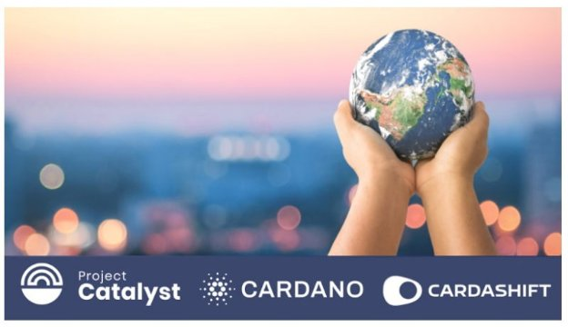

# Fund9 Catalyst Natives Cardashift challenge: demonstrating and monetizing impact
### **Project Catalyst announces Fund9’s Catalyst Natives challenge ‘Demonstrating and monetizing impact’ in conjunction with Cardashift, and a chance to fund up to $200k worth of projects using $CLAP tokens**
 1 June 2022[ Tim Richmond](tmp//en/blog/authors/tim-richmond/page-1/) 5 mins read

### [**Tim Richmond**](tmp//en/blog/authors/tim-richmond/page-1/)
Marketing and Communications Manager

Marketing & Communications

- 
- 

Input Output Global (IOG) is delighted to announce that [Cardashift](https://cardashift.com) will be joining [Fund9](https://bit.ly/Fund9-Launch-Guide) through the [Catalyst Natives](https://iohk.io/en/blog/posts/2021/11/10/introducing-catalyst-natives-how-any-business-can-leverage-the-cardano-innovation-engine) program, with a challenge centered around value creation through positive impact-oriented projects. Cardashift offers up to $200k of $CLAP tokens for selected proposals. This is on top of 12 other challenges in Fund9 where 16m ada is available for funded proposals and community incentives for contributions during the process, 

Đầu vào đầu ra Toàn cầu (IOG) rất vui mừng thông báo rằng [Cardashift] (https://cardashift.com) sẽ tham gia [Fund9] (https://bit.ly/fund9-launch-guide) thông qua [người bản địa chất xúc tác]
(https://iohk.io/en/blog/posts/2021/1
tập trung xung quanh việc tạo giá trị thông qua các dự án định hướng tác động tích cực.
Cardashift cung cấp tới $ 200K mã thông báo $ Clap cho các đề xuất được chọn.
Đây là trên hết 12 thách thức khác trong Fund9, nơi có 16M ADA có sẵn cho các đề xuất được tài trợ và ưu đãi cộng đồng cho các đóng góp trong quá trình này,

## **Catalyst Natives**

## ** Người bản địa Catalyst **

During Fund7, IOG introduced the pilot [Catalyst Natives program](https://iohk.io/en/blog/posts/2021/11/10/introducing-catalyst-natives-how-any-business-can-leverage-the-cardano-innovation-engine), enabling organizations outside of the Cardano/Catalyst ecosystem to present challenges and offer incentives and rewards to those who meet the challenge with their proposed innovations. 

Trong Fund7, IOG đã giới thiệu phi công [Chương trình người bản địa Catalyst] (https://iohk.io/en/blog/posts/2021/11/10/introducing-catalyst-Impress
-Cardano-Innovation-Engine), cho phép các tổ chức bên ngoài hệ sinh thái Cardano/Catalyst đưa ra những thách thức và đưa ra các ưu đãi và phần thưởng cho những người đáp ứng thách thức với những đổi mới được đề xuất của họ.

Catalyst Natives is a fantastic proposition for organizations of all shapes and sizes to access a veritable trove of ideas and those with the skills to realize them. 

Người bản địa Catalyst là một đề xuất tuyệt vời cho các tổ chức thuộc mọi hình dạng và quy mô để truy cập vào một kho ý tưởng thực sự và những người có kỹ năng để nhận ra chúng.

Cardashift aims to empower people to build a sustainable world through the Cardano protocol and help start-ups to monetize the impact they generate. To learn more about why Cardashift chose to build on the Cardano blockchain [click here](https://cardashift.medium.com/the-3-reasons-why-we-choose-cardano-to-maximize-our-impact-28b2e914e894).

Cardashift nhằm mục đích trao quyền cho mọi người xây dựng một thế giới bền vững thông qua giao thức Cardano và giúp các công ty khởi nghiệp kiếm tiền từ tác động mà họ tạo ra.
Để tìm hiểu thêm về lý do tại sao Cardashift chọn xây dựng trên blockchain Cardano [bấm vào đây] (https://cardashift.medium.com/the-3-reasons-thy-we-choose-cardano-to-maximize
28B2E914E894).

Cardashift enables and supports changemakers through its ecosystem of products and services and a community-run [launchpad](https://cardashift.com/launchpad) designed to fund and accelerate impact projects. The [$CLAP token](https://cardashift.com/tokenomics) underpins the Cardashift project. Watch Cardashift's ‘[Batch Genesis Demo Day](https://youtu.be/nSt465KIT_I)’.

Cardashift cho phép và hỗ trợ ChangeMakers thông qua hệ sinh thái sản phẩm và dịch vụ và một cộng đồng [LaunchPad] (https://cardashift.com/launchpad) được thiết kế để tài trợ và đẩy nhanh các dự án tác động.
[Mã thông báo $ Clap] (https://cardashift.com/tokenomics) củng cố dự án Cardashift.
Xem Ngày demo của Cardashift [Genesis Batch] (https://youtu.be/nst465kit_i).

Cardashift’s focus on providing a foundation of growth for projects with positive, real-world impact aligns with Project Catalyst’s ethos and mission.

Cardashift, tập trung vào việc cung cấp một nền tảng tăng trưởng cho các dự án với tác động tích cực, trong thế giới thực phù hợp với các đạo đức và nhiệm vụ của Project Catalyst.

## **The Cardashift Challenge - Demonstrating and monetizing impact**

## ** Thử thách Cardashift - Thể hiện và kiếm tiền từ tác động **

“Today, there is a gap between the value created for society by impact projects and the financial value they capture. Blockchain technology, and especially Cardano protocol, can be a gamechanger on this worldwide mission by bringing three key elements to the infrastructure: tokenization of non-financial value, traceability, and liquid marketplaces” **Yannis Baala, Project Sourcing Lead @Cardashift.**

Ngày nay, có một khoảng cách giữa giá trị được tạo ra cho xã hội bởi các dự án tác động và giá trị tài chính mà họ nắm bắt được.
Công nghệ blockchain, và đặc biệt là giao thức Cardano, có thể là một trò chơi trong nhiệm vụ trên toàn thế giới này bằng cách đưa ba yếu tố chính vào cơ sở hạ tầng: tokenization của giá trị phi tài chính, truy xuất nguồn gốc và thị trường lỏng
*

This challenge combines several themes. Monetizing impact requires the development of an entire ecosystem:

Thử thách này kết hợp một số chủ đề.
Tác động kiếm tiền đòi hỏi sự phát triển của toàn bộ hệ sinh thái:

- Actors capable of defining criteria (standard) on what impact means across different contexts (education, carbon cycle, biodiversity, etc.) and geographical locations.

- Các tác nhân có khả năng xác định các tiêu chí (tiêu chuẩn) về tác động nào có nghĩa là trong các bối cảnh khác nhau (giáo dục, chu kỳ carbon, đa dạng sinh học, v.v.) và các vị trí địa lý.

- Services and methods to issue impact credentials in a decentralized way with a peer-to-peer and expert review process

-Dịch vụ và phương pháp để ban hành thông tin xác thực theo cách phi tập trung với quy trình đánh giá ngang hàng và chuyên gia

- Certification bodies for analyzing and validating the data points provided by impact-oriented projects

- Các cơ quan chứng nhận để phân tích và xác nhận các điểm dữ liệu được cung cấp bởi các dự án định hướng tác động

- Mechanisms to give a financial value to impact - reflections on tokenizing impact

-

- On-chain tools for recording impact proofs and bringing more transparency and traceability

- Các công cụ trên chuỗi để ghi lại các bằng chứng tác động và mang lại sự minh bạch và truy xuất nguồn gốc

- On-chain marketplaces to connect impact-oriented projects with potential buyers (corporations, states organizations, funds, etc.) for their impact proofs These development paths are interconnected and the research can mix blockchain and non-blockchain approaches.

-Thị trường trên chuỗi để kết nối các dự án định hướng tác động với người mua tiềm năng (tập đoàn, tổ chức tiểu bang, quỹ, v.v.) cho các bằng chứng tác động của họ, các con đường phát triển này được kết nối với nhau và nghiên cứu có thể kết hợp các phương pháp tiếp cận blockchain và phi blockchain.

## **Defining success**

## ** Xác định thành công **

Cardashift’s ambition is to tackle one of the pain points of the impact ecosystem: the lack of financial attractiveness of impact projects. So, they are focusing on impact-oriented solutions and not projects that prioritize only Environmental, Social, and [Governance (ESG) Criteria](https://www.investopedia.com/terms/e/environmental-social-and-governance-esg-criteria.asp#:~:text=Environmental%2C%20social%2C%20and%20governance%20\(ESG\)%20criteria%20are%20a,addressing%20climate%20change%2C%20for%20example.). 

Tham vọng của Cardashift là để giải quyết một trong những điểm đau của hệ sinh thái tác động: sự thiếu hấp dẫn tài chính của các dự án tác động.
Vì vậy, họ đang tập trung vào các giải pháp định hướng tác động và không phải là các dự án chỉ ưu tiên các tiêu chí môi trường, xã hội và [quản trị (ESG)] (https://www.investopedia.com/terms/e/environmental-social-and-gounnance
-esg-riteria.asp#: ~: text = Môi trường%2C%20Social%2c%20and%20 Đoạn chính phủ%20 \ (ESG \)%20Criteria%20are%20a, giải quyết%20CLIMED%20Change%2C%20
.

Success for this challenge involves:

Thành công cho thử thách này liên quan đến:

- Discovering innovative ways for impact-oriented projects to create financial value from their impact generation, notably by issuing impact tokens. 

- Khám phá các cách sáng tạo cho các dự án định hướng tác động để tạo ra giá trị tài chính từ việc tạo tác động của chúng, đặc biệt là bằng cách phát hành mã thông báo tác động.

- Increasing transparency and traceability of the impact generated by a specific project. 

- Tăng tính minh bạch và truy xuất nguồn gốc của tác động được tạo ra bởi một dự án cụ thể.

Other protocols explore the idea of leveraging blockchain technology to build a sustainable world. The most famous example is the [IXO protocol](https://www.ixo.world/protocols), whose Impact Tokens aim to represent real-world outcomes.

Các giao thức khác khám phá ý tưởng tận dụng công nghệ blockchain để xây dựng một thế giới bền vững.
Ví dụ nổi tiếng nhất là [Giao thức IXO] (https://www.ixo.world/protocols), có các mã thông báo tác động nhằm thể hiện kết quả trong thế giới thực.

The tokenization of verified results through the IXO protocol transforms traditional certificate-based representations of results (e.g., carbon reduction certificates, education certificates, vaccination certificates, biodiversity certificates, or any other certified outcome state) into tradable and investable digital assets. 

Việc mã hóa kết quả đã được xác minh thông qua giao thức IXO chuyển đổi các biểu diễn kết quả dựa trên chứng chỉ truyền thống (ví dụ: chứng chỉ giảm carbon, chứng chỉ giáo dục, chứng chỉ tiêm chủng, chứng chỉ đa dạng sinh học hoặc bất kỳ trạng thái kết quả được chứng nhận nào khác) vào tài sản kỹ thuật số có thể giao dịch và có thể đầu tư.

However, impact tokenization is still nascent, and the question remains open: What kind of tools, interacting on and off-chain, can we develop to measure and value impact financially?

Tuy nhiên, quá trình mã hóa tác động vẫn còn non trẻ, và câu hỏi vẫn còn mở: loại công cụ nào, tương tác trên và ngoài chuỗi, chúng ta có thể phát triển để đo lường và đánh giá cao tác động về mặt tài chính không?

## **The key metric to measure**

## ** Số liệu chính để đo **

**For impact valuation & monetization projects:**

** Đối với các dự án định giá & kiếm tiền tác động: **

- Number of proof of concept trials that can run with impact-oriented projects

- Số lượng bằng chứng về các thử nghiệm khái niệm có thể chạy với các dự án định hướng tác động

- Time required to validate the impact value 

- Thời gian cần thiết để xác nhận giá trị tác động

- How much financial value can be delivered from impact-oriented projects 

- Bao nhiêu giá trị tài chính có thể được cung cấp từ các dự án định hướng tác động

- Scientific robustness of the validation process (e.g. inclusion of expert reviews)

- Sự mạnh mẽ khoa học của quá trình xác nhận (ví dụ: bao gồm các đánh giá của chuyên gia)

**For any marketplace projects:**

** Đối với bất kỳ dự án thị trường nào: **

## **During the challenge:**

## ** Trong thử thách: **

- Robustness of the revenue model for the marketplace (check with comparables, think it at scale, etc.)

- Sự mạnh mẽ của mô hình doanh thu cho thị trường (kiểm tra với các so sánh, nghĩ rằng nó ở quy mô, v.v.)

- Design of the transactions system on the platform

- Thiết kế hệ thống giao dịch trên nền tảng

- For the longer term

- Để lâu dài hơn

- Number of token issuers and interested buyers on the platform

- Số lượng người phát hành mã thông báo và người mua quan tâm trên nền tảng

- Number of transactions made on the platform

- Số lượng giao dịch được thực hiện trên nền tảng

## **How to take part in this challenge**

## ** Cách tham gia thử thách này **

To answer the Cardashift challenge and potentially earn up to $200k worth of $CLAP tokens, please review the [Fund9 Launch Guide](https://bit.ly/Fund9-Launch-Guide), where you will learn more about how to create an [account on the Catalyst collaboration platform](https://cardano.ideascale.com/), Ideascale, along with how to take part in this and all other Fund9 Challenges.

Để trả lời Thử thách Cardashift và có khả năng kiếm được tới $ 200K của Tokens $ 200k, vui lòng xem lại [Hướng dẫn khởi chạy của Fund9] (https://bit.ly/fund9-launch-guide), nơi bạn sẽ tìm hiểu thêm về cách
Tạo [tài khoản trên nền tảng cộng tác Catalyst] (https://cardano.ideascale.com/), IdeasCale, cùng với cách tham gia vào điều này và tất cả các thách thức khác của Fund9.

## **Project Catalyst**

## ** Chất xúc tác dự án **

[Project Catalyst](https://iohk.io/en/blog/posts/2021/02/12/our-million-dollar-baby-project-catalyst) is Cardano’s turbo-charged innovation engine and one of the world's most decentralized innovation funds. It is a focal point for ecosystem development and innovation, driven by the Cardano community.

[Project Catalyst] (https://iohk.io/en/blog/posts/2021/02/12/Our
Các quỹ đổi mới phi tập trung.
Đó là một tâm điểm cho sự phát triển và đổi mới hệ sinh thái, được thúc đẩy bởi cộng đồng Cardano.

Every quarter, Project Catalyst produces a fresh pipeline of technical, business, creative, and community-focused projects - funded to deliver their proposed ideas voted for by the Cardano and Catalyst community.

Mỗi quý, Project Catalyst tạo ra một đường ống mới về các dự án kỹ thuật, kinh doanh, sáng tạo và tập trung vào cộng đồng - được tài trợ để cung cấp các ý tưởng được đề xuất của họ được bình chọn bởi cộng đồng Cardano và Catalyst.

With [each funding round](https://docs.google.com/spreadsheets/d/1bfnWFa94Y7Zj0G7dtpo9W1nAYGovJbswipxiHT4UE3g/edit#gid=938310766), the community presents challenges across various Cardano-related projects. The community then answers these challenges and offers clearly-defined solutions. The community votes on the proposals and selects projects to receive funding.

Với [mỗi vòng tài trợ] (https://docs.google.com/spreadsheet/d/1bfnwfa94y7zj0g7dtpo9w1naygovjbswipxiHT4Ue3G/edit#gid=938310766)
Cộng đồng sau đó trả lời những thách thức này và đưa ra các giải pháp được xác định rõ ràng.
Cộng đồng bỏ phiếu cho các đề xuất và chọn các dự án để nhận tài trợ.

## **Find out more about Project Catalyst and the Natives Program**

## ** Tìm hiểu thêm về Project Catalyst và Chương trình Người bản địa **

To learn more about Project Catalyst, please subscribe to the [Catalyst mailing list](https://bit.ly/3dSZJvx) and join the [Discord](https://discord.gg/2RnUtK8) and [Telegram](https://t.me/cardanocatalyst) communities. You may also wish to join the Project Catalyst community every Wednesday at the TownHall, live-streamed on the Project Catalyst [YouTube Channel](https://www.youtube.com/playlist?list=PLnPTB0CuBOByRhpTUdALq4J89m_h7QqLk). 

Để tìm hiểu thêm về Project Catalyst, vui lòng đăng ký vào [Danh sách gửi thư Catalyst] (https://bit.ly/3dszjvx) và tham gia [Discord] (https://discord.gg/2rnutk8) và [Telegram] (https
: //t.me/cardanocatalyst) Cộng đồng.
Bạn cũng có thể muốn tham gia cộng đồng Project Catalyst vào mỗi thứ Tư tại Townhall, trực tiếp được phát trực tiếp trên Project Catalyst [Kênh YouTube] (https://www.youtube.com/playlist?list=PlNPTB0CubObyRhptudalq4J89M_H7QQQLK).

Are you interested in becoming the next Catalyst Native pilot? Do you have a specific business problem and would like to participate in the next Catalyst Natives pilot? Please [apply here](https://forms.gle/BA8LmtrAWWmHHcY59) and take the next steps toward accessing untapped potential.

Bạn có quan tâm đến việc trở thành phi công bản địa chất xúc tác tiếp theo?
Bạn có một vấn đề kinh doanh cụ thể và muốn tham gia vào các phi công người bản địa Catalyst tiếp theo?
Vui lòng áp dụng tại đây] (https://forms.gle/ba8lmtrawwmhhcy59) và thực hiện các bước tiếp theo để truy cập tiềm năng chưa được khai thác.

