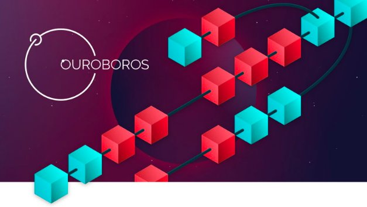

# From Classic to Chronos: the implementations of Ouroboros explained
### **Ouroboros is the consensus protocol of Cardano. Here, we explain what it does and how it’s evolving**
 3 June 2022[ Olga Hryniuk](tmp//en/blog/authors/olga-hryniuk/page-1/) 9 mins read

### [**Olga Hryniuk**](tmp//en/blog/authors/olga-hryniuk/page-1/)
Technical Writer

Marketing & Communications

- 
- 

You have probably heard a lot about Ouroboros: the ground-breaking proof-of-stake consensus protocol used by Cardano. Developed as a more energy-efficient and sustainable alternative to proof of work, upon which earlier cryptocurrencies – Bitcoin and, currently, Ethereum – are built, Ouroboros was the first blockchain consensus protocol to be developed through peer-reviewed research.

Bạn có thể đã nghe rất nhiều về Ouroboros: giao thức đồng thuận bằng chứng đột phá của Cardano.
Được phát triển như một sự thay thế hiệu quả hơn và bền vững hơn để chứng minh công việc, theo đó các loại tiền điện tử trước đó-Bitcoin và, hiện tại, Ethereum-được xây dựng, Ouroboros là giao thức đồng thuận blockchain đầu tiên được phát triển thông qua nghiên cứu được đánh giá ngang hàng.

Led by [Prof. Aggelos Kiayias](https://en.wikipedia.org/wiki/Aggelos_Kiayias) of the University of Edinburgh, Ouroboros and its subsequent implementations provide a new baseline to solve some of the world’s greatest challenges, securely and at scale.

Dẫn đầu bởi [Giáo sư.
Aggelos Kiayias] (https://en.wikipedia.org/wiki/aggelos_kiayias) của Đại học Edinburgh, Ouroboros và các triển khai tiếp theo của nó cung cấp một cơ sở mới để giải quyết một số thách thức lớn nhất thế giới, một cách an toàn và ở quy mô.

Yet recognition begins with education. This article presents an overview of how Ouroboros works. It examines the tangibles and covers what each implementation introduces, to further the community’s understanding of the protocol, and illustrates why it’s such a game-changer. A detailed analysis of each implementation can be found in the corresponding papers below. For a broad-stroke explanation of Ouroboros and its implementations, however, read on.

Tuy nhiên, sự công nhận bắt đầu với giáo dục.
Bài viết này trình bày một cái nhìn tổng quan về cách thức hoạt động của Ouroboros.
Nó kiểm tra các rối và bao gồm những gì mỗi triển khai giới thiệu, để tiếp tục sự hiểu biết của cộng đồng về giao thức và minh họa lý do tại sao nó lại là một người thay đổi trò chơi.
Một phân tích chi tiết về mỗi lần thực hiện có thể được tìm thấy trong các bài báo tương ứng dưới đây.
Tuy nhiên, đối với một lời giải thích rộng rãi về Ouoboros và việc triển khai của nó, hãy đọc tiếp.

- [Ouroboros Classic](https://iohk.io/en/research/library/papers/ouroborosa-provably-secure-proof-of-stake-blockchain-protocol/)

-[Ouroboros Classic] (https://iohk.io/en/research/l Library/papers/ouroborosa-proving-secure-proof-of-pe-blockchain-protocol/)

- [Ouroboros BFT](https://iohk.io/en/research/library/papers/ouroboros-bfta-simple-byzantine-fault-tolerant-consensus-protocol/)

-]

- [Ouroboros Praos](https://iohk.io/en/research/library/papers/ouroboros-praosan-adaptively-securesemi-synchronous-proof-of-stake-protocol/)

-]

- [Ouroboros Genesis](https://iohk.io/en/research/library/papers/ouroboros-genesiscomposable-proof-of-stake-blockchains-with-dynamic-availability/)

-[Ouroboros Genesis] (https://iohk.io/en/research/l Library/papers/ouroboros-genesiscomposable-proof-of-pete-blockchains-with-dynamic-aavailable/)

- [Ouroboros Crypsinous](https://iohk.io/en/research/library/papers/ouroboros-crypsinousprivacy-preserving-proof-of-stake/)

-[Ouroboros crypsinous] (https://iohk.io/en/research/l Library

- [Ouroboros Chronos](https://iohk.io/en/research/library/papers/ouroboros-chronospermissionless-clock-synchronization-via-proof-of-stake/)

-]

## **A word on consensus protocols, and why Ouroboros is different**

## ** Một từ về các giao thức đồng thuận và tại sao ouroboros là khác nhau **

It’s reasonable to assume that anybody new to the space might be confused by the term 'consensus protocol'. Put simply, a consensus protocol is the system of laws and parameters that govern the behavior of distributed ledgers: a ruleset by which each network participant plays to reach an agreement with everyone else.

Nó hợp lý khi cho rằng bất kỳ ai mới vào không gian đều có thể bị nhầm lẫn bởi thuật ngữ 'Giao thức đồng thuận'.
Nói một cách đơn giản, một giao thức đồng thuận là hệ thống luật và thông số chi phối hành vi của các sổ cái phân tán: một quy tắc mà mỗi người tham gia mạng chơi để đạt được thỏa thuận với mọi người khác.

Public blockchains aren’t controlled by any single, central authority. Instead, a consensus protocol is used to allow distributed network participants to agree on the history of the network captured on the blockchain – to reach a consensus on what has happened, and continue from a single source of truth.

Blockchains công cộng aren được kiểm soát bởi bất kỳ cơ quan trung ương nào.
Thay vào đó, một giao thức đồng thuận được sử dụng để cho phép những người tham gia mạng phân tán đồng ý về lịch sử của mạng được ghi lại trên blockchain - để đạt được sự đồng thuận về những gì đã xảy ra và tiếp tục từ một nguồn sự thật duy nhất.

That single source of truth provides a single record. This is why blockchains are sometimes referred to as trustless: instead of requiring participants to trust one another, trust is built into the protocol. Unknown actors may interact and transact with each other without relying on an intermediary to mediate, or for there to be a prerequisite exchange of personal data.

Nguồn sự thật duy nhất cung cấp một bản ghi duy nhất.
Đây là lý do tại sao các blockchain đôi khi được gọi là không đáng tin cậy: thay vì yêu cầu người tham gia tin tưởng lẫn nhau, niềm tin được xây dựng vào giao thức.
Các tác nhân không xác định có thể tương tác và giao dịch với nhau mà không cần dựa vào một trung gian để hòa giải, hoặc để có một sự trao đổi điều kiện tiên quyết của dữ liệu cá nhân.

Ouroboros is a proof-of-stake protocol, which is distinct from proof of work. Rather than relying on 'miners' to solve computationally complex equations to create new blocks – and rewarding the first to do so – proof of stake selects participants (in the case of Cardano, stake pools) to create new blocks based on the stake they control in the network.

Ouroboros là một giao thức chứng minh cổ phần, khác với bằng chứng công việc.
Thay vì dựa vào 'người khai thác' để giải các phương trình phức tạp tính toán để tạo các khối mới - và thưởng cho lần đầu tiên làm như vậy - bằng chứng về việc chọn người tham gia (trong trường hợp của Cardano, nhóm cổ phần) để tạo các khối mới dựa trên cổ phần mà họ kiểm soát
trong mạng.

Networks using Ouroboros are many times more energy-efficient than those using proof of work – and, through Ouroboros, Cardano is able to achieve unparalleled energy efficiency. As of 2022, Bitcoin, for example, requires [204.50 TWh](https://digiconomist.net/bitcoin-energy-consumption) per year which is comparable to the power consumption of Thailand. Ouroboros, on the other hand, runs a [Raspberry Pi](https://www.reddit.com/r/cardano/comments/e8t34d/rock_pi_cardano_full_node_for_100/), which has a power consumption of 15 to 18W (watts). The resulting difference in energy use can be analogized to that between a household and a country: one can be scaled to the mass market; the other cannot.

Các mạng sử dụng ouroboros tiết kiệm năng lượng nhiều hơn nhiều lần so với các mạng sử dụng bằng chứng công việc-và, thông qua Ouroboros, Cardano có thể đạt được hiệu quả năng lượng vô song.
Tính đến năm 2022, Bitcoin, ví dụ, yêu cầu [204.50 TWH] (https://digiconomist.net/bitcoin-ergenergy-consmum) mỗi năm tương đương với mức tiêu thụ năng lượng của Thái Lan.
Ouroboros, mặt khác, chạy [Raspberry Pi] (https://www.reddit.com/r/cardano/comments/e8t34d/rock_pi_cardano_full_node_for_100/)
Sự khác biệt kết quả trong việc sử dụng năng lượng có thể được tương tự giữa một hộ gia đình và một quốc gia: người ta có thể được thu nhỏ lại với thị trường đại chúng;
cái kia không thể.

Now, let’s take a closer look at how the Ouroboros protocol works, and what each new implementation adds.

Bây giờ, hãy để Lôi xem xét kỹ hơn về cách thức hoạt động của giao thức Ouoboros và những gì mỗi triển khai mới bổ sung.

## **Ouroboros Classic**

## ** Ouroboros Classic **

Let’s start with [Ouroboros](https://iohk.io/en/research/library/papers/ouroborosa-provably-secure-proof-of-stake-blockchain-protocol/): the first implementation of the Ouroboros protocol, published in 2017. This first implementation (referred to as Ouroboros Classic) laid the foundations for the protocol as an energy-efficient rival to proof of work, introduced the mathematical framework to analyze proof of stake, and introduced a novel incentive mechanism to reward participants in a proof-of-stake setting.

Hãy bắt đầu với [OuroBoros] (https://iohk.io/en/research/l Library
Vào năm 2017. Việc triển khai đầu tiên này (được gọi là Ouroboros Classic) đã đặt nền móng cho giao thức như một đối thủ tiết kiệm năng lượng để chứng minh công việc, đã giới thiệu khung toán học để phân tích bằng chứng về cổ phần và đưa ra một cơ chế khuyến khích mới lạ để thưởng cho những người tham gia vào việc thưởng thức những người tham gia tham gia vào việc thưởng cho những người tham gia tham gia vào
một cài đặt bằng chứng cổ phần.

More than this, however, what separated Ouroboros from other blockchains, and, specifically, proof-of-stake protocols was its ability to generate unbiased randomness in the protocol’s leader selection algorithm, and the subsequent security assurances that provided. Randomness prevents the formation of patterns and is a critical part of maintaining the protocol’s security. Whenever a behavior can be predicted, it can be exploited – and though Ouroboros ensures transparency, it prevents coercion. Significantly, Ouroboros was the first blockchain protocol to be developed with this type of rigorous security analysis.

Tuy nhiên, hơn thế nữa, điều tách biệt ouroboros với các blockchain khác, và cụ thể, các giao thức chứng minh cổ phần là khả năng tạo ra tính ngẫu nhiên không thiên vị trong thuật toán lựa chọn giao thức của người lãnh đạo giao thức và các đảm bảo bảo mật tiếp theo được cung cấp.
Tính ngẫu nhiên ngăn chặn sự hình thành các mẫu và là một phần quan trọng trong việc duy trì bảo mật giao thức.
Bất cứ khi nào một hành vi có thể được dự đoán, nó có thể được khai thác - và mặc dù Ouroboros đảm bảo tính minh bạch, nó ngăn chặn sự ép buộc.
Đáng kể, Ouroboros là giao thức blockchain đầu tiên được phát triển với loại phân tích bảo mật nghiêm ngặt này.

## **How Ouroboros works**

## ** Cách thức hoạt động của Ouroboros **

A comprehensive explanation of how Ouroboros works can be found in its [research paper](https://iohk.io/en/research/library/papers/ouroborosa-provably-secure-proof-of-stake-blockchain-protocol/). Ouroboros divides time on Cardano into epochs where each epoch is divided into slots. A slot is a short period of time in which a block can be created and grouping slots into epochs is central to adjusting the leader election process to the dynamically changing stake distribution.

Một lời giải thích toàn diện về cách thức hoạt động của Ouroboros trong [bài nghiên cứu] (https://iohk.io/en/research/l Library/papers/ouroborosa-provinger-secure-proof-of-prep
.
Ouroboros chia thời gian trên Cardano thành kỷ nguyên nơi mỗi kỷ nguyên được chia thành các khe.
Một khe là một khoảng thời gian ngắn trong đó một khối có thể được tạo và nhóm các vị trí thành các kỷ nguyên là trọng tâm để điều chỉnh quy trình bầu cử lãnh đạo thành phân phối cổ phần thay đổi động.

Central to Ouroboros’ design is that it must retain its security in the presence of attacks. As such, the protocol has built-in tolerance to prevent attackers from propagating alternative versions of the blockchain and assumes that an adversary may send arbitrary messages to any participant at any time. In fact, the protocol is guaranteed to be secure in the so-called synchronous setting (that is, with strong guarantees on message delivery times) so long as more than 51% of the stake is controlled by honest participants (that is, those following the protocol).

Trung tâm của thiết kế Ouroboros, là nó phải giữ được bảo mật của nó trước sự hiện diện của các cuộc tấn công.
Do đó, giao thức đã tích hợp dung sai để ngăn chặn những kẻ tấn công lan truyền các phiên bản thay thế của blockchain và giả định rằng một kẻ thù có thể gửi tin nhắn tùy ý cho bất kỳ người tham gia nào bất cứ lúc nào.
Trên thực tế, giao thức được đảm bảo sẽ được bảo mật trong cài đặt được gọi là đồng bộ (nghĩa là với các đảm bảo mạnh mẽ về thời gian gửi tin nhắn) miễn là hơn 51% cổ phần được kiểm soát bởi những người tham gia trung thực (nghĩa là
giao thức).

A slot leader is elected for each slot, who is responsible for adding a block to the chain and passing it to the next slot leader. To protect against adversarial attempts to subvert the protocol, each new slot leader is required to consider the last few blocks of the received chain as transient: only the chain that precedes the prespecified number of transient blocks is considered settled. This is also referred to as the settlement delay. Among other things, this means that a stakeholder can go offline and still be synced to the blockchain, so long as it’s not for more than the settlement delay.

Một người lãnh đạo khe được bầu cho mỗi vị trí, người chịu trách nhiệm thêm một khối vào chuỗi và chuyển nó cho người lãnh đạo khe tiếp theo.
Để bảo vệ chống lại các nỗ lực đối nghịch để lật đổ giao thức, mỗi người lãnh đạo khe mới được yêu cầu xem xét một vài khối cuối cùng của chuỗi nhận được là thoáng qua: chỉ chuỗi đi trước số lượng khối thoáng qua được chỉ định trước được coi là giải quyết.
Điều này cũng được gọi là độ trễ giải quyết.
Trong số những thứ khác, điều này có nghĩa là một bên liên quan có thể ngoại tuyến và vẫn được đồng bộ hóa với blockchain, miễn là nó không phải là nhiều hơn độ trễ giải quyết.

Within the Ouroboros protocol, each network node stores a copy of the transaction mempool – where transactions are added if they are consistent with existing transactions – and the blockchain. The locally stored blockchain is replaced when the node becomes aware of an alternative, longer valid chain.

Trong giao thức OuroBoros, mỗi nút mạng lưu trữ một bản sao của mempool giao dịch - nơi các giao dịch được thêm vào nếu chúng phù hợp với các giao dịch hiện có - và blockchain.
Blockchain được lưu trữ cục bộ được thay thế khi nút nhận thức được một chuỗi thay thế, có giá trị dài hơn.

The drawback of Ouroboros Classic was that it was susceptible to adaptive attackers – a significant threat in a real-world setting that was resolved with Ouroboros Praos – and had no secure way for a new participant to bootstrap from the blockchain, which was resolved with Ouroboros Genesis.

Hạn chế của Ouroboros Classic là nó dễ bị những kẻ tấn công thích nghi-một mối đe dọa đáng kể trong môi trường trong thế giới thực đã được giải quyết với Ouroboros PRAOS-và không có cách nào an toàn cho người tham gia mới để bootstrap từ blockchain, đã được giải quyết với Ouroboros
Genesis.

**Ouroboros BFT**

** OUROBOROS BFT **

[Ouroboros BFT](https://iohk.io/en/research/library/papers/ouroboros-bfta-simple-byzantine-fault-tolerant-consensus-protocol/) came next, derived as a simple special case from the analysis of Classic. Ouroboros BFT (Byzantine Fault Tolerance) is a simple protocol that was used by Cardano during the [Byron reboot](https://iohk.io/en/blog/posts/2020/03/30/what-the-byron-reboot-means-for-cardano/), which was the transition of the old Cardano codebase to the new. Ouroboros BFT helped prepare Cardano’s network for Shelley’s release and, with that, its decentralization.

[Ouroboros BFT] (https://iohk.io/en/research/l Library
Của cổ điển.
Ouroboros BFT (dung sai lỗi Byzantine) là một giao thức đơn giản được sử dụng bởi Cardano trong quá trình khởi động lại [Byron] (https://iohk.io/en/blog/posts/2020/03/30/what-the- byron-reboot
-Means-for-cardano/), đó là sự chuyển đổi của cơ sở mã Cardano cũ sang mới.
Ouroboros BFT đã giúp chuẩn bị mạng Cardano, để phát hành Shelley, và, với điều đó, sự phân cấp của nó.

Rather than requiring nodes to be online all of the time, Ouroboros BFT assumed a federated network of servers and synchronous communication between the servers for building the blockchain. In this federated setting, it is a consensus protocol that is attractive due to its simplicity and deterministic nature. It is worth noting that BFT required a larger fraction of honest parties than other Ouroboros versions.

Thay vì yêu cầu các nút trực tuyến mọi lúc, OuroBoros BFT giả định một mạng lưới máy chủ được liên kết và giao tiếp đồng bộ giữa các máy chủ để xây dựng blockchain.
Trong môi trường liên kết này, đó là một giao thức đồng thuận hấp dẫn do tính đơn giản và bản chất xác định của nó.
Điều đáng chú ý là BFT yêu cầu một phần lớn các bên trung thực hơn các phiên bản ouroboros khác.

## **Ouroboros Praos**

## ** OUROBOROS PRAOS **

[Ouroboros Praos](https://iohk.io/en/research/library/papers/ouroboros-praosan-adaptively-securesemi-synchronous-proof-of-stake-protocol/) builds upon – and provides substantial security and scalability improvements to – Ouroboros Classic.

[Ouroboros PRAOS] (https://iohk.io/en/research/l Library
đến - Ouroboros Classic.

As with Ouroboros Classic, Ouroboros Praos processes transaction blocks by dividing chains into slots, which are aggregated into epochs. Unlike Ouroboros Classic, however, Praos is analyzed in a semi-synchronous setting and is secure against adaptive attackers.

Như với Ouroboros Classic, Ouroboros PRAOS xử lý các khối giao dịch bằng cách chia chuỗi thành các khe, được tổng hợp thành các kỷ nguyên.
Tuy nhiên, không giống như Ouroboros Classic, PRAOS được phân tích trong một khung cảnh bán đồng bộ và an toàn trước những kẻ tấn công thích ứng.

It assumes two possibilities: that adversaries can delay honest participant messages for longer than one slot, and that an adversary may send arbitrary messages to any participant at any time.

Nó giả định hai khả năng: rằng các đối thủ có thể trì hoãn các tin nhắn người tham gia trung thực lâu hơn một vị trí và một kẻ thù có thể gửi tin nhắn tùy ý cho bất kỳ người tham gia nào bất cứ lúc nào.

Through private-leader selection and forward-secure, key-evolving signatures, Praos provides better epoch randomness and ensures that a strong adversary cannot predict the next slot leader and launch a focused attack (such as a DDoS attack) to subvert the protocol. Praos is also able to tolerate adversarially-controlled message delivery delays and gradual corruption of individual participants in an evolving stakeholder population, which is critical for maintaining network security in a global setting, provided that an honest majority of stake is maintained.

Thông qua lựa chọn lãnh đạo tư nhân và bảo mật về phía trước, các chữ ký phát triển khóa, PRAOS cung cấp tính ngẫu nhiên kỷ nguyên tốt hơn và đảm bảo rằng một kẻ thù mạnh mẽ không thể dự đoán được người lãnh đạo khe tiếp theo và khởi động một cuộc tấn công tập trung (như cuộc tấn công DDOS) để lật đổ giao thức.
PRAOS cũng có thể chịu đựng sự chậm trễ về việc gửi tin nhắn do bất lợi và tham nhũng dần dần của từng người tham gia vào dân số các bên liên quan đang phát triển, điều này rất quan trọng để duy trì bảo mật mạng trong môi trường toàn cầu, với điều kiện là phần lớn các cổ phần trung thực được duy trì.

## **Ouroboros Genesis**

## ** Ouroboros Genesis **

Then, there is [Ouroboros Genesis.](https://iohk.io/en/research/library/papers/ouroboros-genesiscomposable-proof-of-stake-blockchains-with-dynamic-availability/) Genesis further improves upon Ouroboros Praos by adding a novel chain selection rule, which enables parties to bootstrap from a genesis block – without, significantly, the need for trusted checkpoints or assumptions about past availability. Genesis also provides proof of the protocol’s Universal Composability, which demonstrates that the protocol can be composed with other protocols in arbitrary configurations in a real-world setting, without losing its security properties. This significantly contributes to its security and sustainability, and that of the networks using it.

Sau đó, có [Genesis Ouroboros.] (Https://iohk.io/en/research/l Library
Praos bằng cách thêm một quy tắc lựa chọn chuỗi mới, cho phép các bên khởi động từ một khối genesis - không có, đáng kể, nhu cầu về các điểm kiểm tra hoặc giả định đáng tin cậy về tính sẵn có trong quá khứ.
Genesis cũng cung cấp bằng chứng về khả năng kết hợp phổ quát của giao thức, chứng minh rằng giao thức có thể được cấu tạo với các giao thức khác trong các cấu hình tùy ý trong môi trường thực tế, mà không mất các thuộc tính bảo mật của nó.
Điều này đóng góp đáng kể vào tính bảo mật và tính bền vững của nó, và của các mạng sử dụng nó.

**Ouroboros Crypsinous**

** Ouroboros crypsinous **

[Ouroboros Crypsinous](https://iohk.io/en/research/library/papers/ouroboros-crypsinousprivacy-preserving-proof-of-stake/) equips Genesis with privacy-preserving properties. It is the first formally analyzed privacy-preserving proof-of-stake blockchain protocol, which achieves security against adaptive attacks while maintaining strong privacy guarantees by introducing a new coin evolution technique relying on SNARKs and key-private forward-secure encryption. Crypsinous isn’t currently planned to be implemented on Cardano, but it can be used by other chains for increased privacy-preserving settings.

.
Đây là giao thức blockchain bằng chứng bảo tồn quyền riêng tư đầu tiên được phân tích chính thức, đạt được bảo mật chống lại các cuộc tấn công thích ứng trong khi duy trì bảo đảm quyền riêng tư mạnh mẽ bằng cách đưa ra một kỹ thuật tiến hóa tiền xu mới dựa vào bẫy và mã hóa bảo hiểm chuyển tiếp.
Cypsinous hiện đang được lên kế hoạch để thực hiện trên Cardano, nhưng nó có thể được sử dụng bởi các chuỗi khác để tăng các cài đặt bảo tồn quyền riêng tư.

## **Ouroboros Chronos**

## ** Ouroboros Chronos **

Last but not least is [Ouroboros Chronos](https://iohk.io/en/research/library/papers/ouroboros-chronospermissionless-clock-synchronization-via-proof-of-stake/). [Chronos](https://iohk.io/en/blog/posts/2021/10/27/ouroboros-chronos-provides-the-first-high-resilience-cryptographic-time-source-based-on-blockchain/) achieves two goals: first, it shows how blockchain protocols can synchronize clocks securely via a novel time synchronization mechanism and thereby become independent of external time services. Second, it is a cryptographically secure blockchain protocol that additionally provides a cryptographically secure source of time to other protocols. In short, Chronos makes the ledger more resistant to attacks that target time information.

Cuối cùng nhưng không kém phần quan trọng là [Ouroboros Chronos] (https://iohk.io/en/research/l Library/papers/ouroboros-chronospermissionless-clock-synchronization-viia
[Chronos] (https://iohk.io/en/blog/posts/2021/10/27/ouroboros-chronos-provides-the-first-high-resilience-cryptographic-thời gian
) Đạt được hai mục tiêu: Thứ nhất, nó cho thấy cách các giao thức blockchain có thể đồng bộ hóa đồng hồ một cách an toàn thông qua cơ chế đồng bộ hóa thời gian mới và do đó trở nên độc lập với các dịch vụ thời gian bên ngoài.
Thứ hai, đây là một giao thức blockchain bảo mật bằng mã hóa, cũng cung cấp một nguồn thời gian an toàn bằng mã hóa cho các giao thức khác.
Nói tóm lại, Chronos làm cho sổ cái chống lại các cuộc tấn công nhắm vào thông tin thời gian.

From an application point of view, Chronos can dramatically boost the resilience of critical telecommunications, transport, and other IT infrastructures that require the synchronization of local time to a unified network clock that has no single point of failure.

Từ quan điểm ứng dụng, Chronos có thể thúc đẩy đáng kể khả năng phục hồi của viễn thông quan trọng, vận chuyển và cơ sở hạ tầng CNTT khác đòi hỏi phải đồng bộ hóa thời gian địa phương với đồng hồ mạng thống nhất không có điểm thất bại nào.

## **The future of Ouroboros**

## ** Tương lai của Ouroboros **

Ouroboros, named after the symbol of infinity, is the backbone of the Cardano ecosystem. The protocol serves as a foundation and staging point for self-propagating systems that cyclically transform and grow, supplanting existing systems – financial and otherwise – and disintermediating the power structures upon which they rely. It is the beginning of a new standard, defined not from the center but, instead, from the margins.

Ouroboros, được đặt tên theo biểu tượng của Infinity, là xương sống của hệ sinh thái Cardano.
Nghị định thư đóng vai trò là điểm nền tảng và điểm tổ chức cho các hệ thống tự mở rộng, biến đổi theo chu kỳ và phát triển, thay thế các hệ thống hiện có-tài chính và mặt khác-và làm mất đi các cấu trúc quyền lực mà chúng dựa vào.
Đó là sự khởi đầu của một tiêu chuẩn mới, được xác định không phải từ trung tâm mà thay vào đó, từ lề.

Currently, Cardano operates based on Ouroboros Praos. Genesis is being implemented for 2022 after which the ledger will be upgraded to support Ouroboros Chronos.

Hiện tại, Cardano hoạt động dựa trên Ouroboros PRAOS.
Genesis đang được triển khai vào năm 2022 sau đó sổ cái sẽ được nâng cấp để hỗ trợ Ouroboros Chronos.

Its future is as its past: a tireless effort to explore, iterate, optimize, and drive positive change through rigorous research. Each step in Ouroboros’ journey is a new evolution, which takes us closer to the vision of a fairer, securer, and more sustainable world.

Tương lai của nó là quá khứ của nó: một nỗ lực không mệt mỏi để khám phá, lặp lại, tối ưu hóa và thúc đẩy thay đổi tích cực thông qua nghiên cứu nghiêm ngặt.
Mỗi bước trong hành trình Ouroboros, là một sự tiến hóa mới, đưa chúng ta đến gần hơn với tầm nhìn của một thế giới công bằng, bảo mật và bền vững hơn.

*This post is an updated version of the original (created by Kieran Costello) that has been updated to cover new protocol versions.*

*Bài đăng này là phiên bản cập nhật của bản gốc (được tạo bởi Kieran Costello) đã được cập nhật để bao gồm các phiên bản giao thức mới.*

