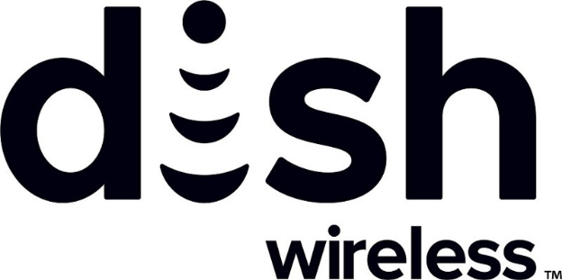

# DISH launches decentralized identification and loyalty coin system built on Input Output Global (IOG) technology
### **The initiative is part of a long-term collaboration between DISH and IOG to create innovative blockchain solutions to drive adoption of decentralized technologies into the DISH ecosystem**
 7 June 2022[ Fernando Sanchez](tmp//en/blog/authors/fernando-sanchez/page-1/) 4 mins read

### [**Fernando Sanchez**](tmp//en/blog/authors/fernando-sanchez/page-1/)
Technical Writer

Marketing and Communications

- 
- 

DISH Network Corporation has taken the first step towards the launch of a decentralized identification and loyalty coin system built on Input Output Global (IOG) designed and developed blockchain technology. This first step enables blockchain capabilities in DISH's infrastructure through Atala PRISM's identity services and Cardano's native asset features.

The end objective of this collaboration is to create a robust and fully digital and decentralized identification and loyalty framework built first on the Cardano blockchain.

DISH is a satellite television company headquartered in Colorado, United States. During the 2021 Cardano Summit, [IOG's CEO Charles Hoskinson announced](https://youtu.be/MPobkiSbx5M) that both companies would cooperate to create novel blockchain solutions to drive adoption of decentralized ledger technology.

This MVP is part of the CRONUS project, a long-term, innovative collaboration between IOG and DISH to make blockchain a core part of the DISH ecosystem and its overall consumer strategy going forward. 
## **How does the CRONUS MVP work?**
The MVP represents the beginning of a journey towards creating a backend token-based loyalty system supported by blockchain technology. The first step in that journey is enabling the minting of loyalty tokens on the Cardano blockchain that duplicate the loyalty coins balance in DISH’s BoostOne loyalty program.

Cardano tracks the balance of loyalty coins or Boostcoinâ„¢ accrued by customers, and mints or burns the loyalty tokens accordingly. The loyalty token balance is adjusted in a nightly batch operation, using a DISH-controlled wallet. IOG will not have access to this wallet. To avoid including any personally identifiable customer information, the MVP leverages the Atala SDK library to generate an unpublished decentralized identifier (DID).
## **Core MVP capabilities**
Upon launch, the MVP will offer these capabilities:

- Loyalty ledger database that tracks Boostcoins and shows how many loyalty tokens need to be minted/burned so the token balance matches the loyalty coin balance.
- API to mint and control tokens on the Cardano mainnet.
- Cardano mainnet where loyalty tokens are minted and burned according to the data provided by the loyalty ledger database.
- DISH organizational wallet that holds all Boostcoins. The wallet executes minting and burning transactions during nightly batch updates.
- Generation of an unpublished DID for each customer. This DID is mapped in the customer master, which sits outside the MVP. DIDs are created with the Atala SDK library but are not themselves published on the Cardano blockchain.

The MVP includes two APIs:

1. API to mint and control tokens on the Cardano mainnet blockchain
- Mint/burn loyalty tokens
- Query total number of tokens in circulation
2. API for the loyalty ledger database
- Add loyalty coins to a customer’s account
- Deduct loyalty coins from a customer’s account
- Query loyalty coin balance and transactions of each customer

This MVP represents the first step in a major blockchain adoption journey. This first step is about **blockchain enablement**. DISH will become a participant in the Cardano Ecosystem by running various nodes, issuing DIDs, minting and burning native assets. The next stage will involve **blockchain adoption** where DISH users will be slowly introduced to the different aspects of the blockchain ecosystems. Including but not limited to having a wallet.
## **MVP: user stories**
The CRONUS MVP opens up a range of opportunities, both for DISH itself and for its development partner, IOG. But ultimately, the DISH customer base will get the greatest benefit. The MVP enables BoostOne app users to see their total loyalty coin balance and transactions, for example.

The MVP also enables greater control for backend BoostOne administrators, as they can:

- Add or remove loyalty coins from a BoostOne app user’s account as needed.
- Mint or burn tokens on the Cardano Mainnet as needed to provide BoostOne customers with loyalty coins they have earned.
- Have sole control over the Dish loyalty token wallet so customers cannot directly interact with loyalty tokens.
- Reference an unpublished DID to identify the customer associated with a loyalty coin account.
## **Conclusion**
This pioneering MVP represents a major step towards the integration of blockchain-enabled systems into the telecommunications ecosystem, and specifically for the creation of loyalty programs powered by decentralized ledgers.
