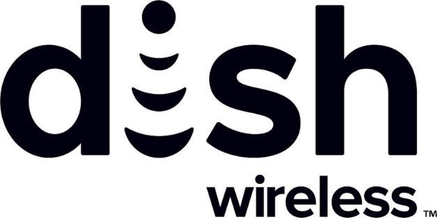

# DISH launches decentralized identification and loyalty coin system built on Input Output Global (IOG) technology
### **The initiative is part of a long-term collaboration between DISH and IOG to create innovative blockchain solutions to drive adoption of decentralized technologies into the DISH ecosystem**
 7 June 2022[ Fernando Sanchez](tmp//en/blog/authors/fernando-sanchez/page-1/) 4 mins read

### [**Fernando Sanchez**](tmp//en/blog/authors/fernando-sanchez/page-1/)
Technical Writer

Marketing and Communications

- 
- 

DISH Network Corporation has taken the first step towards the launch of a decentralized identification and loyalty coin system built on Input Output Global (IOG) designed and developed blockchain technology. This first step enables blockchain capabilities in DISH's infrastructure through Atala PRISM's identity services and Cardano's native asset features.

Dish Network Corporation đã thực hiện bước đầu tiên để ra mắt một hệ thống đồng nhận định danh và trung thành được xây dựng dựa trên công nghệ blockchain đầu ra đầu ra (IOG) được thiết kế và phát triển.
Bước đầu tiên này cho phép các khả năng blockchain trong cơ sở hạ tầng của Dish thông qua các dịch vụ nhận dạng của Atala Prism và các tính năng tài sản bản địa của Cardano.

The end objective of this collaboration is to create a robust and fully digital and decentralized identification and loyalty framework built first on the Cardano blockchain.

Mục tiêu cuối cùng của sự hợp tác này là tạo ra một khung nhận dạng và trung thành mạnh mẽ và phi tập trung đầy đủ và phi tập trung được xây dựng đầu tiên trên blockchain Cardano.

DISH is a satellite television company headquartered in Colorado, United States. During the 2021 Cardano Summit, [IOG's CEO Charles Hoskinson announced](https://youtu.be/MPobkiSbx5M) that both companies would cooperate to create novel blockchain solutions to drive adoption of decentralized ledger technology.

Dish là một công ty truyền hình vệ tinh có trụ sở tại Colorado, Hoa Kỳ.
Trong hội nghị thượng đỉnh Cardano năm 2021, [Giám đốc điều hành của IOG Charles Hoskinson đã công bố] (https://youtu.be/mpobkisbx5m) rằng cả hai công ty sẽ hợp tác để tạo ra các giải pháp blockchain mới để thúc đẩy việc áp dụng công nghệ sổ cái phi tập trung.

This MVP is part of the CRONUS project, a long-term, innovative collaboration between IOG and DISH to make blockchain a core part of the DISH ecosystem and its overall consumer strategy going forward. 

MVP này là một phần của Dự án Cronus, sự hợp tác lâu dài, sáng tạo giữa IOG và Dish để biến Blockchain thành một phần cốt lõi của hệ sinh thái Dish và chiến lược tiêu dùng tổng thể của nó trong tương lai.

## **How does the CRONUS MVP work?**

## ** Làm thế nào để cronus mvp hoạt động? **

The MVP represents the beginning of a journey towards creating a backend token-based loyalty system supported by blockchain technology. The first step in that journey is enabling the minting of loyalty tokens on the Cardano blockchain that duplicate the loyalty coins balance in DISH’s BoostOne loyalty program.

MVP đại diện cho sự khởi đầu của một hành trình hướng tới việc tạo ra một hệ thống lòng trung thành dựa trên mã thông báo phụ trợ được hỗ trợ bởi công nghệ blockchain.
Bước đầu tiên trong hành trình đó là cho phép khai thác các mã thông báo trung thành trên blockchain Cardano nhằm nhân đôi cân bằng đồng tiền trung thành trong chương trình khách hàng thân thiết của Boostone.

Cardano tracks the balance of loyalty coins or Boostcoinâ„¢ accrued by customers, and mints or burns the loyalty tokens accordingly. The loyalty token balance is adjusted in a nightly batch operation, using a DISH-controlled wallet. IOG will not have access to this wallet. To avoid including any personally identifiable customer information, the MVP leverages the Atala SDK library to generate an unpublished decentralized identifier (DID).

Cardano theo dõi sự cân bằng của các đồng tiền trung thành hoặc BoostCoinâ „¢ được tích lũy bởi khách hàng, và bạc hà hoặc đốt cháy các mã thông báo trung thành cho phù hợp.
Số dư mã thông báo trung thành được điều chỉnh trong một hoạt động hàng loạt hàng đêm, sử dụng ví điều khiển bằng đĩa.
IOG sẽ không có quyền truy cập vào ví này.
Để tránh bao gồm bất kỳ thông tin khách hàng nào có thể nhận dạng cá nhân, MVP tận dụng thư viện ATALA SDK để tạo một định danh phi tập trung chưa được công bố (DID).

## **Core MVP capabilities**

## ** Khả năng MVP cốt lõi **

Upon launch, the MVP will offer these capabilities:

Sau khi ra mắt, MVP sẽ cung cấp các khả năng này:

- Loyalty ledger database that tracks Boostcoins and shows how many loyalty tokens need to be minted/burned so the token balance matches the loyalty coin balance.

- Cơ sở dữ liệu Sổ cái trung thành theo dõi BoostCoin và cho thấy có bao nhiêu mã thông báo trung thành cần được đúc/đốt để cân bằng mã thông báo phù hợp với sự cân bằng đồng xu trung thành.

- API to mint and control tokens on the Cardano mainnet.

- API để bạc hà và kiểm soát mã thông báo trên cardano mainnet.

- Cardano mainnet where loyalty tokens are minted and burned according to the data provided by the loyalty ledger database.

- Cardano Mainnet nơi các mã thông báo trung thành được đúc và đốt theo dữ liệu được cung cấp bởi cơ sở dữ liệu Sổ cái khách hàng thân thiết.

- DISH organizational wallet that holds all Boostcoins. The wallet executes minting and burning transactions during nightly batch updates.

- Ví tổ chức món ăn giữ tất cả các boostcoin.
Ví thực hiện các giao dịch khai thác và đốt trong các bản cập nhật hàng loạt hàng đêm.

- Generation of an unpublished DID for each customer. This DID is mapped in the customer master, which sits outside the MVP. DIDs are created with the Atala SDK library but are not themselves published on the Cardano blockchain.

- Thế hệ của một người chưa được công bố đã làm cho mỗi khách hàng.
Điều này đã được ánh xạ trong chủ khách hàng, nằm ngoài MVP.
DIDS được tạo ra với thư viện Atala SDK nhưng không được xuất bản trên blockchain Cardano.

The MVP includes two APIs:

MVP bao gồm hai API:

1. API to mint and control tokens on the Cardano mainnet blockchain

1. API để bạc hà và kiểm soát mã thông báo trên blockchain Cardano Mainnet

- Mint/burn loyalty tokens

- Mint/Burn lòng trung thành

- Query total number of tokens in circulation

- Truy vấn tổng số mã thông báo đang lưu hành

2. API for the loyalty ledger database

2. API cho cơ sở dữ liệu sổ cái khách hàng thân thiết

- Add loyalty coins to a customer’s account

- Thêm tiền trung thành vào tài khoản của khách hàng

- Deduct loyalty coins from a customer’s account

- khấu trừ tiền trung thành từ tài khoản của khách hàng

- Query loyalty coin balance and transactions of each customer

- Truy vấn cân bằng đồng xu trung thành và giao dịch của mỗi khách hàng

This MVP represents the first step in a major blockchain adoption journey. This first step is about **blockchain enablement**. DISH will become a participant in the Cardano Ecosystem by running various nodes, issuing DIDs, minting and burning native assets. The next stage will involve **blockchain adoption** where DISH users will be slowly introduced to the different aspects of the blockchain ecosystems. Including but not limited to having a wallet.

MVP này đại diện cho bước đầu tiên trong một hành trình áp dụng blockchain lớn.
Bước đầu tiên này là về ** hỗ trợ blockchain **.
Dish sẽ trở thành người tham gia vào hệ sinh thái Cardano bằng cách chạy các nút khác nhau, phát hành DIDS, Masting và đốt tài sản bản địa.
Giai đoạn tiếp theo sẽ liên quan đến việc áp dụng blockchain ** trong đó người dùng Dish sẽ được giới thiệu từ từ các khía cạnh khác nhau của hệ sinh thái blockchain.
Bao gồm nhưng không giới hạn để có một ví.

## **MVP: user stories**

## ** MVP: Câu chuyện của người dùng **

The CRONUS MVP opens up a range of opportunities, both for DISH itself and for its development partner, IOG. But ultimately, the DISH customer base will get the greatest benefit. The MVP enables BoostOne app users to see their total loyalty coin balance and transactions, for example.

Cronus MVP mở ra một loạt các cơ hội, cả cho chính món ăn và đối tác phát triển của nó, IOG.
Nhưng cuối cùng, cơ sở khách hàng của Dish sẽ nhận được lợi ích lớn nhất.
Ví dụ, MVP cho phép người dùng ứng dụng Boostone thấy tổng số dư và giao dịch đồng xu khách hàng thân thiết của họ.

The MVP also enables greater control for backend BoostOne administrators, as they can:

MVP cũng cho phép kiểm soát lớn hơn cho các quản trị viên Boostone phụ trợ, như họ có thể:

- Add or remove loyalty coins from a BoostOne app user’s account as needed.

- Thêm hoặc xóa các đồng tiền trung thành khỏi tài khoản của người dùng ứng dụng Boostone khi cần thiết.

- Mint or burn tokens on the Cardano Mainnet as needed to provide BoostOne customers with loyalty coins they have earned.

- Mint hoặc Burn Token trên Cardano Mainnet khi cần thiết để cung cấp cho khách hàng Boostone những đồng tiền trung thành mà họ đã kiếm được.

- Have sole control over the Dish loyalty token wallet so customers cannot directly interact with loyalty tokens.

- Có quyền kiểm soát duy nhất đối với ví mã thông báo trung thành của món ăn để khách hàng không thể tương tác trực tiếp với mã thông báo trung thành.

- Reference an unpublished DID to identify the customer associated with a loyalty coin account.

- Tham khảo một chưa được công bố đã làm để xác định khách hàng liên quan đến tài khoản Coin khách hàng thân thiết.

## **Conclusion**

## **Sự kết luận**

This pioneering MVP represents a major step towards the integration of blockchain-enabled systems into the telecommunications ecosystem, and specifically for the creation of loyalty programs powered by decentralized ledgers.

MVP tiên phong này thể hiện một bước quan trọng đối với việc tích hợp các hệ thống hỗ trợ blockchain vào hệ sinh thái viễn thông và đặc biệt để tạo ra các chương trình khách hàng thân thiết được cung cấp bởi các sổ cái phi tập trung.

