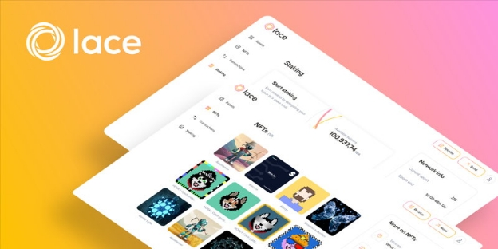

# Lace: speed, simplicity, and seamless flow
### **IOG’s new light wallet – now in development – will help drive adoption by offering enhanced capability and ease of use to crypto users**
 10 June 2022[ Olga Hryniuk](tmp//en/blog/authors/olga-hryniuk/page-1/) 3 mins read

### [**Olga Hryniuk**](tmp//en/blog/authors/olga-hryniuk/page-1/)
Technical Writer

Marketing & Communications

- 
- 

Wallets allow crypto users to safely store and access their digital assets. They come in different forms, from desktop and mobile applications to hardware (USB-like) devices.

Ví cho phép người dùng Crypto lưu trữ và truy cập tài sản kỹ thuật số của họ một cách an toàn.
Chúng có các dạng khác nhau, từ các ứng dụng máy tính để bàn và di động đến các thiết bị phần cứng (giống như USB).

The [Daedalus](https://daedaluswallet.io/) wallet is IOG’s full node implementation and it is a desktop application that fully synchronizes with the blockchain history. While full node wallets are a good option for more tech-savvy users, these wallets consume a significant amount of resources and take longer to sync because they hold a full copy of the blockchain. So a full-node wallet might not suit users requiring fast access to their assets. As Cardano reaches more mainstream audiences – and developing markets – an alternative is required.

Ví [Daedalus] (https://daedaluswallet.io/) là triển khai nút đầy đủ của IOG và nó là một ứng dụng máy tính để bàn đồng bộ hóa hoàn toàn với lịch sử blockchain.
Mặc dù ví nút đầy đủ là một lựa chọn tốt cho người dùng am hiểu công nghệ hơn, các ví này tiêu thụ một lượng tài nguyên đáng kể và mất nhiều thời gian hơn để đồng bộ hóa vì chúng chứa một bản sao đầy đủ của blockchain.
Vì vậy, một ví toàn nút có thể không phù hợp với người dùng yêu cầu truy cập nhanh vào tài sản của họ.
Khi Cardano tiếp cận nhiều khán giả chính - và thị trường đang phát triển - cần phải có một giải pháp thay thế.

To simplify the experience for wallet users, IOG is developing Lace ‒ a ‘one-stop-shop’ for all blockchain operations. This new platform will be feature-packed, yet lightweight, streamlining online finance. Acting as a portal to Web3.0, Lace will encompass elements of true decentralization. This means that users will be able to interact with other users and organizations in a peer-to-peer way, exchanging data and assets without relying on third parties.

Để đơn giản hóa trải nghiệm cho người dùng ví, IOG đang phát triển ren-một shop-shop-shop shop cho tất cả các hoạt động blockchain.
Nền tảng mới này sẽ được tính năng đóng gói, nhưng nhẹ, hợp lý hóa tài chính trực tuyến.
Hoạt động như một cổng thông tin cho Web3.0, ren sẽ bao gồm các yếu tố phân cấp thực sự.
Điều này có nghĩa là người dùng sẽ có thể tương tác với người dùng và tổ chức khác theo cách ngang hàng, trao đổi dữ liệu và tài sản mà không cần dựa vào bên thứ ba.

## **About Lace**

## ** Giới thiệu về ren **

Broader mainstream adoption requires a greater user experience. That's why IOG gathered user feedback early in the development process, and built Lace following requirements for speed, simplicity, and seamless flows.

Việc áp dụng chính rộng hơn đòi hỏi trải nghiệm người dùng lớn hơn.
Đó là lý do tại sao IOG thu thập phản hồi của người dùng sớm trong quá trình phát triển và xây dựng các yêu cầu theo các yêu cầu về tốc độ, đơn giản và dòng chảy liền mạch.

Designed to cater to a variety of users interested in leveraging Cardano’s infrastructure to optimize their wallet experience, Lace will allow everyone to become a part of the crypto space. The light wallet will provide unparalleled security and functionality. So, whether you’re a crypto-savvy user, an enthusiast, an ada holder, or a newbie, Lace 1.0 will provide a friendly and intuitive experience to:

Được thiết kế để phục vụ cho nhiều người dùng quan tâm đến việc tận dụng cơ sở hạ tầng Cardano, để tối ưu hóa trải nghiệm ví của họ, Lace sẽ cho phép mọi người trở thành một phần của không gian tiền điện tử.
Ví nhẹ sẽ cung cấp bảo mật và chức năng vô song.
Vì vậy, cho dù bạn là một người dùng am hiểu về tiền điện tử, một người đam mê, chủ sở hữu ADA hay người mới, Lace 1.0 sẽ cung cấp trải nghiệm thân thiện và trực quan để:

- securely store your funds

- Lưu trữ an toàn tiền của bạn

- transact and make payments

- Giao dịch và thanh toán

- store and view your non-fungible tokens (NFTs)

- Lưu trữ và xem các mã thông báo (NFTS) không thể bỏ qua của bạn

- delegate stake

- Đại biểu cổ phần

- interact with different DApps.

- Tương tác với các DAPP khác nhau.

In future iterations, Lace plans to support identity and voting on Cardano – the key pillars to ensure secure personal data protection in a decentralized way.

Trong các lần lặp lại trong tương lai, ren có kế hoạch hỗ trợ bản sắc và bỏ phiếu trên Cardano - các trụ cột chính để đảm bảo bảo vệ dữ liệu cá nhân an toàn theo cách phi tập trung.

Over time, Lace also intends to utilize different Cardano products combining a range of features into a cohesive user experience. This will include integration with [Atala PRISM](https://atalaprism.io/) for identity and personal data management, along with [Project Catalyst](https://projectcatalyst.org/) for easy registration and voting. Other future enhancements may also include integration with EVM sidechains (allowing Ethereum developers to easily harness the robust and verifiably secure infrastructure of Cardano) and Hydra – for scalable and cost-efficient transaction processing.

Theo thời gian, Lace cũng dự định sử dụng các sản phẩm Cardano khác nhau kết hợp một loạt các tính năng vào trải nghiệm người dùng gắn kết.
Điều này sẽ bao gồm tích hợp với [Atala Prism] (https://atalaprism.io/) để quản lý dữ liệu cá nhân và nhận dạng, cùng với [Project Catalyst] (https://projectcatalyst.org/) để dễ dàng đăng ký và bỏ phiếu.
Các cải tiến trong tương lai khác cũng có thể bao gồm tích hợp với EVM Sidechains (cho phép các nhà phát triển Ethereum dễ dàng khai thác cơ sở hạ tầng mạnh mẽ và bảo mật của Cardano) và hydra-để xử lý giao dịch có thể mở rộng và tiết kiệm chi phí.

While initially the light wallet is built for the Cardano blockchain, the long-term goal is to make it blockchain-agnostic. Interoperability is key to ensuring widespread blockchain adoption, and therefore Lace plans to evolve to support many other blockchains along with a variety of cryptocurrencies.

Mặc dù ban đầu, ví nhẹ được xây dựng cho blockchain Cardano, mục tiêu dài hạn là làm cho nó trở thành blockchain-agnostic.
Khả năng tương tác là chìa khóa để đảm bảo áp dụng blockchain rộng rãi, và do đó, có kế hoạch phát triển để hỗ trợ nhiều blockchain khác cùng với nhiều loại tiền điện tử.

## **Getting involved**

## ** Tham gia **

We’re excited to announce that Lace will be launched soon in its closed beta version. As always, community engagement is key to assessing the wallet’s functionality.

Chúng tôi rất vui mừng thông báo rằng Lace sẽ sớm được ra mắt trong phiên bản Beta khép kín.
Như mọi khi, sự tham gia của cộng đồng là chìa khóa để đánh giá chức năng của ví.

Interested to find out more? Register your interest at [www.lace.io](https://hubs.li/Q01d2q6h0) and find out when Lace 1.0 becomes available.

Quan tâm để tìm hiểu thêm?
Đăng ký sự quan tâm của bạn tại [www.lace.io] (https://hubs.li/Q01D2Q6H0) và tìm hiểu khi nào Lace 1.0 có sẵn.

