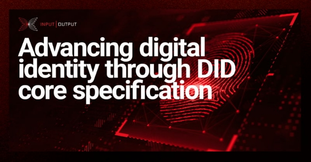

# Advancing digital identity through DID core specification
### **The recent DID core specification approval at the World Wide Web Consortium (W3C) provided clearer and stronger foundations for identity platforms building decentralized identifiers.**
 8 September 2022[ Ivan Irakoze](/en/blog/authors/ivan-irakoze/page-1/) 4 mins read

### [**Ivan Irakoze**](/en/blog/authors/ivan-irakoze/page-1/)
Blog/Feature Writer

Marketing & Communication

- 
- 

In June 2022, the World Wide Web Consortium (W3C) approved the [Decentralized Identifier (DID) Working Group](https://www.w3.org/2020/12/did-wg-charter.html)’s DID core specification to move to the W3C Recommendation stage. This milestone reaffirms the rising relevance of **digital identity** and provides clearer and stronger foundations for identity platforms such as [Atala PRISM](https://www.atalaprism.io/#why).

Here, we look at:

- what digital identity and DIDs are.
- what DID core specification approval means for digital identity.
## **What is digital identity?**
To define digital identity, we must first understand all that identity entails.

[Identity](https://atala.mymidnight.blog/ssi-fundamentals-i-identity/) encompasses all the unchangeable traits that represent who we are, such as ethnicity, date of birth, lineage, etc., and changeable traits like profession, online personas, etc.

Typically we only consider individuals as having an identity, but other entities like organizations, businesses, and digital and physical things can also have unique identifying characteristics.

[Digital identity](https://www.essentialcardano.io/article/digital-identity) is an online representation of entities and the claims about who or what they are. **Verifiable Credentials (VCs)** represent these claims in the digital world, similar to the physical documents we use today.

Entities, whether individuals or organizations, use these VCs to share information with other entities. This exchange of information presents two important questions regarding security:

- How safe is it to share identifying information with other entities?
- Who controls the data?

In an internet age where different companies gather vast amounts of (often personal) information for purposes beyond our control, securing our own identities becomes crucial. This is where **Self-Sovereign Identity (SSI)** and DIDs come in.
## **What are self-sovereign identities and decentralized identifiers?**
SSI is [a set of principles](https://github.com/WebOfTrustInfo/self-sovereign-identity/blob/master/self-sovereign-identity-principles.md) that entails having the indisputable authority to control the personal information you share with others.

[DIDs](https://atala.mymidnight.blog/ssi-fundamentals-iii-dids/) are an important aspect of a [decentralized identity](https://www.essentialcardano.io/glossary/decentralized-identity) platform. Algorithms produce unique, random strings of characters. When exchanged with a peer, DIDs create a secure channel that enables bidirectional communication. Every DID is effectively a pseudonym, and the user has complete control of their data, and with whom they share it.

The Working Group’s DID core specification defines a DID, its components, and its functional methods. According to the DID Working Group, DIDs:

- Are controlled by the entities that hold them.
- Enable cryptographic authentication of the DID holder.
- Describe the discovery of information needed to launch secure and privacy-preserving communication methods.
- Give access to service-independent data portability.
## **What does DID core specification approval mean for digital identity?**
DID core specification approval by the W3C Director standardizes DIDs, ensuring that DID technology is accepted by all invested parties and can begin moving towards wider adoption.

Despite [Google, Apple, and Mozilla formally objecting to advancing the DID specification forward](https://www.w3.org/2019/did-wg/faqs/2021-formal-objections/), the [W3C Director stated that](https://www.w3.org/2022/06/DIDRecommendationDecision.html):

*If DID core is held from advancing to Recommendation this would decrease the motivation for other designers of decentralized identifier systems to follow the consensus of a community who were chartered to create a deliverable in this space. One can easily foresee unnecessary deployment of other [URI](https://www.techtarget.com/whatis/definition/URI-Uniform-Resource-Identifier) schemes compounding the interoperability challenge that the community has been working to address. The Director concludes that the balance lies in favor of the DID developer community, encouraging it to continue its work and search for consensus on standard DID methods. The objections are overruled. The DID core specification is approved to advance to W3C Recommendation.”*

This decision enables **the standardization of a universal template** that allows **interoperability** and **portability**. Without standardization, DIDs and VCs created by different DID methods might not be readable by verifiers or storable in a single identity wallet.

W3C Recommendation status of the DID core specification, therefore, codifies the work of hundreds of people diligently working on improving the digital identity framework.

The next step in the process outlined by the W3C Director is for the Working Group to *“address and deliver proposed standard DID method(s) and demonstrate interoperable implementations.”*
## **Learn more about Atala PRISM**
**Input Output Global, Inc. (IOG)** continuously researches and builds products and services through blockchain technology. One of these products is **Atala PRISM** – a digital identity platform built on SSI principles, and a service suite for verifiable data and digital identity, built on the Cardano blockchain.

Watch the explainer video below to learn more about Atala PRISM.

*I’d like to thank [Peter Vielhaber](https://iohk.io/en/team/pete-vielhaber) for his input and support in this collaborative blog post.*
