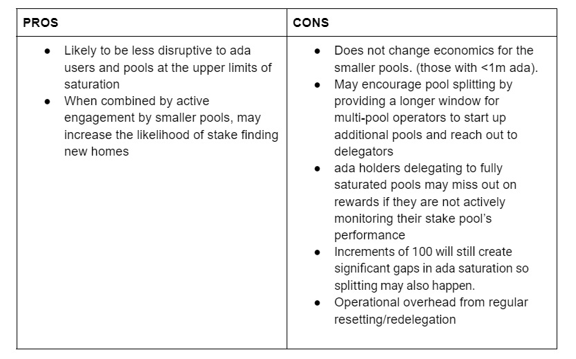
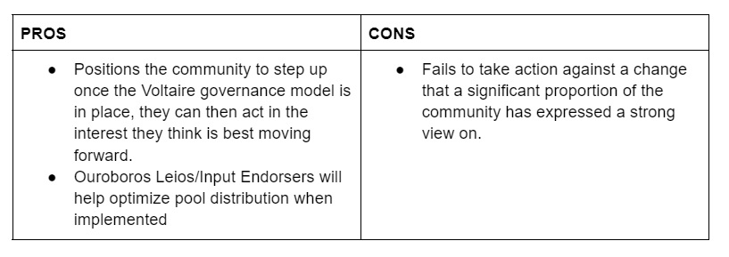
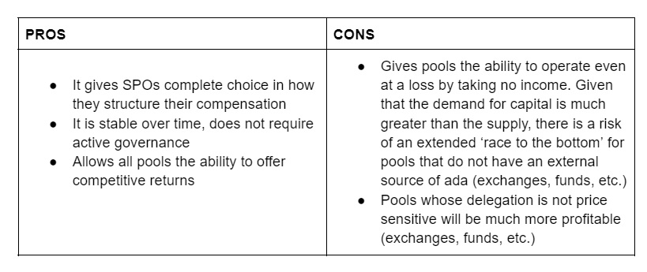
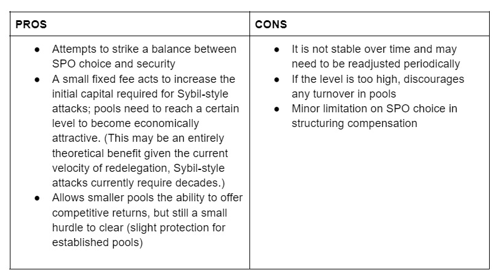
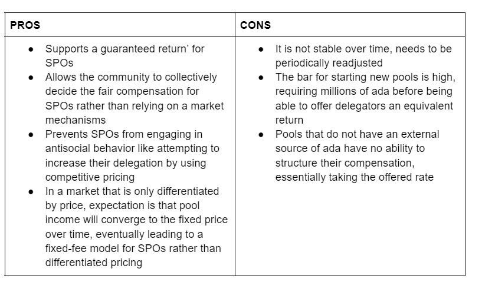

# Staking parameters and network optimization – where next for k and min fee?
### **Pros and cons of the different approaches to adjusting the k parameter and the minimum pool fee**
 27 October 2022[ Rebecca Hopwood](/en/blog/authors/rebecca-hopwood-1/page-1/) 9 mins read

### [**Rebecca Hopwood**](/en/blog/authors/rebecca-hopwood-1/page-1/)
Community Coordinator

Marketing and Communications

- 
- 

A set of parameters is used to define the Cardano protocol's behavior. Some parameters are stable and can be left unchanged more or less indefinitely. Others relate to more dynamic on-chain activities (staking environment or price of ada, to name just two) and consequently may need periodic adjustment due to changes and fluctuations in these factors. 

Two variable parameters in particular continue to generate debate within the stake pool operator community as changes to either (or both) can have an impact on decentralization, yields, and other aspects of the Cardano experience. These are the *k* value, which determines the level at which a pool becomes ‘saturated’ with stake and so receives no further rewards, and the minimum pool fee, which is a flat amount paid to a pool before rewards are split with delegators.

Earlier this year, a survey was made within the Cardano SPO community on how these might be adjusted and its results can be seen [here](https://input-output.typeform.com/report/Row2tnqQ/HSCUwpltfMyJ7yp7). 

The results showed that many in the SPO community were supportive of making a change to *k* and the minimum fee, but there remains some contention. While there is a high degree of flexibility in changing the parameters themselves, the decision process is less clear-cut. So it is important to be clear about the requirements for adjusting either parameter. Altering them is fundamentally a community decision but the overriding concern for all should be the overall health and decentralization of the network.

In line with transparency and objectivity, this piece first attempts to offer a brief overview of the k parameter and the minimum fees, outlines some of the different ways in which these two parameters could be adjusted, and the pros and cons of each approach.
### **The k parameter: brief overview**
The k parameter determines the maximum stake in a pool that receives awards, in essence creating a ‘soft cap’ on pool size. This size changes over time and is defined as a percentage of the maximum supply of ada (45bn) minus any amount that remains in the reserve. As of epoch 370, that is 35bn ada. 

Maximum pool size = (45bn - reserves) / *k* = ( 35bn / 500 ) = 70m

Within the Cardano documentation, a pool that reaches its maximum size is said to be saturated. A saturated pool offers the highest rewards to delegators and is most lucrative for its operators, while an over-saturated pool delivers lower rewards. The system thereby incentivizes delegators to move their stake to a pool containing less ada, in order to maintain their yield and thus encourages the decentralization of the network.

As of October 2022, the value of *k* is 500. Previously, IOG had suggested that this value could be safely raised to 1,000, but ultimately any final decision was postponed due to three factors: i) surveying the community did not give a conclusive result; ii) there was an IOG operational focus on delivering Vasil capability; iii) and there was a possibly disruptive effect on ada users delegating to pools near the current saturation level so proper planning and communicating was required.
### **The implications of changing *k***
While *k* is absolutely not a panacea to more equitable stake distribution, its value does have some positive impact on some pools. It decreases the maximum size of pools, allowing more pools to be in the optimal range for block creation. If this change were to be accompanied by a change in delegation (and ada holder behavior is key here), it has the potential to create a more diverse staking environment. This is what we saw with the previous change from *k*=150 to the current level of 500; a number of large pools stopped competing for public delegation, allowing that stake to go to other operators.

The situation with moving to *k*=1,000 is less clear-cut. We would expect private pools (such as those run by exchanges, financial companies, or large ada holders) to split their existing stake into smaller pools. Private pools account for about 35% of the total stake in the ecosystem and we estimate this would lead to another 150 stake pools being created. We do not expect any of that delegation to move to public pools since the net ada rewards generated for large private pools are higher.

From IOG’s calculations, there are about 100 public pools that would be affected by a move to *k*=1,000, representing around 2bn ada that would need to be redelegated (8% of the supply). To keep their current profitability, these pools would be inclined to split. Stake pool operation is at its core a commodity activity – there is only a marginal difference in rewards when staking to different pools that are producing blocks, which is the way the protocol is intended. However, many of these pools have strong name recognition, sometimes via a long-established track record and/or by content creation and high social media activity. Experience with the pool operators may mean these pools are able to keep a large proportion of their delegators in any newly created pool.

Pools in around 10m+ will be able to offer comparable pricing, so the expectation is that these pools will be the major beneficiaries of any change; taking the majority of the delegation that is not retained by the split pools. (Of that 2bn ada, IOG estimates a third to half of it will end up moving around.)

The key takeaway here is that while there may be some moderate increase in network diversity through moving *k*, the impact is projected to be far less pronounced than the previous change.
### **Three potential approaches to changing *k***
IOG has identified three potential scenarios for consideration by the community.

**Option 1: Single, immediate increase of *k* to 1,000**

**Option 2: Gradual increase of *k* to 1,000 (by a factor of 100 per month, for example)**

**Option 3: No change – maintain *k*'s current value (500)**

### **Minimum fee: brief overview**
Stake pools perform a critical function within the Cardano ecosystem. They produce new blocks and contribute to the decentralization of the network.

In return for this, pools are compensated in two ways:

- a fixed fee, which is a flat amount taken if any blocks are produced, and 
- a variable fee, which is a percentage of the total rewards paid to a pool.

While pools are free to set any variable fee they choose, the ledger rules define a minimum fixed fee.

Minimum fees act as an additional layer of protection against Sybil attacks (an attempt to take over the network by creating large numbers of zero-fee pools). Abolishing or lowering these minimum fees would remove this protective layer and could leave Cardano more open to certain forms of economic attack. IOG analysis of staking behavior and redelegation suggests that this concern may be a more theoretical issue now, rather than a practical one. Cardano has passed the point where enough delegation is moving around to execute an effective attack in a period less than several years.

On the other hand, setting a fixed minimum fee makes it difficult for small pools starting out to compete economically with larger, established pools until they reach a certain size. This fee needs to be met before a pool can start returning rewards to delegators and can add up to an effective rate that can be several times larger than the more visible percentage rate that pools advertise. Delegating to a smaller pool is generally a much worse outcome for delegators and the extra burden of costs are paid by the initial delegators to a pool.

Additionally, the minimum fee acts as an incentive for a well-established SPO to spin up new pools, since there is a guaranteed ‘income’ from doing so.
### **Implications of changing the minimum fee**
None of the options laid out below have a direct impact on ada holders. With the minimum fee lowered, pools will not have to make any immediate changes. In the short term, the ability to offer a competitive return should benefit smaller SPOs looking to attract delegation and retaining control over fees will keep smaller pools viable for longer.
### **Three potential approaches to changing the minimum fee**
As with the *k* parameter, IOG would like to present three potential choices for consideration by the community.

**Option 1: Set minimum fee to zero**

**Option 2: Reduce min fee significantly (to 40 ada, for example)**

**Option 3: Leave min fee as is**

### **Conclusion**
Considering the information above, altering either or both of these parameters requires careful consideration. Although changes are unlikely to make a significant difference to stake distribution, a properly considered change will still move the needle in a positive direction in terms of supporting smaller pools and assisting continuing decentralization of the network. 

And altering these parameters alone form just part of a wider conversation to broaden the spread of stake across the SPO ecosystem. Several community-created improvement proposals (including [CIP7](https://cips.cardano.org/cips/cip7/), [CIP23](https://cips.cardano.org/cips/cip23/), and [CIP50](https://github.com/cardano-foundation/CIPs/pull/242)) continue to be under discussion and evaluation alongside this topic.

The Cardano network and general environment has changed significantly over the past year. Going forward, parameter optimization will be a key component of any future technical governance model. With this in mind, IOG plans to form a parameters consultative group in collaboration with a small group of SPOs and the Cardano Foundation. This will evolve as needed to meet the new Cardano governance structure.

A fresh survey outlining the three options for the target number of pools and the minimum pool cost will be distributed to SPOs this week to capture their preferred route forward. The results will be reviewed by the new parameters group. A decision will then be made and communicated, with a timeline for any change that will take into account the operational needs of the SPOs and other network users.

The community now has the chance to consider the options laid out here. The survey/form will be shared today with SPOs via [email](https://mailchi.mp/iohk/spo) and the [SPO Announcements](https://t.me/SPOannouncements) channel.

*Thanks to Colin Edwards, Kevin Hammond, Fernando Sanchez, Tim Harrison, and Prof. Aggelos Kiayias for their contribution to this blog.*
