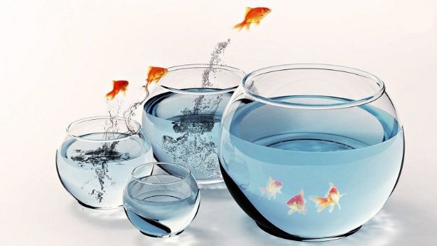

# Repositioning Project Catalyst ahead of the next funding round
### **Catalyst makes a tactical pause to evaluate Fund9's results before kickstarting the next iteration**
 1 November 2022[ Tim Richmond](/en/blog/authors/tim-richmond/page-1/) 3 mins read

### [**Tim Richmond**](/en/blog/authors/tim-richmond/page-1/)
Marketing and Communications Manager

Marketing & Communications

- 
- 

Innovation and collaboration were two of Project Catalyst's founding principles. Through each funding round, Input Output Global, Inc. (IOG) facilitates Catalyst to support those whose projects and ideas can make a positive, real-world impact.

IOG believes in empowering people to explore and develop their ideas. This collaboration leads to cascading innovation and growth and often opens life-changing new opportunities. 

Project Catalyst has achieved many great things. It has received and processed over 6.1k proposals, reached over 1.7 million votes, and funded around 1.2k projects (800 in 2022 alone). These achievements are a testament to the passion and belief in Project Catalyst and the Cardano ecosystem.
## **Fund9 results**
Fund9 saw 205 proposals selected for funding, along with ten challenges to be answered in the subsequent funding round, and received more than 364k votes, a 53% increase from Fund8! And 9 projects were approved to participate in the [Cardashift Catalyst Natives Challenge](https://iohk.io/en/blog/posts/2022/06/01/fund9-catalyst-natives-cardashift-challenge-demonstrating-and-monetizing-impact/).

Project Catalyst is also trialing milestone-based reporting for funded projects. Funded projects in the Dapps, Products, and Integrations Challenge, and projects that requested funds with a value ≥$75k, must now report requirements based on clear milestones and provide a statement of milestones and proof of achievement to continue receiving funding.

Moving to a milestone-based reporting mechanism reinforces belief in the project and demonstrates progress to the community. In addition, it is an extra layer of protection for the Cardano Treasury and the community, ensuring that projects deliver as planned before receiving the amounts requested.
## **Cooldown period: time to pause and reflect**
As Fund9 draws to a close, there’s a broad recognition that processes need to mature, be simplified, become more autonomous, remain inclusive, and continue demonstrating value to the broader Cardano ecosystem. As a result, some crucial changes and updates are on the horizon.

Slowing down allows Catalyst participants to look at the processes, reflect upon improvement opportunities, and iterate forward meaningfully. One of the significant reasons to have a cooldown is to allow for that collective clarity without rushing toward the next deadline. Let's focus on a set of outcomes instead.

Considering the above, Fund10 has no start date yet. So instead, Project Catalyst will take stock of all signals and experiences before moving on to the next funding cycle. Upcoming blogs will discuss changes and lay out future plans.
## **Future iteration and communication**
Project Catalyst is an organic organism relying on individuals to come together and innovate toward a common goal. Therefore, it is vital to remain fluid and dynamic to meet the demands of an ever-changing and fast-paced environment. Charting a course toward a goal becomes easier if there is a clear destination. The most important part of this process is communication between all relevant and interested parties.

The Catalyst community is welcomed and encouraged to discuss and hold retrospective sessions and document and share the outcomes. A [feedback form for Fund9](https://bit.ly/Fund9-Feedback) is now available. Use this form to help identify gaps and areas that need attention.

The survey outcomes will be shared publicly with all the key insights. You can see the [Fund8 version here](https://bit.ly/F8-Feedback) for your reference.
## **How to get involved?**
Do you want to take an active part in Project Catalyst? The first step is [creating an account](https://cardano.ideascale.com/) on the Catalyst collaboration platform, Ideascale. 

For regular updates on the progress of [Project Catalyst](https://bit.ly/ProjectCatalyst), please subscribe to the Catalyst [mailing list](https://bit.ly/3dSZJvx) and join the [Discord](https://discord.gg/2RnUtK8) and [Telegram](https://discord.gg/2RnUtK8) communities.
