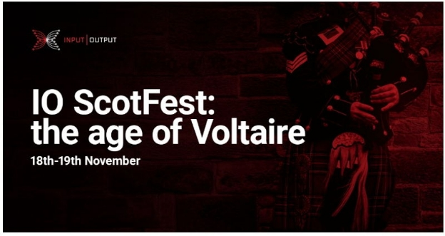

# Announcing IO ScotFest: the age of Voltaire
### **Join IOG to celebrate Cardano’s achievements and find out more about the future plans**
 4 November 2022[ Tim Harrison](/en/blog/authors/tim-harrison/page-1/) 4 mins read

### [**Tim Harrison**](/en/blog/authors/tim-harrison/page-1/)
VP of Community & Ecosystem

Communications

- 
- 
- 
- 

Edinburgh – Scotland’s capital and the birthplace of Cardano’s Ouroboros protocol – will be the venue for IO ScotFest: the age of Voltaire this month. Hosted at the city’s famous university on November 18th and 19th, the Input Output Global (IOG) team will live-stream speeches, presentations, project updates, and announcements from a special virtual event to celebrate Cardano as the world’s leading proof-of-stake blockchain, and mark more than five years of successful operation.

ScotFest will lead into the [summit being hosted by the Cardano Foundation](https://summit.cardano.org/) in Switzerland over the following two days. 

At ScotFest, IOG will set out its achievements as the company developing Cardano, and outline future plans.
## **The age of Voltaire**
Cardano’s development roadmap started in September 2017 with Byron, which established the blockchain and the ada cryptocurrency. Since then, the Shelley, Goguen, and Basho stages have introduced staking and delegation, native tokens, smart contract support, and a range of technologies to boost network performance and throughput. 

Now, as the ecosystem continues to grow, we’re heading into the age of Voltaire, laying down the foundations for decentralized decision-making. 

Edinburgh, a focal point of the Enlightenment period in Europe, is a fitting venue for IOG’s celebration. For the French philosopher François-Marie Arouet – writing as ‘Voltaire’ – was a leading light in the Enlightenment, an astonishing period of intellectual and scientific accomplishment that spanned the eighteenth and nineteenth centuries. He prized criticism and argued for the separation of church and state. So Voltaire was chosen as an inspirational name for the governance theme of Cardano, with its emphasis on long-term sustainability and democratic decision-making empowered by the community. 

The University of Edinburgh and the Royal Society of Edinburgh were important institutions in the Enlightenment, encouraging the careers of Adam Smith – whose ‘invisible hand’ metaphor is oft-quoted by economists to this day – and David Hume, a philosopher who influenced people as varied as Immanuel Kant and Albert Einstein. So [Professor Aggelos Kiayias](https://iohk.io/en/team/aggelos-kiayias), the chief scientist at IOG, is an ideal choice to kick off ScotFest. A professor at the University of Edinburgh, and a fellow of the Royal Society of Edinburgh, Professor Kiayias led the team that created Ouroborous and guides IOG’s academic researchers across the globe. The research enabled Cardano to become the leader in proof-of-stake blockchains in 2017.
## **What’s on the agenda?**
Over the course of two days, you’ll be able to tune into 20+ keynotes and presentations, with new announcements and project updates. All showcasing what has been achieved so far, and celebrating what is being built for the future.

- **Research** – we’ll announce new initiatives and collaborations driving Cardano and the wider blockchain industry forward 
- **Governance** – how to support the continuing growth of a decentralized, community-first ecosystem
- **Decentralization and scalability** – building a blockchain fit for the future
- **RealFi and adoption** – driving and supporting real-world use cases and onboarding new users
- **The ecosystem** – hear from just some of the exciting projects #BuildingOnCardano

In a special keynote, [Charles Hoskinson](https://iohk.io/en/team/charles-hoskinson), IOG’s chief executive, will talk about the journey to Voltaire, governance, and the future of Cardano. You’ll hear updates on some of IOG’s contributions to Cardano’s core technology stack, covering topics such as scalability solutions Mithril and Hydra, and input endorsers. And in something of a homecoming, there will also be an update on Cardano’s smart contract scripting language, Plutus; the language was launched in the city at PlutusFest in December 2018.
## **Join us!**
The event will be live-streamed to the community across IOG’s official channels for you to watch and engage with throughout. Subscribe to our [YouTube channel](https://www.youtube.com/channel/UCBJ0p9aCW-W82TwNM-z3V2w), and hit that bell to be the first to join as soon as we start on the morning (UTC) of November 18. 

The main event will be digital only, but if you are local to Edinburgh, can't make it to Lausanne for the summit, or just fancy a trip up to bonnie Scotland, you can join us at a special community meet-up on the evening of November 18. You can [register for the meetup here](https://www.meetup.com/iohk-meetup/events/289331789/). Numbers are limited, and offered on a first-come, first-served basis – so don’t delay.

If you’re not in the UK but would like to join one of the in-person Cardano summit weekend meet-ups, see the [list of community-led events](https://summit.cardano.org/community-led-events-locations/) happening around the world.
