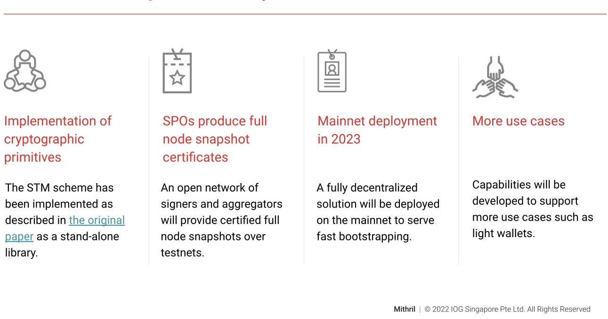

# Advancing node syncing time with Mithril
### **Mithril is a light, fast, and efficient solution for secure bootstrapping of Cardano nodes**
 11 January 2023[ Olga Hryniuk](/en/blog/authors/olga-hryniuk/page-1/) 4 mins read

### [**Olga Hryniuk**](/en/blog/authors/olga-hryniuk/page-1/)
Senior Technical Writer

Marketing & Communications

- 
- 

Mithril is a solution that enables users to obtain the current state of the Cardano blockchain without retrieving its full history. Previous posts discussed how the [Mithril protocol works](https://iohk.io/en/blog/posts/2021/10/29/mithril-a-stronger-and-lighter-blockchain-for-better-efficiency/) and updated the community on the release of the [proof of concept](https://iohk.io/en/blog/posts/2022/08/29/mithril-proof-of-concept-is-now-open-source/).

At IO ScotFest at Edinburgh, Jean-Philippe Raynaud, technical lead at PaloIT, and Iñigo Querejeta Azurmendi, Cardano lead cryptography engineer at IOG, [presented Mithril](https://www.youtube.com/watch?v=VyxsqwNWZt4) revealing more about its benefits, applications, and roadmap.
## **Achieving greater scalability**
One of the challenges to achieving scalability and mass adoption of blockchain technology is fast and secure interactions with the chain. DApps and wallets operating on a full node can independently validate every transaction in the blockchain’s history, providing a high level of security. However, this takes more time and requires specific software and storage requirements.

Mithril comes as a solution. It is both a protocol and a network based on the technology called the stake-based threshold multi-signature (STM) scheme. The protocol enables nodes in the Mithril network to establish lightweight and efficient interactions with Cardano in a transparent, secure, and trustless way. 

Current light wallet interactions require relying on a third party to retrieve the chain state. These interactions are also based on making either security or decentralization tradeoffs. Mithril, on the other hand, ensures both and is capable of unlocking such use cases as:

- **Fast bootstrapping of the full node**: a node can sync with the chain history 4-6 times faster than previously, as assessed on the preview testnet. 
- **Trustless ‘light’ wallets**: light wallets don’t need to rely on a third party to sync blockchain history. The Mithril protocol enables fast synchronization while relying on Cardano’s main chain security properties. 
- **Efficient voting systems**: Mithril enables the establishment of a highly reliable and fast voting system in governance use cases.

The above-mentioned use cases show that for Mithril to scale, there is a need to establish the infrastructure to support different types of data. This is where an open and collaborative development process steps in. Leveraging the power of the community will allow the development of numerous innovative applications for Mithril. Mithril will therefore provide the capability to rapidly include new types of [signed data](https://iohk.io/en/blog/posts/2022/08/29/mithril-proof-of-concept-is-now-open-source/) as the need arises.

Jean-Philippe Raynaud comments:

Mithril can help sign any type of data that can be deterministically computed or witnessed by stakeholders of a proof-of-stake (PoS) blockchain. This proves the same security guarantees as on the Cardano main chain as well as the same decentralization level without reliance on the third-party entity. 
## **The roadmap**

Figure 1: The roadmap of Mithril development

Mithril is an open-source project currently operating as a proof of concept. The implementation of cryptographic primitives was the first step towards establishing a stand-alone, blockchain-agnostic library, which developers can use for implementing their own use cases of decentralized certification in a PoS context.

Currently, Mithril’s test network includes several SPOs onboarded as signers to continuously test the Mithril network. The Mithril team and the community are consistently improving the proof of concept to make it ready for mainnet release. They deliver the signer, aggregator, and client nodes in fortnightly released distributions. These distributions are tested and qualified with the pioneer SPOs in a multi-stage process on the [preview testnet](https://docs.cardano.org/cardano-testnet/getting-started/#environments) to then be released on the pre-production testnet on Cardano.

When the testing is complete, Mithril will be deployed to mainnet, providing a fully decentralized solution for efficient node bootstrapping.

Jean-Philippe Raynaud adds:

Mithril is already proving its efficiency with the fast bootstrapping of Cardano nodes which, in our benchmarks, significantly reduces its synchronization time. It is a very versatile technology that will enable and help scale many other use cases in the future.

Finally, to keep track of Mithril development, see high-level [development updates on Essential Cardano](https://www.essentialcardano.io/development-update) or more in-depth [technical reports](https://input-output-hk.github.io/cardano-updates/archive/) here.
