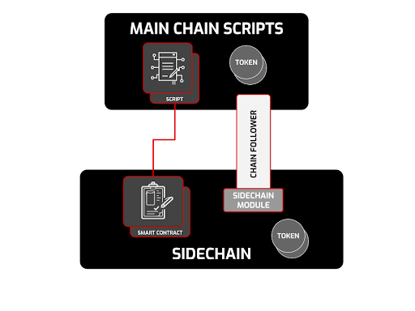

# IOG launches a toolkit for developing custom sidechains on Cardano
### **Building sidechains on Cardano: documentation, components, and a working example**
 12 January 2023[ Neil Burgess](/en/blog/authors/neil-burgess/page-1/) 7 mins read

### [**Neil Burgess**](/en/blog/authors/neil-burgess/page-1/)
Technical Writer

Marketing & Communications

- 
- 

Input Output Global (IOG) has assembled a team of specialist engineers to use the rock-solid foundation of Cardano to build a toolkit for building custom sidechains. Using the toolkit, they have constructed an Ethereum virtual machine (EVM)-compatible sidechain public testnet as a proof of concept. Sidechains make Cardano extensible and more scalable without compromising the stability or security of the main chain.
## **Extending Cardano with sidechains**
Cardano is a third-generation blockchain, based on academic research, and written in Haskell for mathematical proof of correctness.

The decentralization, security, and scalability of the Ouroboros consensus protocol have been proven at scale and volume by [thousands of independent stake pools](https://www.statista.com/statistics/1279280/cardano-ada-biggest-staking-pool-groups/) and [millions of wallet addresses](https://cardanofeed.com/cardano-active-wallets-skyrocket-past-3-million-a-striking-1000-year-on-year-increase-45346) over [five years](https://roadmap.cardano.org/en/byron/). The network has been running without a failure since its inception in 2017.

Decentralization and interoperability are key to the future of blockchain. These features ensure that no person or entity is able to control a blockchain, or be restricted to just one ecosystem. To grow, from both engineering and social perspectives, most applications and communities need to be empowered with their own sovereignty and design choices.

To enable this interoperable environment, IOG has been working on the creation of a toolkit for building a family of sidechains. With this toolkit, anyone can start to leverage Cardano’s security and infrastructure to create mission-specific sidechains. The [EVM sidechain](https://iohk.io/en/blog/posts/2022/07/06/introducing-the-cardano-evm-sidechain/) proves the feasibility of this concept. All this work is being shared with the Cardano community and will be fully open source. The first stage was the demonstration of the EVM application at [IO ScotFest](https://iohk.io/en/blog/posts/2022/11/04/announcing-io-scotfest-the-age-of-voltaire/) in Edinburgh in late November 2022. Today, we’re making available the first tranche of [formal documentation](https://docs.cardano.org/cardano-sidechains/sidechain-toolkit/introduction).
## **About the toolkit**
A sidechain is simply a blockchain that depends on its main chain and is connected to it. 

The toolkit allows the sidechain to have its own consensus algorithm and features. The sidechain is connected to the main chain through a bridge that allows asset transfer between the chains. The finality of blocks is determined through a consensus mechanism that relies on the security of the main chain.

The toolkit is made up of:

- **Main chain Plutus scripts**. These scripts run on Cardano’s main chain, enable secure cross-chain transactions and token movement, and leverage minting policies to support the sidechain’s token.
- **A chain follower**. The chain follower tracks the main-chain data and events that govern the sidechain. In the v1 toolkit release, this is a Cardano [db-sync instance](https://docs.cardano.org/cardano-components/cardano-db-sync/about-db-sync).
- **The sidechain module**. This module is part of the sidechain client. It interprets main-chain data and implements the necessary ledger adaptations.

Figure 1. Sidechain toolkit components

The toolkit also comes with a [technical specification document](https://docs.cardano.org/cardano-sidechains/sidechain-toolkit/introduction/#technicalspecification) containing an introduction and a guide to Cardano sidechains. The toolkit’s building blocks are designed to empower developers. Some examples:

- move data and assets between the main chain and the custom sidechain
- support various consensus protocols, ledger rules, and languages
- secure sidechain launches
- secure small chains
- allow experiments, incubation, and research.

The EVM sidechain application is still being audited, and it will be available as a public testnet later in January 2023. Developers will be able to try it out by running a few Solidity applications to get a feel for its potential. DApp developers using the EVM sidechain should take note that data needs to be considered final on the main chain before it is moved to the sidechain.
## **Using the components of the sidechain toolkit**
Blockchain developers, distributed application (DApp) developers, stake pool operators (SPOs), and DApp users can all benefit from custom sidechains. Developers can use the toolkit to create blockchains for specific use cases based on Cardano’s security and decentralization.

Blockchains created this way can leverage the support of the existing SPO community, and benefit from the enthusiastic community of Cardano followers.

For DApp developers, custom sidechains offer advantages in interoperability, scalability, testability, and compatibility.

**Interoperability**

The most basic form of communication between a main chain and sidechain is the exchange of assets. Because assets retain their nature when transferred to the sidechain, they can be transferred back just as easily. A bridge mechanism enables this communication. As long as both chains are secure, this security is carried on to the two-way transfers.

Communication between the main chain and the sidechain allows them to keep their own (be it amended) consensus protocols and block formats yet still work together, opening up a wider range of applications.

**Scalability**

Just as a project manager has the choice of good, fast, or cheap (pick any two), a blockchain has the choice of three competing objectives – decentralization, security, and scalability.

Because sidechains can be specific to an application domain, transactions can be completed quicker, relieving the main chain of this load. The scalability improvement of sidechains comes without compromising security and need not affect decentralization. 

**Testability**

Developers can test pilot DApps on dedicated sidechains. If there is a failure requiring a restart or modification of the interface to the chain, then only the sidechain is affected, not the main chain. This phase acts as an intermediate step between testnet operation and full mainnet release for experimental features and new applications.

**Compatibility**

Sidechains can expose the same application program interface (API) as an existing chain and use the security and efficiency of Cardano’s consensus protocols. For example, the Cardano EVM sidechain provides a Solidity execution environment that does not require miners, but still serves Ethereum JSON RPC methods. Ethereum smart contracts can run unchanged, at a considerably lower gas fee. 
### **For SPOs**
Sidechains offer an opportunity to SPOs by allowing their pools to award more tokens than just ada if they decide to also run a sidechain node. These sidechain-specific tokens can serve different purposes and in turn attract delegators to participate in the network. Depending on how rewards are set up on the sidechain, sidechain block creators can be rewarded with new tokens for building blocks, validating them and contributing to the network's security. Any Cardano SPO can choose to also validate blocks on the sidechain. If they do, they may benefit from the extra revenue for providing additional services and using more resources.

If an SPO chooses to validate sidechain blocks, they will need to provide additional resources. Some disk space is required to store the sidechain, and they must run two more processes; a chain follower and a sidechain node.
### **For DApp users**
Greater interoperability between chains, simplified development processes, more development platforms, and reduced transaction fees tend to increase the number and variety of DApps. More Cardano sidechains means greater variety of innovative blockchain designs, use cases, and higher total staking rewards, which tends to attract more SPOs and delegators, and consequently ensures enhanced security and greater decentralization. That’s the potential of the ecosystem of sidechains.
## **Conclusion**
The sidechain toolkit is the latest delivery on the Cardano roadmap within Basho, the scaling phase, introducing higher programmability, interoperability, and scalability. Sidechains development paves the way for mass adoption of Cardano by enabling much higher throughput without reduction in decentralization or security. Blockchain developers can more easily create custom sidechains. Eventually, IOG hopes to see a family of Cardano sidechains and partner chains emerging.

The EVM sidechain public testnet will be released in January 2023 allowing the community to deploy DApps, create smart contracts, and move tokens between the testing environment chains.

The toolkit being released in January is not a complete solution. There are some known areas for improvement, like the bridge experience, SPO rewards mechanism and the security model. All these areas will be worked on with the community as we go – carefully and steadily – collaborating for feedback, thoughts and recommendations.

There are plenty of improvements that can be made and there are lots of diverse ways of running a sidechain. However, we hope what we have developed internally at IOG will provide a core set of capabilities and lay firm foundations for building out a set of tools and making further improvements in collaboration with the community.

Further documentation and video tutorials will be available in due course. As always, follow [IOG's social media](https://twitter.com/InputOutputHK) for the latest updates.

Read the sidechains [technical specification](https://docs.cardano.org/cardano-sidechains/sidechain-toolkit/introduction/#technicalspecification) and [development documentation](https://docs.cardano.org/cardano-sidechains/sidechain-toolkit/introduction), and [join IOG’s Technical Community Discord](https://discord.gg/inputoutput) for further discussions. We’ll soon host a Discord stage for interested developers, so be sure to sign up for IOG’s [developer newsletter](https://mailchi.mp/iohk/devdigest) to be alerted. For commercial and partnership inquiries, get in touch with IOG through the [contact page](https://iohk.io/en/contact-commercial).
