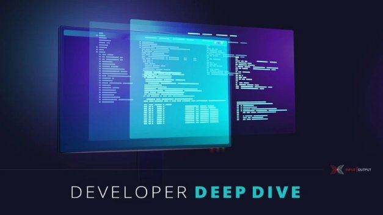

# Plutus Tx: compiling Haskell into Plutus Core
### **Get to the heart of writing smart contract applications on Cardano**
 2 February 2021[ Michael Peyton Jones](tmp//en/blog/authors/michael-peyton-jones/page-1/) 9 mins read

### [**Michael Peyton Jones**](tmp//en/blog/authors/michael-peyton-jones/page-1/)
Software Engineering Lead

Engineering

- 
- 
- 
- 

Last week saw the release of the refreshed version of the [Plutus Playground](https://iohk.io/en/blog/posts/2021/01/25/introducing-the-new-plutus-playground/). This is our showcase for the [Plutus Platform](https://www.youtube.com/watch?v=usMPt8KpBeI), at the heart of which is the ability to write smart contract applications in a single, high-level language: Haskell. 

Tuần trước đã chứng kiến việc phát hành phiên bản được làm mới của [Plutus Playground] (https://iohk.io/en/blog/posts/2021/01/25/Introducing-the-new-plutus-playground/).
Đây là chương trình giới thiệu của chúng tôi cho [nền tảng Plutus] (https://www.youtube.com/watch?v=USMPT8KPBEI), trung tâm là khả năng viết các ứng dụng hợp đồng thông minh bằng ngôn ngữ cấp cao, duy nhất:
Haskell.â

Our toolchain allows a single Haskell program to produce not only an executable file that users can run on their own computers, but also the code that runs on the Cardano blockchain. This gives users a battle-tested, high-quality programming language, and makes use of standard tooling and library support. Nobody wants to learn a proprietary programming language and half-baked tools if they don’t have to!

Công cụ của chúng tôi cho phép một chương trình Haskell duy nhất tạo ra không chỉ một tệp thực thi mà người dùng có thể chạy trên máy tính của riêng họ, mà còn là mã chạy trên blockchain Cardano.
Điều này cung cấp cho người dùng một ngôn ngữ lập trình chất lượng cao được thử nghiệm chiến đấu và sử dụng công cụ tiêu chuẩn và hỗ trợ thư viện.
Không ai muốn học một ngôn ngữ lập trình độc quyền và các công cụ nửa nướng nếu họ không phải làm!

The technology that powers this is called Plutus Tx, and is, in essence, a compiler from Haskell to Plutus Core – the language that runs on the chain – provided as a GHC plug-in. In this post we’ll dive into how this works, and some of the technical challenges.

Công nghệ cung cấp năng lượng cho nó được gọi là Plutus TX, và về bản chất, là một trình biên dịch từ Haskell đến Plutus Core-ngôn ngữ chạy trên chuỗi-được cung cấp dưới dạng trình cắm GHC.
Trong bài đăng này, chúng tôi sẽ đi sâu vào cách thức hoạt động của nó và một số thách thức kỹ thuật.

## **Boiling down Haskell**

## ** Đun sôi xuống Haskell **

Isn’t Haskell an old, complicated language? Notoriously, it has dozens of sophisticated extensions that change the language in far-reaching ways. How are we possibly going to support all this?

Isnâ € t haskell một ngôn ngữ cũ, phức tạp?
Nổi tiếng, nó có hàng tá phần mở rộng tinh vi thay đổi ngôn ngữ theo những cách sâu rộng.
Làm thế nào chúng ta có thể sẽ hỗ trợ tất cả những điều này?

Fortunately, the design of GHC, the primary Haskell compiler, makes this possible. GHC has a very simple representation of Haskell programs called [GHC Core](https://www.youtube.com/watch?v=uR_VzYxvbxg). After the initial typechecking phase, all of the complex surface language is desugared away into GHC Core, and the rest of the pipeline doesn’t need to know about it. This works for us too: we can operate on GHC Core, and get support for the much larger Haskell surface language for free.

May mắn thay, thiết kế của GHC, trình biên dịch haskell chính, làm cho điều này có thể.
GHC có một đại diện rất đơn giản của các chương trình Haskell có tên [GHC Core] (https://www.youtube.com/watch?v=ur_VZYXVBXG).
Sau giai đoạn đánh máy ban đầu, tất cả các ngôn ngữ bề mặt phức tạp được đưa vào lõi GHC và phần còn lại của đường ống không cần biết về nó.
Điều này cũng phù hợp với chúng tôi: chúng tôi có thể hoạt động trên GHC Core và nhận được hỗ trợ cho ngôn ngữ bề mặt Haskell lớn hơn nhiều miễn phí.

The other complexity of Haskell is its type system. This is much harder to avoid. However, we have the luxury of choosing what type system we want to use for our target language, and so we use a system that is a subset of Haskell’s – fortunately Haskell’s type system is pretty good!

Sự phức tạp khác của Haskell là hệ thống loại của nó.
Điều này khó hơn nhiều để tránh.
Tuy nhiên, chúng tôi có sự sang trọng trong việc chọn loại hệ thống loại nào chúng tôi muốn sử dụng cho ngôn ngữ mục tiêu của mình và vì vậy chúng tôi sử dụng một hệ thống là một tập hợp con của hệ thống loại của Haskell là khá tốt!

In the end, it turns out that we don’t want to support *all* of Haskell. Some features are niche, inapplicable (nobody needs a C FFI on the blockchain), or, honestly, just a real pain to implement. So for now the Plutus Tx compiler will give you a helpful error if you use a feature it doesn’t support. Most ‘simple’ Haskell is supported (although there are a few things that look simple, but are annoyingly complicated in practice).

Cuối cùng, hóa ra chúng tôi không muốn hỗ trợ * tất cả * của Haskell.
Một số tính năng là thích hợp, không thể áp dụng (không ai cần C FFI trên blockchain), hoặc, thành thật mà nói, chỉ là một nỗi đau thực sự để thực hiện.
Vì vậy, bây giờ, trình biên dịch Plutus TX sẽ cung cấp cho bạn một lỗi hữu ích nếu bạn sử dụng một tính năng mà nó không hỗ trợ.
Hầu hết các haskell không được hỗ trợ (mặc dù có một vài điều trông đơn giản, nhưng rất phức tạp trong thực tế).

## **Down the tube**

## ** Xuống ống **

What do we compile Haskell into? At the end of the day we have to produce Plutus Core, but it is ancient compiler wisdom to break down big compilation pipelines like this by introducing ‘intermediate languages’, or an intermediate representation (IR). This ensures that no one step is too large, and that the steps can be tested independently.

Chúng ta biên dịch Haskell thành gì?
Vào cuối ngày, chúng ta phải tạo ra Lõi Plutus, nhưng đó là sự khôn ngoan của nhà biên dịch cổ xưa để phá vỡ các đường ống biên dịch lớn như thế này bằng cách giới thiệu các ngôn ngữ gây chú ý - hoặc một biểu diễn trung gian (IR).
Điều này đảm bảo rằng không một bước nào quá lớn và các bước có thể được kiểm tra độc lập.

Our compilation pipeline looks like this:

Đường ống biên dịch của chúng tôi trông như thế này:

1. GHC: Haskell -> GHC Core

1. GHC: Haskell -> GHC Core

1. Plutus Tx compiler: GHC Core -> Plutus IR

1. Trình biên dịch Plutus TX: lõi ghc -> Plutus ir

1. Plutus IR compiler: Plutus IR -> Typed Plutus Core

1. Trình biên dịch PLUTUS IR: Plutus IR -> Lõi Plutus đánh máy

1. Type eraser: Typed Plutus Core -> Untyped Plutus Core

1. Loại cục tẩy: Lõi Plutus gõ -> Core Plutus UNTYPED

As you can see, there are quite a few stages after GHC Core, but I just want to highlight Plutus IR. This is an extension of Plutus Core designed to be close to GHC Core. So, strictly speaking, the Plutus Tx compiler doesn’t target Plutus Core: it targets Plutus IR, and then we invoke the rest of the pipeline to get the rest of the way.

Như bạn có thể thấy, có khá nhiều giai đoạn sau GHC Core, nhưng tôi chỉ muốn làm nổi bật Plutus IR.
Đây là một phần mở rộng của Solutus Core được thiết kế để gần GHC Core.
Vì vậy, nói đúng ra, Trình biên dịch Plutus TX không nhắm mục tiêu Core Plutus Lõi: Nó nhắm vào Plutus IR, và sau đó chúng tôi gọi phần còn lại của đường ống để có được phần còn lại của con đường.

This reduces the amount of logic that has to live in the plug-in itself. It can focus on dealing with the idiosyncrasies of GHC, and leave well-defined (but [difficult](https://hydra.iohk.io/job/Cardano/plutus/linux.papers.unraveling-recursion/latest/download-by-type/doc-pdf/unraveling-recursion)) problems such as handling data types and recursion to the Plutus IR compiler, where they can be tested without having to run a GHC plug-in!

Điều này làm giảm lượng logic phải sống trong chính trình cắm.
Nó có thể tập trung vào việc xử lý các đặc điểm riêng của GHC và để lại được xác định rõ (nhưng [khó] (https://hydra.iohk.io/job/cardano/plutus/linux.papers.unraveling-cursion/latest/doad-
Các loại phụ/do doc-pdf/làm sáng tỏ)) các vấn đề như xử lý các loại dữ liệu và đệ quy cho trình biên dịch PLUTUS IR, nơi chúng có thể được kiểm tra mà không phải chạy trình cắm GHC!

Having Plutus IR in the pipeline gives us other advantages too. We don’t have total control over how GHC generates GHC Core, but we *do* control how Plutus IR gets turned into Plutus Core. So if users want to ensure total reproducibility of their on-chain code, they can save the Plutus IR and get a (comparatively) readable dump that they can reload later.

Có Plutus IR trong đường ống cũng cho chúng ta những lợi thế khác.
Chúng tôi không có quyền kiểm soát hoàn toàn về cách GHC tạo ra lõi GHC, nhưng chúng tôi * thực hiện * kiểm soát cách Plutus ir bị biến thành Core Plutus.
Vì vậy, nếu người dùng muốn đảm bảo tổng khả năng tái tạo của mã trên chuỗi của họ, họ có thể lưu Plutus IR và nhận được một bãi rác (tương đối) có thể đọc được mà họ có thể tải lại sau đó.

## **Sneaking into GHC**

## ** lẻn vào ghc **

How do we actually get the GHC Core in the first place? GHC Core is part of *GHC*’s compilation pipeline. We’d have to somehow insert ourselves into the middle of GHC’s compilation process, intercept the part of the program that we want to compile to Plutus Core (remember: we only compile *some* of the program to on-chain code), compile it, and then do something useful with the result.

Làm thế nào để chúng ta thực sự có được lõi GHC ở nơi đầu tiên?
GHC Core là một phần của đường ống biên dịch của *GHC *.
Chúng tôi phải bằng cách nào đó tự chèn vào giữa quy trình biên dịch của GHC
mã), biên dịch nó, và sau đó làm một cái gì đó hữu ích với kết quả.

Fortunately, GHC provides the tools for this in the form of GHC plug-ins. A GHC plug-in gets to run during the GHC compilation process, and is able to modify the program that GHC is compiling however it likes. This is exactly what we want!

May mắn thay, GHC cung cấp các công cụ cho việc này dưới dạng các trình cắm GHC.
Trình cắm GHC sẽ được chạy trong quá trình biên dịch GHC và có thể sửa đổi chương trình mà GHC đang biên dịch tuy nhiên nó thích.
Đây chính xác là những gì chúng tôi muốn!

Because we are able to modify the program GHC is compiling, we have an obvious place to put the output of the Plutus Tx compiler – back into the main Haskell program! That’s the right place for it, because the rest of the Haskell program is responsible for submitting transactions containing Plutus Core scripts. But from the point of view of the rest of the program, Plutus Core is opaque, so we can get away with just providing it as a blob of bytes ready to go into a transaction.

Bởi vì chúng tôi có thể sửa đổi chương trình GHC đang biên dịch, chúng tôi có một nơi rõ ràng để đặt đầu ra của trình biên dịch Plutus TX - trở lại chương trình Haskell chính!
Đó là nơi phù hợp với nó, bởi vì phần còn lại của chương trình Haskell chịu trách nhiệm gửi các giao dịch có chứa các tập lệnh cốt lõi của Plutus.
Nhưng từ quan điểm của phần còn lại của chương trình, Plutus Core rất mờ đục, vì vậy chúng ta có thể thoát khỏi chỉ với việc cung cấp nó như một byte của byte sẵn sàng để đi vào một giao dịch.

This suggests that we want to implement a function like this:

Điều này cho thấy rằng chúng tôi muốn thực hiện một chức năng như thế này:

compile :: forall a . a -> CompiledCode a

biên dịch :: forall a.
a -> compiledcode a

From the user’s perspective, this takes *any* Haskell expression and replaces it with an opaque value representing that expression, but compiled into a Plutus Core program (or rather a bytestring containing a serialized representation of that program). The real version is a little more complicated, but, conceptually, it’s the same.

Từ quan điểm của người dùng, điều này lấy * bất kỳ biểu thức * Haskell nào và thay thế nó bằng một giá trị mờ biểu thị biểu thức đó, nhưng được biên dịch thành một chương trình cốt lõi Plutus (hoặc đúng hơn là một bytestring có chứa biểu diễn tuần tự của chương trình đó).
Phiên bản thực sự phức tạp hơn một chút, nhưng, về mặt khái niệm, nó giống nhau.

However, we don’t want to try and implement this as a normal Haskell function. A normal Haskell function with the signature of compile would take a *value* of type a, and turn it into a Plutus Core program at *run* time. We want to take the *syntax tree for the expression* of type a and turn it into a Plutus Core program at *compile* time.

Tuy nhiên, chúng tôi không muốn thử và thực hiện điều này như một hàm Haskell bình thường.
Hàm Haskell bình thường với chữ ký của biên dịch sẽ lấy * giá trị * loại A và biến nó thành một chương trình cốt lõi Plutus tại thời điểm * chạy *.
Chúng tôi muốn lấy cây cú pháp * cho biểu thức * của loại A và biến nó thành một chương trình cốt lõi Plutus tại thời gian * biên dịch *.

## **The switcheroo**

## ** Bộ chuyển đổi **

Here’s the trick: we don’t actually implement compile as a function; instead, our plug-in trawls through the program to find applications of compile to an argument, and then replaces the whole application with the compiled code.

Đây là thủ thuật: Chúng tôi không thực sự thực hiện biên dịch như một hàm;
Thay vào đó, các trình đánh dấu trình cắm của chúng tôi thông qua chương trình để tìm các ứng dụng biên dịch thành một đối số, sau đó thay thế toàn bộ ứng dụng bằng mã được biên dịch.

So, for example, we turn

Vì vậy, ví dụ, chúng tôi chuyển sang

compile 1

Biên dịch 1

into

vào trong

<bytestring containing the serialized Plutus Core program ‘(con integer 1)’>

<bytestring chứa chương trình cốt lõi của Plutus serialized â € ˜ (Con số nguyên 1) â € ™>

This means that the program continues to be type-correct throughout. Before the plug-in runs, the expression compile 1 has type CompiledCode, and the same is true afterwards – but now we have an actual program!

Điều này có nghĩa là chương trình tiếp tục được điều chỉnh loại trong suốt.
Trước khi trình cắm chạy, Biểu thức Compile 1 đã loại CompileDCode và điều tương tự cũng đúng sau đó-nhưng bây giờ chúng tôi có một chương trình thực tế!

## **Finding the source**

## ** Tìm nguồn **

Compilers work with the source of programs, and the Plutus Tx compiler is no different. We process the GHC Core syntax tree for programs. But what happens when a program calls a function from another module? Haskell is separately compiled: typically modules only see the types of functions in other modules, and the object code is linked together later. So we don’t have the source!

Trình biên dịch làm việc với nguồn chương trình và trình biên dịch Plutus TX cũng không khác.
Chúng tôi xử lý cây cú pháp lõi GHC cho các chương trình.
Nhưng điều gì xảy ra khi một chương trình gọi một hàm từ một mô -đun khác?
Haskell được biên dịch riêng: Thông thường các mô -đun chỉ thấy các loại hàm trong các mô -đun khác và mã đối tượng được liên kết với nhau sau.
Vì vậy, chúng tôi không có nguồn!

This is, in fact, extremely annoying, and in the long run we plan to implement support in GHC for reliably storing the GHC Core for modules inside the interface files that it generates. This would enable us to do something more like ‘separate compilation’ for Plutus Tx. Until then, however, we have a workaround using ‘unfoldings’.

Trên thực tế, điều này cực kỳ khó chịu và về lâu dài, chúng tôi dự định thực hiện hỗ trợ trong GHC để lưu trữ lõi GHC đáng tin cậy cho các mô -đun bên trong các tệp giao diện mà nó tạo ra.
Điều này sẽ cho phép chúng tôi làm một cái gì đó giống như phần biên dịch phân tách "cho Plutus TX.
Tuy nhiên, cho đến lúc đó, chúng tôi có một cách giải quyết bằng cách sử dụng - ˜Unprintingsâ € ™.

Unfoldings are the copies of functions that GHC uses to enable cross-module inlining. We piggyback on these as a way of getting the source of functions. Consequently, functions that are used transitively by Plutus Tx code must be marked as INLINABLE, which ensures that unfoldings are present.

Mở ra là các bản sao của các chức năng mà GHC sử dụng để cho phép nội tuyến mô-đun chéo.
Chúng tôi cõng những thứ này như một cách để có được nguồn gốc của các chức năng.
Do đó, các chức năng được sử dụng chuyển tiếp bằng mã PLUTUS TX phải được đánh dấu là không thể tin được, đảm bảo rằng việc mở ra có mặt.

## **Run time matters too**

## ** Thời gian chạy quá quan trọng **

This all sounds fine, until you realise that you usually want to create different versions of a Plutus Core program based on decisions at run time. If I’m writing a contract that implements an atomic trade, I don’t want to have to *recompile my program* to change the participants or the amount!

Tất cả điều này nghe có vẻ ổn, cho đến khi bạn nhận ra rằng bạn thường muốn tạo các phiên bản khác nhau của chương trình cốt lõi Plutus dựa trên các quyết định trong thời gian chạy.
Nếu tôi viết một hợp đồng thực hiện giao dịch nguyên tử, tôi không muốn * biên dịch lại chương trình của mình * để thay đổi người tham gia hoặc số tiền!

But as we said before, it’s tricky to write a function of type a -> CompiledCode a that actually works at run time. Rather than looking at the GHC Core syntax tree representing the expression in the Haskell program, we instead need to deal with values that the program computes.

Nhưng như chúng tôi đã nói trước đây, thật khó để viết một chức năng của loại A -> CompileDCode A thực sự hoạt động trong thời gian chạy.
Thay vì nhìn vào cây cú pháp GHC Core đại diện cho biểu thức trong chương trình Haskell, thay vào đó chúng ta cần phải đối phó với các giá trị mà chương trình tính toán.

We can do this in typical Haskell fashion by defining a pair of typeclasses:

Chúng ta có thể làm điều này theo kiểu Haskell điển hình bằng cách xác định một cặp typeclasses:

1. Typeable: which tells us how to turn a Haskell type into a Plutus Core type

1. Có thể đánh máy: Điều này cho chúng tôi biết cách biến loại Haskell thành loại lõi Plutus

1. Lift, which tells us how to turn a Haskell value into a Plutus Core value

1. Nâng, cho chúng ta biết làm thế nào để biến giá trị Haskell thành giá trị lõi Plutus

For those familiar with Haskell, these deliberately parallel the Typeable and Lift classes that GHC provides for turning Haskell types and values into representations useful for more typical Haskell metaprogramming.

Đối với những người quen thuộc với Haskell, những loại này có thể cố tình song song với các lớp có thể đánh máy và nâng mà GHC cung cấp cho các loại và giá trị biến Haskell thành các biểu diễn hữu ích cho việc siêu âm Haskell điển hình hơn.

We can’t write instances of these type classes for all types. For example, when we’re looking at the GHC Core we can inspect the GHC Core for \x -> 1 and see that it is a lambda, and what the body is. But when the code is run, a function can be a compiled blob of native code, and we can’t do this any more. So, unfortunately, we can’t lift functions at run time.

Chúng ta không thể viết các trường hợp của các loại loại này cho tất cả các loại.
Ví dụ, khi chúng ta đang nhìn vào lõi ghc, chúng ta có thể kiểm tra lõi ghc cho \ x -> 1 và thấy đó là một lambda, và cơ thể là gì.
Nhưng khi mã được chạy, một hàm có thể là một blob được biên dịch mã gốc và chúng ta không thể làm điều này nữa.
Vì vậy, thật không may, chúng ta không thể các chức năng nâng ở thời điểm chạy.

Ultimately, this means you can typically lift *data* at run time, like an integer, or a complicated data type representing a fee schedule. You can then pass the lifted data to a function that you compiled at compile time with a little helper: applyCode :: CompiledCode (a -> b) -> CompiledCode a -> CompiledCode b. 

Cuối cùng, điều này có nghĩa là bạn thường có thể nâng * dữ liệu * trong thời gian chạy, như số nguyên hoặc loại dữ liệu phức tạp đại diện cho lịch trình phí.
Sau đó, bạn có thể chuyển dữ liệu được nâng lên một hàm mà bạn đã biên dịch tại thời điểm biên dịch với một trình trợ giúp nhỏ: applicationCode :: CompileDCode (a -> b) -> compiledcode a -> compiledcode b.â

This is a nice instance of a functional architecture paying off for us: we can handle these tricky dependencies between compile time and run time with simple functions and arguments!

Đây là một ví dụ tốt đẹp của một kiến trúc chức năng được đền đáp cho chúng tôi: chúng tôi có thể xử lý những phụ thuộc khó khăn này giữa thời gian biên dịch và thời gian chạy với các chức năng và đối số đơn giản!

## **Getting out of the way**

## ** Ra khỏi đường **

The goal of Plutus Tx is to allow you to freely write Haskell and seamlessly use it in both on-chain and off-chain code. We’ve made a lot of progress towards that goal, and we look forward to polishing off the remaining warts as we go.

Mục tiêu của Plutus TX là cho phép bạn tự do viết Haskell và sử dụng liền mạch nó trong cả mã trên chuỗi và mã ngoài chuỗi.
Chúng tôi đã đạt được rất nhiều tiến bộ cho mục tiêu đó, và chúng tôi mong muốn đánh bóng các mụn cóc còn lại khi chúng tôi đi.

## **Postscript: show me the money!**

## ** PostScript: Cho tôi xem tiền! **

How can you actually use Plutus Tx? The compiler will be released with [Plutus Foundation](https://www.youtube.com/watch?v=NjFUYD5FOkE) in one of the updates of Cardano to support Goguen’s capabilities. This will include support for Plutus Core on the Cardano chain. At that point we’ll release the libraries into the wild. Until then, you can cheer us along [on Github](https://github.com/input-output-hk/plutus), and let us know how you get on with the new [Plutus Playground](https://playground.plutus.iohkdev.io/).

Làm thế nào bạn thực sự có thể sử dụng Plutus TX?
Trình biên dịch sẽ được phát hành với [Plutus Foundation] (https://www.youtube.com/watch?v=njFuyd5Foke) trong một trong những bản cập nhật của Cardano để hỗ trợ các khả năng của Goguen.
Điều này sẽ bao gồm hỗ trợ cho Plutus Core trên chuỗi Cardano.
Vào thời điểm đó, chúng tôi sẽ phát hành các thư viện vào tự nhiên.
Cho đến lúc đó, bạn có thể cổ vũ chúng tôi cùng [trên GitHub] (https://github.com/input-output-hk/plutus), và cho chúng tôi biết làm thế nào bạn tiếp tục với [Plutus Playground] (https: //
sân chơi.plutus.iohkdev.io/).

