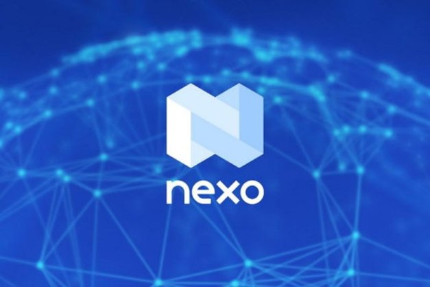

# Digital lending platform Nexo integrates Cardano, enabling ada holders to borrow and earn from a diverse crypto portfolio
### **This latest partnership with a leading crypto company further expands the Cardano ecosystem and exposes new users to ada**
 30 June 2021[ Eric Czuleger](tmp//en/blog/authors/eric-czuleger/page-1/) 3 mins read

### [**Eric Czuleger**](tmp//en/blog/authors/eric-czuleger/page-1/)
Senior Content Editor

Marketing & Communications

- 
- 
- 

Nexo kicks off a landmark collaboration with IOHK to fully integrate Cardano into its platform. This will allow ada holders to buy, borrow, lend, and sell crypto on the Nexo Exchange, while also earning up to 8 percent interest on their holdings, or accessing ada-backed credit. This partnership increases ada’s utility and enhances Cardano’s value and reach.

Nexo khởi động sự hợp tác mang tính bước ngoặt với IOHK để tích hợp hoàn toàn Cardano vào nền tảng của mình.
Điều này sẽ cho phép chủ sở hữu ADA mua, vay, cho vay và bán tiền điện tử trên Sàn giao dịch Nexo, đồng thời kiếm được tới 8 phần trăm tiền lãi cho việc nắm giữ của họ hoặc truy cập vào tín dụng được hỗ trợ bởi ADA.
Sự hợp tác này làm tăng tiện ích của ADA và nâng cao giá trị và tầm với của Cardano.

As we move towards the Alonzo upgrade, IOHK is establishing strategic partnerships with organizations like [Orion](https://iohk.io/en/blog/posts/2021/06/23/orion-to-bring-one-stop-crypto-marketplace-to-cardano/) and [Nervos](https://iohk.io/en/blog/posts/2021/06/02/nervos-partnership-to-build-the-first-cross-chain-bridge-with-cardano/) to expand the Cardano ecosystem. Now, we’re adding Nexo to our growing list of collaborators. Nexo is a leading institution for building value in the decentralized finance (DeFi) space. The Cardano integration comes from increasing demand from both Nexo clients and ada holders. Adding Cardano to Nexo’s [Earn on Crypto & Fiat Suite](https://nexo.io/earn-crypto) and Instant Crypto Credit Lines™ brings their total serviceable assets to 20.

Khi chúng tôi tiến tới việc nâng cấp Alonzo, IOHK đang thiết lập quan hệ đối tác chiến lược với các tổ chức như [Orion] (https://iohk.io/en/blog/posts/2021/06/23/orion-to-one-one-stop-
Crypto-marketplace-to-cardano/) và [Nervos] (https://iohk.i
Cầu với Cardano/) để mở rộng hệ sinh thái Cardano.
Bây giờ, chúng tôi đã thêm Nexo vào danh sách các cộng tác viên đang phát triển của chúng tôi.
Nexo là một tổ chức hàng đầu để xây dựng giá trị trong không gian tài chính phi tập trung (DEFI).
Việc tích hợp Cardano đến từ việc tăng nhu cầu từ cả khách hàng Nexo và người nắm giữ ADA.
Thêm Cardano vào Nexo's [Earn on Crypto & Fiat Suite] (https://nexo.io/earn-crypto) và dòng tín dụng tiền điện tử tức thì đưa tổng tài sản có thể phục vụ của họ lên 20.

This is only the second time that Nexo has brought an asset on board via their new integrations system. The goal is to cater to client needs while fulfilling demand for exposure to cryptocurrencies. Increased interest in blockchain technology led Nexo to work closely with projects like Cardano, while making it easy for everyone to invest in both digital and traditional assets.

Đây chỉ là lần thứ hai Nexo mang một tài sản lên tàu thông qua hệ thống tích hợp mới của họ.
Mục tiêu là để phục vụ nhu cầu của khách hàng trong khi đáp ứng nhu cầu tiếp xúc với tiền điện tử.
Sự quan tâm ngày càng tăng đối với công nghệ blockchain đã khiến Nexo hợp tác chặt chẽ với các dự án như Cardano, đồng thời giúp mọi người dễ dàng đầu tư vào cả tài sản kỹ thuật số và truyền thống.

Antoni Trenchev, co-founder and Managing Partner of Nexo, says: 

Antoni Trenchev, đồng sáng lập và đối tác quản lý của Nexo, nói:

Blockchain organizations like Nexo and Cardano have a lot of potential to give each other a serious leg-up in digital finance and it thrills me to see that happening. Nexo’s business creates added utility for ada, reducing selling pressure, boosting its value, and creating an influx of users, including people who might just be starting out in crypto. Reciprocally, Cardano broadens our total addressable market and expands existing clients’ options when investing funds via our platform.

Các tổ chức blockchain như Nexo và Cardano có rất nhiều tiềm năng để mang đến cho nhau một sự nghiêm túc trong tài chính kỹ thuật số và điều đó khiến tôi cảm thấy hồi hộp khi thấy điều đó xảy ra.
Kinh doanh của Nexo tạo ra tiện ích bổ sung cho ADA, giảm áp lực bán, tăng giá trị của nó và tạo ra một dòng người dùng, bao gồm cả những người có thể bắt đầu trong Crypto.
Đối ứng, Cardano mở rộng tổng thị trường địa chỉ của chúng tôi và mở rộng các tùy chọn của khách hàng hiện tại khi đầu tư tiền thông qua nền tảng của chúng tôi.

This falls in line with the vision of IOHK’s Chief Technical Officer, Romain Pellerin, who views interoperability as essential to mainstream adoption of cryptocurrencies and blockchain technology. He says:

Điều này phù hợp với tầm nhìn của giám đốc kỹ thuật của IOHK, Romain Pellerin, người coi khả năng tương tác là điều cần thiết để áp dụng chính thống các loại tiền điện tử và công nghệ blockchain.
Anh ta nói:

Bringing Nexo into our growing ecosystem will give the Cardano community even more options and utility for ada. Working together with Nexo to make this process user-friendly for those who are new to crypto will only encourage wider adoption, and Nexo’s unique offering is a clear match for IOHK.

Đưa Nexo vào hệ sinh thái đang phát triển của chúng tôi sẽ cung cấp cho cộng đồng Cardano nhiều lựa chọn và tiện ích hơn cho ADA.
Làm việc cùng với Nexo để làm cho quá trình này thân thiện với người dùng cho những người mới sử dụng tiền điện tử sẽ chỉ khuyến khích việc áp dụng rộng hơn và cung cấp độc đáo của Nexo là một trận đấu rõ ràng cho IOHK.

Nexo is a leading regulated digital asset enterprise with a mission to maximize the value and utility of cryptocurrencies. They provide instant exchange, trading, over-the-counter capabilities, and a spectrum of other services backed by custodial insurance and the military-grade security of the Nexo Wallet. Learn more about Nexo at their official [website](https://nexo.io).

Nexo là một doanh nghiệp tài sản kỹ thuật số được quy định hàng đầu với nhiệm vụ tối đa hóa giá trị và tiện ích của tiền điện tử.
Họ cung cấp trao đổi tức thì, giao dịch, khả năng không kê đơn và một loạt các dịch vụ khác được hỗ trợ bởi bảo hiểm giám sát và an ninh cấp quân sự của ví Nexo.
Tìm hiểu thêm về Nexo tại [trang web chính thức của họ] (https://nexo.io).

