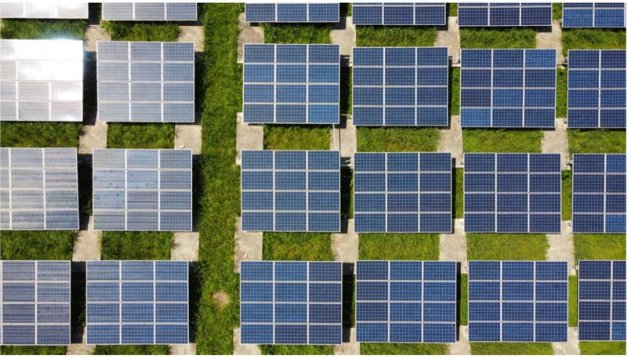

# Why they’re calling Cardano ‘the green blockchain’
### **Staking process avoids the massive energy use and hardware pollution caused by Bitcoin and Ethereum mining**
 17 August 2021[ Fernando Sanchez](tmp//en/blog/authors/fernando-sanchez/page-1/) 5 mins read

### [**Fernando Sanchez**](tmp//en/blog/authors/fernando-sanchez/page-1/)
Technical Writer

Marketing and Communications

- 
- 

Ever since Satoshi Nakamoto published the [Bitcoin whitepaper](https://bitcoin.org/bitcoin.pdf) in 2008, Bitcoin has had its fair share of controversy. The cryptocurrency has often been in the limelight for the wrong reasons. The biggest criticism is how much the mining activities of Bitcoin – and other cryptos such as Ethereum based on proof-of-useless-work – protocols are damaging the environment. Turns out, well, a lot.

Kể từ khi Satoshi Nakamoto xuất bản [whitepaper bitcoin] (https://bitcoin.org/bitcoin.pdf) vào năm 2008, Bitcoin đã có phần tranh cãi công bằng.
Tiền điện tử thường ở trong ánh đèn sân khấu vì những lý do sai lầm.
Những lời chỉ trích lớn nhất là các hoạt động khai thác của Bitcoin-và các loại tiền điện tử khác như Ethereum dựa trên các giao thức không sử dụng-công việc không sử dụng-các giao thức đang gây tổn hại cho môi trường.
Hóa ra, tốt, rất nhiều.

[The University of Cambridge](https://cbeci.org/) reckons that mining consumes 100 terawatt-hours (TWh) of electricity a year – that’s one trillion watts *every hour*. To put this figure into perspective, that's 0.55% of the electricity produced in the world each year, enough to run [a country such as Malaysia or Sweden](https://hbr.org/2021/05/how-much-energy-does-bitcoin-actually-consume#:~:text=According%20to%20the%20Cambridge%20Center,like%20a%20lot%20of%20energy). Digiconomist shows the same [energy problem plagues Ethereum](https://digiconomist.net/ethereum-energy-consumption). And the figures continue to rise.

.
Để đưa con số này vào quan điểm, đó là 0,55% điện được sản xuất trên thế giới mỗi năm, đủ để chạy [một quốc gia như Malaysia hoặc Thụy Điển] (https://hbr.org/2021/05/how-much-energy
-Does-bitcoin-actical-aconsume#: ~: text = theo%20TO%20THER%20Cambridge%20Center, như%20a%20Lot%20of%20Energy).
Nhà kinh tế học cho thấy cùng một [vấn đề năng lượng gây bệnh Ethereum] (https://digiconomist.net/ethereum-ergyergy-cons tiêu dùng).
Và các số liệu tiếp tục tăng lên.

In recent months, the environmental impact of proof-of-work mining has come to the forefront. Mining algorithms require massive amounts of energy. This issue was, up to recently, compounded by the fact that 70% of mining was concentrated in China, where electricity production relies on fossil fuels, particularly burning coal. A recent crackdown by the Chinese authorities has prompted an exodus of crypto miners, which will probably just move the problem to another country. And the issue affects other places anyway. Concerns about energy consumption [led to the shutting down of a mining hub in Mongolia](https://www.cnbc.com/2021/03/02/china-bitcoin-mining-hub-to-shut-down-cryptocurrency-projects.html) in March, for example. 

Trong những tháng gần đây, tác động môi trường của việc khai thác bằng chứng đã đi đầu.
Các thuật toán khai thác đòi hỏi một lượng lớn năng lượng.
Vấn đề này, cho đến gần đây, được kết hợp bởi thực tế là 70% khai thác tập trung ở Trung Quốc, nơi sản xuất điện phụ thuộc vào nhiên liệu hóa thạch, đặc biệt là than đốt.
Một cuộc đàn áp gần đây của chính quyền Trung Quốc đã thúc đẩy một cuộc di cư của các thợ mỏ tiền điện tử, có lẽ sẽ chỉ chuyển vấn đề sang một quốc gia khác.
Và vấn đề ảnh hưởng đến những nơi khác dù sao.
Những lo ngại về tiêu thụ năng lượng [dẫn đến việc tắt một trung tâm khai thác ở Mongolia] (https://www.cnbc.com/2021/03/02/china-bitcoin-mining-hub-to-hut-xuống-cryptocurrence-
dự án.html) vào tháng 3, ví dụ.

Profiting from cryptocurrency mining is not restricted by geography or motivation. British police swooped on a building this year expecting to find a cannabis farm, for example. Instead, [they found 100 computer boards mining Bitcoin](https://www.bbc.co.uk/news/uk-england-birmingham-57280115) with an illegal connection to the electricity grid. It was later reported that 'three nerds' had stolen power worth £16,000 a month to make £8,000 in crypto.

Lợi nhuận từ khai thác tiền điện tử không bị hạn chế bởi địa lý hoặc động lực.
Cảnh sát Anh đã sà vào một tòa nhà trong năm nay với hy vọng sẽ tìm thấy một trang trại cần sa chẳng hạn.
Thay vào đó, [họ đã tìm thấy 100 bảng máy tính khai thác bitcoin] (https://www.bbc.co.uk/news/uk-england-birmingham-57280115) với kết nối bất hợp pháp với lưới điện.
Sau đó, có báo cáo rằng 'ba người mọt sách' đã đánh cắp sức mạnh trị giá 16.000 bảng mỗi tháng để kiếm được 8.000 bảng tiền điện tử.

### **The greener crypto road**

### ** Đường tiền điện tử xanh hơn **

While fundamental to its function, the proof-of-work algorithms of Bitcoin and Ethereum are their Achilles heel. Powerful, state-of-the-art mining rigs produce better yields, but the faster the rigs are, the more electricity they require. This poses the question of long-term sustainability. A recent post on the [Ethereum Foundation blog](https://blog.ethereum.org/2021/05/18/country-power-no-more/) claimed that ‘Ethereum’s power-hungry days are numbered’ and that its long-awaited move to [proof of stake](https://en.wikipedia.org/wiki/Proof_of_stake) would use 99.95% less energy, although exactly when this shift will take place remains unclear. (‘[Early 2022](https://fortune.com/2021/05/24/ethereum-bitcoin-buterin-carbon-footprint-proof-of-stake/)’ has recently been suggested.)

Trong khi cơ bản cho chức năng của nó, các thuật toán bằng chứng của Bitcoin và Ethereum là gót chân Achilles của họ.
Các giàn khai thác mạnh mẽ, hiện đại sản xuất sản lượng tốt hơn, nhưng các giàn khoan càng nhanh, chúng càng cần nhiều điện.
Điều này đặt ra câu hỏi về tính bền vững lâu dài.
Một bài đăng gần đây trên blog [Ethereum Foundation] (https://blog.ethereum.org/2021/05/18/country-power-no-more/) tuyên bố rằng 'những ngày đói sức mạnh của Ethereum được đánh số' và nó
Di chuyển được chờ đợi từ lâu đến [bằng chứng cổ phần] (https://en.wikipedia.org/wiki/PROOF_OF_STAKE) sẽ sử dụng năng lượng ít hơn 99,95%, mặc dù chính xác khi sự thay đổi này sẽ diễn ra vẫn chưa rõ ràng.
.

But what makes proof of stake, as used by Cardano, a more environmentally friendly blockchain?

Nhưng điều gì tạo ra bằng chứng về cổ phần, như được sử dụng bởi Cardano, một blockchain thân thiện với môi trường hơn?

Proof of work is resource-intensive because miners need to solve ever-more-complex mathematical problems to create blocks. They are in an energy-intensive global race to solve meaningless, randomly generated puzzles. This massive amount of computational power could be used to map the stars, search for alien life, or speed up the [search for Covid vaccines](https://www.weforum.org/agenda/2020/03/covid-19-distributed-computing-vaccine/); but it is just wasted effort. This wasted digital effort leads to real world consequences as well.

Bằng chứng về công việc là tốn nhiều nguồn lực vì các thợ mỏ cần giải quyết các vấn đề toán học phức tạp hơn bao giờ hết để tạo ra các khối.
Họ đang trong một cuộc đua toàn cầu sử dụng nhiều năng lượng để giải quyết các câu đố vô nghĩa, được tạo ra ngẫu nhiên.
Lượng sức mạnh tính toán khổng lồ này có thể được sử dụng để ánh xạ các ngôi sao, tìm kiếm sự sống ngoài hành tinh hoặc tăng tốc [tìm kiếm vắc-xin covid] (https://www.weforum.org/agenda/2020/03/covid-19-
Phân phối-tính toán-vaccine/);
Nhưng nó chỉ là lãng phí nỗ lực.
Điều này lãng phí nỗ lực kỹ thuật số cũng dẫn đến hậu quả trong thế giới thực.

The need for powerful hardware leads to a secondary problem: e-waste. Miners always need to keep up with rivals, which means buying more powerful mining rigs. The 'old' equipment – often suitable only for mining – quickly becomes obsolete. It is discarded, and [according to the Digiconomist](https://digiconomist.net/bitcoin-electronic-waste-monitor/), Bitcoin's e-waste is shockingly high. Only 20% of the world's electronic waste is recycled, so the plastics and poisonous materials such as heavy metals in the rigs can end up in landfill. (According to predictions by the United Nations, the world will produce up to 120 million tonnes of e-waste a year by 2050.) 

Sự cần thiết của phần cứng mạnh mẽ dẫn đến một vấn đề thứ cấp: chất thải điện tử.
Người khai thác luôn cần theo kịp các đối thủ, điều đó có nghĩa là mua các giàn khai thác mạnh mẽ hơn.
Các thiết bị 'cũ' - thường chỉ phù hợp để khai thác - nhanh chóng trở nên lỗi thời.
Nó bị loại bỏ, và [theo nhà tiêu hóa] (https://digiconomist.net/bitcoin-electronic-faste-monitor/), E-Waste của Bitcoin rất cao.
Chỉ có 20% chất thải điện tử của thế giới được tái chế, vì vậy các vật liệu nhựa và độc như kim loại nặng trong các giàn khoan có thể kết thúc tại bãi rác.
(Theo dự đoán của Liên Hợp Quốc, thế giới sẽ sản xuất tới 120 triệu tấn chất thải điện tử mỗi năm vào năm 2050.)

So why are [commentators in newspapers](https://www.independent.co.uk/life-style/gadgets-and-tech/cardano-crypto-bitcoin-elon-musk-b1849021.html) and on investing blogs such as the [Motley Fool](https://www.fool.com/investing/2021/06/03/why-cryptocurrency-investors-are-excited-about-car/) calling Cardano the ‘green blockchain’? When it comes to sustainability and environment-friendly cryptocurrencies, Cardano has two clear advantages: far less energy consumption, and staking.

Vậy tại sao [các nhà bình luận trên báo] (https://www.indepinent.co.uk/life-style/gadgets-and-tech/cardano-crypto-bitcoin-elon-musk-b1849021.html) và trên các blog đầu tư như vậy
Là [Motley Fool] (https://www.fool.com/investing/2021/06/03/why-cryptocurrency-investors-are-excited-about-car/) gọi cardano là 'blockchain xanh'?
Khi nói đến tính bền vững và tiền điện tử thân thiện với môi trường, Cardano có hai lợi thế rõ ràng: tiêu thụ năng lượng ít hơn và đặt cược.

In proof of stake, network participants run nodes, and the chain selects a node to add the next block, based on the node's stake and other parameters. So the main difference between these two algorithms (and therefore, in their energy requirements) is that in proof of stake, block producers do not need to spend excessive amounts of time and computer power to solve random puzzles. IOHK chief Charles Hoskinson has estimated that [Cardano’s energy use is just 0.01% of Bitcoin’s](https://www.independent.co.uk/life-style/gadgets-and-tech/cardano-crypto-bitcoin-elon-musk-b1849021.html).

Để chứng minh cổ phần, những người tham gia mạng chạy các nút và chuỗi chọn một nút để thêm khối tiếp theo, dựa trên cổ phần của nút và các tham số khác.
Vì vậy, sự khác biệt chính giữa hai thuật toán này (và do đó, trong các yêu cầu năng lượng của chúng) là bằng chứng về cổ phần, các nhà sản xuất khối không cần phải dành quá nhiều thời gian và sức mạnh máy tính để giải các câu đố ngẫu nhiên.
Giám đốc IOHK Charles Hoskinson đã ước tính rằng việc sử dụng năng lượng của Cardano chỉ là 0,01% của Bitcoin] (https://www.indepinent.co.uk/life-style/gadgets-and-tch/cardano-crypto-bitcoin-elon-musk
-B1849021.html).

Proof-of-work cryptos need computer power to produce blocks in a pointless, energy-intensive arms race. A Cardano node, in contrast, can be run on a [very low-powered processor](https://armada-alliance.com/), such as a Raspberry Pi. More than 40 million of these have been produced, many for schools in developing countries because they cost just $40-$70. This simplicity also reduces plastic and e-waste.

Bằng chứng tiền điện tử cần sức mạnh máy tính để tạo ra các khối trong một cuộc chạy đua vũ trang vô nghĩa, sử dụng năng lượng.
Ngược lại, một nút Cardano có thể được chạy trên [bộ xử lý rất năng lượng rất thấp] (https://armada-alliance.com/), chẳng hạn như Raspberry Pi.
Hơn 40 triệu trong số này đã được sản xuất, nhiều trường cho các trường học ở các nước đang phát triển vì chúng chỉ tốn $ 40- $ 70.
Sự đơn giản này cũng làm giảm nhựa và chất thải điện tử.

### **Carbon-neutral blockchains**

### ** Blockchains trung lập carbon **

The extreme weather events and forest fires of recent months, along with the [UN’s landmark (and chilling) study](https://www.bbc.co.uk/news/science-environment-58130705) into global warming and climate change, has thrown this into even-sharper relief. Deforestation, ice-shelf depletion, and global warming are all in the public eye. Heat waves in many parts of the world are damaging the environment, and forest fires are devastating many areas. Consequently, anything that contributes to the sustainability problem comes under scrutiny. This includes the growing cryptocurrency industry.

Các sự kiện thời tiết khắc nghiệt và hỏa hoạn trong những tháng gần đây, cùng với nghiên cứu [và thư giãn) của Liên Hợp Quốc] (https://www.bbc.co.uk/news/science-environment-58130705)
, đã ném điều này vào cứu trợ thậm chí còn xáo trộn.
Phá rừng, suy giảm kệ băng và sự nóng lên toàn cầu đều ở trong mắt công chúng.
Sóng nhiệt ở nhiều nơi trên thế giới đang làm hỏng môi trường và các đám cháy rừng đang tàn phá nhiều khu vực.
Do đó, bất cứ điều gì góp phần vào vấn đề bền vững đều được xem xét kỹ lưỡng.
Điều này bao gồm ngành công nghiệp tiền điện tử ngày càng tăng.

On December 12 2015, 196 countries signed up to the Paris Agreement, a legally binding treaty to limit global warming to 2C. A ['net-zero emissions' race](https://eciu.net/netzerotracker) is now underway, aiming to cut carbon dioxide emissions sharply by 2050. The next stage in this process is [COP26](https://ukcop26.org/), the United Nations conference in Glasgow in November. 

Vào ngày 12 tháng 12 năm 2015, 196 quốc gia đã đăng ký Thỏa thuận Paris, một hiệp ước ràng buộc về mặt pháp lý để hạn chế sự nóng lên toàn cầu xuống còn 2C.
Một cuộc đua ['Net-Zero phát thải' (https://eciu.net/netzerotracker) hiện đang được tiến hành, nhằm mục đích cắt giảm khí thải carbon dioxide vào năm 2050. Giai đoạn tiếp theo trong quá trình này là [COP26] (https: //
ukcop26.org/), Hội nghị Liên Hợp Quốc tại Glasgow vào tháng 11.

When it comes to addressing environmental problems, there are no easy answers. Cardano is a decentralized platform that can replace the inefficiencies of older and legacy systems. With its sustainability credentials, Cardano, and other proof-of-stake protocols, are seen as part of the solution, rather than contributing to the problem caused by Bitcoin and Ethereum.

Khi nói đến giải quyết các vấn đề môi trường, không có câu trả lời dễ dàng.
Cardano là một nền tảng phi tập trung có thể thay thế sự thiếu hiệu quả của các hệ thống cũ và di sản.
Với thông tin về tính bền vững, Cardano và các giao thức chứng minh cổ phần khác, được coi là một phần của giải pháp, thay vì đóng góp cho vấn đề do Bitcoin và Ethereum gây ra.

