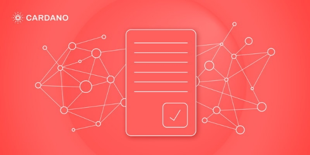

# No-surprises transaction validation: part 2
### **Alonzo transaction validation is performed in two phases to ensure fair compensation for validation work**
 7 September 2021[ Polina Vinogradova](tmp//en/blog/authors/polina-vinogradova/page-1/) 7 mins read

### [**Polina Vinogradova**](tmp//en/blog/authors/polina-vinogradova/page-1/)
Research Engineer

Engineering

- 
- 
- 
- 

In our [previous blog post](https://iohk.io/en/blog/posts/2021/09/06/no-surprises-transaction-validation-on-cardano/), we discussed the deterministic nature of transaction and script validation on the Alonzo ledger, which provides assurance that the outcome of on-chain transaction application and script validation can be accurately predicted locally, before the transaction is ever submitted. 

Trong [bài đăng trên blog trước] của chúng tôi (https://iohk.io/en/blog/posts/2021/09/06/no-surprises-transaction-validation-on-cardano/), chúng tôi đã thảo luận về bản chất xác định của giao dịch và
Xác thực tập lệnh trên sổ cái Alonzo, nơi đảm bảo rằng kết quả của ứng dụng giao dịch trên chuỗi và xác thực tập lệnh có thể được dự đoán chính xác tại địa phương, trước khi giao dịch được gửi.

Relying on the guarantees provided by the deterministic design of the Alonzo ledger, we have implemented a specific two-phase validation scheme. It is designed to minimize the resources the nodes use to validate network transactions while also eliminating unexpected costs for the user. In this blog post, we dive deeper into how the two-phase validation works.

Dựa vào các bảo đảm được cung cấp bởi thiết kế xác định của sổ cái Alonzo, chúng tôi đã thực hiện một sơ đồ xác nhận hai pha cụ thể.
Nó được thiết kế để giảm thiểu các tài nguyên mà các nút sử dụng để xác nhận các giao dịch mạng đồng thời loại bỏ chi phí bất ngờ cho người dùng.
Trong bài đăng trên blog này, chúng tôi đi sâu hơn về cách thức xác nhận hai pha hoạt động.

In the Shelley, Allegra, and Mary eras, transaction validation was a one-step process. The effect of a valid transaction on the ledger was fully predictable before it was applied. If a transaction was valid, it got included into a block and added to the ledger. If not, a node would reject it after a failed validation attempt and the transaction would not be included in a block. However, nodes that validated incoming transactions used time and resources, regardless of whether or not the transaction ended up in a block.

Trong Shelley, Allegra và Mary Eras, xác nhận giao dịch là một quá trình một bước.
Hiệu quả của một giao dịch hợp lệ trên sổ cái là có thể dự đoán đầy đủ trước khi nó được áp dụng.
Nếu một giao dịch là hợp lệ, nó đã được đưa vào một khối và thêm vào sổ cái.
Nếu không, một nút sẽ từ chối nó sau nỗ lực xác thực thất bại và giao dịch sẽ không được đưa vào một khối.
Tuy nhiên, các nút xác nhận các giao dịch đến đã sử dụng thời gian và tài nguyên, bất kể giao dịch có kết thúc trong một khối hay không.

Alonzo introduces Plutus scripts, which might require significantly more resources to validate them compared to simple scripts in previous eras. To address the issue of nodes expending resources on validating scripts of transactions that get rejected, Alonzo introduces a two-phase validation approach. This strategy maintains a predictable outcome of applying transactions to the ledger, and also ensures fair compensation to the nodes for their work and resource usage. 

Alonzo giới thiệu các tập lệnh Plutus, có thể đòi hỏi nhiều tài nguyên hơn đáng kể để xác nhận chúng so với các tập lệnh đơn giản trong các thời đại trước.
Để giải quyết vấn đề các nút mở rộng tài nguyên về việc xác thực các tập lệnh của các giao dịch bị từ chối, Alonzo giới thiệu một phương pháp xác thực hai pha.
Chiến lược này duy trì kết quả dự đoán của việc áp dụng các giao dịch cho sổ cái và cũng đảm bảo bồi thường công bằng cho các nút cho công việc và sử dụng tài nguyên của họ.

## **Two-phase transaction validation**

## ** Xác thực giao dịch hai pha **

Transaction validation on Cardano is divided into two phases. The main reason for introducing two-phase validation is to limit the amount of uncompensated validation work by nodes. Each phase serves a purpose in achieving this goal. Roughly speaking, the first phase checks whether the transaction is constructed correctly and can pay its processing fee. The second phase runs the scripts included in the transaction. If the transaction is phase-1 valid, phase-2 scripts run. If phase-1 fails, no scripts run, and the transaction is immediately discarded.

Xác nhận giao dịch trên Cardano được chia thành hai giai đoạn.
Lý do chính để giới thiệu xác thực hai pha là để hạn chế số lượng công việc xác nhận không bù bởi các nút.
Mỗi giai đoạn phục vụ một mục đích để đạt được mục tiêu này.
Nói một cách đại khái, giai đoạn đầu tiên kiểm tra xem giao dịch có được xây dựng chính xác hay không và có thể trả phí xử lý.
Giai đoạn thứ hai chạy các tập lệnh bao gồm trong giao dịch.
Nếu giao dịch là giai đoạn-1 hợp lệ, các tập lệnh giai đoạn-2 sẽ chạy.
Nếu giai đoạn 1 thất bại, không có tập lệnh nào chạy và giao dịch ngay lập tức bị loại bỏ.

Thus, nodes are expected to add processable transactions to a block even if the transactions are not phase-2 valid. This means that either:

Do đó, các nút dự kiến sẽ thêm các giao dịch có thể xử lý vào một khối ngay cả khi các giao dịch không hợp lệ pha-2.
Điều này có nghĩa là:

- a small amount of uncompensated work is done by a node to find out that a transaction is not processable, but no expensive phase-2 validation is done, or

- Một lượng nhỏ công việc không bù được thực hiện bởi một nút để tìm ra rằng một giao dịch không thể xử lý được, nhưng không có xác thực pha 2 đắt tiền nào được thực hiện, hoặc

- the transaction is processable. The node can then perform phase-2 validation of the scripts, tag the transaction accordingly as either phase-2 valid or phase-2 invalid, and add it to a block. In either case, the node will later be compensated for both phases of validation via the fee or collateral collected from this transaction.

- Giao dịch có thể xử lý.
Sau đó, nút có thể thực hiện xác thực giai đoạn-2 của các tập lệnh, gắn thẻ giao dịch phù hợp dưới dạng giai đoạn-2 hợp lệ hoặc pha-2 không hợp lệ và thêm nó vào một khối.
Trong cả hai trường hợp, sau đó nút sẽ được bồi thường cho cả hai giai đoạn xác nhận thông qua phí hoặc tài sản thế chấp được thu thập từ giao dịch này.

The expectation is that phase-2 failure should be rare, because a user submitting a transaction with failing scripts will lose ada while achieving nothing. This is locally predictable, and therefore a preventable event. The phase is a required safeguard to guarantee compensation for scripts’ potentially resource-intensive computation.

Kỳ vọng là sự thất bại của Giai đoạn-2 sẽ rất hiếm, bởi vì người dùng gửi giao dịch với các tập lệnh thất bại sẽ mất ADA trong khi không đạt được gì.
Đây là dự đoán cục bộ, và do đó là một sự kiện có thể phòng ngừa được.
Giai đoạn này là một biện pháp bảo vệ cần thiết để đảm bảo bồi thường cho tính toán có thể sử dụng nhiều tài nguyên.

Let’s take a closer look at the specifics of each phase.

Hãy xem xét kỹ hơn các chi tiết cụ thể của từng giai đoạn.

**Phase 1**

**Giai đoạn 1**

The first phase of validation must be simple. If this phase fails, a node does not get compensated for the work it has done, as it cannot accept processing fees from unprocessable transactions. 

Giai đoạn đầu tiên của xác nhận phải đơn giản.
Nếu giai đoạn này thất bại, một nút không được bù cho công việc mà nó đã thực hiện, vì nó không thể chấp nhận phí xử lý từ các giao dịch không thể qua được.

Phase-1 validation verifies two things: that a transaction is constructed correctly, and that it is possible to add it to the ledger. This validation includes the following checks and some additional ones:

Xác thực giai đoạn-1 xác minh hai điều: rằng một giao dịch được xây dựng chính xác và có thể thêm nó vào sổ cái.
Xác thực này bao gồm các kiểm tra sau và một số kiểm tra bổ sung:

- it pays the correct amount of fees and provides the correct amount of collateral (i.e. ada collected in the case of script failure, explained below)

- Nó trả đúng số phí và cung cấp số lượng tài sản thế chấp chính xác (nghĩa là ADA được thu thập trong trường hợp lỗi tập lệnh, được giải thích bên dưới)

- it includes all the data required for executing Plutus scripts

- Nó bao gồm tất cả các dữ liệu cần thiết để thực thi các tập lệnh Plutus

- it does not exceed any bounds set in the protocol parameters (on output sizes, etc.)

- Nó không vượt quá bất kỳ giới hạn nào được đặt trong các tham số giao thức (trên kích thước đầu ra, v.v.)

- its inputs refer to UTXOs existing on the ledger

- Các đầu vào của nó đề cập đến UTXOS hiện có trên sổ cái

- the stated computational budget for the transaction does not exceed the maximum resource limit per transaction

- Ngân sách tính toán đã nêu cho giao dịch không vượt quá giới hạn tài nguyên tối đa cho mỗi giao dịch

- integrity hash checks, etc.

- Kiểm tra hàm băm toàn vẹn, v.v.

Before adding an incoming transaction to the mempool (and eventually, to a block), a node must perform all phase-1 validation checks. If any of these checks fail, the transaction is rejected without being included into a block, and no fees are charged. In previous eras, this was the only validation phase, and Cardano handled all validation failures in this fashion. 

Trước khi thêm một giao dịch đến vào mempool (và cuối cùng, vào một khối), một nút phải thực hiện tất cả các kiểm tra xác thực pha-1.
Nếu bất kỳ kiểm tra nào trong số này không thành công, giao dịch bị từ chối mà không được đưa vào một khối và không có phí nào được tính.
Trong thời đại trước, đây là giai đoạn xác nhận duy nhất và Cardano đã xử lý tất cả các thất bại xác nhận theo kiểu này.

Honest, non-compromised nodes are not expected to intentionally produce unprocessable transactions. Nodes can also drop connections performing adversarial dissemination of phase-1 invalid transactions.

Trung thực, các nút không được tính toán được dự kiến sẽ không cố ý tạo ra các giao dịch không thể qua được.
Các nút cũng có thể bỏ kết nối thực hiện phổ biến đối nghịch các giao dịch không hợp lệ pha 1.

**Phase 2**

**Giai đoạn 2**

The second phase of validation runs Plutus scripts, which can be more computationally expensive. Therefore, fees are charged following either a success or a failure in the second phase. Collected ada goes into the fee pot, and thus compensates nodes for the resources used in the validation process.

Giai đoạn xác thực thứ hai chạy các tập lệnh Plutus, có thể tốn kém hơn về mặt tính toán.
Do đó, phí được tính sau khi thành công hoặc thất bại trong giai đoạn thứ hai.
ADA được thu thập đi vào nồi phí, và do đó bù các nút cho các tài nguyên được sử dụng trong quá trình xác nhận.

Successful phase-1 validation does not guarantee that all of the transaction’s actions are processable, only that collection of the collateral is possible. Phase-2 performs Plutus script validation, and the decision of whether to perform full processing or only collect collateral is made based on the outcome of validation:

Xác thực giai đoạn-1 thành công không đảm bảo rằng tất cả các hành động của giao dịch đều có thể xử lý được, chỉ có thể thu thập tài sản thế chấp.
Giai đoạn-2 thực hiện xác thực tập lệnh Plutus và quyết định có thực hiện xử lý đầy đủ hay chỉ thu thập tài sản thế chấp được thực hiện dựa trên kết quả xác thực:

- fully apply the transaction (the only possibility prior to Alonzo) – if the Plutus scripts validate **all** the actions of the transaction, or 

- Áp dụng đầy đủ giao dịch (khả năng duy nhất trước Alonzo) - Nếu các tập lệnh Plutus xác thực ** tất cả ** các hành động của giao dịch, hoặc "

- collect the collateral ada and ignore the rest of the transaction – if one of the Plutus scripts fails 
. 

- Thu thập ADA tài sản thế chấp và bỏ qua phần còn lại của giao dịch - nếu một trong những tập lệnh Plutus không thành công.

Recall that script validation has a locally predictable outcome and is guaranteed to terminate. Users can locally check script validation outcomes, and there will be no disagreement between honest nodes on how to process a given transaction and the scripts therein. 

Nhớ lại rằng xác thực tập lệnh có kết quả dự đoán cục bộ và được đảm bảo chấm dứt.
Người dùng có thể kiểm tra địa phương kết quả xác thực tập lệnh và sẽ không có sự bất đồng nào giữa các nút trung thực về cách xử lý một giao dịch nhất định và các tập lệnh trong đó.

**Collateral**

** Tài sản thế chấp **

If scripts don't validate, we still need to compensate the nodes for their work. But we can't just take money from the transaction inputs, because those might have been locked with scripts - those that failed! So instead, Alonzo introduces a special provision for this. The *collateral* of a transaction is the amount of ada that will be collected as a fee in case of a phase-2 script validation failure. In a processable transaction, this amount must be at least a certain percentage of the transaction fee, specified in a protocol parameter. 

Nếu các tập lệnh không xác nhận, chúng ta vẫn cần phải bù các nút cho công việc của họ.
Nhưng chúng tôi không thể lấy tiền từ các đầu vào giao dịch, bởi vì những thứ đó có thể đã bị khóa với các tập lệnh - những người thất bại!
Vì vậy, thay vào đó, Alonzo giới thiệu một điều khoản đặc biệt cho việc này.
* Tài sản thế chấp * của một giao dịch là số lượng ADA sẽ được thu dưới dạng phí trong trường hợp lỗi xác thực tập lệnh giai đoạn-2.
Trong một giao dịch có thể xử lý, số tiền này phải ít nhất là một tỷ lệ phần trăm nhất định của phí giao dịch, được chỉ định trong tham số giao thức.

This amount is specified at the time of constructing the transaction. Not directly, but by adding *collateral inputs* to the transaction. The total balance in the UTXOs corresponding to these specially marked inputs is the transaction’s collateral amount. These UTXOs must have public key (rather than script) addresses and contain no tokens other than ada. 

Số tiền này được chỉ định tại thời điểm xây dựng giao dịch.
Không trực tiếp, nhưng bằng cách thêm * đầu vào tài sản thế chấp * vào giao dịch.
Tổng số dư trong UTXOS tương ứng với các đầu vào được đánh dấu đặc biệt này là số tiền tài sản thế chấp của giao dịch.
Các UTXO này phải có các địa chỉ khóa công khai (thay vì tập lệnh) và chứa không có mã thông báo nào khác ngoài ADA.

The collateral inputs get removed from the ledger UTXO *only if any script fails phase-2 validation*. If all scripts pass, the specified transaction fee amount gets collected, as in previous eras. In particular, the amount comes from the regular, non-collateral inputs, and the collateral inputs are simply ignored. And, good news! It is permitted to use the same inputs as both collateral and regular, since only one of the two sets ever gets removed from the UTXO.

Các đầu vào tài sản thế chấp được xóa khỏi sổ cái utxo *chỉ khi bất kỳ tập lệnh nào không thành công xác thực pha-2 *.
Nếu tất cả các tập lệnh vượt qua, số tiền phí giao dịch được chỉ định sẽ được thu thập, như trong các thời đại trước.
Cụ thể, số tiền đến từ các đầu vào thông thường, không quan trọng và các đầu vào tài sản thế chấp chỉ đơn giản là bị bỏ qua.
Và, tin tốt!
Nó được phép sử dụng các đầu vào giống nhau như cả tài sản thế chấp và đều đặn, vì chỉ một trong hai bộ từng bị xóa khỏi UTXO.

The signatures required to validate the spending of collateral inputs also play an important role in maintaining the integrity of a transaction. They do so by preventing adversaries from altering its contents so that it continues to be processable but fails phase-2 validation. An example of this would be an adversary replacing a redeemer. Collateral key holders’ signatures are required to make such a change. The collateral key holders are also the only users who stand to lose any ada if script validation fails. 

Các chữ ký cần thiết để xác nhận chi tiêu đầu vào tài sản thế chấp cũng đóng một vai trò quan trọng trong việc duy trì tính toàn vẹn của một giao dịch.
Họ làm như vậy bằng cách ngăn chặn các đối thủ thay đổi nội dung của nó để nó tiếp tục có thể xử lý nhưng không xác thực giai đoạn 2.
Một ví dụ về điều này sẽ là một kẻ thù thay thế cho một người cứu chuộc.
Cần có chữ ký của chủ sở hữu khóa tài sản thế chấp được yêu cầu để thực hiện thay đổi như vậy.
Các chủ sở hữu khóa tài sản thế chấp cũng là người dùng duy nhất bị mất bất kỳ ADA nào nếu xác thực tập lệnh không thành công.

Since script evaluation is deterministic, the collateral key holders are able to check locally whether the transaction will pass phase-2 validation on-chain before they sign it. If it does, then they can be sure it will also do so on-chain, and they will definitely not lose their collateral. A user acting in good faith should never lose their collateral. It also means that they can reuse the same collateral inputs for multiple transactions, and be sure the collateral is not collected.

Vì đánh giá tập lệnh là xác định, các chủ sở hữu khóa tài sản thế chấp có thể kiểm tra cục bộ xem giao dịch sẽ vượt qua xác thực pha-2 trên chuỗi trước khi họ ký.
Nếu có, thì họ có thể chắc chắn rằng nó cũng sẽ làm như vậy trên chuỗi, và họ chắc chắn sẽ không mất tài sản thế chấp.
Một người dùng hành động trong đức tin tốt không bao giờ nên mất thế chấp.
Điều đó cũng có nghĩa là họ có thể sử dụng lại cùng một đầu vào tài sản thế chấp cho nhiều giao dịch và chắc chắn rằng tài sản thế chấp không được thu thập.

*Now that we have launched the public Alonzo testnet, we welcome all users and developers to assess it by building and executing Plutus scripts. You can find out more information in the dedicated [Alonzo testnet repository](https://github.com/input-output-hk/Alonzo-testnet), or [discuss Plutus and Alonzo topics](https://discord.com/channels/826816523368005654/826829738156621895) with our diverse community.*

*Bây giờ chúng tôi đã ra mắt Alonzo Testnet công khai, chúng tôi hoan nghênh tất cả người dùng và nhà phát triển đánh giá nó bằng cách xây dựng và thực hiện các tập lệnh Plutus.
Bạn có thể tìm hiểu thêm thông tin trong kho lưu trữ [Alonzo TestNet chuyên dụng] (https://github.com/input-output-hk/alonzo-testnet) hoặc [thảo luận về chủ đề Plutus và Alonzo] (https://discord.com
/kênh/826816523368005654/826829738156621895) với cộng đồng đa dạng của chúng tôi.*

