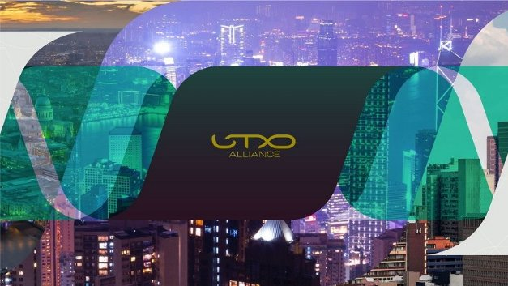

# UTXO alliance: fostering innovation and collaboration across the blockchain space
### **We’re partnering with other UTXO-based blockchains to cultivate innovative solutions to advance interoperability, programmability, and scalability**
 15 October 2021[ Olga Hryniuk](tmp//en/blog/authors/olga-hryniuk/page-1/) 9 mins read

### [**Olga Hryniuk**](tmp//en/blog/authors/olga-hryniuk/page-1/)
Technical Writer

Marketing & Communications

- 
- 

At the Cardano Summit, IOHK announced a collaboration with [Ergo](https://ergoplatform.org/en/), [Nervos](https://www.nervos.org/), and [Topl](https://www.topl.co/) to create the UTXO alliance. Today, we’re delighted to welcome a new alliance partner – [Komodo](https://komodoplatform.com/en/).

Tại Hội nghị thượng đỉnh Cardano, IOHK đã công bố sự hợp tác với [ERGO] (https://ergoplatform.org/en/), [Nervos] (https://www.nervos.org/) và [Topl] (https:/
/www.topl.co/) để tạo Liên minh UTXO.
Hôm nay, chúng tôi rất vui mừng được chào đón một đối tác liên minh mới - [Komodo] (https://komodoplatform.com/en/).

Komodo is an open-source technology provider that offers all-in-one blockchain solutions for developers and enterprises. Komodo works closely with organizations that want to launch branded decentralized exchanges, cross-protocol financial applications, and independent blockchains. Komodo's flagship end-user application AtomicDEX is a non-custodial multi-coin software wallet and atomic swap-powered decentralized exchange rolled into one app. [AtomicDEX](https://atomicdex.io/) and its underlying technology – Komodo AtomicDEX API – is compatible with 99% of cryptocurrencies in existence and offers the widest cross-chain, cross-protocol trading support in the entire blockchain industry.

Komodo là một nhà cung cấp công nghệ nguồn mở cung cấp các giải pháp blockchain tất cả trong một cho các nhà phát triển và doanh nghiệp.
Komodo làm việc chặt chẽ với các tổ chức muốn khởi động các sàn giao dịch phi tập trung có thương hiệu, các ứng dụng tài chính giao thức chéo và blockchain độc lập.
Ứng dụng AtomicDex của người dùng cuối hàng đầu của Komodo là một ví phần mềm đa coin không giam giữ và trao đổi phi tập trung được trao đổi nguyên tử được cuộn thành một ứng dụng.
.

“UTXO blockchains lay the basis and undisputed foundations of today’s blockchain industry. UTXO technology reflects Satoshi Nakamoto’s core vision of ultimate (financial) liberty,” said Komodo business development leader, Kadan Stadelman. “On behalf of Komodo Platform and the AtomicDEX team, I am honored to join the UTXO alliance to uphold and advance this vision. I am certain that together with other alliance members, we will bring this technology to the next level. All for one and one for all.”

Các blockchain của UTXO đặt nền tảng và nền tảng không thể tranh cãi của ngành công nghiệp blockchain ngày nay.
Công nghệ UTXO phản ánh tầm nhìn cốt lõi của Satoshi Nakamoto, về tự do (tài chính) tự do.
Thay mặt cho nền tảng Komodo và nhóm AtomicDex, tôi rất vinh dự được tham gia Liên minh UTXO để duy trì và nâng cao tầm nhìn này.
Tôi chắc chắn rằng cùng với các thành viên liên minh khác, chúng tôi sẽ đưa công nghệ này lên một tầm cao mới.
Mọi người vì một người, một người vì mọi người."

The UTXO alliance will facilitate cross-ecosystem initiatives to extend the capabilities of UTXO in terms of smart contract functionality. Teaming up with other blockchain industry projects, the shared objective is to foster and support further research, development, and education across the entire space.

Liên minh UTXO sẽ tạo điều kiện cho các sáng kiến hệ sinh thái chéo để mở rộng khả năng của UTXO về chức năng hợp đồng thông minh.
Hợp tác với các dự án công nghiệp blockchain khác, mục tiêu chung là thúc đẩy và hỗ trợ nghiên cứu, phát triển và giáo dục sâu hơn trên toàn bộ không gian.

The goal of the UTXO alliance is to drive continuous innovation of the UTXO model in terms of interoperability, scalability (sharding, state channels), and smart contract solutions. Enhancing these solutions and driving key initiatives to build bridges between blockchains powers fair and accessible global finance for everyone. This also establishes a collective effort to enforce the development and functionality of UTXO-based ledgers. Other projects using this model include NEO, Bitcoin, and its derivatives like Bitcoin Cash, Litecoin, and Zcash. 

Mục tiêu của Liên minh UTXO là thúc đẩy sự đổi mới liên tục của mô hình UTXO về khả năng tương tác, khả năng mở rộng (Sharding, Kênh Nhà nước) và Giải pháp hợp đồng thông minh.
Tăng cường các giải pháp này và thúc đẩy các sáng kiến chính để xây dựng các cây cầu giữa các blockchains quyền lực tài chính toàn cầu công bằng và dễ tiếp cận cho mọi người.
Điều này cũng thiết lập một nỗ lực tập thể để thực thi sự phát triển và chức năng của các sổ cái dựa trên UTXO.
Các dự án khác sử dụng mô hình này bao gồm NEO, Bitcoin và các công cụ phái sinh của nó như Bitcoin Cash, Litecoin và ZCash.

## **Why UTXO matters**

## ** Tại sao utxo quan trọng **

The unspent transaction output (UTXO) accounting model guarantees security, data privacy, and scalability at the core of financial activities. UTXO models foster scalability, as multiple UTXOs can be handled simultaneously, and ensure enhanced security as the overall stake is not aggregated into a single account. 

Mô hình kế toán đầu ra giao dịch chưa được sử dụng (UTXO) đảm bảo bảo mật, quyền riêng tư dữ liệu và khả năng mở rộng là cốt lõi của các hoạt động tài chính.
Các mô hình UTXO thúc đẩy khả năng mở rộng, vì nhiều UTXO có thể được xử lý đồng thời và đảm bảo bảo mật nâng cao vì cổ phần tổng thể không được tổng hợp thành một tài khoản.

UTXO is a more secure alternative to account-based models (used by Ethereum, for example). Unlike UTXO-based ledgers, account-based blockchains track the overall balance, and the same address is used every time a transaction is made. This is vulnerable to hacks and hinders scalability, as transactions are processed sequentially, rather than in parallel.

UTXO là một giải pháp thay thế an toàn hơn cho các mô hình dựa trên tài khoản (ví dụ như được sử dụng bởi Ethereum).
Không giống như sổ cái dựa trên UTXO, các blockchain dựa trên tài khoản theo dõi số dư tổng thể và cùng một địa chỉ được sử dụng mỗi khi giao dịch được thực hiện.
Điều này dễ bị hack và cản trở khả năng mở rộng, vì các giao dịch được xử lý tuần tự, thay vì song song.

Cardano’s extended UTXO ([EUTXO](https://docs.cardano.org/plutus/eutxo-explainer)) model, for example, supports multi-assets and smart contracts and enables arbitrary logic in the form of scripts. These scripts can be split across different branches enforcing more parallelism and higher scalability. 

Cardano sườn mở rộng UTXO ([EUTXO] (https://docs.cardano.org/plutus/eutxo-explainer)), ví dụ, hỗ trợ nhiều tài sản và hợp đồng thông minh và cho phép logic tùy ý trong hình thức.
Các tập lệnh này có thể được phân chia trên các nhánh khác nhau thực thi song song hơn và khả năng mở rộng cao hơn.

Alliance member Nervos is developing a permissionless, layer 1, open-source, proof-of-work blockchain protocol focused on creating the foundations for an interoperable universal public network.

Thành viên Alliance Nervos đang phát triển một giao thức blockchain không được phép, lớp 1, nguồn mở, bằng chứng tập trung vào việc tạo nền tảng cho một mạng lưới công cộng phổ quát có thể tương tác.

“Implementing the ‘separation of duties’ principle, Bitcoin’s visionary UTXO model is naturally more scalable and prone to attacks than the account model,” said Ren Zhang, lead researcher at Nervos. “Many projects sharing this vision provide unique perspectives to extend UTXO’s possibilities. The UTXO alliance enables interoperability and coevolution of its members, providing the world a superset of our advantages.”

Ren Zhang, nhà nghiên cứu chính của Nervos cho biết, việc thực hiện ‘phân tách nguyên tắc nhiệm vụ.
Nhiều dự án chia sẻ tầm nhìn này cung cấp những quan điểm độc đáo để mở rộng khả năng của UTXO.
Liên minh UTXO cho phép khả năng tương tác và sự kết hợp của các thành viên của mình, cung cấp cho thế giới một siêu nhân của những lợi thế của chúng tôi.

Manuel Chakravarty, Lambda scientist and Plutus architect at IOHK added: 

Manuel Chakravarty, Nhà khoa học Lambda và Kiến trúc sư Plutus tại IOHK cho biết thêm:

The UTXO ledger model, battle-tested by Bitcoin, remains the gold standard for security and scalability. The UTXO alliance is an important step towards ensuring that it will be the gold standard for interoperability, too.

Mô hình sổ cái UTXO, được thử nghiệm bởi Bitcoin, vẫn là tiêu chuẩn vàng cho bảo mật và khả năng mở rộng.
Liên minh UTXO là một bước quan trọng để đảm bảo rằng đó cũng sẽ là tiêu chuẩn vàng cho khả năng tương tác.

## **Focusing on interoperability, programmability, and scalability**

## ** Tập trung vào khả năng tương tác, khả năng lập trình và khả năng mở rộng **

Centralized finance has been the centerpiece for financial operations for decades. While such a system has served us well enough in general, it still suffers from a reliance on a central authority, exorbitant transaction fees, and unnecessary delays, complexity, and costs in making international payments because of regulatory restrictions. It’s time for change.

Tài chính tập trung là trung tâm cho các hoạt động tài chính trong nhiều thập kỷ.
Mặc dù một hệ thống như vậy đã phục vụ chúng ta đủ tốt nói chung, nhưng nó vẫn phải chịu sự phụ thuộc vào cơ quan trung ương, phí giao dịch cắt cổ và sự chậm trễ không cần thiết, sự phức tạp và chi phí trong việc thanh toán quốc tế vì các hạn chế theo quy định.
Nó thời gian để thay đổi.

**Interoperability**

** Khả năng tương tác **

Blockchain technology addresses the challenges of centralization by enabling reliable peer-to-peer transactions based on cryptographic proof rather than relying on costly intermediaries. Many blockchain projects have emerged to provide a secure and decentralized environment for financial transactions. These projects vary in terms of consensus algorithms, accounting models, or smart contract applicability focusing on particular use cases (such as finance, data traceability, supply chain management, etc). 

Công nghệ blockchain giải quyết các thách thức của tập trung hóa bằng cách cho phép các giao dịch ngang hàng đáng tin cậy dựa trên bằng chứng mật mã thay vì dựa vào các trung gian tốn kém.
Nhiều dự án blockchain đã xuất hiện để cung cấp một môi trường an toàn và phi tập trung cho các giao dịch tài chính.
Các dự án này khác nhau về thuật toán đồng thuận, mô hình kế toán hoặc ứng dụng hợp đồng thông minh tập trung vào các trường hợp sử dụng cụ thể (như tài chính, truy xuất dữ liệu, quản lý chuỗi cung ứng, v.v.).

Growth is inevitable. However, the speed at which the blockchain landscape matures is challenged by siloed ecosystems and disparate governance rules, technology versions, or functionality support. 

Tăng trưởng là không thể tránh khỏi.
Tuy nhiên, tốc độ mà cảnh quan blockchain trưởng thành bị thách thức bởi các hệ sinh thái im lặng và các quy tắc quản trị khác nhau, phiên bản công nghệ hoặc hỗ trợ chức năng.

As Romain Pellerin, IOHK CTO, said at the Summit:

Như Romain Pellerin, IOHK CTO, cho biết tại hội nghị thượng đỉnh:

Mainstream blockchain adoption will pass only through the interconnection of networks, similar to how the Internet was built by the interconnection of intranets and extranets.

Việc áp dụng blockchain chính thống sẽ chỉ thông qua các kết nối của các mạng, tương tự như cách internet được xây dựng bởi sự kết nối của mạng nội bộ và extranets.

So, today, it is important to ensure that the whole industry is driving towards interoperability. Users should be able to transact with each other without being limited to a certain ledger, smart contracts should be supported within different environments, and decentralized applications (DApps) should have cross-platform compatibility. Only such an approach will allow the blockchain industry to reach the full potential of its capabilities, driving further adoption. 

Vì vậy, ngày nay, điều quan trọng là đảm bảo rằng toàn bộ ngành công nghiệp đang hướng tới khả năng tương tác.
Người dùng có thể giao dịch với nhau mà không bị giới hạn trong một sổ cái nhất định, các hợp đồng thông minh nên được hỗ trợ trong các môi trường khác nhau và các ứng dụng phi tập trung (DAPP) nên có khả năng tương thích đa nền tảng.
Chỉ có một cách tiếp cận như vậy sẽ cho phép ngành công nghiệp blockchain đạt được toàn bộ tiềm năng của khả năng của nó, thúc đẩy việc áp dụng thêm.

**Programmability**

** Khả năng lập trình **

The UTXO alliance is also focused on blockchain programmability for the creation of DApps and smart contracts. In fact, the design of new languages is required in order to adapt to the specific transaction and data storage management (Ergo’s and Cardano’s EUTXO, or Nervos’ cell model, for example) of the UTXO model. The founding members of the alliance have developed Antara, CKB-VM, ErgoScript, and Plutus as their smart contract languages. Alliance members are sharing knowledge and collaborating in the development of those technologies to rapidly scale the number of use cases that can be run on UTXO-based blockchains.

Liên minh UTXO cũng tập trung vào khả năng lập trình blockchain để tạo ra DAPP và hợp đồng thông minh.
Trên thực tế, việc thiết kế các ngôn ngữ mới được yêu cầu để thích ứng với quản lý lưu trữ dữ liệu và giao dịch cụ thể (ví dụ, ERGO, và Cardano, EUTXO, hoặc mô hình tế bào Nervos,) của mô hình UTXO.
Các thành viên sáng lập của Liên minh đã phát triển Antara, CKB-VM, Ergoscript và Plutus là ngôn ngữ hợp đồng thông minh của họ.
Các thành viên liên minh đang chia sẻ kiến thức và hợp tác trong việc phát triển các công nghệ đó để nhanh chóng mở rộng số lượng các trường hợp sử dụng có thể được chạy trên các blockchain dựa trên UTXO.

Also, those languages are built as domain-specific languages (DSLs) on top of common programming languages including Scala, Haskell, C, JavaScript, Go, Rust, etc. However, in certain cases, those common languages do not offer the security or ease of use that smart contract developers require.

Ngoài ra, các ngôn ngữ đó được xây dựng dưới dạng các ngôn ngữ dành riêng cho miền (DSL) trên các ngôn ngữ lập trình phổ biến bao gồm Scala, Haskell, C, JavaScript, Go, Rust, v.v.
Dễ sử dụng mà các nhà phát triển hợp đồng thông minh yêu cầu.

To ensure enhanced security and code verifiability, IOHK has chosen Haskell as the programming language for Plutus smart contracts. It is the most widely used functional programming language for application development. Haskell is simple, secure, and formally verified. In terms of adoption, it is suitable for a wide range of financial use cases, while allowing to move funds rapidly, get the right results, and ensure scalability. This programming style fits well within the UTXO model with regard to state distribution and parallelization for enhanced scalability. 

Để đảm bảo tính xác minh bảo mật và mã được nâng cao, IOHK đã chọn Haskell làm ngôn ngữ lập trình cho các hợp đồng thông minh Plutus.
Đây là ngôn ngữ lập trình chức năng được sử dụng rộng rãi nhất để phát triển ứng dụng.
Haskell đơn giản, an toàn và chính thức được xác minh.
Về mặt áp dụng, nó phù hợp cho một loạt các trường hợp sử dụng tài chính, trong khi cho phép di chuyển tiền nhanh chóng, có được kết quả đúng và đảm bảo khả năng mở rộng.
Phong cách lập trình này rất phù hợp trong mô hình UTXO liên quan đến phân phối trạng thái và song song hóa để tăng cường khả năng mở rộng.

Nervos is also working on alternative provably secure programming options that use RISK-V compilers to support common programming languages with CKB-VM. Topl, on the other hand, has been working on a chain program engine proof of concept, which is basically an abstraction layer on top of the UTXO model that allows working with shared state execution environments. It uses a pointer registry and a series of UTXOs (represented as atomic data elements in ledger state -i.e., boxes-) to reconstruct an execution context for evaluating program method call transactions.

Nervos cũng đang làm việc trên các tùy chọn lập trình an toàn thay thế có thể sử dụng các trình biên dịch rủi ro-V để hỗ trợ các ngôn ngữ lập trình phổ biến với CKB-VM.
Topl, mặt khác, đã làm việc trên một chương trình Chuỗi bằng chứng về khái niệm, về cơ bản là một lớp trừu tượng trên đầu mô hình UTXO cho phép làm việc với môi trường thực thi trạng thái được chia sẻ.
Nó sử dụng sổ đăng ký con trỏ và một loạt các UTXOS (được biểu thị dưới dạng các yếu tố dữ liệu nguyên tử ở trạng thái sổ cái -I.E., hộp-) để xây dựng lại bối cảnh thực thi để đánh giá các giao dịch gọi của phương thức chương trình.

Taking into consideration different development efforts, the UTXO alliance will be exploring the best-case scenarios to create a unified smart contract ecosystem where a *variety* of programming languages can be compiled and used on different blockchain platforms. This will be instrumental in ensuring better interoperability between blockchains.

Cân nhắc các nỗ lực phát triển khác nhau, Liên minh UTXO sẽ khám phá các tình huống tốt nhất để tạo ra một hệ sinh thái hợp đồng thông minh thống nhất trong đó một * giống * ngôn ngữ lập trình có thể được biên dịch và sử dụng trên các nền tảng blockchain khác nhau.
Đây sẽ là công cụ để đảm bảo khả năng tương tác tốt hơn giữa các blockchain.

**Scalability**

** Khả năng mở rộng **

As a network grows, it is also important to take into account its scalability capability in terms of transaction processing and throughput. The UTXO model is different from the account-based one, as it functions based on the local state, and thus requires a different programming approach.

Khi một mạng phát triển, điều quan trọng là phải tính đến khả năng mở rộng của nó về mặt xử lý và thông lượng giao dịch.
Mô hình UTXO khác với mô hình dựa trên tài khoản, vì nó hoạt động dựa trên trạng thái cục bộ và do đó đòi hỏi một phương pháp lập trình khác.

These two models have different properties and offer a different set of trade-offs, different pros and cons. The UTXO model ensures determinism, predictability and scalability by managing local states (the local portions of the overall graph of transactions) while the account model facilitates the development of use cases that rely on the global state (the whole graph of transactions needs to be processed before validation).

Hai mô hình này có các thuộc tính khác nhau và cung cấp một bộ đánh đổi khác nhau, những ưu và nhược điểm khác nhau.
Mô hình UTXO đảm bảo chủ nghĩa xác định, khả năng dự đoán và khả năng mở rộng bằng cách quản lý các trạng thái địa phương (các phần cục bộ của biểu đồ tổng thể của các giao dịch) trong khi mô hình tài khoản tạo điều kiện cho việc phát triển các trường hợp sử dụng dựa vào trạng thái toàn cầu (toàn bộ biểu đồ giao dịch cần được xử lý
trước khi xác nhận).

Hence, the UTXO model offers valuable properties of ensuring the execution of transactions and contracts prior to their submission on the chain with no surprises in terms of fees or validation. Also, the UTXO model can provide better scalability as it is simpler to shard a graph of transactions by definition by dividing into a set of sub-graphs.

Do đó, mô hình UTXO cung cấp các thuộc tính có giá trị để đảm bảo thực hiện các giao dịch và hợp đồng trước khi gửi vào chuỗi mà không có bất ngờ về phí hoặc xác nhận.
Ngoài ra, mô hình UTXO có thể cung cấp khả năng mở rộng tốt hơn vì đơn giản hơn để ngăn chặn một biểu đồ giao dịch theo định nghĩa bằng cách chia thành một tập hợp các biểu đồ phụ.

It is also easier to detach a particular transaction or set of transactions (that transport data, scripts and assets) to continue activity off-chain before coming back with a result on-chain which ensures scalability by off-loading activities from the mainchain. IOHK, for example, has developed Hydra state channel solutions that increase the system throughput and allow running multiple operations in parallel without compromising scalability. You can find out more about scalability by reading about [concurrency on Cardano](https://iohk.io/en/blog/posts/2021/09/10/concurrency-and-all-that-cardano-smart-contracts-and-the-eutxo-model/) and the [Hydra](https://iohk.io/en/blog/posts/2021/09/17/hydra-cardano-s-solution-for-ultimate-scalability/) approach.

Cũng dễ dàng hơn để tách một giao dịch hoặc bộ giao dịch cụ thể (đó là dữ liệu vận chuyển, tập lệnh và tài sản) để tiếp tục hoạt động ngoài chuỗi trước khi quay lại với kết quả trên chuỗi đảm bảo khả năng mở rộng bằng cách giảm tải các hoạt động từ mainchain.
IOHK, ví dụ, đã phát triển các giải pháp kênh trạng thái hydra làm tăng thông lượng hệ thống và cho phép chạy nhiều hoạt động song song mà không ảnh hưởng đến khả năng mở rộng.
Bạn có thể tìm hiểu thêm về khả năng mở rộng bằng cách đọc về [đồng thời trên Cardano] (https://iohk.io/en/blog/posts/2021/09/10/concurrency-and-all-that-cardano-mart-contracts-
và-eutxo-model/) và [hydra] (https://iohk.io/en/blog/posts/2021/09/17/hydra-cardano
cách tiếp cận.

## **Combining forces for the common goal**

## ** Kết hợp các lực cho mục tiêu chung **

The UTXO alliance collaborates to advance the UTXO model while developing a universal UTXO standard. It aims to provide ada holders, cryptocurrency users, enterprises, and the developer community with a range of solutions that do not lock them into a single standard. For this, the alliance will be conducting academic research and releasing a number of papers that underpin secure and scalable smart contract development based on the UTXO model.

Liên minh UTXO hợp tác để thúc đẩy mô hình UTXO trong khi phát triển một tiêu chuẩn UTXO phổ quát.
Nó nhằm mục đích cung cấp cho chủ sở hữu ADA, người dùng tiền điện tử, doanh nghiệp và cộng đồng nhà phát triển với một loạt các giải pháp không khóa chúng vào một tiêu chuẩn duy nhất.
Đối với điều này, Liên minh sẽ tiến hành nghiên cứu học thuật và phát hành một số bài báo làm nền tảng cho sự phát triển hợp đồng thông minh an toàn và có thể mở rộng dựa trên mô hình UTXO.

While interoperability is key, it is also crucial to provide blockchain solutions for increased funds security, scalability of transaction processing, and, of course, extended functionality granted by smart contracts. 

Mặc dù khả năng tương tác là chìa khóa, nhưng cũng rất quan trọng để cung cấp các giải pháp blockchain để tăng bảo mật quỹ, khả năng mở rộng của xử lý giao dịch và tất nhiên, chức năng mở rộng được cấp bởi các hợp đồng thông minh.

Alliance member Topl has developed a blockchain built to be an impact monetization engine. James Aman, Topl founder and CTO said: “Extended UTXOs enable novel methods of computation in DLT systems that bridge the gap between hard-coded protocol behavior and smart contracts. EUTXOs enable users to engage in complex interactions while retaining full local verifiability even from light clients.”

Thành viên Alliance Topl đã phát triển một blockchain được xây dựng để trở thành một động cơ kiếm tiền tác động.
James Aman, người sáng lập Topl và CTO cho biết: Utxos mở rộng cho phép các phương pháp tính toán mới trong các hệ thống DLT thu hẹp khoảng cách giữa hành vi giao thức được mã hóa cứng và hợp đồng thông minh.
EUTXOS cho phép người dùng tham gia vào các tương tác phức tạp trong khi vẫn giữ được tính xác minh cục bộ đầy đủ ngay cả từ các máy khách ánh sáng.

To enable the possibility of utilizing various features in a blockchain-agnostic way, the alliance is committed to addressing such instrumental questions as:

Để cho phép khả năng sử dụng các tính năng khác nhau theo cách không chính xác blockchain, liên minh cam kết giải quyết các câu hỏi công cụ như:

- how to seamlessly transfer data between different blockchain environments

- Cách chuyển dữ liệu liên tục giữa các môi trường blockchain khác nhau

- what is the ideal size of data to be used in transactions

- Kích thước lý tưởng của dữ liệu sẽ được sử dụng trong các giao dịch là gì

- what should be the speed of data processing 

- Tốc độ xử lý dữ liệu là bao nhiêu

- the transaction cost, etc. 

- Chi phí giao dịch, v.v.

Thus, the alliance focuses on the mechanism that enables seamless and secure transactions between different blockchains to foster the greater adoption of blockchain technology. This will also drive the development of solid DApps and DeFi solutions.

Do đó, Liên minh tập trung vào cơ chế cho phép các giao dịch liền mạch và an toàn giữa các blockchain khác nhau để thúc đẩy việc áp dụng công nghệ blockchain lớn hơn.
Điều này cũng sẽ thúc đẩy sự phát triển của các giải pháp DEFI và DEFI rắn.

Alex Chepurnoy, the co-founder of alliance member Ergo, added: “While it is well-known that UTXOs are better for blockchain scalability and simpler off-chain protocols, the extended UTXO model also allows for novel on-chain DeFi constructions with interesting properties.”

Alex Chepurnoy, người đồng sáng lập thành viên Alliance Ergo, nói thêm: Trong khi người ta biết rằng UTXO tốt hơn cho khả năng mở rộng blockchain và các giao thức ngoài chuỗi đơn giản hơn, mô hình UTXO mở rộng cũng cho phép các cấu trúc xác định trên chuỗi mới lạ với các cấu trúc thú vị với sự thú vị
đặc tính."

This is only the beginning, and we are currently looking into collaborations with more ecosystems to pioneer improvements of the UTXO model, investigate how the common knowledge and technology stack can improve scalability properties, and contribute to open-source research. We’ll keep you posted as the alliance grows.

Đây chỉ là khởi đầu và chúng tôi hiện đang xem xét sự hợp tác với nhiều hệ sinh thái hơn để cải tiến tiên phong của mô hình UTXO, điều tra làm thế nào kiến thức và ngăn xếp công nghệ phổ biến có thể cải thiện các đặc tính khả năng mở rộng và đóng góp cho nghiên cứu nguồn mở.
Chúng tôi sẽ giữ cho bạn được đăng khi liên minh phát triển.

Visit the [UTXO alliance website](https://utxo-alliance.org/) to find out more, join the alliance or contribute to the research.

Truy cập [Trang web UTXO Alliance] (https://utxo-alliance.org/) để tìm hiểu thêm, tham gia Liên minh hoặc đóng góp cho nghiên cứu.

