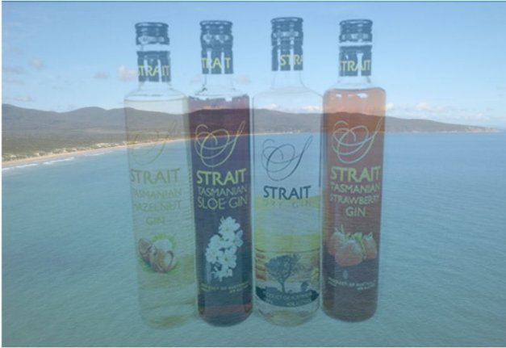

# Bringing premium spirits to the Cardano blockchain
### **Enhancing the customer experience with blockchain-based supply chain authentication**
 22 October 2021[ Neil Burgess](tmp//en/blog/authors/neil-burgess/page-1/) 2 mins read

### [**Neil Burgess**](tmp//en/blog/authors/neil-burgess/page-1/)
Technical Writer

Marketing & Communications

- 
- 

Imagine buying a bottle of super premium spirits. Scan it with an app on your phone, and you know for certain that it is a genuine product, never opened or tampered with, and every ingredient can be traced to its source. All this without needing to trust the retailer or anyone in the supply chain.

Hãy tưởng tượng mua một chai rượu mạnh siêu cao cấp.
Quét nó với một ứng dụng trên điện thoại của bạn và bạn biết chắc chắn đó là một sản phẩm chính hãng, không bao giờ được mở hoặc giả mạo, và mọi thành phần đều có thể được truy tìm đến nguồn của nó.
Tất cả điều này mà không cần tin tưởng nhà bán lẻ hoặc bất kỳ ai trong chuỗi cung ứng.

That’s authentication security, and it will soon be a reality for customers of [Strait Brands](https://www.foodandbeveragetasmania.com/partner/strait-brands/), an Australian producer of international award-winning spirits since 2006. 

Đó là bảo mật xác thực đó và nó sẽ sớm trở thành thực tế cho khách hàng của [Strait Brands] (https://www.foodandbeveragetasmania.com/partner/strait-Brands/)
2006.

At the [Cardano Summit 2021](https://summit.cardano.org/), IOG's [Dan Friedman](https://iohk.io/en/team/daniel-friedman) talked with [Philip Ridyard](https://downginlane.com.au/the-story-behind-strait-brands-distillery/), Strait Brands founder and MD, about using [Atala SCAN](https://iohk.io/en/enterprise/#product-authentication) for blockchain-based supply chain accreditation. Based in the Tamar Valley in Tasmania, Strait Brands is partnering with [Input Output](https://iog.io/) to embed Atala SCAN into their production and distribution processes. Watch the [full interview](https://summit.cardano.org/sessions/no-longer-a-luxury-blockchain-backed-product-authentication).

Tại Hội nghị thượng đỉnh [Cardano 2021] (https://summit.cardano.org/), IOG's [Dan Friedman] (https://iohk.io/en/team/daniel-priedman) đã nói chuyện với [Philip Ridyard] (https
hay
-Authentication) cho chứng nhận chuỗi cung ứng dựa trên blockchain.
Có trụ sở tại Thung lũng Tamar ở Tasmania, Strait Brand đang hợp tác với [đầu ra đầu vào] (https://iog.io/) để đưa Atala quét vào các quy trình sản xuất và phân phối của họ.
Xem [Phỏng vấn đầy đủ] (https://summit.cardano.org/sessions/no-longer-a-x-loxury-blockchain-backed-product-authentication).

Philip’s experience exporting to Asian countries has shown him the prevalence of counterfeiting and substitution in those markets. In the alcohol industry alone, counterfeited, mislabeled, substituted, or diluted products worth upwards of $40 billion a year are making their way to consumers. After ten years of searching, Philip has found the ideal solution in the immutability and auditability of blockchain technology, and ideal partners in the people of Input Output like Dan Friedman.

Kinh nghiệm xuất khẩu của Philip sang các nước châu Á đã cho anh ta thấy sự phổ biến của việc làm giả và thay thế ở các thị trường đó.
Chỉ trong ngành công nghiệp rượu, giả mạo, được dán nhãn sai, thay thế hoặc các sản phẩm pha loãng trị giá lên tới 40 tỷ đô la một năm đang được đưa đến người tiêu dùng.
Sau mười năm tìm kiếm, Philip đã tìm ra giải pháp lý tưởng trong tính bất biến và khả năng kiểm toán của công nghệ blockchain, và các đối tác lý tưởng trong những người đầu vào đầu vào như Dan Friedman.

As Philip says, ‘For the launch of a super premium brand, to have super premium authentication and traceability is absolutely paramount.’ This authentication allows Strait Brands to offer not only the taste and texture of the product but the whole intellectual package that makes up the value offering. That includes the geographical location of Strait Brands in Tasmania, the pristine spring water, the agreements with local growers, the responsibly sourced ingredients, and the custom bottles. There will be four million bottles with Atala-compatible stoppers produced locally and distributed worldwide.

Như Philip nói, "để ra mắt một thương hiệu siêu cao cấp, để có xác thực siêu cao cấp và truy xuất nguồn gốc là hoàn toàn điều tối quan.
Gói tạo ra giá trị cung cấp.
Điều đó bao gồm vị trí địa lý của các thương hiệu eo biển ở Tasmania, nước suối nguyên sơ, các thỏa thuận với người trồng địa phương, các thành phần có nguồn gốc có trách nhiệm và các chai tùy chỉnh.
Sẽ có bốn triệu chai với các nút chặn tương thích ATALA được sản xuất tại địa phương và phân phối trên toàn thế giới.

This partnership is timed to coincide with the coming release of a super-premium range to be known as Badger Head. The name comes from Badger Head Road, where the distillery is located, and from the term used by the British to describe the local wombats. The packaging includes a wombat motif.

Sự hợp tác này được hẹn giờ trùng với việc phát hành một loạt các siêu cao cấp sắp được gọi là Badger Head.
Cái tên này đến từ Badger Head Road, nơi đặt nhà máy chưng cất, và từ thuật ngữ được sử dụng bởi người Anh để mô tả các đêm địa phương.
Bao bì bao gồm một mô típ Wombat.

Strait Brands is even planning a special Cardano-themed limited edition matched with CNFTs. More details of this will be announced soon!

Strait Brand thậm chí đang lên kế hoạch cho một phiên bản giới hạn đặc biệt theo chủ đề Cardano phù hợp với CNFT.
Thông tin chi tiết về điều này sẽ được công bố sớm!

