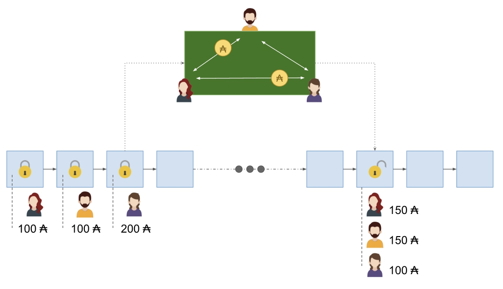

# Implementing Hydra Heads: the first step towards the full Hydra vision
### **The Hydra Head, the first in a suite of protocols, is an important element of Cardano’s scaling journey. Let’s see how it fits into the bigger picture. And maybe bust some myths** 
 3 February 2022[ Matthias Benkort](tmp//en/blog/authors/matthias-benkort/page-1/) 12 mins read

### [**Matthias Benkort**](tmp//en/blog/authors/matthias-benkort/page-1/)
Software Engineering Lead

Engineering

- 
- 
- 

We’ve done the science and the theory. We have laid the foundations for a scalable, versatile, and high-throughput blockchain. Now it’s time for steady growth and system enhancements. With the goal of creating an optimized ecosystem to support and foster decentralized applications (DApps) development, Cardano is in the foothills of the Basho phase. With smart contracts already in place, Basho is all about [scaling](https://iohk.io/en/blog/posts/2022/01/14/how-we-re-scaling-cardano-in-2022/) and network optimization. The [Hydra](https://iohk.io/en/blog/posts/2021/09/17/hydra-cardano-s-solution-for-ultimate-scalability/) protocol family is a key component for this.

Chúng tôi đã thực hiện khoa học và lý thuyết.
Chúng tôi đã đặt nền móng cho một blockchain có thể mở rộng, linh hoạt và thông lượng cao.
Bây giờ, thời gian để tăng trưởng ổn định và cải tiến hệ thống.
Với mục tiêu tạo ra một hệ sinh thái được tối ưu hóa để hỗ trợ và thúc đẩy sự phát triển của các ứng dụng phi tập trung (DAPPS), Cardano nằm trong chân đồi của giai đoạn Basho.
Với các hợp đồng thông minh đã có, Basho là tất cả về [tỷ lệ] (https://iohk.io/en/blog/posts/2022/01/14/how-we-re-scaling-cardano-in-2022/)
và tối ưu hóa mạng.
[Hydra] (https://iohk.io/en/blog/posts/2021/09/17/hydra-cardano-solution-for-ultimate-scalability/) của họ là một thành phần chính cho việc này.

We have talked about Hydra before. Hydra is an ensemble of layer 2 solutions designed to address network security and scalability capabilities. Originally conceived within the work of the Ouroboros research team, it has in fact forged an independent path since the original paper publication. Hydra offers increased throughput, minimized latency, and cost-efficient solutions without substantial storage requirements. The Hydra Head protocol was already shaping up back in [2020](https://eprint.iacr.org/2020/299) and since then our thinking has developed – particularly throughout this early implementation and proof of concept stage. Building on that initial idea, the **Hydra Head protocol** matured into [a proof of concept](https://iohk.io/en/blog/posts/2021/09/17/hydra-cardano-s-solution-for-ultimate-scalability/), and has continued to do so as we have headed toward a more defined implementation for the testnet MVP.

Chúng tôi đã nói về hydra trước đây.
Hydra là một nhóm giải pháp Lớp 2 được thiết kế để giải quyết các khả năng bảo mật và khả năng mở rộng của mạng.
Ban đầu được hình thành trong công việc của nhóm nghiên cứu Ouroboros, trên thực tế, nó đã tạo ra một con đường độc lập kể từ ấn phẩm giấy gốc.
Hydra cung cấp thông lượng tăng, độ trễ giảm thiểu và các giải pháp tiết kiệm chi phí mà không cần lưu trữ đáng kể.
Giao thức đầu Hydra đã định hình trở lại vào [2020] (https://eprint.iacr.org/2020/299) và kể từ đó, suy nghĩ của chúng tôi đã phát triển - đặc biệt là trong suốt quá trình thực hiện sớm và bằng chứng về giai đoạn khái niệm.
Dựa trên ý tưởng ban đầu đó, giao thức đầu ** hydra ** trưởng thành thành [một bằng chứng về khái niệm] (https://iohk.io/en/blog/posts/2021/09/17/hydra-cardano-solution
-Nhưng tính phân biệt/), và đã tiếp tục làm như vậy khi chúng tôi hướng tới một triển khai xác định rõ hơn cho TestNet MVP.

We have seen plenty of excitement (great!) along with misconceptions and misunderstandings (not so great). Most of these have arisen from the idea statement, rather than the actual protocol *implementation* and some of our earlier blogs have perhaps contributed to these misunderstandings. But the Hydra Head protocol isn’t solely about SPO implementation as much as the theoretical ‘1 million TPS’ – which needs to be caveated and better explained.

Chúng tôi đã thấy rất nhiều sự phấn khích (tuyệt vời!) Cùng với những quan niệm sai lầm và hiểu lầm (không quá tuyệt vời).
Hầu hết trong số này đã phát sinh từ tuyên bố ý tưởng, thay vì giao thức thực tế * triển khai * và một số blog trước đây của chúng tôi có lẽ đã góp phần vào những hiểu lầm này.
Nhưng giao thức đầu hydra không chỉ là về việc triển khai SPO nhiều như lý thuyết ‘1 triệu TPS - cần phải được thông báo và giải thích tốt hơn.

In this article, we – the Hydra engineering team – outline our current progress, our approach, and our near and long-term roadmap. We’ll demystify some misconceptions, clarify the benefits and reflect on development challenges. 

Trong bài viết này, chúng tôi-Nhóm Kỹ thuật Hydra-phác thảo tiến trình hiện tại của chúng tôi, cách tiếp cận và lộ trình gần và dài hạn của chúng tôi.
Chúng tôi sẽ làm sáng tỏ một số quan niệm sai lầm, làm rõ lợi ích và phản ánh về các thách thức phát triển.

## **Hydra Head in a nutshell**

## ** đầu hydra một cách ngắn gọn **

Let’s first re-introduce Hydra Heads, which involve not only a robust networking layer between peers and an integrated Cardano ledger, but also, several on-chain scripts (smart contracts) that drive the lifecycle of a Hydra Head.

Trước tiên, hãy giới thiệu lại các đầu Hydra, không chỉ liên quan đến một lớp mạng mạnh mẽ giữa các đồng nghiệp và sổ cái Cardano tích hợp, mà còn, một số kịch bản trên chuỗi (hợp đồng thông minh) điều khiển vòng đời của đầu hydra.

A Hydra Head is a provably secure [isomorphic state channel](https://www.google.com/url?q=https://eprint.iacr.org/2020/299.pdf&sa=D&source=docs&ust=1643024354663393&usg=AOvVaw2qBMRPzWu0H_7oIkQZkQX-). Simply put, it is an off-chain mini-ledger between a restricted set of participants, which works similarly (albeit significantly quicker) to the on-chain main ledger. 

Một đầu hydra là một kênh trạng thái đồng đẳng an toàn có thể bảo mật] (https://www.google.com/url?q=https://eprint.iacr.org/2020/299.pdf&sa=d&source=docs&ust=164302435
-).
Nói một cách đơn giản, đó là một vấn đề nhỏ ngoài chuỗi giữa một tập hợp người tham gia bị hạn chế, hoạt động tương tự (mặc dù nhanh hơn đáng kể) đối với sổ cái chính trên chuỗi.

The first thing to understand is that a channel is a communication path between two or more peers. To be part of a Head means being one of those peers. Channels form isolated networks that can evolve in parallel to the main network. On these alternative networks, participants follow a different, simpler, consensus algorithm: everyone needs to agree on all transactions flowing through. A consequence of this is that, as a participant, I cannot lose money I haven't explicitly agreed to lose. Why? Because any valid transaction requires my *explicit* approval. 

Điều đầu tiên cần hiểu là một kênh là một đường dẫn giao tiếp giữa hai hoặc nhiều đồng nghiệp.
Trở thành một phần của đầu có nghĩa là một trong những đồng nghiệp đó.
Các kênh hình thành các mạng bị cô lập có thể phát triển song song với mạng chính.
Trên các mạng thay thế này, những người tham gia tuân theo một thuật toán đồng thuận, đơn giản hơn, khác nhau: mọi người cần phải đồng ý về tất cả các giao dịch chảy qua.
Hậu quả của điều này là, với tư cách là người tham gia, tôi không thể mất tiền mà tôi không đồng ý rõ ràng để mất.
Tại sao?
Bởi vì bất kỳ giao dịch hợp lệ nào cũng yêu cầu phê duyệt * rõ ràng * của tôi.

When forming a Head, participants may commit funds to it. This means moving funds on-chain to a script address that locks them under specific rules. The script guarantees safe execution of the protocol on-chain, and in particular, that participants cannot cheat one another. At any time, however, any participant may decide to quit the Head by closing it. In this case, all participants walk away with the latest state they had agreed to off-chain, on their parallel network.

Khi hình thành đầu, người tham gia có thể cam kết vốn cho nó.
Điều này có nghĩa là di chuyển tiền trên chuỗi sang một địa chỉ tập lệnh khóa chúng theo các quy tắc cụ thể.
Kịch bản đảm bảo thực hiện an toàn giao thức trên chuỗi và đặc biệt, người tham gia không thể lừa dối nhau.
Tuy nhiên, bất cứ lúc nào, bất kỳ người tham gia nào cũng có thể quyết định rời khỏi đầu bằng cách đóng nó lại.
Trong trường hợp này, tất cả những người tham gia bỏ đi với tiểu bang mới nhất mà họ đã đồng ý ngoài chuỗi, trên mạng lưới song song của họ.

Think of Heads as ‘private poker tables’ where participants bring their own chips to play the game. Participants can play for as long as they want. If someone doesn't play, then the game doesn't progress. Yet, participants are still free to walk away with their chips. If they do so, the game ends with the current wealth distribution. 

Hãy nghĩ về những người đứng đầu như là bàn poker riêng, nơi những người tham gia mang theo chip của riêng họ để chơi trò chơi.
Người tham gia có thể chơi miễn là họ muốn.
Nếu ai đó không chơi, thì trò chơi không tiến triển.
Tuy nhiên, những người tham gia vẫn tự do bỏ đi với chip của họ.
Nếu họ làm như vậy, trò chơi kết thúc với phân phối tài sản hiện tại.

**Figure 1**. Hydra Head (simplified) life cycle

**Hình 1**.
Vòng đời của Hydra Head (đơn giản hóa)

The dealer at the table (the on-chain script) ensures that people play by the rules and don't cheat. In the end, there are as many chips out as there were chips in, but they may have been redistributed during the course of the game. While the final result is known outside of the table, the history of all actions that happened during the game is only known to the participants. 

Các đại lý tại bàn (tập lệnh trên chuỗi) đảm bảo rằng mọi người chơi theo các quy tắc và không gian lận.
Cuối cùng, có nhiều chip như có chip, nhưng chúng có thể đã được phân phối lại trong suốt quá trình của trò chơi.
Mặc dù kết quả cuối cùng được biết đến bên ngoài bảng, lịch sử của tất cả các hành động xảy ra trong trò chơi chỉ được người tham gia biết đến.

This protocol is one of a whole suite of protocols that we usually refer to as ‘Hydra’. The current engineering effort is focused on implementing the Hydra Head protocol as published in [Hydra: Fast Isomorphic State-Channels](https://eprint.iacr.org/2020/299) by Chakravarty et al. 

Giao thức này là một trong những bộ giao thức mà chúng ta thường gọi là ‘hydra.
Nỗ lực kỹ thuật hiện tại tập trung vào việc thực hiện giao thức đầu hydra như được công bố trong [hydra: fast isomorphic state-channels] (https://eprint.iacr.org/2020/299) của Chakravarty et al.

Around the end of 2021, Maxim Jourenko, Mario Larangeira, and Keisuke Tanaka published an iteration on top of Hydra Head called [Interhead Hydra: Two Heads are Better than One](https://eprint.iacr.org/2021/1188). This iteration defines a method for interconnecting two Heads together enabling, in the long run, the creation of a network of interconnected Hydra Heads. Previously, there were mentions of other protocols like the ‘Hydra Tail’. However, those are still under research, along with new ideas coming from the recent work on the Hydra Head protocol. 

Vào khoảng cuối năm 2021, Maxim Jourenko, Mario Larangeira và Keisuke Tanaka đã xuất bản một lần lặp lại trên đầu Hydra có tên [Interhead Hydra: Hai đầu tốt hơn một] (https://eprint.iacr.org/2021/1188)
.
Lặp lại này xác định một phương pháp để kết nối hai đầu với nhau cho phép, về lâu dài, việc tạo ra một mạng lưới các đầu hydra được kết nối với nhau.
Trước đây, đã có đề cập đến các giao thức khác như ‘hydra đuôi.
Tuy nhiên, những điều đó vẫn đang được nghiên cứu, cùng với những ý tưởng mới đến từ công việc gần đây trên giao thức HYDRA Head.

## **Hydra misconceptions**

## ** Những quan niệm sai lầm của hydra **

Recently we have seen a lot of commentary positioning Hydra as the ‘ultimate’ solution for Cardano scalability. For sure, Hydra Heads make for a strong foundation to build a scalability layer for Cardano. They are an essential building block that leverages the power of the [Extended Unspent Transaction Output (EUTXO) ](https://iohk.io/en/blog/posts/2021/03/12/cardanos-extended-utxo-accounting-model-part-2/)model to enable more complex solutions on top. They are a critical element of the scalability journey, but they are not the *final* destination.

Gần đây, chúng tôi đã thấy rất nhiều bình luận định vị Hydra là giải pháp ‘cuối cùng cho khả năng mở rộng của Cardano.
Chắc chắn, các đầu Hydra tạo nên một nền tảng vững chắc để xây dựng một lớp khả năng mở rộng cho Cardano.
Chúng là một khối xây dựng thiết yếu, tận dụng sức mạnh của [đầu ra giao dịch mở rộng (EUTXO)] (https://iohk.io/en/blog/posts/2021/03/12/cardanos-extends-utxo-accounting-
Mô hình-part-2/) mô hình để cho phép các giải pháp phức tạp hơn trên đầu.
Chúng là một yếu tố quan trọng của hành trình mở rộng, nhưng chúng không phải là điểm đến * cuối cùng *.

**Scalability isn’t about a million TPS**

** Khả năng mở rộng là khoảng một triệu TPS **

Before talking about scalability metrics, let’s clarify a few things about transactions per second (TPS). Amongst all those available, TPS is probably the least meaningful metric to consider as a means of comparison. Transactions come in different shapes and sizes. While this is true for Cardano, it’s even more essential when comparing two drastically different systems. 

Trước khi nói về các số liệu khả năng mở rộng, hãy để Lừa làm rõ một vài điều về các giao dịch mỗi giây (TPS).
Trong số tất cả những người có sẵn, TPS có lẽ là số liệu ít có ý nghĩa nhất để xem xét như một phương tiện so sánh.
Giao dịch có hình dạng và kích thước khác nhau.
Mặc dù điều này đúng với Cardano, nhưng nó thậm chí còn cần thiết hơn khi so sánh hai hệ thống khác nhau mạnh mẽ.

Think about a highway and vehicles. One can look at how many ‘Vehicles Per Second’ (VPS) the highway can handle between two points. Yet, if there’s no common definition of what a vehicle is, then comparing 10 VPS to 100 VPS is seemingly meaningless. If the 10 vehicles in the example refer to massive cargo trucks, does it make sense to compare them to 100 scooters in terms of their delivery capabilities? The same applies to transactions. A transaction carrying hundreds of native assets and outputs is certainly not the same as a single ada payment between two actors. 

Hãy suy nghĩ về một đường cao tốc và phương tiện.
Người ta có thể nhìn vào số lượng ‘xe mỗi giây (VPS) đường cao tốc có thể xử lý giữa hai điểm.
Tuy nhiên, nếu không có định nghĩa chung về phương tiện là gì, thì so sánh 10 VP với 100 VP dường như là vô nghĩa.
Nếu 10 phương tiện trong ví dụ đề cập đến xe tải chở hàng khổng lồ, có hợp lý khi so sánh chúng với 100 xe tay ga về khả năng giao hàng của chúng không?
Điều tương tự áp dụng cho các giao dịch.
Một giao dịch mang theo hàng trăm tài sản bản địa và đầu ra chắc chắn không giống như một khoản thanh toán ADA duy nhất giữa hai diễn viên.

Using TPS as a metric within the same context (for example, to compare two versions of the Cardano node) is meaningful. Using it as a means of comparison between blockchains isn’t. 

Sử dụng TPS làm số liệu trong cùng một bối cảnh (ví dụ, để so sánh hai phiên bản của nút Cardano) là có ý nghĩa.
Sử dụng nó như một phương tiện để so sánh giữa các blockchains là không.

With that in mind, we suggest looking not only at throughput, but also at finality and concurrency as important metrics to consider and discuss scalability: 

Với ý nghĩ đó, chúng tôi đề nghị không chỉ tìm kiếm thông lượng, mà còn ở tính hữu hạn và đồng thời là các số liệu quan trọng để xem xét và thảo luận về khả năng mở rộng:

- **throughput**: the volume of data processed by a system in a given amount of time

- ** Thông lượng **: Khối lượng dữ liệu được xử lý bởi một hệ thống trong một khoảng thời gian nhất định

- [**finality**](https://docs.cardano.org/core-concepts/chain-confirmation-versus-transaction-confirmation): the time it takes for the result of some action to become immutable and true for everyone in the system

-[** Finality **] (https://docs.cardano.org/core-conect
Mọi người trong hệ thống

- **concurrency**: the amount of work that can be done by different actors without blocking each other

- ** Đồng thời **: Số lượng công việc có thể được thực hiện bởi các diễn viên khác nhau mà không chặn nhau

Hydra Heads excel in achieving near-instant finality within a Head. The process of setting up and closing a Head can take a few blocks, but once established, transactions can flow rapidly across collaborative participants. Since Hydra Heads also use the EUTXO model, they can process non-conflicting transactions concurrently, which – coupled with good networking – allows for optimal use of the available resources. The first simulations of the Hydra Head protocol back in 2020 suggested a very promising ‘1000 TPS’. We are now in the process of benchmarking the real implementation in terms of throughput and finality. 

HYDRA Heads vượt trội trong việc đạt được tính hữu hạn gần như trong đầu.
Quá trình thiết lập và đóng đầu có thể mất một vài khối, nhưng một khi được thiết lập, các giao dịch có thể chảy nhanh chóng trên những người tham gia hợp tác.
Vì Heads Heads cũng sử dụng mô hình EUTXO, chúng có thể xử lý các giao dịch không có kết hợp đồng thời, trong đó-kết hợp với mạng tốt-cho phép sử dụng tối ưu các tài nguyên có sẵn.
Các mô phỏng đầu tiên của giao thức đầu hydra trở lại vào năm 2020 cho thấy một ‘1000 TPS rất hứa hẹn.
Bây giờ chúng tôi đang trong quá trình đánh giá việc thực hiện thực sự về thông lượng và tính hữu hạn.

One caveat: a Hydra Head is a very *local* construct within a small group of participants. These groups will initially be independent and thus, looking at the sum of their individual metrics as a whole is misleading. Since groups are independent and can be independently created at will, it is easy to reach any figure by just adding them up: ten, a thousand, one million, one billion, and so on. 

Một cảnh báo: Một đầu hydra là một cấu trúc rất * cục bộ * trong một nhóm nhỏ người tham gia.
Các nhóm này ban đầu sẽ độc lập và do đó, nhìn vào tổng số các số liệu cá nhân của họ nói chung là sai lệch.
Vì các nhóm độc lập và có thể được tạo độc lập theo ý muốn, nên rất dễ dàng để đạt được bất kỳ con số nào bằng cách chỉ thêm chúng lên: mười, một nghìn, một triệu, một tỷ, v.v.

Consequently, while the first version of the Hydra Head protocol will allow for small groups of participants to scale up their traffic at low cost, it won’t immediately offer a solution for global consumer-to-consumer (micro) payments or NFT sales. Why? Because the consensus inside a Head requires every participant to react to every transaction. And a single head doesn't scale infinitely with the number of participants, at least not without some additional engineering efforts. For example, the interconnection of Hydra Heads paves the way for larger networks of participants, effectively turning local Heads into a global network. We are exploring several other ideas to extend the Hydra Head protocol to broaden the set of use cases it can cover. We will talk more about that in the next sections and in future updates.

Do đó, trong khi phiên bản đầu tiên của giao thức Head Head sẽ cho phép các nhóm người tham gia nhỏ tăng quy mô lưu lượng truy cập của họ với chi phí thấp, thì nó đã giành được giải pháp cho một giải pháp cho các khoản thanh toán tiêu dùng đến người tiêu dùng toàn cầu (Micro) hoặc bán hàng NFT.
Tại sao?
Bởi vì sự đồng thuận bên trong đầu đòi hỏi mọi người tham gia phải phản ứng với mọi giao dịch.
Và một đầu duy nhất không quy mô vô hạn với số lượng người tham gia, ít nhất là không có một số nỗ lực kỹ thuật bổ sung.
Ví dụ, sự kết nối của các đầu hydra mở đường cho các mạng lưới người tham gia lớn hơn, biến đầu cục bộ thành một mạng lưới toàn cầu.
Chúng tôi đang khám phá một số ý tưởng khác để mở rộng giao thức đầu hydra để mở rộng tập hợp các trường hợp sử dụng mà nó có thể bao gồm.
Chúng tôi sẽ nói thêm về điều đó trong các phần tiếp theo và trong các bản cập nhật trong tương lai.

**Use cases and the role of SPOs**

** Các trường hợp sử dụng và vai trò của SPO **

So when are Heads useful? Hydra Heads shine when a small group of participants need to process many quick interactions. Imagine, for example, a pay-per-use API service, a bank-to-bank private network, or a fast-paced auction between a seller and a small group of bidders. The use cases are plenty and take various forms. Some of them may be long-running Heads going for months, whereas others may be much shorter and only last a few hours. 

Vậy khi nào người đứng đầu hữu ích?
Hydra Heads tỏa sáng khi một nhóm nhỏ người tham gia cần xử lý nhiều tương tác nhanh.
Ví dụ, hãy tưởng tượng, một dịch vụ API trả tiền cho mỗi lần sử dụng, mạng riêng để ngân hàng hoặc đấu giá có nhịp độ nhanh giữa người bán và một nhóm nhỏ các nhà thầu.
Các trường hợp sử dụng là rất nhiều và có nhiều hình thức khác nhau.
Một số người trong số họ có thể là những người đứng đầu kéo dài trong nhiều tháng, trong khi những người khác có thể ngắn hơn nhiều và chỉ kéo dài một vài giờ.

Our [initial Hydra research in 2020](https://iohk.io/en/blog/posts/2020/03/26/enter-the-hydra-scaling-distributed-ledgers-the-evidence-based-way/) suggested stake pool operators (SPOs) as *likely* candidates for running Hydra Heads. However, as the Hydra Head protocol has been researched and built as a proof of concept, we can firmly state that it is a misunderstanding to say that *only* SPOs should run a Hydra Head to ensure ledger scalability. In fact, SPOs have no intrinsic interest in opening Heads between each other without a reason to transact (tipping or trading NFTs, for example). In a way, SPOs are like any other actor when it comes to the Hydra Head protocol. They can be a participant and open up Heads with other peers, but so can anyone interested. 

[Nghiên cứu HYDRA ban đầu của chúng tôi vào năm 2020] (https://iohk.io/en/blog/posts/2020/03/26/enter-the-hydra-scaling-diSTribution-ledgers-evidence-eclidence-way/)
Các nhà khai thác nhóm cổ phần được đề xuất (SPO) là * có khả năng * ứng cử viên để chạy đầu hydra.
Tuy nhiên, vì giao thức đầu hydra đã được nghiên cứu và xây dựng như một bằng chứng về khái niệm, chúng ta có thể tuyên bố chắc chắn rằng đó là một sự hiểu lầm khi nói rằng * chỉ * Spos nên chạy đầu hydra để đảm bảo khả năng mở rộng sổ cái.
Trên thực tế, các SPO không có mối quan tâm nội tại trong việc mở đầu nhau mà không có lý do để giao dịch (ví dụ: tiền boa hoặc giao dịch NFTs).
Theo một cách nào đó, các SPO giống như bất kỳ diễn viên nào khác khi nói đến giao thức đầu hydra.
Họ có thể là người tham gia và mở đầu với các đồng nghiệp khác, nhưng bất cứ ai cũng có thể quan tâm.

Admittedly, SPOs are good in operating infrastructure and can be some of the first users running instances of the Hydra Head protocol. Still, this only allows participating SPOs to transact with one another, which limits use cases for end users. Only advanced layer 2 system designs like the Interhead Hydra protocol require intermediaries to run infrastructure to the benefit of end users. In fact, we anticipate that one likely setup for Hydra Heads will be providing users managed Hydra Heads as a service (HaaS). We can achieve this without giving up custody of funds by running the infrastructure on the behalf of end users, who generally have neither the interest nor the technical skills to maintain such infrastructure.

Phải thừa nhận rằng, các SPO rất tốt trong cơ sở hạ tầng hoạt động và có thể là một số người dùng đầu tiên chạy các phiên bản của giao thức HYDRA Head.
Tuy nhiên, điều này chỉ cho phép các SPO tham gia giao dịch với nhau, giới hạn các trường hợp sử dụng cho người dùng cuối.
Chỉ các thiết kế hệ thống Lớp 2 nâng cao như Giao thức Hydra Interhead yêu cầu trung gian chạy cơ sở hạ tầng vì lợi ích của người dùng cuối.
Trên thực tế, chúng tôi dự đoán rằng một thiết lập có khả năng cho đầu hydra sẽ cung cấp cho người dùng Hedra Heads làm dịch vụ (HAAS).
Chúng tôi có thể đạt được điều này mà không từ bỏ quyền giám sát tiền bằng cách điều hành cơ sở hạ tầng thay mặt cho người dùng cuối, những người thường không có sự quan tâm cũng như các kỹ năng kỹ thuật để duy trì cơ sở hạ tầng đó.

This is very similar to the current operational model of light wallets and light wallet providers that are much more likely to be running Hydra Heads in the long run. Imagine a network composed of the top light wallet providers within the Cardano ecosystem. Such providers can then facilitate instant and cheap payments between their users while ensuring overall trust.

Điều này rất giống với mô hình hoạt động hiện tại của ví nhẹ và các nhà cung cấp ví nhẹ có nhiều khả năng chạy đầu hydra trong thời gian dài.
Hãy tưởng tượng một mạng bao gồm các nhà cung cấp ví nhẹ hàng đầu trong hệ sinh thái Cardano.
Các nhà cung cấp như vậy sau đó có thể tạo điều kiện cho các khoản thanh toán tức thì và giá rẻ giữa người dùng của họ trong khi đảm bảo niềm tin chung.

We also envision that services for developers and DApp providers will be likely candidates for running Hydra Heads. Indeed, DApp developers require access to on-chain information. For that, developers may rely on online services that provide adequate interfaces and typically charge monthly usage fees. Hydra Heads can improve this process enabling a more decentralized business model with pay-per-use API calls between service providers and DApp developers.

Chúng tôi cũng hình dung rằng các dịch vụ cho các nhà phát triển và nhà cung cấp DAPP sẽ có khả năng là ứng cử viên cho việc chạy đầu hydra.
Thật vậy, các nhà phát triển DAPP yêu cầu truy cập vào thông tin trên chuỗi.
Vì vậy, các nhà phát triển có thể dựa vào các dịch vụ trực tuyến cung cấp giao diện đầy đủ và thường tính phí sử dụng hàng tháng.
HYDRA Heads có thể cải thiện quy trình này cho phép mô hình kinh doanh phi tập trung hơn với các cuộc gọi API trả tiền cho mỗi nhà cung cấp dịch vụ và nhà phát triển DAPP.

## **The roadmap**

## ** Lộ trình **

As a group of protocols that will be delivered over time, and will involve more elaborated layer 2 system designs on top of the Hydra Head protocol, it is crucial that we engage frequently with developers of the Cardano ecosystem. This is not about a ‘big bang’ release but rather an iterative release cycle. We need to understand developer challenges, make sure to meet their needs, and ultimately ensure we are building something useful. This is why we are developing Hydra Head as an open-source GitHub project, starting with an early proof of concept last year. Aiming for a regular and frequent release cadence, we released our initial developer preview in September (0.1.0) followed by a second iteration (0.2.0) before Christmas. The next increment (0.3.0) is coming up in February. We follow semantic versioning and each of those pre-releases (0.x.0) adds features that will be available to our partners and early adopters to test out on private and public Cardano testnet(s). 

Là một nhóm các giao thức sẽ được phân phối theo thời gian và sẽ liên quan đến các thiết kế hệ thống Lớp 2 được xây dựng nhiều hơn trên giao thức đầu hydra, điều quan trọng là chúng tôi thường xuyên tham gia vào các nhà phát triển của hệ sinh thái Cardano.
Đây không phải là về một bản phát hành ‘Big Bang, mà là một chu kỳ phát hành lặp đi lặp lại.
Chúng ta cần hiểu các thách thức của nhà phát triển, đảm bảo đáp ứng nhu cầu của họ và cuối cùng đảm bảo chúng ta đang xây dựng một cái gì đó hữu ích.
Đây là lý do tại sao chúng tôi đang phát triển Hydra Head như một dự án GitHub nguồn mở, bắt đầu với một bằng chứng sớm về khái niệm năm ngoái.
Nhằm mục đích cho một nhịp phát hành thường xuyên và thường xuyên, chúng tôi đã phát hành bản xem trước nhà phát triển ban đầu vào tháng 9 (0.1.0) sau đó là lần lặp thứ hai (0.2.0) trước Giáng sinh.
Sự gia tăng tiếp theo (0.3.0) sẽ xuất hiện vào tháng Hai.
Chúng tôi theo dõi phiên bản ngữ nghĩa và mỗi phiên bản trước (0.x.0) bổ sung các tính năng sẽ có sẵn cho các đối tác và người chấp nhận sớm của chúng tôi để kiểm tra trên Cardano Testnet tư nhân và công cộng.

We’re delighted to announce that *our [roadmap is now also available on Github](https://github.com/orgs/input-output-hk/projects/21)!* As a means to engage with our community of developers and to be transparent about the course of our development efforts, you will find [feature issues](https://github.com/input-output-hk/hydra-poc/labels/feature), [milestones](https://github.com/input-output-hk/hydra-poc/milestones), and [projects boards](https://github.com/input-output-hk/hydra-poc/projects?type=beta) available on the [Hydra Head repository.](https://github.com/input-output-hk/hydra-poc/)

Chúng tôi vui mừng thông báo rằng * [Lộ trình của chúng tôi hiện cũng có sẵn trên GitHub] (https://github.com/orgs/input-output
Các nhà phát triển và để minh bạch về quá trình nỗ lực phát triển của chúng tôi, bạn sẽ tìm thấy [các vấn đề tính năng] (https://github.com/input-output
//github.com/input-output-hk/hydra-poc/milestones) và [bảng dự án] (https://github.com/input-output-hk/hydra-poc/projects?type=beta)
Trên kho lưu trữ đầu [hydra.] (https://github.com/input-output-hk/hydra-poc/)

While our focus is creating meaningful and feature-packed releases as we journey along testnet and later mainnet maturity with version 1.0.0, the roadmap also includes tentative dates. These forecasts stem from both the work accomplished so far and our estimates of the work remaining ahead. We’ll reflect on the content and the dates regularly in an agile manner to keep the roadmap as accurate as possible.

Mặc dù trọng tâm của chúng tôi là tạo ra các bản phát hành có ý nghĩa và đóng gói tính năng khi chúng tôi hành trình dọc theo TestNet và sau đó là trưởng thành chính với phiên bản 1.0.0, lộ trình cũng bao gồm các ngày dự kiến.
Những dự báo này xuất phát từ cả công việc đã hoàn thành cho đến nay và ước tính của chúng tôi về công việc còn lại ở phía trước.
Chúng tôi sẽ phản ánh về nội dung và ngày thường xuyên một cách nhanh nhẹn để giữ cho lộ trình chính xác nhất có thể.

**Community feedback is essential**

** Phản hồi của cộng đồng là điều cần thiết **

We will measure our success by how much traffic will be running in Hydra Heads in comparison to the Cardano mainnet. This means that we can’t reach our goal without the community, and Hydra can only be successful if it is useful to current and future Cardano users.

Chúng tôi sẽ đo lường thành công của chúng tôi bằng cách lưu lượng truy cập trong đầu hydra so với Cardano Mainnet.
Điều này có nghĩa là chúng ta có thể đạt được mục tiêu của mình mà không cần cộng đồng và Hydra chỉ có thể thành công nếu nó hữu ích cho người dùng Cardano hiện tại và tương lai.

Depending on your time, skills, and expertise, we welcome you to engage with us to share questions, feedback, or contribute to the development effort. This is a stellar opportunity to build a whole ecosystem of layer 2 solutions for Cardano together. The Hydra Head protocol will be the first building block of many advanced solutions to come. At IOG, we have already started working on some of them, but some will inevitably (and fortunately!) be built by the members of our community, which we look forward to supporting.

Tùy thuộc vào thời gian, kỹ năng và chuyên môn của bạn, chúng tôi chào đón bạn tham gia với chúng tôi để chia sẻ câu hỏi, phản hồi hoặc đóng góp cho nỗ lực phát triển.
Đây là một cơ hội xuất sắc để xây dựng toàn bộ hệ sinh thái gồm các giải pháp Lớp 2 cho Cardano cùng nhau.
Giao thức đầu Hydra sẽ là khối xây dựng đầu tiên của nhiều giải pháp tiên tiến sẽ đến.
Tại IOG, chúng tôi đã bắt đầu làm việc với một số trong số họ, nhưng một số người chắc chắn sẽ (và may mắn thay!) Được xây dựng bởi các thành viên trong cộng đồng của chúng tôi, mà chúng tôi mong muốn được hỗ trợ.

We’ll talk about Hydra Heads in more detail during February’s mid month development update. Subscribe to our [Youtube channel](https://www.youtube.com/c/IohkIo) and come join us!

Chúng tôi sẽ nói về những người đứng đầu Hydra chi tiết hơn trong bản cập nhật phát triển giữa tháng tháng Hai.
Đăng ký vào [kênh YouTube của chúng tôi] (https://www.youtube.com/c/iohkio) và đến tham gia với chúng tôi!

*I’d like to thank Sebastian Nagel, Olga Hryniuk, Mark Irwin, and Tim Harrison for their input and support in preparing this blog post.*

*Tôi muốn cảm ơn Sebastian Nagel, Olga Hryniuk, Mark Irwin và Tim Harrison vì đầu vào và hỗ trợ của họ trong việc chuẩn bị bài đăng trên blog này.*

