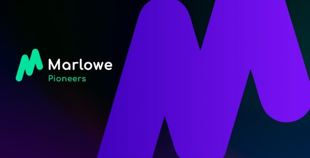

# Learn how to create low-code, low-cost financial smart contracts in the Marlowe Pioneers Program
### **Join our new Marlowe training program to discover how to easily build financial smart contacts using drag and drop**
 11 May 2022[ Niamh Ahern](tmp//en/blog/authors/niamh-ahern/page-1/) 4 mins read

### [**Niamh Ahern**](tmp//en/blog/authors/niamh-ahern/page-1/)
Education Manager

Education

- 
- 
- 
- 

Do you want to learn how to write low-cost smart contracts for finance with an easy-to-use visual tool? Then sign up for our new [Marlowe Pioneers](https://pioneers.marlowe-finance.io/) training program kicking off on May 19th. Marlowe is a web-based platform where you can build, simulate, analyze, and run financial smart contracts visually, without needing deep programming knowledge. 

Bạn có muốn học cách viết các hợp đồng thông minh chi phí thấp để tài chính với một công cụ trực quan dễ sử dụng?
Sau đó đăng ký cho chương trình đào tạo [Marlowe Pioneers mới] (https://pioneers.marlowe-finance.io/) khởi động vào ngày 19 tháng 5.
Marlowe là một nền tảng dựa trên web nơi bạn có thể xây dựng, mô phỏng, phân tích và điều hành các hợp đồng thông minh tài chính một cách trực quan, mà không cần kiến thức lập trình sâu.

Next week sees the launch of the first Marlowe Pioneer training program, where participants can learn the fundamentals of Marlowe and help to test the code before the official release. This program is designed to train developers and anyone interested in decentralized finance products to write financial smart contracts (such as loans, swaps, CFDs, and so on) using the Marlowe product suite. 

Tuần tới chứng kiến sự ra mắt của chương trình đào tạo Marlowe Pioneer đầu tiên, nơi những người tham gia có thể tìm hiểu các nguyên tắc cơ bản của Marlowe và giúp kiểm tra mã trước khi phát hành chính thức.
Chương trình này được thiết kế để đào tạo các nhà phát triển và bất kỳ ai quan tâm đến các sản phẩm tài chính phi tập trung để viết các hợp đồng thông minh tài chính (như các khoản vay, hoán đổi, CFD, v.v.) bằng cách sử dụng bộ sản phẩm Marlowe.

Since we announced this new course on [April's Cardano360 show](https://www.youtube.com/watch?v=b4x5OIy4shU&t=1285s), we have had strong interest from both our developer community and individuals who work in finance and are interested in learning Marlowe. 

Kể từ khi chúng tôi công bố khóa học mới này trên chương trình Cardano360 của tháng Tư] (https://www.youtube.com/watch?v=b4x5oiy4shu&t=1285s)
Quan tâm đến việc học Marlowe.

Over the next few days we will contact everyone who registered to get a better idea of their experience and expertise. Those of you who have been selected for the first round of this program will hear from us very soon. If you don’t receive an invitation at this stage, don’t worry, as we will be running several rounds of this program, so please do stay in touch!

Trong vài ngày tới, chúng tôi sẽ liên hệ với tất cả những người đã đăng ký để có ý tưởng tốt hơn về kinh nghiệm và chuyên môn của họ.
Những người bạn đã được chọn cho vòng đầu tiên của chương trình này sẽ sớm được nghe từ chúng tôi.
Nếu bạn không nhận được lời mời ở giai đoạn này, đừng lo lắng, vì chúng tôi sẽ chạy vài vòng của chương trình này, vì vậy xin vui lòng giữ liên lạc!

## **Course structure**

## **Cấu trúc khóa học**

The first iteration of the new program starts next week on May 19th and will run for eight weeks. The cohort joining this program will be true pioneers for Marlowe and will have early access to a set of learning modules. Your feedback will help us develop and iterate the overall learning experience and make it better for those who take the course in the future.

Lần lặp đầu tiên của chương trình mới bắt đầu vào tuần tới vào ngày 19 tháng 5 và sẽ chạy trong tám tuần.
Đoàn hệ tham gia chương trình này sẽ là những người tiên phong thực sự cho Marlowe và sẽ có quyền truy cập sớm vào một bộ mô -đun học tập.
Phản hồi của bạn sẽ giúp chúng tôi phát triển và lặp lại trải nghiệm học tập tổng thể và làm cho nó tốt hơn cho những người tham gia khóa học trong tương lai.

The course will teach you the core principles of Marlowe and how to write smart contracts for the financial world. The course modules will cover the building blocks of the language, using the [Marlowe CLI tool](https://iohk.io/en/blog/posts/2022/04/19/introducing-the-new-command-line-interface-tool-for-marlowe/), the [Marlowe Playground](https://iohk.io/en/blog/posts/2022/03/04/diving-deeper-into-the-marlowe-playground/), as well as some case studies and practical exercises. 

Khóa học sẽ dạy cho bạn các nguyên tắc cốt lõi của Marlowe và cách viết hợp đồng thông minh cho thế giới tài chính.
Các mô-đun khóa học sẽ bao gồm các khối xây dựng của ngôn ngữ, sử dụng [công cụ Marlowe CLI] (https://iohk.io/en/blog/posts/2022/04/19/intreucing-the-new-command-line-line-line-line-
Giao diện-tool-for-marlowe/), [Sân chơi Marlowe] (https://iohk.io/en/blog/posts/2022/03/04/diving-deeper-into-the-marlowe-playground/),
cũng như một số nghiên cứu trường hợp và các bài tập thực tế.

The course will follow a modular approach and will be highly interactive. Each week we will be releasing new teaching videos from both our Marlowe product and development team and director of education, Lars Brünjes, along with a set of practical exercises to complete during the week as part of each module. We will also be holding regular interactive Q&A sessions. In addition, you will have access to a dedicated community channel on Discord, created especially to help you to connect with other course participants as you learn. 

Khóa học sẽ tuân theo một cách tiếp cận mô -đun và sẽ có tính tương tác cao.
Mỗi tuần, chúng tôi sẽ phát hành các video giảng dạy mới từ cả nhóm sản phẩm và phát triển Marlowe và Giám đốc Giáo dục, Lars Brünjes, cùng với một tập hợp các bài tập thực tế để hoàn thành trong tuần như một phần của mỗi mô -đun.
Chúng tôi cũng sẽ tổ chức các phiên hỏi đáp tương tác thường xuyên.
Ngoài ra, bạn sẽ có quyền truy cập vào một kênh cộng đồng chuyên dụng trên Discord, đặc biệt là để giúp bạn kết nối với những người tham gia khóa học khác khi bạn học.

Outside the exercises and videos, students will be encouraged to learn at a pace that is right for them and to collaborate with each other. We recommend all students invest a minimum of 8-10 hours of their time per week. As with all learning experiences, the more you put in, the more you will get out! We encourage all participants to *engage with each other* and *work collaboratively* to answer questions and solve problems. 

Bên ngoài các bài tập và video, sinh viên sẽ được khuyến khích học hỏi với tốc độ phù hợp với họ và hợp tác với nhau.
Chúng tôi đề nghị tất cả các sinh viên đầu tư tối thiểu 8-10 giờ thời gian mỗi tuần.
Như với tất cả các kinh nghiệm học tập, bạn càng đặt vào, bạn sẽ càng thoát ra được!
Chúng tôi khuyến khích tất cả những người tham gia * tham gia với nhau * và * làm việc cộng tác * để trả lời các câu hỏi và giải quyết vấn đề.

We will have a small team of moderators who will check in from time to time to help facilitate and assist. They can also help triage issues or questions that may come up in your learning during the week. At the close of each week, we will engage directly with the group to resolve more complex technical questions and provide feedback on the subject matter covered that week. 

Chúng tôi sẽ có một nhóm nhỏ người điều hành, những người sẽ kiểm tra theo thời gian để giúp tạo điều kiện và hỗ trợ.
Họ cũng có thể giúp xử lý các vấn đề hoặc câu hỏi có thể xuất hiện trong việc học của bạn trong tuần.
Vào cuối mỗi tuần, chúng tôi sẽ tham gia trực tiếp với nhóm để giải quyết các câu hỏi kỹ thuật phức tạp hơn và cung cấp phản hồi về vấn đề được đề cập trong tuần đó.

## **Prior experience**

## **Kinh nghiệm trước**

As Marlowe is a low code solution, it is not necessary to have programming experience to join this course. However, some knowledge of Haskell and JavaScript would be beneficial, as well as a general understanding of blockchain technology and financial products. You should be as keen to learn as to help us; while we have run a number of successful Pioneer Programs already for both Plutus and Atala, this is the first time we have challenged ourselves to teach Marlowe at this scale. So be prepared for road bumps along the way as we learn and improve, too!

Vì Marlowe là một giải pháp mã thấp, không cần thiết phải có kinh nghiệm lập trình để tham gia khóa học này.
Tuy nhiên, một số kiến thức về Haskell và JavaScript sẽ có lợi, cũng như sự hiểu biết chung về công nghệ blockchain và các sản phẩm tài chính.
Bạn nên muốn học hỏi như chúng tôi;
Mặc dù chúng tôi đã điều hành một số chương trình tiên phong thành công đã có cho cả Sao Diêm Vương và Atala, đây là lần đầu tiên chúng tôi thử thách bản thân để dạy Marlowe ở quy mô này.
Vì vậy, hãy chuẩn bị cho những cú va chạm trên đường đi khi chúng ta học và cải thiện, quá!

## **When does the course start?**

## ** Khi nào khóa học bắt đầu? **

The course starts next week on May 19th and will run concurrently for eight weeks through late July. It will involve approximately ten hours of your time and effort each week.

Khóa học bắt đầu vào tuần tới vào ngày 19 tháng 5 và sẽ diễn ra đồng thời trong tám tuần đến cuối tháng Bảy.
Nó sẽ liên quan đến khoảng mười giờ thời gian và công sức của bạn mỗi tuần.

## **Ready to learn?**

## **Sẵn sàng học tập?**

We are excited to have so much interest from developers within our ecosystem who are ready to get started and learn Marlowe. You’ll not only be learning yourselves, but acting as a pioneer to help us determine the best way to teach and deliver this course – truly helping pave the way for future cohorts who enroll! We look forward to bringing you on this learning journey before we launch Marlowe to the world!

Chúng tôi rất vui mừng khi có rất nhiều sự quan tâm từ các nhà phát triển trong hệ sinh thái của chúng tôi, những người sẵn sàng bắt đầu và học Marlowe.
Bạn không chỉ học chính mình mà còn đóng vai trò là người tiên phong để giúp chúng tôi xác định cách tốt nhất để dạy và cung cấp khóa học này - thực sự giúp mở đường cho các đoàn hệ trong tương lai đăng ký!
Chúng tôi mong muốn đưa bạn vào hành trình học tập này trước khi chúng tôi ra mắt Marlowe ra thế giới!

*Please join us on the [Marlowe Discord channel](https://discord.com/channels/826816523368005654/936295815926927390/936316494042779698) to engage in discussions, ask questions, and hear the latest Marlowe news.*

*Vui lòng tham gia với chúng tôi trên [Kênh Marlowe Discord] (https://discord.com/channels/826816523368005654/936295815926927390/93631649404277

