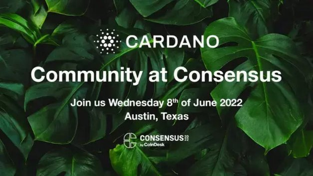

# Cardano at Consensus: a look ahead
### **It’s one of the premier blockchain industry events of the year. And IOG is going to be there. Here's what’s happening…**
 6 June 2022[ Fernando Sanchez](tmp//en/blog/authors/fernando-sanchez/page-1/) 3 mins read

### [**Fernando Sanchez**](tmp//en/blog/authors/fernando-sanchez/page-1/)
Technical Writer

Marketing and Communications

- 
- 

Consensus, one of the focal points for crypto developers, enthusiasts, and the ‘[festival for the decentralized world](https://www.coindesk.com/consensus2022/)’, is almost here. The Austin Convention Center in Austin, Texas, will become a hive of activity for the 2022 edition of this landmark event, hosting some of the biggest names in the global crypto world.

Sự đồng thuận, một trong những điểm đầu mối cho các nhà phát triển tiền điện tử, những người đam mê và ‘[Lễ hội cho thế giới phi tập trung] (https://www.coindesk.com/consensus2022/), gần như ở đây.
Trung tâm Hội nghị Austin ở Austin, Texas, sẽ trở thành một tổ chức hoạt động cho phiên bản 2022 của sự kiện mang tính bước ngoặt này, tổ chức một số tên tuổi lớn nhất trong thế giới tiền điện tử toàn cầu.

Input Output Global (IOG) will be there, along with our friends from the Cardano Foundation and EMURGO. Charles will be [speaking](https://events.coindesk.com/consensus2022/agenda/session/915238) at the main conference while the Cardano main booth space will showcase a range of products, projects and initiatives from the three organizations, including Project Catalyst (Fund9 launching imminently), Atala PRISM, IOG’s new light wallet and EVM sidechain project.

Đầu vào đầu vào Toàn cầu (IOG) sẽ ở đó, cùng với bạn bè của chúng tôi từ Quỹ Cardano và Emurgo.
Charles sẽ [Nói] (https://events.coindesk.com/consensus2022/agenda/session/915238) tại hội nghị chính trong khi không gian gian hàng chính của Cardano sẽ giới thiệu một loạt các sản phẩm, dự án và sáng kiến từ ba tổ chức,
bao gồm Project Catalyst (Fund9 ra mắt sắp tới), Atala Prism, dự án Light Light và EVM SideChain mới của IOG.

More importantly, we’ll be showcasing and celebrating just some of the hundreds of Dapp and NFT projects that are #BuildingOnCardano. In attendance at Consensus will be; Blockery, Cardashift, CNFT.IO, Cornucopias game, COTI/Djed, dcSpark, Genius Yield, Gero Wallet, Indigo, JPG Store, MELD, NFT Maker Pro, Oracle Charli3, Pavia, SundaeSwap, Veritree, Wanchain, Claymates, MuesliSwap, SingularityNET, Joget, Fibo, certiktech, ADAZoo, Dapp360 Workforce, Tokhun, Project Catalyst, World Mobile, Adaverse, Wave, and Terra Virtua. And many more.

Quan trọng hơn, chúng tôi sẽ giới thiệu và ăn mừng chỉ một số trong hàng trăm dự án DAPP và NFT là #BuildingCardano.
Tham dự tại sự đồng thuận sẽ được;
Blockery, Cardashift, CNFT.IO, Cornucopias Game, COTI/DJED, DCSPARK, Genius Năng suất, ví Gero, Indigo, JPG Store, Meld, NFT Maker Pro, Oracle Charli3, Pavia, Sundaeswap, Veritree,
, Joget, Fibo, CertikTech, Adazoo, DAPP360 Lực lượng lao động, Tokhun, Project Catalyst, World Mobile, AdAverse, Wave và Terra Virtua.
Và nhiều cái khác.

## **Community celebration**

## ** Lễ kỷ niệm cộng đồng **

This year's Consensus event promises to be one of the largest celebrations for the decentralized world. And to kick things off, IOG, Emurgo, and the Cardano Foundation will hold a [Cardano Community Event](https://iohk.link/cardano-community-event) on the evening of June 8th at the Palmer Center in Austin.

Sự kiện đồng thuận năm nay hứa hẹn sẽ là một trong những lễ kỷ niệm lớn nhất cho thế giới phi tập trung.
Và để khởi động mọi thứ, IOG, Emurgo và Cardano Foundation sẽ tổ chức một sự kiện [Cardano Community] (https://iohk.link/cardano-community-vent) vào tối ngày 8 tháng 6 tại Trung tâm Palmer ở Austin.

The [meetup is free to attend](https://twitter.com/InputOutputHK/status/1529175571594452995?s=20&t=ej6XHH_j1TbuDa-JLYQx4g), and you will have an opportunity to meet Charles Hoskinson and connect with projects #BuildingOnCardano and community leaders.

[Meetup là miễn phí để tham dự] (https://twitter.com/inputoutputhk/status/1529175571594452995?s
lãnh đạo.

## **Free-to-attend developer workshop and hackathon**

## ** Hội thảo phát triển miễn phí và hackathon **

After the conclusion of the main Consensus event, IOG will hold a free workshop and hackathon for developers in Austin on June 13th. Attendees will be invited to participate in one of three tracks - Plutus Challenge, Marlowe Zero to Hero or DApp developer update track - in which they’ll be able to display their ingenuity, connect with the community and ultimately, build on Cardano. 

Sau khi kết thúc sự kiện đồng thuận chính, IOG sẽ tổ chức một hội thảo miễn phí và hackathon cho các nhà phát triển ở Austin vào ngày 13 tháng 6.
Những người tham dự sẽ được mời tham gia vào một trong ba bài hát - Plutus Challenge, Marlowe Zero to Hero hoặc DAPP Developer Update Track - trong đó họ sẽ có thể hiển thị sự khéo léo của họ, kết nối với cộng đồng và cuối cùng, xây dựng trên Cardano.

After the afternoon sessions, developers will also have the opportunity to network with other community members, projects building on Cardano and members of the IOG team. 

Sau các buổi chiều, các nhà phát triển cũng sẽ có cơ hội kết nối với các thành viên cộng đồng khác, các dự án xây dựng trên Cardano và các thành viên của nhóm IOG.

**DApp development track**

** Theo dõi phát triển Dapp **

Participate in discussions with members of the IOG team and community members about DApp development. Learn about the foundations of DApp development in Cardano, the possibilities that the Vasil hard fork combinator event will open up, auditing and certification, and much more.

Tham gia vào các cuộc thảo luận với các thành viên của nhóm IOG và các thành viên cộng đồng về sự phát triển của DAPP.
Tìm hiểu về nền tảng của sự phát triển DAPP ở Cardano, các khả năng sự kiện tổ hợp Vasil Hard Fork sẽ mở ra, kiểm toán và chứng nhận, và nhiều hơn nữa.

Later in the day, IOG will invite developers to discuss the projects they're building on Cardano.

Sau đó trong ngày, IOG sẽ mời các nhà phát triển thảo luận về các dự án mà họ đang xây dựng trên Cardano.

**Plutus challenge**

** Thử thách Sao Diêm Vương **

Participants will use their creativity to resolve Plutus challenges issued by the IOG team. Later, IOG will offer developers the chance to present their projects to community members.

Những người tham gia sẽ sử dụng sự sáng tạo của họ để giải quyết các thách thức Plutus do nhóm IOG ban hành.
Sau đó, IOG sẽ cung cấp cho các nhà phát triển cơ hội trình bày các dự án của họ cho các thành viên cộng đồng.

**Marlowe - Zero to hero**

** Marlowe - Zero to Hero **

This is a learn-as-you go event where participants can learn the basics of Marlowe, Cardano's domain-specific language. This track will include challenges and practical exercises.

Đây là một sự kiện học hỏi, nơi những người tham gia có thể tìm hiểu những điều cơ bản của Marlowe, ngôn ngữ dành riêng cho miền của Cardano.
Ca khúc này sẽ bao gồm các thử thách và bài tập thực tế.

The developer event will take place on 13th June. If you’d like to attend, you can register [here](https://iogmeetups2022.co.uk/).

Sự kiện nhà phát triển sẽ diễn ra vào ngày 13 tháng 6.
Nếu bạn muốn tham dự, bạn có thể đăng ký [tại đây] (https://iogmeetups2022.co.uk/).

## **Conclusion**

## **Sự kết luận**

Consensus is one of the most influential blockchain events of the year. The 2022 edition will feature relevant topics such as DeFi, NFTs, the metaverse, and much more. Consensus gathers developers, academics, policymakers, investors, and creators involved in all aspects of the push for a decentralized global ecosystem.

Đồng thuận là một trong những sự kiện blockchain có ảnh hưởng nhất trong năm.
Phiên bản 2022 sẽ có các chủ đề có liên quan như DEFI, NFTS, Metaverse và nhiều hơn nữa.
Sự đồng thuận tập hợp các nhà phát triển, học giả, nhà hoạch định chính sách, nhà đầu tư và người sáng tạo tham gia vào tất cả các khía cạnh của việc thúc đẩy một hệ sinh thái toàn cầu phi tập trung.

If you can make it to Austin, we’ll see you there. For most of you who can’t, don’t worry - we’ll be sure to keep you up to speed via our social and community channels.

Nếu bạn có thể đến Austin, chúng tôi sẽ gặp bạn ở đó.
Đối với hầu hết các bạn, những người có thể, đừng lo lắng - chúng tôi chắc chắn sẽ giúp bạn tăng tốc thông qua các kênh xã hội và cộng đồng của chúng tôi.

