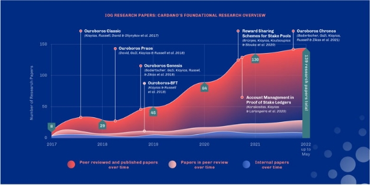

# Cardano's foundational research overview
### **Here’s the first of a series of blog posts taking a closer look at the research underpinning Cardano** 
 10 June 2022[ Olga Hryniuk](tmp//en/blog/authors/olga-hryniuk/page-1/) 5 mins read

### [**Olga Hryniuk**](tmp//en/blog/authors/olga-hryniuk/page-1/)
Technical Writer

Marketing & Communications

- 
- 

Since its inception in 2015, the Cardano project had one clear goal: to alter the way cryptocurrencies are designed and developed. Instead of having a single, authoritative whitepaper, the project combined a range of scientific design principles and engineering best practices to produce a solid, pioneering, research-based blockchain. The key ideas of Cardano development were presented in the '[Why Cardano](https://why.cardano.org/en/introduction/motivation/)' essay and the '[Cardano whiteboard](https://www.youtube.com/watch?v=Ja9D0kpksxw)' video by Charles Hoskinson. This research-driven approach positions Cardano uniquely among other blockchain platforms.

Kể từ khi thành lập vào năm 2015, dự án Cardano đã có một mục tiêu rõ ràng: thay đổi cách thức tiền điện tử được thiết kế và phát triển.
Thay vì có một whitepaper có thẩm quyền duy nhất, dự án đã kết hợp một loạt các nguyên tắc thiết kế khoa học và thực tiễn tốt nhất kỹ thuật để tạo ra một blockchain dựa trên nghiên cứu, tiên phong, tiên phong.
Những ý tưởng chính của sự phát triển Cardano đã được trình bày trong '[Tại sao Cardano] (https://why.cardano.org/en/introduction/motivation/)' Bài tiểu luận và '[Cardano Whiteboard] (https://www.youtube
.com/Watch? V = JA9D0KPKSXW) 'Video của Charles Hoskinson.
Cách tiếp cận dựa trên nghiên cứu này định vị Cardano duy nhất trong số các nền tảng blockchain khác.

A set of the best practices, ideas, and contributions formed Cardano’s foundation for building a secure, decentralized, and scalable ledger. There is now a substantial body of research, represented by Input Output Global’s extensive [library of papers](https://iohk.io/research/library/), which at the time of writing numbers 139. Many of them have been peer-reviewed and accepted at top-tier academic conferences. [According to Google Scholar](https://scholar.google.com/scholar?hl=en&as_sdt=0%2C5&q=ouroboros&btnG=), the original Ouroboros paper has been cited more than 1,200 times.

Một tập hợp các thực tiễn, ý tưởng và đóng góp tốt nhất đã hình thành nền tảng Cardano, để xây dựng một sổ cái an toàn, phi tập trung và có thể mở rộng.
Hiện tại có một nghiên cứu đáng kể, được thể hiện bằng đầu vào đầu ra toàn cầu [Thư viện giấy tờ] (https://iohk.io/research/l Library)
-Erviewed và được chấp nhận tại các hội nghị học thuật hàng đầu.
.

## **Research papers**

Một tập hợp các thực tiễn, ý tưởng và đóng góp tốt nhất đã hình thành nền tảng Cardano, để xây dựng một sổ cái an toàn, phi tập trung và có thể mở rộng.
Hiện tại có một nghiên cứu đáng kể, được thể hiện bằng đầu vào đầu ra toàn cầu [Thư viện giấy tờ] (https://iohk.io/research/l Library)
-Erviewed và được chấp nhận tại các hội nghị học thuật hàng đầu.
.

Charles Hoskinson, IOG CEO, said:

Charles Hoskinson, CEO của IOG, cho biết:

Decentralization imposes major technical challenges to financial systems worldwide and IOG Research is interested in every single one of them.

Phân cấp áp đặt những thách thức kỹ thuật lớn đối với các hệ thống tài chính trên toàn thế giới và nghiên cứu của IOG quan tâm đến mỗi người trong số họ.

The vision of IOG Research is to be a leading institution in the academic study of blockchain infrastructures and fintech, and, more broadly, distributed systems secured by cryptographic techniques and incentivized through economic game theory. IOG has established its reputation for tackling difficult research questions in general, and for building formal and reliable foundations for the fintech blockchain infrastructure industry in particular.

Tầm nhìn của nghiên cứu IOG là trở thành một tổ chức hàng đầu trong nghiên cứu học thuật về cơ sở hạ tầng blockchain và fintech, và, rộng hơn, các hệ thống phân tán được bảo đảm bằng các kỹ thuật mật mã và khuyến khích thông qua lý thuyết trò chơi kinh tế.
IOG đã thiết lập danh tiếng của mình để giải quyết các câu hỏi nghiên cứu khó khăn nói chung và xây dựng các nền tảng chính thức và đáng tin cậy cho ngành công nghiệp cơ sở hạ tầng blockchain Fintech nói riêng.

In this blog post, we take a look at some of the research papers that set the foundations of Cardano. 

Trong bài đăng trên blog này, chúng tôi xem xét một số tài liệu nghiên cứu thiết lập nền tảng của Cardano.

### **Ouroboros**

### ** OuroBoros **

The initial paper to drive the project's research was ‘[Ouroboros: A Provably Secure Proof-of-Stake Blockchain Protocol](https://eprint.iacr.org/2016/889.pdf)’, which was academically peer-reviewed and published at Crypto 2017.

Bài báo ban đầu để thúc đẩy nghiên cứu của dự án là '[Ouroboros: một giao thức chứng minh chứng minh chứng minh an toàn cho cổ phần] (https://eprint.iacr.org/2016/889.pdf)'
Xuất bản tại Crypto 2017.

Consensus lies at the heart of blockchain networks. Ouroboros is the proof-of-stake consensus protocol for Cardano. The name ‘Ouroboros’ comes from an ancient symbol that represents eternity and endless return. For Cardano, Ouroboros symbolizes the theoretical eternity of a blockchain. 

Sự đồng thuận nằm ở trung tâm của các mạng Blockchain.
Ouroboros là giao thức đồng thuận bằng chứng cho Cardano.
Cái tên ‘Ouroboros, xuất phát từ một biểu tượng cổ đại đại diện cho sự trở lại vĩnh cửu và vô tận.
Đối với Cardano, Ouroboros tượng trưng cho sự vĩnh cửu lý thuyết của một blockchain.

Since 2017, a number of Ouroboros protocol versions have been produced. Each ‘flavor’ of Ouroboros adds different features and functionality to support Cardano’s evolution. Starting with [Ouroboros Classic](https://eprint.iacr.org/2016/889.pdf), the ledger has undergone regular upgrades. Ouroboros Classic established the foundation for an energy-efficient proof-of-stake consensus protocol in a federated setting (Cardano’s Byron development theme). [Praos](https://eprint.iacr.org/2017/573.pdf), [Genesis](https://eprint.iacr.org/2018/378.pdf), and [Chronos](https://eprint.iacr.org/2019/838.pdf) were designed to ensure enhanced security in a fully permissionless setting. While Genesis improved the Praos protocol, Chronos will make Genesis even more robust when implemented. [This blog post](https://iohk.io/en/blog/posts/2022/06/03/from-classic-to-chronos-the-implementations-of-ouroboros-explained/) describes the evolution of Ouroboros in more detail.

Kể từ năm 2017, một số phiên bản giao thức Ouroboros đã được sản xuất.
Mỗi ‘hương vị của Ouroboros bổ sung các tính năng và chức năng khác nhau để hỗ trợ sự tiến hóa của Cardano.
Bắt đầu với [OuroBoros Classic] (https://eprint.iacr.org/2016/889.pdf), sổ cái đã trải qua nâng cấp thường xuyên.
Ouroboros Classic đã thiết lập nền tảng cho một giao thức đồng thuận bằng chứng về cổ phần tiết kiệm năng lượng trong một thiết lập được liên kết (chủ đề phát triển của Cardano By Byron).
[PRAOS] (https://eprint.iacr.org/2017/573.pdf), [Genesis] (https://eprint.iac.
/print.iacr.org/2019/838.pdf) được thiết kế để đảm bảo bảo mật nâng cao trong một cài đặt không cho phép hoàn toàn.
Trong khi Genesis cải thiện giao thức PRAOS, Chronos sẽ làm cho Genesis trở nên mạnh mẽ hơn khi được thực hiện.
.
chi tiết hơn.

Coupled with unique technology and mathematically verified mechanisms, Ouroboros realizes a ‘[Nakamoto-style consensus](https://bitcoin.org/bitcoin.pdf)’ adapted for proof of stake. Ouroboros provides the security and robustness guarantees as we know them from Bitcoin’s proof-of-work consensus while ensuring greater efficiency in terms of energy consumption. Rather than relying on miners to solve computationally complex problems to create a block, proof-of-stake participants create and validate blocks based on the stake they control in the network.

Kết hợp với công nghệ độc đáo và các cơ chế được xác minh về mặt toán học, Ouroboros nhận ra một sự đồng thuận ‘[Nakamoto-Style] (https://bitcoin.org/bitcoin.pdf) đã được điều chỉnh để chứng minh cổ phần.
Ouroboros cung cấp các đảm bảo về bảo mật và mạnh mẽ khi chúng tôi biết chúng từ sự đồng thuận bằng chứng làm việc của Bitcoin trong khi đảm bảo hiệu quả cao hơn về tiêu thụ năng lượng.
Thay vì dựa vào các công ty khai thác để giải quyết các vấn đề phức tạp về mặt tính toán để tạo ra một khối, những người tham gia bằng chứng tạo ra và xác nhận các khối dựa trên cổ phần mà họ kiểm soát trong mạng.

In his blog post, [The Ouroboros path to decentralization](https://iohk.io/en/blog/posts/2020/06/23/the-ouroboros-path-to-decentralization/), [Professor Aggelos Kiayias](https://iohk.io/en/team/aggelos-kiayias), Chief Scientist at IOG and the chair in cybersecurity and privacy at the University of Edinburgh, says:

Trong bài đăng trên blog của mình, [con đường Ouroboros để phân cấp] (https://iohk.io/en/blog/posts/2020/06/23/the-ouboros-path-to-decentralization/), [Giáo sư Aggelos Kiayias]
(https:

Ouroboros is a decentralized ledger protocol that is analyzed in the context of both Byzantine and rational behavior. What makes the protocol unique is the combination of such design elements as stake, dynamic availability, trustless setting, and a reward-sharing incentive scheme.

Ouroboros là một giao thức sổ cái phi tập trung được phân tích trong bối cảnh của cả hành vi byzantine và hợp lý.
Điều làm cho giao thức trở nên độc đáo là sự kết hợp của các yếu tố thiết kế như cổ phần, tính sẵn có động, cài đặt không đáng tin cậy và sơ đồ khuyến khích chia sẻ phần thưởng.

### **Delegation and stake pools**

### ** Đoàn và nhóm cổ phần **

Transitioning from a federated setting to full decentralization required some adjustments to the protocol. It was essential to provide the means for proper account management (to enable a stake delegation technique) and incentivized participation.

Chuyển từ một cài đặt liên kết sang phân cấp hoàn toàn đòi hỏi một số điều chỉnh cho giao thức.
Điều cần thiết là cung cấp các phương tiện để quản lý tài khoản thích hợp (để cho phép một kỹ thuật ủy quyền cổ phần) và tham gia khuyến khích.

The paper ‘[Account Management in Proof of Stake Ledgers](https://eprint.iacr.org/2020/525.pdf)’ – published in 2020 – explores ways to maximize stakeholders' participation in network maintenance activities.

Bài viết ‘[Quản lý tài khoản bằng chứng của sổ cái cổ phần] (https://eprint.iacr.org/2020/525.pdf) - xuất bản năm 2020 - khám phá các cách để tối đa hóa sự tham gia của các bên liên quan trong các hoạt động bảo trì mạng.

Typically, proof-of-stake blockchains depend – by nature – on the active participation of stakeholders. Stakeholders need to be constantly online to validate network transactions and produce new blocks. However, not every stakeholder has the ability or desire to constantly be online. To ensure that the system is robust and remains secure in such conditions, it is important to enable different types of stakeholder participation.

Bài viết ‘[Quản lý tài khoản bằng chứng của sổ cái cổ phần] (https://eprint.iacr.org/2020/525.pdf) - xuất bản năm 2020 - khám phá các cách để tối đa hóa sự tham gia của các bên liên quan trong các hoạt động bảo trì mạng.

Stake delegation addresses this problem and allows a user to participate in network activities by delegating their stake to other participants. Stake delegation gives rise to [stake pools](https://iohk.io/en/blog/posts/2018/10/23/stake-pools-in-cardano/) – server nodes holding the staking rights of multiple stakeholders. The paper mathematically analyzes and defines the delegation technique and also implements core wallet properties to process secure payments.

Thông thường, các blockchain bằng chứng phụ thuộc-về bản chất-dựa vào sự tham gia tích cực của các bên liên quan.
Các bên liên quan cần liên tục trực tuyến để xác nhận các giao dịch mạng và tạo ra các khối mới.
Tuy nhiên, không phải mọi bên liên quan đều có khả năng hoặc mong muốn liên tục được trực tuyến.
Để đảm bảo rằng hệ thống mạnh mẽ và vẫn an toàn trong các điều kiện như vậy, điều quan trọng là cho phép các loại tham gia khác nhau của các bên liên quan.

The paper ‘[Reward Sharing Schemes for Stake Pools](https://arxiv.org/ftp/arxiv/papers/1807/1807.11218.pdf)’, also published in 2020, introduces mechanisms to incentivize stakeholders for their activities.

Bài viết ‘[Đề án chia sẻ phần thưởng cho nhóm cổ phần] (https://arxiv.org/ftp/arxiv/papers/1807/1807.11218.pdf)

The power of a stake pool comes from the accumulation of stake that is delegated to it. To avoid monopolization of network validation activities by one single pool, it is essential that network participants are incentivized to delegate to a large set of different pools.

Sức mạnh của một nhóm cổ phần xuất phát từ sự tích lũy cổ phần được ủy quyền cho nó.
Để tránh độc quyền các hoạt động xác thực mạng bởi một nhóm duy nhất, điều cần thiết là những người tham gia mạng được khuyến khích ủy thác cho một nhóm lớn các nhóm khác nhau.

The reward-sharing scheme describes a means to [properly incentivize](https://iohk.io/en/blog/posts/2020/11/30/blockchain-reward-sharing-a-comparative-systematization-from-first-principles/) stake pool operators (SPOs) and delegators for their activities such as transaction validation, block creation, etc. The research shows that the proposed reward mechanism steers the network to a desired level of decentralization and, in particular, offers protection against Sybil attacks. This is enabled by a so-called [pledging mechanism](https://iohk.io/en/blog/posts/2020/05/12/how-pledging-encourages-a-healthy-decentralized-cardano-ecosystem/), which greatly disincentivizes the formation of multiple stake pools controlled by a single real-world entity.

Sơ đồ chia sẻ phần thưởng mô tả một phương tiện để [khuyến khích đúng cách] (https://iohk.io/en/blog/posts/2020/11/30/blockchain-reward-sharing-a-comparative-systemative-from
Nguyên tắc/) Người vận hành nhóm cổ phần (SPO) và ủy quyền cho các hoạt động của họ như xác thực giao dịch, tạo khối, v.v ... Nghiên cứu cho thấy cơ chế phần thưởng được đề xuất đưa mạng đến mức phân cấp mong muốn và đặc biệt, cung cấp bảo vệ chống lại Sybil
tấn công.
Điều này được kích hoạt bởi một cái gọi là [cơ chế cam kết] (https://iohk.io/en/blog/posts/2020/05/12/how-pledging-courages-a-halthy-decentilized-cardano-cosystem/)
, trong đó không tôn trọng sự hình thành của nhiều nhóm cổ phần được kiểm soát bởi một thực thể thực tế duy nhất.

Cardano’s incentive model established an ecosystem where rational participants benefit from following the protocol, thereby enabling the secure and efficient operation of the Cardano blockchain. The result is a reliably operating, decentralized ledger secured by cryptographic techniques and game-theoretic reward mechanisms.

Mô hình khuyến khích của Cardano, đã thiết lập một hệ sinh thái nơi những người tham gia hợp lý được hưởng lợi từ việc tuân theo giao thức, do đó cho phép hoạt động an toàn và hiệu quả của blockchain Cardano.
Kết quả là một sổ cái được vận hành, phi tập trung đáng tin cậy được bảo đảm bằng các kỹ thuật mật mã và các cơ chế phần thưởng lý thuyết trò chơi.

*Stay tuned! In our next posts, we’ll take a closer look at some of the research papers that established the foundation for a functional smart-contract platform. Specifically, we’ll start with the research that enabled an extended UTxO model, explain what that actually means and how it enables the ledger to handle multi-assets and fees with a variety of benefits for users.*

*Giữ nguyên!
Trong các bài viết tiếp theo của chúng tôi, chúng tôi sẽ xem xét kỹ hơn một số tài liệu nghiên cứu đã thiết lập nền tảng cho một nền tảng hợp đồng thông minh chức năng.
Cụ thể, chúng tôi sẽ bắt đầu với nghiên cứu cho phép mô hình UTXO mở rộng, giải thích điều đó thực sự có nghĩa là gì và cách nó cho phép sổ cái xử lý nhiều tài sản và phí với nhiều lợi ích cho người dùng.

